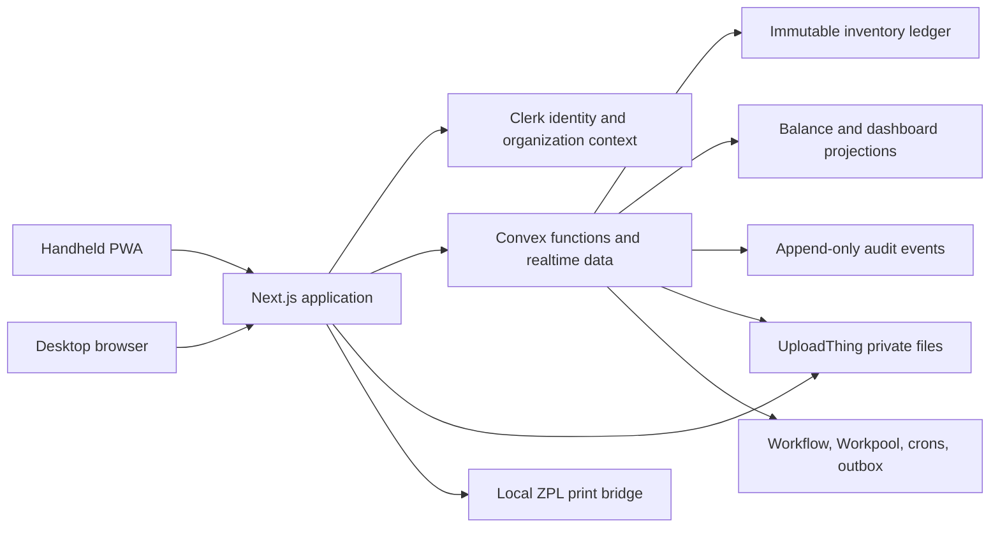

# Industrial SSA — Warehouse Management System Project Plan

Status: **Planning complete; implementation not started**  
Repository: `Rugby-Thailand/industrial-ssa` (empty at planning time)  
Prepared: 2026-08-02  
Research method: product-owner grilling followed by an independent, read-only Kiro CLI research pass over 50 product, warehouse-domain, architecture, security, legal, device, and delivery questions.

## 1. Executive decision

Build a mobile-first, multi-tenant B2B SaaS WMS for Thai manufacturing companies. The first release is one production-grade inbound vertical slice:

`PO → Receive → QC → Build pallet/lot → Print label → Putaway → Inventory ledger`

The MVP includes tenant isolation, multi-organization users, warehouse/location master data, permission-based authorization, audit logging, barcode scanning, inventory balances/history, and a small operational dashboard. It does not attempt shallow implementations of all future modules.

The architecture is viable, with three constraints that must be accepted during Phase 0:

1. Convex Cloud currently offers US East and EU West, not an Asian region. Bangkok latency and Thai PDPA cross-border-transfer implications must be tested before the production region is created.
2. Convex is server-transaction-oriented, not offline-first. The MVP can support degraded connectivity and queued intents, but not unconstrained offline warehouse execution.
3. Three.js has no justified MVP use. Use an accessible 2D SVG occupancy map; keep Three.js deferred unless it is a committed customer requirement.

Application scaffolding may begin after this plan is approved. Domain schema and ledger implementation must wait until the Phase 0 blocking decisions in section 4 are accepted.

## 2. Product boundaries

### 2.1 MVP outcomes

- A tenant can be provisioned, invite users, and restrict them to authorized warehouses and actions.
- An authorized user can create or import a PO and receive it partially or completely.
- The receiver can scan an item, capture quantity, UOM, lot, manufacture/expiry data, and construct a pallet handling unit.
- QC-controlled stock lands in `QC_HOLD`; a permitted approver can release, quarantine, reject, scrap, or mark it for rework.
- The system can generate a versioned ZPL label and a PDF fallback, print it, and retain its audit evidence.
- Putaway produces an explainable location recommendation, permits an audited override, and posts the movement.
- Every inventory change is an immutable, idempotent, balanced ledger transaction with a same-transaction balance projection.
- Users can inspect current stock and history without editing balances directly.
- A small dashboard reports receiving volume, open QC, putaway backlog, occupancy, low stock, and reconciliation status using bounded/pre-aggregated queries.

### 2.2 Long-term product vision

The planned product family remains: authentication; master data; receiving; putaway; inventory; transfers; picking; packing; shipping/POD; returns; manufacturing; quality/CAPA; reporting; administration; and operational dashboards. Those are roadmap modules, not MVP commitments.

### 2.3 Standing MVP non-goals

- Picking, packing, shipping, delivery, POD, reservations, waves, and route optimization
- Manufacturing orders, BOM execution, material issue, WIP, machine telemetry, and yield/scrap execution
- Returns, CAPA, and statistical AQL/ISO 2859 sampling
- True offline execution, a native mobile app, RFID, NFC, or automated MHE/AS-RS integration
- Serial-number workflows in the UI; the schema remains serial-capable
- Multi-currency, in-product subscription billing, and 3PL storage billing
- Live ERP synchronization beyond a versioned contract and optional import boundary
- Three-dimensional warehouse visualization

## 3. Assumptions register

### 3.1 Confirmed by the product owner

| ID | Confirmed assumption |
|---|---|
| C-01 | The product is a multi-tenant B2B SaaS. |
| C-02 | A user may belong to multiple tenant organizations and switch the active organization. |
| C-03 | Clerk owns identity, MFA, sessions, and organization switching. Convex owns WMS authorization and domain data. |
| C-04 | The MVP is the inbound vertical slice defined in section 2.1. |
| C-05 | Inventory uses an append-only ledger, compensating reversals, and materialized current-balance projections. |
| C-06 | Requested technologies are Next.js, Convex, UploadThing, Three.js, shadcn/ui, Tailwind CSS, and ReUI MCP. Three.js remains requested but its MVP use is unresolved. |
| C-07 | The broader 15-module vision is a roadmap rather than a requirement to implement every module at initialization. |
| C-08 | The GitHub repository is greenfield and had no commit or branch content when cloned. |

### 3.2 Recommended defaults adopted by this plan

These are safe planning defaults unless the product owner replaces them before the affected phase.

| ID | Recommended default |
|---|---|
| D-01 | Target a Thai mid-market manufacturer with 1–3 warehouses, 500–5,000 active SKUs, 5–40 concurrent warehouse users, and lot-tracked industrial/FMCG materials. |
| D-02 | Use a responsive installable PWA with separate handheld and desktop shells; do not build native mobile in the MVP. |
| D-03 | Support Chrome/Edge latest two major versions on desktop and Chrome on Android 11+ handhelds; iPad Safari is supervisory/read-mostly. |
| D-04 | Use HID keyboard-wedge scanners as the primary input and camera/WASM decoding as secondary. |
| D-05 | Store timestamps in UTC, store business dates as `YYYY-MM-DD` in the organization timezone, and default to `Asia/Bangkok`. |
| D-06 | Default locale is Thai with English fallback; code identifiers remain English. Support Buddhist Era display where required, never in storage. |
| D-07 | Default currency is THB; use integer minor units. MVP is single-currency per organization. |
| D-08 | Use metric measurements plus count UOMs. Store inventory quantities as integer base-UOM minor units with exact rational conversions. |
| D-09 | SKU tracking modes are `NONE`, `LOT`, and `LOT_SERIAL`; implement `NONE` and `LOT`, keeping serial flows feature-disabled. |
| D-10 | Pallets are logistic handling units with immutable LPN history. The model permits mixed SKU/lot, split, merge, relabel, and one nesting level; mixed SKU/lot defaults off. |
| D-11 | Keep `stockStatus` and optional `ownerId` as orthogonal inventory-bucket dimensions. Client-owned/consigned stock remains disabled unless a launch tenant needs it. |
| D-12 | Negative available inventory is forbidden. Any exception must be an explicit tenant setting and never silent. |
| D-13 | Capacity is advisory in the MVP; incompatibility and prohibited-location rules are hard constraints. |
| D-14 | Putaway uses deterministic filters and scoring, an explainable recommendation, an overflow fallback, and an audited override. |
| D-15 | Use GS1-128 when a tenant has a GS1 prefix; otherwise use an internal LPN encoded in Code 128. |
| D-16 | Use ZPL as the primary label payload, a PDF as preview/fallback, and a local printer bridge such as Zebra Browser Print where the customer permits installation. |
| D-17 | All authorization is server-side and permission-based, with seeded roles and contextual warehouse/maker-checker policies. |
| D-18 | Every tenant table and tenant index begins with `orgId`; cross-tenant document IDs are revalidated after every lookup. |
| D-19 | Domain rules live in pure TypeScript modules called by thin Convex functions. Next.js owns presentation, routing, and session integration, not domain mutations. |
| D-20 | Tenant-visible files use UploadThing private ACLs and short-lived signed URLs. Convex stores attachment metadata and may store internal-only artifacts. |
| D-21 | Durable jobs use Convex Workflow/Workpool/crons; outbound integrations use a transactional outbox and at-least-once delivery. |
| D-22 | Use expand–migrate–contract schema evolution and idempotent environment-gated seeds. |
| D-23 | Use trunk-based development, short-lived branches, preview deployments, staging, production, and mandatory CI gates. |
| D-24 | Target WCAG 2.2 AA plus 48×48 px touch targets, glove spacing, audio/haptic feedback, high contrast, and no color-only state. |
| D-25 | Production uses a paid Convex tier sized after load testing, not a free tier assumption. |
| D-26 | Initial RPO/RTO targets are 24 hours / 8 hours, backed by platform backups, independent encrypted exports, and rehearsed restores. |
| D-27 | Ledger/audit retention defaults to seven years pending Thai legal and accounting review; other operational logs have shorter documented retention. |
| D-28 | Remove Three.js from the MVP bundle and use a 2D SVG occupancy heat map. Reassess 3D only with a named customer use case. |
| D-29 | Package manager is pnpm; use current stable, mutually compatible package versions at initialization and lock them. |
| D-30 | Billing is manual/off-platform during pilot; keep a server-enforced plan/entitlement model for later billing integration. |

### 3.3 Inferred assumptions that need validation at the pilot site

- Warehouse Wi-Fi can support server-confirmed scanning for critical operations.
- Rugged scanners can emit keyboard/HID input and a reliable terminator.
- The customer permits a local print bridge on at least one workstation or provides another supported printer route.
- Supplier labels are inconsistent, so raw scan capture and controlled parser fallback are required.
- Most products are quantity- or lot-tracked rather than fully serialized or catch-weight.
- QC is configured per item/supplier; not every receipt is QC-blocked.
- Operators share some devices, while privileged actions happen on a named-user desktop or require step-up authentication.
- A pilot tenant can supply baseline receiving cycle time, inventory accuracy, hardware, sample labels, label stock, and a warehouse map.
- The SaaS operator will contract as a data processor and tenants will generally be data controllers under Thai PDPA.
- Early tenants can accept cross-border cloud hosting if contracts and safeguards are in place.

### 3.4 Deferred assumptions

- Serial tracking will be activated later without changing ledger line identity.
- Reservations will be introduced with outbound flows as their own ledger/projection concept.
- ERP integrations will use the same versioned PO and inventory event contracts defined during the MVP.
- Future transport capabilities will integrate maps, messaging, and signature providers rather than recreating them.
- Three.js may eventually render rack occupancy for slotting analysis, but only after reliable 3D master data exists.

## 4. Decisions required before domain implementation

The plan uses recommended answers so work is not ambiguous, but these decisions require explicit acceptance at the Phase 0 gate.

| ID | Decision | Recommended answer | Consequence if different |
|---|---|---|---|
| B-01 | Launch customer | Thai mid-market manufacturer, not pharma/cold-chain regulated and not a 3PL | Pharma adds validation/regulatory scope; 3PL adds stock ownership and client billing. |
| B-02 | Tenant provisioning | Sales-provisioned pilot first; enable self-service after onboarding stabilizes; manual billing | Self-service adds lifecycle, abuse, trial, entitlement, and billing work. |
| B-03 | Hosting/residency | Benchmark US East vs EU West from the pilot site; select once; obtain PDPA cross-border advice | In-country/APAC requirements may force self-hosting or a backend change. |
| B-04 | Connectivity | Degraded-online is acceptable; uncommitted queued intents are visibly pending; correctness-sensitive tasks stop offline | True offline requires a replicated client domain model and conflict resolution, materially changing scope/stack. |
| B-05 | Hardware | HID rugged scanner; Zebra/TSC/Godex-class ZPL printer; local bridge installation permitted | RFID, old WebViews, iOS-only fleets, or prohibited local agents require different integrations. |
| B-06 | Traceability | Implement `NONE` and `LOT`; serial-capable schema; pallets are HUs; mixed SKU/lot disabled by default | This changes the ledger bucket key and is expensive after real receipts exist. |
| B-07 | ERP boundary | In-app PO authoring plus CSV/XLSX import; no launch-critical live ERP sync | A mandatory SAP/Oracle/local-ERP integration adds a separate Phase 1 workstream. |
| B-08 | Three.js | Defer; use 2D SVG occupancy for MVP | A contractual 3D demo needs its own data, performance, and accessibility spike. |
| B-09 | Thai compliance | Engage Thai counsel before production; approve cross-border basis, DPA, retention, privacy notice, and incident process | A localization requirement can invalidate selected vendors/regions. |
| B-10 | Locale | Thai-first UI, English fallback, bilingual master-data descriptions, BE display on documents where requested | English-first or single-language master data changes content and migration work. |
| B-11 | Scale | Design for 5–40 concurrent scanners, 3,000 inbound lines/day, and roughly 1M ledger lines/year/tenant | Higher peaks require earlier performance tests, sharding, and plan upgrades. |
| B-12 | UOM exceptions | No catch-weight products in MVP; maximum quantity precision is 3 decimals | Catch-weight inventory needs actual-weight capture at item/HU level. |

Approval shortcut: accepting this plan means accepting every recommended answer above unless the approval message lists exceptions.

## 5. Kiro research answer register

This section records the answer to every researched question so implementation does not depend on hidden chat context.

1. **Initial customer segment:** target a Thai mid-market manufacturer with modest multi-warehouse complexity and lot traceability; exclude pharma-grade validation, 3PL billing, and warehouse automation from MVP. **Must confirm.**
2. **Provisioning and billing:** start sales-provisioned, retain an idempotent organization-provisioning flow, and bill manually while enforcing plan entitlements in Convex. **Must confirm.**
3. **Tenancy and region:** use one row-level multi-tenant deployment with `orgId`-first indexes. Benchmark US East/EU West before creating production because Convex has no Asian cloud region and deployment regions cannot be changed in place. **Blocking.**
4. **Locale and identifiers:** UTC timestamps, organization-local business dates, `Asia/Bangkok`, THB, metric/count UOMs, normalized human identifiers separate from Convex IDs, and Unicode descriptions. **Default.**
5. **MVP success criteria:** ≥95% handheld completion, p95 scan-to-ack <800 ms at the pilot, ≥99% sampled inventory accuracy, zero tenant leaks, zero ledger/projection drift through a 28-day pilot, measurable receiving-cycle improvement, and ≤2 P1 defects in the final week. **Targets need confirmation.**
6. **Client form:** responsive installable PWA with task-specific handheld and desktop layouts; no native app. **Default.**
7. **Offline:** degraded-online only. Cache the shell/reference data, assign client request IDs, visibly queue safe intents, and block operations requiring fresh stock/location state. **Blocking.**
8. **Scanning:** HID keyboard wedge first, camera/WASM second, Web `BarcodeDetector` opportunistically; RFID/NFC deferred. **Hardware must be confirmed.**
9. **Printing:** versioned server-generated ZPL plus PDF fallback; use an approved local print bridge and retain payload hash/audit evidence. **Printer spike required.**
10. **Task split:** handheld for scan-first single-task execution; desktop for dense master data, exceptions, approvals, reversals, administration, and reports. **Default.**
11. **Browser/accessibility:** modern Chrome/Edge, Android Chrome, limited iPad supervision, WCAG 2.2 AA, warehouse ergonomics, and actual WebView testing. **Fleet must be confirmed.**
12. **Identity source of truth:** Clerk owns identity/credentials/session/org membership existence; Convex mirrors membership for prompt revocation and owns WMS roles, permissions, and domain data. **Confirmed architecture.**
13. **Membership model:** Clerk organization equals tenant; Convex warehouse-scoped membership rows allow one user to hold different roles across warehouses. **Default; multi-warehouse need must be confirmed.**
14. **Authorization:** enforce granular permissions plus warehouse/threshold/separation-of-duties policies; seeded roles are editable compositions. **Default; catalogue needs review.**
15. **Support access:** no ambient cross-tenant access. Use time-boxed reason/ticket-bound support grants, read-only by default, two-person approval for writes, tenant-visible audit, and an emergency review process. **Support policy must be confirmed.**
16. **MFA and sessions:** require MFA and Clerk reverification for privileged operations; choose shift-compatible session lifetimes and fully identify actors on shared devices. **Shared-device policy must be confirmed.**
17. **Traceability/HUs:** implement quantity and lot tracking; make serial tracking schema-ready. Pallets are HUs; mixed SKU/lot is modeled but off by default; one nesting level is schema-ready. **Blocking.**
18. **UOM:** one base UOM per item, integer minor units, exact rational conversions, no inventory floats, rejected non-exact entry conversion, display-only rounding. **Catch-weight/precision must be confirmed.**
19. **Stock state:** status and owner are independent bucket dimensions. Reclassification is a paired ledger movement, not a row edit. Expiry becomes an explicit scheduled status transaction. **Ownership scope must be confirmed.**
20. **Ledger:** transaction header plus immutable lines; balanced double-entry through virtual boundary locations; unique per-org request ID; explicit reversal; no update/delete API; atomic invariant checks. **Default architectural core.**
21. **Projections:** update narrow balance documents in the ledger transaction; use Aggregate for rollups; reconcile by ledger replay nightly; forbid negative available stock. **Default.**
22. **Locations:** materialized hierarchy/path with semantic location types, advisory capacity, hard storage compatibility, and audited rare re-parenting. **Default; pilot vocabulary review.**
23. **Lots/FEFO:** item+lot uniqueness, manufacture/expiry/best-before business dates, configurable rotation date, deterministic FEFO tie-breakers, and shelf-life exceptions at receipt. **Rotation policy must be confirmed.**
24. **LPN lifecycle:** GS1 SSCC where licensed, internal check-digit LPN otherwise; never reuse IDs; split, merge, relabel, nest, and unnest are explicit audited transactions. **GS1 prefix must be confirmed.**
25. **PO/ERP:** author POs in-app and import CSV/XLSX with stable external references. Define HMAC/idempotent integration contracts now; do not access ERP databases directly. **ERP dependency must be confirmed.**
26. **Receipt rules:** partial is normal; over-receipt has configured tolerance/approval; under-close needs a reason; unexpected/cancelled/blind receipts are explicit exceptions; duplicates use request IDs and warnings; large batches are chunked/resumable. **Tolerance/blind policy must be confirmed.**
27. **QC:** simple all/fixed/percentage sampling, result attachments, `QC_HOLD`, explicit dispositions, ledger transitions, and maker-checker approval. Defer statistical AQL. **QC gate/AQL expectation must be confirmed.**
28. **Putaway:** filter hard constraints, prefer same item/lot or configured home/preferred zone, score capacity/travel/fragmentation, fall back to overflow, explain the choice, and audit overrides. **Default.**
29. **Barcode standards:** GS1-128 AI parsing, internal LPN fallback, GTIN/SKU fallback, otherwise explicit rejection. Obtain real supplier-label samples and verify print dimensions. **Samples required.**
30. **Concurrency:** rely on Convex serializability/OCC rather than locks; compare-and-set task claiming; no MVP reservations; debounce plus idempotency plus plausible-duplicate warnings. **Default.**
31. **Next.js/Convex boundary:** Convex functions own writes, authorization, and invariants; pure TypeScript domain modules contain portable algebra; Next.js owns UI/routing. **Default.**
32. **File storage:** UploadThing private files and signed URLs for tenant evidence/exports, with authorization metadata in Convex; confirm data region and paid ACL capability. **Residency must be confirmed.**
33. **Three.js:** remove from MVP and use accessible 2D SVG. Reintroduce only for a customer-backed rack/slotting case. **Blocking because it was requested.**
34. **Durable work:** Workflow for resumable orchestration, Workpool for bounded concurrency, crons for expiry/reconciliation/backups, rate limiting for ingestion, and visible job-run records. **Default.**
35. **Integrations:** authenticate inbound webhooks, record delivery/idempotency, acknowledge quickly, and use a same-transaction outbox for at-least-once outbound events. **Default.**
36. **Tenant-safe Convex:** required `orgId`, `orgId`-first indexes, tenant-bound data access wrappers, ban unbounded scans/filter-based tenant selection, and make two-tenant isolation tests a merge gate. **Default.**
37. **Audit:** same-transaction append-only audit events with actor/action/entity/request/device/support context and changed-field diffs. Retain ledger/audit for seven years provisionally and support tenant export. **Retention needs legal confirmation.**
38. **Evolution/seeds:** forward-only expand–migrate–contract, resumable migrations, separate idempotent reference/demo/onboarding seeds, and production guards against demo data. **Default.**
39. **Observability:** structured log streaming, Sentry errors, privacy-controlled product analytics, auth logs, request IDs, domain SLIs, and alerts for drift, dead letters, latency, and failures. **Vendor choice can wait.**
40. **Testing:** unit tests for domain algebra, property tests for ledger invariants/reversal/replay, Convex integration tests for auth/tenancy/idempotency, Playwright critical journeys, and physical-device acceptance. **Default.**
41. **Scale:** start with the envelope in B-11, paginate everything, cap bulk chunks, test hot-bucket contention, and budget a production Convex tier based on evidence. **Volume/budget must be confirmed.**
42. **Backup/DR:** paid periodic backups plus independent encrypted exports to durable storage, quarterly restore rehearsal, and a complete code/env/job runbook. **RPO/RTO/residency must be confirmed.**
43. **Thai PDPA:** tenant as controller and SaaS provider as processor is the working model; require DPA/subprocessor register, ROPA, lawful basis, cross-border safeguards, notice, retention, security, incident response, and DPO assessment. **Thai counsel is a production gate.**
44. **Internationalization:** `next-intl`, Thai default and English fallback, real Thai layout tests, bilingual descriptions, optional BE display, Thai collation, and verified Thai font output on thermal labels. **Locale details must be confirmed.**
45. **Delivery environments:** developer, PR preview, persistent staging, and production; separate auth/deployment environments; trunk-based branches; type/lint/unit/property/integration/isolation/E2E gates. **Default.**
46. **Roadmap order:** cycle count → outbound pick/pack/ship → replenishment/transfers → ERP integrations → deeper reporting → returns/cross-dock → slotting/3D → native/offline if evidence requires it. **Commercial confirmation required.**
47. **Buy vs build:** integrate email/SMS/PDF/XLSX/maps/signature capabilities; build the explainable WMS domain and putaway rules; defer route/POD optimization. **SMS need must be confirmed early.**
48. **Reports:** live bounded/pre-aggregated dashboard widgets and asynchronous indexed export jobs producing private artifacts. **Default.**
49. **Cost/lock-in:** Convex is the deepest lock-in; mitigate with a pure domain layer, logical exports, and self-hosting as an escape hatch. Abstract attachments and keep a per-tenant vendor-cost model. **Budget must be confirmed.**
50. **Decision timing:** B-01 through B-12 are Phase 0 decisions; architecture defaults can proceed after plan approval; roadmap features stay deferred until explicitly promoted. **This plan is the decision baseline.**

## 6. Target architecture



### 6.1 Trust boundaries

- The browser is untrusted. It never supplies an authoritative `orgId`, permission, price, balance, or status transition.
- Clerk tokens establish identity and active organization context. Convex verifies the token and an active mirrored membership before each domain operation.
- All client-supplied document IDs are fetched through a tenant-bound accessor that rechecks `orgId` and warehouse scope.
- UI permission checks improve usability only; Convex is the enforcement point.
- Upload authorization is tenant-scoped before upload, and download URLs are short-lived after a fresh permission check.
- Integration endpoints verify signatures and idempotency keys before scheduling work.

### 6.2 Domain module boundary

- `convex/model/**`: pure TypeScript domain logic with no Convex imports.
- `convex/lib/**`: authentication, authorization, tenant access, audit, idempotency, validation, pagination, errors.
- Feature modules expose thin public Convex queries/mutations/actions and call the pure model.
- Next.js Server Actions may orchestrate presentation concerns but must not bypass Convex domain functions.

## 7. Core domain model

### 7.1 Tenant and access

- `organizations`: mirrored Clerk org identity plus WMS configuration and entitlements.
- `users`: mirrored Clerk user profile reference; no credentials.
- `memberships`: organization/warehouse scope, role, effective period, status.
- `roles`, `permissions`, `rolePermissions`: org-configurable compositions over a code-owned permission catalogue.
- `supportGrants`: time-boxed cross-tenant support access with reason, ticket, approval, and expiry.
- `devices`, `sessionsAudit`: registered-device metadata and security/audit context, without replacing Clerk sessions.

### 7.2 Master data

- `warehouses`, `locations`, `locationStorageClasses`
- `items`, `itemDescriptions`, `itemUoms`, `barcodes`
- `suppliers`, `customers`, `owners`
- `lots`, future `serials`
- `handlingUnits`, `handlingUnitContents`, `lpnAliases`
- `labelTemplates`, `labelTemplateVersions`, `printJobs`
- `reasonCodes`, `qcProfiles`, `putawayPolicies`

### 7.3 Inbound aggregates

- `purchaseOrders`, `purchaseOrderLines`
- `receipts`, `receiptLines`, `receiptExceptions`
- `qcInspections`, `qcSamples`, `qcResults`, `qcDispositions`
- `putawayTasks`, `putawayRecommendations`, `taskClaims`

### 7.4 Ledger and projections

`inventoryTransactions` is the immutable header:

```ts
type InventoryTransaction = {
  orgId: Id<"organizations">;
  warehouseId: Id<"warehouses">;
  type: InventoryTransactionType;
  requestId: string; // UUIDv7; unique within org
  actorUserId: string;
  deviceId?: Id<"devices">;
  occurredAt: number;
  source: { type: string; id: string };
  reversalOfTransactionId?: Id<"inventoryTransactions">;
  reasonCodeId?: Id<"reasonCodes">;
};
```

`inventoryLedgerLines` contains balanced immutable postings. Its bucket identity is:

```ts
type InventoryBucket = {
  orgId: Id<"organizations">;
  warehouseId: Id<"warehouses">;
  itemId: Id<"items">;
  locationId: Id<"locations">;
  lotId?: Id<"lots">;
  serialId?: Id<"serials">;
  handlingUnitId?: Id<"handlingUnits">;
  stockStatus: StockStatus;
  ownerId?: Id<"owners">;
};
```

### 7.5 Non-negotiable ledger invariants

- Each transaction request is unique per organization; replay returns the original result.
- Lines are balanced, including external boundaries represented as virtual locations.
- No zero-quantity line exists.
- Every referenced item, lot, location, HU, owner, and warehouse belongs to the active organization.
- Lots belong to their items; locations belong to their warehouses; HUs cannot simultaneously occupy different locations.
- Resulting available balance cannot be negative unless an explicit policy permits it.
- Transaction and ledger-line documents are never updated or deleted by application code.
- A reversal references one original transaction, posts compensating lines, cannot reverse another reversal, and retains the original history.
- Balance projections update atomically in the same mutation as ledger lines.
- A scheduled replay independently proves projections equal the ledger and raises an alert on any drift.

## 8. Planned repository structure

This is the intended file plan, not files already implemented.

```text
industrial-ssa/
├── .github/
│   └── workflows/
│       ├── ci.yml
│       └── preview-cleanup.yml
├── docs/
│   ├── adr/
│   ├── domain-glossary.md
│   ├── permissions.md
│   ├── runbooks/
│   └── integration-contracts/
├── public/
│   ├── manifest.webmanifest
│   └── icons/
├── src/
│   ├── app/
│   │   ├── [locale]/
│   │   │   ├── (auth)/
│   │   │   ├── (desktop)/
│   │   │   │   ├── dashboard/
│   │   │   │   ├── master-data/
│   │   │   │   ├── purchase-orders/
│   │   │   │   ├── quality/
│   │   │   │   ├── inventory/
│   │   │   │   └── administration/
│   │   │   └── (handheld)/
│   │   │       ├── receive/
│   │   │       ├── quality/
│   │   │       ├── pallet/
│   │   │       ├── print/
│   │   │       └── putaway/
│   │   ├── api/uploadthing/
│   │   ├── layout.tsx
│   │   └── globals.css
│   ├── components/
│   │   ├── ui/
│   │   ├── desktop-shell/
│   │   ├── handheld-shell/
│   │   └── scanner/
│   ├── features/
│   │   ├── auth/
│   │   ├── receiving/
│   │   ├── quality/
│   │   ├── handling-units/
│   │   ├── putaway/
│   │   ├── inventory/
│   │   └── reporting/
│   ├── i18n/
│   └── lib/
├── convex/
│   ├── schema.ts
│   ├── auth.config.ts
│   ├── http.ts
│   ├── crons.ts
│   ├── model/
│   │   ├── ledger/
│   │   ├── uom/
│   │   ├── gs1/
│   │   ├── putaway/
│   │   └── qc/
│   ├── lib/
│   │   ├── auth.ts
│   │   ├── tenantDb.ts
│   │   ├── permissions.ts
│   │   ├── audit.ts
│   │   ├── idempotency.ts
│   │   └── errors.ts
│   ├── organizations/
│   ├── masterData/
│   ├── receiving/
│   ├── quality/
│   ├── handlingUnits/
│   ├── putaway/
│   ├── inventory/
│   ├── reports/
│   ├── integrations/
│   └── migrations/
├── tests/
│   ├── properties/
│   ├── integration/
│   ├── isolation/
│   ├── e2e/
│   └── fixtures/
├── messages/
│   ├── th.json
│   └── en.json
├── PROJECT_PLAN.md
├── components.json
├── package.json
├── pnpm-lock.yaml
└── README.md
```

## 9. Initialization specification

After Phase 0 approval, initialize with current stable compatible releases rather than unreviewed floating versions:

- Next.js App Router, React, strict TypeScript, ESLint, pnpm
- Convex and `convex-test`
- Clerk Next.js and Convex integration
- Tailwind CSS and shadcn/ui
- ReUI MCP connected with:

  ```sh
  codex mcp add reui --url https://mcp.reui.io
  codex mcp list
  codex mcp login reui
  ```

- UploadThing App Router adapter with private ACL capability confirmed before production
- `next-intl`, Zod, React Hook Form where appropriate
- Vitest, fast-check, Playwright, testing-library, axe accessibility checks
- PWA manifest/service worker tooling selected after verifying compatibility with the chosen Next.js version
- Sentry/log streaming/product analytics vendors selected behind small adapters

Do not add Three.js during initialization unless B-08 is explicitly rejected.

## 10. Delivery phases

### Phase 0 — Decide and de-risk (1–2 weeks)

Deliverables:

- Written acceptance or replacement answers for B-01 through B-12
- ADRs 001–012 from section 11
- Bangkok-to-Convex US/EU latency measurements from a realistic warehouse network
- Scanner spike using the actual rugged device and browser/WebView
- Physical ZPL label printed in Thai and English on the actual printer/stock and rescanned successfully
- Sample supplier barcode corpus and parser test fixtures
- PDPA/legal gap assessment and cross-border-transfer decision
- Vendor/unit-economics worksheet for pilot and 10-tenant scenarios
- Baseline receiving time and inventory-accuracy measurement plan

Gate:

- No blocking decision remains open.
- A realistic scan round trip can meet the accepted latency target.
- Thai glyphs and GS1/internal barcodes pass the physical print/scan test.
- The pilot tenant accepts degraded-online behavior or the plan is revised.

Non-goal: application/domain implementation.

### Phase 1 — Project and security foundations (3–4 weeks)

Deliverables:

- Next.js/Convex/Clerk/Tailwind/shadcn/ReUI project initialized
- Developer, preview, staging, and production environment design
- Clerk organization/user/membership webhook sync with idempotent provisioning
- Tenant-bound Convex query/mutation/action wrappers
- Organization, membership, warehouse, role, permission, audit, and entitlements schema
- Two-tenant isolation suite as a blocking CI gate
- Request IDs, structured errors, logging, Sentry, and basic domain SLI plumbing
- Permission catalogue and seeded roles
- PWA shells, locale routing, Thai/English baseline, and responsive navigation

Gate:

- Organization creation, user invitation, organization switch, and warehouse restriction work in staging.
- Every exported tenant function uses the auth/tenant wrapper.
- Cross-tenant IDs are rejected in automated tests.
- No secret or real tenant data exists in demo/preview environments.

### Phase 2 — Inventory foundation and master data (3–4 weeks)

Deliverables:

- Item, barcode, UOM, supplier, warehouse/location, storage class, lot, HU, and label-template master data
- Pure ledger algebra and transaction posting service
- Same-transaction stock-balance projections
- Idempotency, compensating reversal, reason codes, and append-only audit
- Property tests for balance, replay, reversal, non-negativity, UOM, and tenant invariants
- Nightly reconciliation and expiry reclassification jobs
- Inventory current-state and history screens

Gate:

- Random valid transaction sequences always replay to the projection.
- Reversal restores exact prior balances.
- Ledger/projection drift remains zero during a seven-day automated soak.
- No direct inventory-balance edit path exists.

### Phase 3 — Inbound vertical slice (4–6 weeks)

Deliverables:

- PO authoring and previewed CSV/XLSX import
- Partial/over/under/unexpected/cancelled/blind receipt rules and exception handling
- Handheld scanning abstraction, GS1/internal parser, camera fallback, and duplicate defense
- Lot/expiry capture and HU/pallet construction
- QC profiles, sample capture, private photo attachments, dispositions, quarantine, and maker-checker approval
- Versioned ZPL/PDF generation, printing, reprinting, and audit evidence
- Explainable putaway recommendation, task claim, confirmation, overflow, and override analytics
- Degraded-connectivity UI with clearly pending, idempotent queued intents only where safe
- Real hardware E2E and hot-bucket contention/load tests

Gate:

- A real PO completes receive → QC → pallet → print → putaway → inventory history on pilot hardware.
- Duplicate scans/retries never duplicate stock.
- Unauthorized warehouse actions fail server-side.
- The measured concurrency ceiling safely exceeds the pilot peak with headroom.
- Printed labels remain scannable and Thai text correct after actual handling.

### Phase 4 — Pilot hardening and release (3–4 weeks plus 4-week observation)

Deliverables:

- Aggregate-backed dashboard and accessible 2D occupancy map
- Asynchronous CSV/XLSX/PDF report jobs with private signed downloads
- Thai/English content completion and domain glossary
- WCAG 2.2 AA and warehouse ergonomics audit/remediation
- Backups, independent encrypted exports, restore rehearsal, incident/DR/support/onboarding runbooks
- PDPA documentation pack and counsel sign-off
- Thai operator and supervisor training materials

Release gate over the agreed pilot window:

- ≥95% receipt-line completion on handheld without desktop fallback
- Accepted p95/p99 scan-to-ack latency
- ≥99% sampled inventory accuracy or the tenant-agreed threshold
- Zero tenant-isolation failures
- Zero ledger/projection drift
- Measurable receiving-cycle improvement over baseline
- No unresolved P0; ≤2 P1 defects in the final week
- Restore completed within the accepted RTO

### Phase 5 — Roadmap

1. Cycle count, stock take, reconciliation workflow, and controlled adjustments
2. Outbound sales orders, reservations, waves, picking, packing, shipping, and labels
3. Internal transfers, replenishment, and optimized location moves
4. Versioned live ERP integrations and outbound inventory events
5. Returns and cross-docking
6. Manufacturing material issue, WIP, completion, and production QC
7. Deeper reporting, quality/CAPA, and performance analytics
8. Logistics, GPS, POD, signature, and notifications through specialized providers
9. Slotting optimization and evidence-backed Three.js visualization
10. Native/offline/RFID capabilities only if customer evidence justifies them

## 11. Architecture Decision Record backlog

Write ADRs in this order. ADRs 001–012 are prerequisites to Phase 1 domain work.

1. Row-level multi-tenancy and `orgId`-first access
2. Convex production region and self-host escape hatch
3. Clerk identity/membership with Convex authorization and membership revalidation
4. Permission-based, warehouse-scoped access control
5. Time-boxed audited support/break-glass access
6. Double-entry append-only inventory ledger and virtual boundary locations
7. Atomic balance projections and independent reconciliation
8. Integer base-UOM quantities and rational conversions
9. SKU tracking modes and serial-ready schema
10. Pallets/HUs, LPN lifecycle, nesting, and mixed-content policy
11. Request-id idempotency and reversal-only correction
12. Degraded-online connectivity contract
13. GS1/internal identifiers and barcode parser
14. ZPL-first labels and printer bridge
15. HID scanner baseline and camera fallback
16. UploadThing private tenant files and storage region
17. Accessible 2D SVG instead of Three.js in MVP
18. Workflow/Workpool and transactional outbox
19. Expand–migrate–contract schema evolution
20. Same-transaction audit and retention
21. Backup/export/restore and RPO/RTO
22. Thai PDPA processor posture and cross-border safeguards
23. Thai-first internationalization and thermal-font strategy
24. Test pyramid, property testing, and tenant-isolation gate
25. Asynchronous indexed report architecture
26. Production service tiers and cost guardrails

## 12. Quality and verification strategy

### Unit and property tests

- UOM conversion is exact and never accumulates float error.
- GS1 and internal LPN parsers reject ambiguous/invalid input.
- FEFO/FIFO ordering is deterministic.
- Putaway scoring is deterministic and can explain each score/filter.
- Any valid ledger sequence remains balanced.
- Ledger replay always equals the materialized projection.
- Reversal restores the exact prior projection.
- Negative stock and cross-tenant references are rejected.

### Convex integration tests

- Authentication/membership/warehouse scope and permission policy
- Idempotent Clerk and integration webhooks
- Receipt variants and QC transitions
- Same-transaction ledger, projection, and audit writes
- OCC contention and duplicate request behavior
- Scheduled expiry/reconciliation/workflow retry behavior

### End-to-end and physical tests

- Handheld PO receipt using synthetic HID scan events
- QC hold/release with separate users
- Pallet creation, print, rescan, relabel, and putaway
- Offline/disconnect state and safe replay
- Thai/English layouts, touch targets, keyboard operation, and screen-reader checks
- Actual scanner, Android WebView, printer, labels, gloves, lighting, and warehouse Wi-Fi

### Merge gates

- Formatting, lint, strict typecheck, dependency audit
- Unit/property/integration/isolation tests
- Playwright smoke journey
- No exported Convex function bypasses access wrappers
- No mutation updates/deletes ledger or audit tables
- No tenant list query uses an unbounded scan or tenant `.filter()`

## 13. Highest risks and mitigations

| Risk | Mitigation |
|---|---|
| Convex cloud latency from Bangkok | Benchmark both regions in Phase 0, keep mutations narrow, use clear optimistic/pending UI, and retain a self-host/stack-change decision point before domain code. |
| True-offline expectation | Obtain written acceptance of degraded-online behavior; if rejected, redesign before implementation. |
| Cross-tenant leak | Tenant-bound access wrappers, `orgId`-first indexes, no direct client-ID fetches, and an isolation suite on every merge. |
| Hot balance-document contention | Narrow buckets, avoid global counter documents, use Aggregate for rollups, and load-test the worst hot bucket. |
| Wrong traceability/HU model | Confirm tracking, mixed-content, catch-weight, and serial requirements before the ledger schema. |
| Real label/printer failure | Phase 0 physical spike with actual hardware, stock, Thai fonts, ZPL, and rescan verification. |
| Thai PDPA cross-border noncompliance | Thai counsel, DPA/subprocessor register, section 28/29 safeguards, breach runbook, and a costed self-host alternative. |
| Backup window shorter than audit retention | Independent encrypted logical exports with long retention and quarterly restore rehearsal. |
| Scope creep into outbound/manufacturing | Enforce phase gates and written non-goals; promote features only with a dated plan change. |
| Vendor cost/lock-in | Pure domain layer, independent exports, attachment abstraction, self-host option, and unit economics reviewed at pilot and 10 tenants. |
| Clerk/Convex membership drift | Signed idempotent webhooks, membership recheck per request, short privileged sessions, and scheduled drift reconciliation. |
| Shared-device actor ambiguity | Full user switching, privileged step-up authentication, device context, and no communal privileged account. |

## 14. Legal and operational production checklist

- Thai counsel confirms controller/processor roles, lawful basis, DPA, subprocessor list, cross-border transfer basis, retention, DPO need, and breach workflow.
- Privacy notice and required operator disclosures exist in Thai and English.
- Data inventory/ROPA covers user identity, device/session metadata, audit actors, photos/signatures, support access, and exported reports.
- Tenant export/deletion procedures distinguish business records that must be retained from personal profile data that may be erased or pseudonymized.
- Production secrets, Clerk instance, Convex deployment, UploadThing app, logs, analytics, and backups are separated from non-production.
- Support access, restore, tenant onboarding/offboarding, incident response, and key rotation have rehearsed runbooks.
- Contracts do not promise an unsupported region, true offline operation, point-in-time recovery, or unmeasured latency/RPO.

## 15. Source register

### Convex

- [Authentication overview](https://docs.convex.dev/auth/overview)
- [Convex and Clerk](https://docs.convex.dev/auth/clerk)
- [Authentication in functions](https://docs.convex.dev/auth/functions-auth)
- [OCC and atomicity](https://docs.convex.dev/database/advanced/occ)
- [Platform limits](https://docs.convex.dev/production/state/limits)
- [Deployment regions](https://docs.convex.dev/production/regions)
- [Backup and restore](https://docs.convex.dev/database/backup-restore)
- [File storage](https://docs.convex.dev/file-storage)
- [Data types](https://docs.convex.dev/database/types)
- [Self-hosting](https://docs.convex.dev/self-hosting)
- [Components overview](https://docs.convex.dev/components/overview)
- [Workflow component](https://www.convex.dev/components/workflow)
- [Workpool component](https://www.convex.dev/components/workpool)
- [Aggregate component](https://www.convex.dev/components/aggregate)
- [Migrations component](https://www.convex.dev/components/migrations)
- [Rate Limiter component](https://www.convex.dev/components/rate-limiter)

### Identity and files

- [Clerk organizations](https://clerk.com/docs/guides/organizations/overview)
- [Clerk roles and permissions](https://clerk.com/docs/guides/organizations/control-access/roles-and-permissions)
- [Clerk session options](https://clerk.com/docs/guides/secure/session-options)
- [Clerk pricing](https://clerk.com/pricing)
- [UploadThing regions and ACL](https://docs.uploadthing.com/concepts/regions-acl)

### UI, devices, labels, and standards

- [ReUI for Codex](https://reui.io/docs/codex)
- [Next.js App Router](https://nextjs.org/docs/app)
- [WCAG 2.2](https://www.w3.org/TR/WCAG22/)
- [MDN BarcodeDetector](https://developer.mozilla.org/en-US/docs/Web/API/BarcodeDetector)
- [MDN Web NFC](https://developer.mozilla.org/en-US/docs/Web/API/Web_NFC_API)
- [GS1 Application Identifier reference](https://ref.gs1.org/ai/)
- [GS1 General Specifications](https://ref.gs1.org/standards/genspecs/)
- [GS1 Thailand](https://www.gs1thailand.org/)
- [Zebra Browser Print](https://developer.zebra.com/products/printers/browser-print)

### Thai privacy

- [Thailand PDPC](https://www.pdpc.or.th/)
- [KPMG Thailand summary of cross-border rules effective 24 March 2024](https://kpmg.com/th/en/insights/2024/04/legal-news-update-issue-27.html)
- [Nagashima Ohno & Tsunematsu summary of PDPA sections 28/29 notifications](https://www.nagashima.com/wp-content/uploads/2024/03/thailand_en_no30_1.pdf)

Legal summaries are research inputs, not legal advice. Primary Thai legal text and customer-specific obligations require Thai counsel before production.

## 16. Approval record

To approve this plan, record:

- Product owner and date
- Accepted B-01 through B-12 answers or listed exceptions
- Approved MVP scope/non-goals
- Approved Phase 0 budget and pilot tenant/site
- Authorization to initialize the project after the Phase 0 gate

