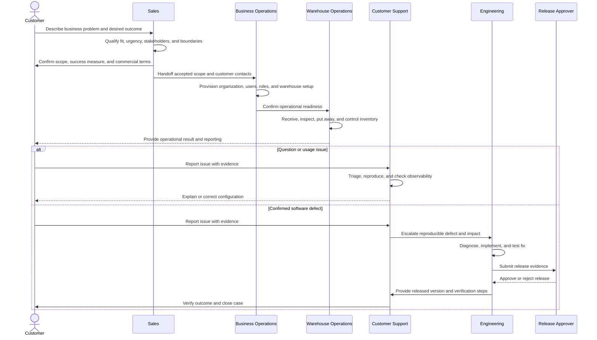
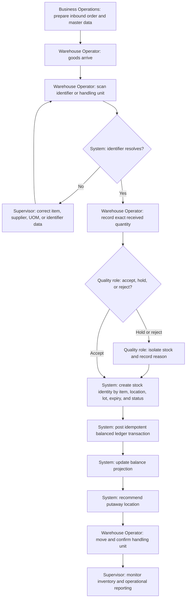
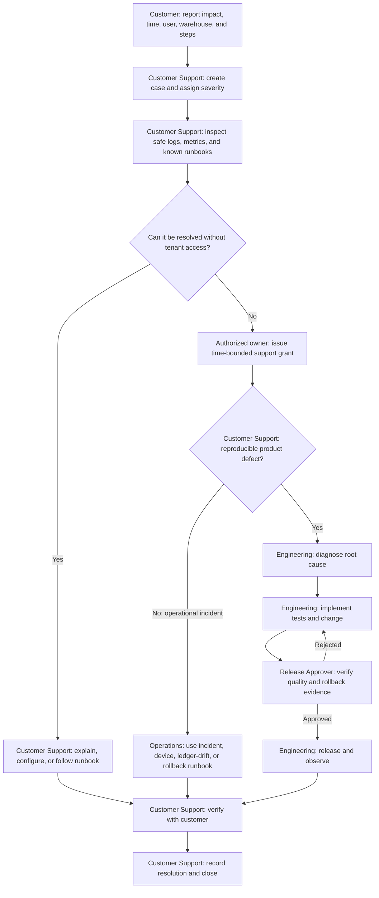
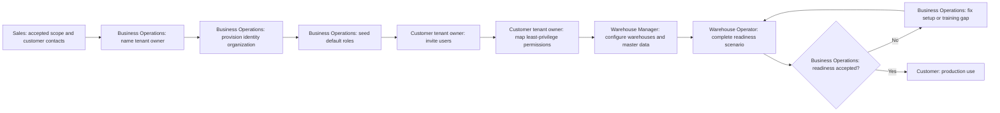
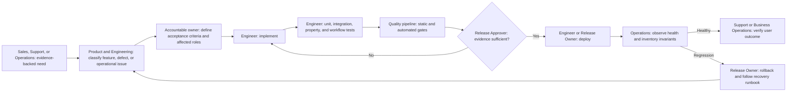

# Customer-to-Operations Workflow

This document shows how work should move from the customer through Sales,
Business Operations, Warehouse Operations, Customer Support, and Engineering.

## Scope and legend

- **Recommended business layer**: customer, Sales, account ownership, commercial
  approval, and customer-success handoffs. These roles are needed for an end-to-end
  operating model, but they are not CRM features implemented by this repository.
- **Repository-backed system layer**: tenant onboarding, default roles and
  permissions, receipt-to-putaway, inventory controls, observability, controlled
  support access, incident response, and release/rollback procedures.
- **Accountable owner**: the role that decides whether a task is complete.
  Contributors may assist, but ownership should not be shared ambiguously.

## 1. End-to-end customer journey

```mermaid
flowchart LR
    C1["Customer: explains need"]
    S1["Sales: qualifies need"]
    S2["Sales: agrees scope and commercial terms"]
    B1["Business Operations: accepts handoff"]
    B2["Business Operations: onboards organization and users"]
    W1["Warehouse Operations: runs daily workflow"]
    C2["Customer: receives operational outcome"]
    CS1["Customer Support: handles questions and incidents"]
    E1["Engineering: fixes product or platform defect"]
    R1["Approver: checks release evidence"]
    CS2["Customer Support: verifies resolution"]
    S3["Sales or Account Owner: reviews value and next need"]

    C1 --> S1 --> S2 --> B1 --> B2 --> W1 --> C2
    C2 -->|"question or problem"| CS1
    CS1 -->|"usage or configuration issue"| CS2
    CS1 -->|"confirmed product defect"| E1 --> R1 --> CS2
    CS2 --> C2
    C2 --> S3 -->|"new requirement"| S1
```

The primary path is customer need to usable warehouse outcome. Support and
Engineering form a controlled recovery loop, while Sales owns the commercial
feedback loop.

## 2. Role handoffs

## 3. Warehouse execution: receipt to putaway

This is the core repository-backed operational slice.

Control rules:

- Do not edit posted inventory history in place; corrective actions create new
  compensating ledger activity.
- Use exact quantities and item UOM rules at the transaction boundary.
- Treat item, physical location, lot, expiry, status, and handling unit as part of
  stock identity.
- Reconcile ledger history and balance projections when drift is detected.

## 4. Customer support and engineering escalation

Support access is an exception, not the first diagnostic step. Observability and
runbooks should be used before requesting tenant access; any grant should be
authorized, scoped, time-bounded, and auditable.

## 5. Customer onboarding and access ownership

Authorization should fail closed. Sensitive or high-impact actions should use the
permission catalogue, step-up verification where marked, and maker-checker
approval where required.

## 6. Engineering delivery loop

## 7. Who does what

| Role                           | Accountable for                           | Main tasks                                                                                                            | Handoff evidence                                                          |
| ------------------------------ | ----------------------------------------- | --------------------------------------------------------------------------------------------------------------------- | ------------------------------------------------------------------------- |
| Customer                       | Business need and acceptance              | Explain need, provide constraints and examples, nominate users, verify outcome                                        | Desired outcome, priority, sample evidence, acceptance confirmation       |
| Sales / Account Owner          | Commercial relationship                   | Qualify opportunity, agree scope, set expectations, maintain stakeholder map, route new needs                         | Accepted scope, contacts, commercial status, promised dates               |
| Business Operations            | Customer operational readiness            | Accept Sales handoff, coordinate onboarding, provision organization, seed roles, coordinate training and go-live      | Onboarding checklist, named tenant owner, readiness result                |
| Customer Tenant Owner          | Access inside the customer organization   | Invite users, assign least privilege, approve sensitive support access where policy requires                          | User list, role mapping, support grant authorization                      |
| Warehouse Manager / Supervisor | Safe warehouse execution                  | Configure warehouse context, manage master data, supervise exceptions, review reports and reconciliation              | Readiness scenario, exception decision, reconciliation evidence           |
| Warehouse Operator             | Physical execution and accurate capture   | Scan, receive, inspect, label, put away, confirm movement                                                             | Scan/receipt record, quantity, quality result, location confirmation      |
| Customer Support               | Case ownership and customer communication | Log, classify, reproduce, use observability/runbooks, request controlled access only when necessary, verify and close | Severity, reproduction, timestamps, safe diagnostics, verification result |
| Engineer                       | Product correctness                       | Diagnose defects, design change, implement, test, document verification and rollback                                  | Root cause, code/tests, risk note, release and rollback steps             |
| Release Approver / Checker     | Independent change decision               | Check quality evidence, security and tenant impact, migration/recovery plan, approve or reject                        | Approval record and release evidence                                      |

## 8. Work breakdown by phase

| Phase                  | Tasks                                                                                    | Accountable owner     | Contributors                             | Done when                                                  |
| ---------------------- | ---------------------------------------------------------------------------------------- | --------------------- | ---------------------------------------- | ---------------------------------------------------------- |
| 1. Discover            | Capture problem, users, warehouse constraints, desired metrics, urgency                  | Sales / Account Owner | Customer, Business Operations            | Need and success measure are written and accepted          |
| 2. Commit              | Confirm scope, exclusions, commercials, timeline, and handoff contacts                   | Sales / Account Owner | Customer, Business Operations            | Operations accepts a complete handoff                      |
| 3. Onboard             | Provision organization, seed roles, invite users, configure warehouse/master data, train | Business Operations   | Tenant Owner, Warehouse Manager, Support | Readiness scenario passes with named owners                |
| 4. Operate             | Receive, scan, inspect, post ledger activity, put away, monitor                          | Warehouse Manager     | Operators, Quality role                  | Physical result agrees with recorded inventory state       |
| 5. Support             | Log, classify, reproduce, observe, use runbook, communicate                              | Customer Support      | Customer, Operations                     | Resolution is verified or defect is reproducibly escalated |
| 6. Engineer            | Diagnose, implement, test, prepare release and rollback evidence                         | Engineering           | Support, Product/Operations              | Acceptance criteria and quality gates pass                 |
| 7. Approve and release | Independently check evidence, approve, deploy, observe                                   | Release Approver      | Engineering, Operations                  | Release is healthy or rollback completes safely            |
| 8. Close and improve   | Verify customer outcome, document resolution, review recurring cause or next need        | Customer Support      | Customer, Sales, Engineering             | Customer confirms outcome and follow-up has an owner       |

## 9. Handoff rules

1. **Customer to Sales:** include the problem, affected people, urgency, and desired
   outcome—not only a requested feature.
2. **Sales to Business Operations:** include accepted scope, exclusions, customer
   contacts, promised dates, and success measure.
3. **Business Operations to Warehouse Operations:** include configured organization,
   users, roles, warehouse context, master data, training, and readiness result.
4. **Support to Engineering:** include severity, tenant-safe evidence, timestamps,
   exact reproduction steps, expected versus actual behavior, and workaround.
5. **Engineering to Release Approver:** include acceptance criteria, tests, risk,
   affected permissions/tenants, observability, deployment steps, and rollback steps.
6. **Support to Customer:** translate the technical result into customer impact,
   verification steps, and any remaining limitation.

## Repository evidence

- [Project plan](../PROJECT_PLAN.md) — target architecture and inbound vertical slice.
- [Permission catalogue](./permissions.md) — default roles, fail-closed permissions,
  maker-checker, step-up verification, and support grants.
- [Inbound-scope decision](./adr/0007-inbound-slice-scope.md) — receipt-to-putaway.
- [Inventory-ledger decision](./adr/0003-append-only-inventory-ledger.md) — append-only,
  balanced, idempotent inventory history.
- [Stock-identity decision](./adr/0005-warehouse-location-and-stock-identity.md) —
  warehouse locations and handling units.
- [Observability decision](./adr/0011-async-jobs-reporting-and-observability.md) —
  bounded asynchronous work, reporting, and observability.
- [Delivery-gates decision](./adr/0012-delivery-release-and-quality-gates.md) — quality
  and release controls.
- [Operational runbooks](./runbooks/README.md) — incident response, support access,
  onboarding/offboarding, ledger drift, release/rollback, and device failure.
