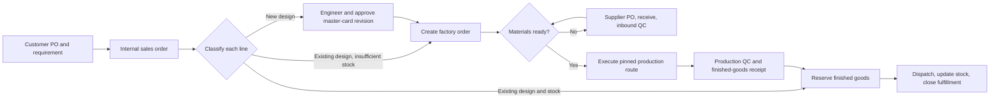

# Figma Order-to-Ship Operating Model Support Plan

Status: **Proposed roadmap extension**
Prepared: 2026-08-14
Source: [Work Flow Top Gold FigJam](https://www.figma.com/board/NTkJT0iGsmem2K0hayqkDi/Work-Flow-Top-Gold?node-id=0-1&p=f&t=wpfIgAWxSQzd1Q7I-0)
Repository baseline: Phases 1–4 are implemented locally; the customer-order/master-card factory-handoff slice is planned but not yet represented in `convex/schema.ts`.

## 1. Recommendation

Treat the FigJam board as one end-to-end **customer order-to-ship process**, implemented as connected bounded workflows rather than one large record with one status field.

The existing system already provides the correct platform foundation: tenant isolation, permissions, idempotent audited writes, supplier purchase orders, inbound receiving and QC, an immutable inventory ledger, balance projections, master data, and putaway. The new work should reuse those capabilities and add four business contexts:

1. Customer order and engineering design control.
2. Factory-order and material-readiness planning.
3. Production route execution and production quality.
4. Finished-goods reservation, shipment, and closure.

The current Phase 5A plan should remain the first increment. The material, production, and shipping stages shown in FigJam are a material scope expansion beyond Phase 5A and should be delivered behind separate release gates.

## 2. Interpreted company workflow

The final swimlane on the board names these operating roles: Customer, Sales, Design/Engineering, Customer Service, Purchasing, Production, Inventory, and QA/QC.

### 2.1 Intake and classification

1. Customer sends a purchase order and requirements.
2. Sales records the customer PO and passes the requirement to Customer Service.
3. Customer Service opens the internal sales order (`SO`).
4. Each order line is classified independently:
   - **New product / no released design:** send to Design/Engineering.
   - **Existing product / stock available:** reserve finished goods and ship.
   - **Existing product / no or insufficient stock:** use the released specification and create a factory order (`FO`).

### 2.2 New-design loop

1. Engineering checks that required information is complete.
2. Missing information returns to Customer Service, Sales, and the customer.
3. Engineering defines the box structure, paper layers, flute, box/sheet dimensions, and performs the Box Calculation Kit and BCT/Burst/ECT checks.
4. Engineering adjusts paper, grammage, or flute and recalculates when the design fails its criteria.
5. Engineering creates the new SKU, summarizes the approved specification, and releases it back to Customer Service.
6. Customer Service selects the released design and opens the FO.

### 2.3 Material readiness and purchasing

1. The system calculates the materials required by the FO.
2. Inventory is checked using available quantity, not physical on-hand alone.
3. If materials are ready, the FO can be released to Production.
4. If materials are short, Customer Service receives a readiness exception and Purchasing receives a material demand.
5. Purchasing creates a supplier PO using the existing purchasing context.
6. Existing receiving, inbound QC, ledger, and putaway functions bring the material into available stock.
7. The readiness calculation reruns and releases the waiting FO only when all hard requirements are satisfied or an authorized exception is approved.

### 2.4 Production, quality, and fulfillment

1. Production receives a master-card packet pinned to the exact approved revision plus the SO, customer PO, and FO references.
2. The factory executes the ordered route. The board shows Slitter, Slotter, Stitching, Printer, Die Cut, Pull, Glue, Bundle, and Assembly; the route must be configurable per master-card revision rather than globally fixed.
3. Production records quantities completed, rejected, scrapped, and reworked at the relevant operations.
4. QA/QC records final inspection and disposition.
5. Accepted finished goods are posted into inventory through the immutable ledger.
6. Finished goods are reserved against the customer-order line, prepared, shipped, and posted out of stock.
7. The order line and order close only when quantity and exception rules are satisfied.

## 3. Fit with the current system

| Capability from FigJam                   | Current repository fit                                         | Required change                                                                                                          |
| ---------------------------------------- | -------------------------------------------------------------- | ------------------------------------------------------------------------------------------------------------------------ |
| Tenant, users, roles, audit              | Implemented foundation                                         | Add business-role permissions and role compositions.                                                                     |
| Customer PO / SO                         | Planned only                                                   | Add customers, customer orders, lines, internal SO numbering, lifecycle, and intake UI/import.                           |
| Design request and SKU engineering       | Planned in Phase 5A                                            | Implement design requests, master cards, immutable revisions, structured calculations, files, and maker-checker release. |
| Existing-design exact match              | Planned in Phase 5A                                            | Match by customer + customer product code; keep similarity as human-confirmed suggestions only.                          |
| Factory order (`FO`)                     | Production release is planned only to acknowledgement          | Add a true factory-order aggregate with demand, target site, dates, route, quantity, and execution states.               |
| Material requirements                    | Explicitly out of current Phase 5A                             | Add revisioned material requirements, explosion, shortage calculation, allocation, and exception workflow.               |
| Supplier purchasing and material receipt | Supplier PO, receipt, inbound QC, and ledger foundations exist | Link material demand to supplier PO lines and receipt fulfillment without reusing customer-order tables.                 |
| Production operations                    | Not implemented                                                | Add work centers, route operations, dispatch/claim, execution records, quantities, evidence, and exceptions.             |
| Production QC                            | Existing QC is inbound-focused                                 | Add production inspection plans/results/dispositions linked to FO and operation/completion.                              |
| Finished-goods receipt                   | Ledger can support it                                          | Add production-completion transaction source and virtual production/WIP boundaries.                                      |
| Finished-goods reservation               | Deliberately absent                                            | Add auditable reservation/allocation projections with concurrency-safe release and consumption.                          |
| Shipment and order closure               | Deliberately absent                                            | Add shipment, shipment lines, pick/prepare confirmation, dispatch ledger posting, and closure policy.                    |

Two naming collisions must remain explicit:

- `customerOrders` represent the customer PO / internal sales-order context. Existing `purchaseOrders` remain supplier-facing procurement documents.
- A production `FO` must not be represented by an inbound receipt, supplier PO, or generic inventory transaction. It receives its own stable identity and lifecycle.

## 4. Target domain model

Every table below is tenant-scoped, uses `orgId`-first indexes, bounded reads, idempotent writes, append-only audit evidence, and warehouse/production-site scope where relevant.

### 4.1 Commercial and workflow anchor

- `customers`
- `customerOrders`
- `customerOrderLines`
- `customerOrderReferences` for customer PO, internal SO, ERP, and legacy identifiers
- `orderLineDesignDecisions` recording new design, exact reuse, or confirmed suggested reuse
- `fulfillmentCases`, one per customer-order line, as the correlation anchor across design, supply, production, inventory, and shipment

The case provides a timeline and exception inbox. It must not become another source of truth for the detailed state owned by each context.

### 4.2 Design and master-card control

- `designRequests`
- `masterCards`
- `masterCardRevisions`
- `masterCardMaterials`
- `masterCardRouteSteps`
- `masterCardQualityRequirements`
- `masterCardFiles`
- `masterCardApprovals`

Released revisions are immutable. Every FO pins one exact released revision. Calculated values retain their inputs, formula/version identifier, output, pass/fail result, actor, and timestamp so the factory can reproduce the approved decision.

### 4.3 Factory planning and material supply

- `productionSites` if a production site is not equivalent to an existing warehouse
- `workCenters` and `machines` as optional planning resources; machine telemetry remains deferred
- `factoryOrders`
- `factoryOrderMaterialRequirements`
- `factoryOrderMaterialAllocations`
- `factoryOrderShortages`
- `materialDemandLinks` connecting shortages to one or more supplier PO lines
- `factoryOrderRouteSteps`, copied from the pinned revision at FO release so later design changes cannot alter live work

Material readiness must be derived from requirements, active allocations, usable stock status, warehouse, UOM conversion, lot/expiry policy, and expected supply. A mutable boolean such as `materialsReady` may be cached as a projection but cannot be the only evidence.

### 4.4 Production execution and quality

- `productionOperations`
- `productionOperationRuns`
- `productionMaterialIssues`
- `productionCompletions`
- `productionExceptions`
- `productionInspections`
- `productionInspectionResults`
- `productionDispositions`

Material issue, WIP moves, finished-goods completion, scrap, rework, and shipment must post balanced inventory transactions through the existing ledger service. No production module may update inventory balances directly.

### 4.5 Reservation and shipment

- `inventoryReservations`
- `reservationAllocations`
- `shipments`
- `shipmentLines`
- `shipmentPackages` only when packing evidence becomes necessary
- `shipmentEvents`

Reservations are separate from physical inventory. The availability projection becomes:

`available = eligible on-hand - active reservations - other hard allocations`

Shipment confirmation posts finished goods from their physical buckets to a virtual customer/shipping boundary and consumes the linked reservation atomically.

### 4.6 Module seams and interfaces

Keep each domain module deep: callers provide a business command and receive a complete result or refusal; they do not coordinate state transitions, permissions, inventory effects, audit, and follow-up work themselves.

| Module               | External interface                                                             | Complexity hidden in the implementation                                                                                                        |
| -------------------- | ------------------------------------------------------------------------------ | ---------------------------------------------------------------------------------------------------------------------------------------------- |
| Order intake         | `acceptCustomerOrder`, `amendOrderLine`, `cancelOrderLine`                     | Numbering, duplicate detection, customer/product resolution, line quantities, audit, and initial classification work.                          |
| Design control       | `requestDesign`, `submitRevision`, `decideRevision`, `selectReleasedRevision`  | Completeness rules, calculations, files, comparison, maker-checker, immutable revisioning, and waiting-line updates.                           |
| Factory planning     | `createFactoryOrder`, `evaluateReadiness`, `releaseFactoryOrder`               | Requirement explosion, UOM conversion, eligible inventory, allocation, shortages, expected supply, pinned route/specification, and exceptions. |
| Production execution | `recordOperationProgress`, `recordProductionException`, `completeFactoryOrder` | Route order, claims, partial quantities, genealogy, material issue/return, WIP, scrap/rework, and ledger transaction plans.                    |
| Production quality   | `recordInspection`, `proposeDisposition`, `approveDisposition`                 | Inspection requirements, evidence, separation of duties, stock status, rework, and completion eligibility.                                     |
| Fulfillment          | `reserveOrderLine`, `releaseReservation`, `dispatchShipment`, `closeOrder`     | Availability, concurrency, allocation choice, partial fulfillment, ledger posting, and close policy.                                           |

The existing inventory-ledger module remains the only seam through which physical stock changes. Factory planning may read availability projections, but it cannot write balances. Production and Fulfillment submit validated transaction intents to the ledger and use the ledger result as their inventory evidence.

Use adapters only where behavior genuinely varies. Private file storage and outbound customer notifications need production and test adapters. Pure calculations, lifecycle rules, and Convex-local persistence remain internal seams rather than becoming public ports. Tests exercise the same module interfaces as production callers and assert observable results, refusals, emitted transaction intents, and durable records rather than implementation details.

## 5. Lifecycle and control rules

### 5.1 Customer-order line

`RECEIVED → DESIGN_CHECK → DESIGN_REQUIRED | STOCK_CHECK → ENGINEERING | READY_FROM_STOCK | READY_FOR_FO → IN_SUPPLY | IN_PRODUCTION → AWAITING_FINAL_QC → READY_TO_SHIP → SHIPPED → CLOSED`

Cancellation is an explicit transition with reason and policy checks. Partial quantities may occupy different branches simultaneously, so line-level quantities and fulfillment allocations are authoritative; the headline status is a projection.

### 5.2 Master-card revision

`DRAFT → IN_REVIEW → RELEASED | REJECTED → SUPERSEDED`

- Author and releaser must be different users.
- Rejection and supersession never delete history.
- Factory orders and release packets always render the pinned revision.

### 5.3 Factory order

`DRAFT → MATERIAL_CHECK → BLOCKED_MATERIAL | READY → RELEASED → IN_PROGRESS → AWAITING_QC → COMPLETED | REWORK | CANCELLED → CLOSED`

- `READY` requires a released revision and satisfied hard material requirements.
- Release copies the approved route and specification snapshot.
- Operation completion follows the configured route and exception policy; it is not hard-coded to the sample route shown on the board.
- FO completion alone does not close the customer order; accepted inventory and shipment fulfillment do.

### 5.4 Shipment

`DRAFT → RESERVED → READY → DISPATCHED → DELIVERED | EXCEPTION → CLOSED`

The first implementation may stop at `DISPATCHED/CLOSED` if proof of delivery is not required. Delivery/POD and transport optimization remain later capabilities.

## 6. Authorization additions

Add code-owned permissions before exposing any new public Convex function. Proposed groups:

| Group                    | Representative permissions                                                                                | Default roles                                           |
| ------------------------ | --------------------------------------------------------------------------------------------------------- | ------------------------------------------------------- |
| Customer orders          | `sales.order.read/create/update/cancel/release`                                                           | Sales, Customer Service, Sales Manager                  |
| Design                   | `engineering.request.read/assign`, `engineering.masterCard.draft/submit/release`, `engineering.file.read` | Engineer, Engineering Approver                          |
| Factory planning         | `production.fo.read/create/release/cancel`, `production.material.override`                                | Production Planner, Production Supervisor               |
| Execution                | `production.operation.claim/execute`, `production.exception.raise`                                        | Production Operator, Production Supervisor              |
| Production quality       | `productionQuality.inspect/submit/approve`                                                                | Production QC, QA Approver                              |
| Reservation and shipping | `fulfillment.reserve/release`, `shipping.shipment.create/dispatch/close`                                  | Inventory Planner, Shipping Operator, Warehouse Manager |

High-risk actions use the existing step-up, threshold, and maker-checker mechanisms. At minimum: master-card release, material-shortage override, FO cancellation after issue, QC disposition approval, reservation override, shipment reversal, and order close-with-short must be guarded and audited.

## 7. Delivery roadmap

Estimates assume one cross-functional product team and exclude pilot waiting time. Each increment must be deployable behind tenant entitlements or feature flags.

### Phase 5A — Customer order and approved design (4–6 weeks)

Deliver the already planned vertical slice:

- Customer register, customer PO/SO intake, line lifecycle, and exact design matching.
- Missing-information loop across Customer Service, Sales, customer, and Engineering.
- Design request queue and assignment.
- Structured master-card editor, calculations, route, quality requirements, private files, revision comparison, and independent approval.
- Factory release packet pinned to the exact revision and read-only factory acknowledgement.

Release gate: both existing-design and new-design order lines reach an acknowledged factory packet with correct tenant isolation, revision pinning, permissions, idempotency, Thai/English UX, and private-file enforcement.

### Phase 5B — FO and material readiness (3–5 weeks)

- Confirm whether FO is the existing `productionRelease` renamed/expanded or a separate aggregate; prefer one authoritative `factoryOrders` aggregate.
- Add production site/work center masters and revisioned material requirements.
- Implement requirement explosion, available-to-allocate calculation, shortages, material allocations, and readiness exceptions.
- Connect shortages to existing supplier PO lines and receipts.
- Re-evaluate waiting FOs on receipt, QC release, allocation change, reversal, and expiry/status change.

Release gate: an existing-design/no-stock line opens an FO, creates an explainable shortage, is supplied through the existing inbound flow, and becomes ready exactly once without oversubscribing stock.

### Phase 5C — Production execution (5–7 weeks)

- Copy the pinned route into FO steps at release.
- Add production queues, operation claim/start/pause/complete, quantities, evidence, and exception handling.
- Add material issue and return, WIP movement, scrap, rework, and completion ledger transaction types.
- Provide desktop supervision and scan-first handheld operation screens.
- Add throughput, WIP aging, shortage, scrap, rework, and overdue projections.

Release gate: a released FO executes its configured route, preserves a complete genealogy/audit trail, refuses invalid transitions and cross-tenant references, and reconciles every inventory effect to the ledger.

### Phase 5D — Production QC and finished-goods receipt (3–5 weeks)

- Add production inspection plans from the pinned master-card revision.
- Record samples/results/evidence, propose dispositions, and enforce independent approval.
- Post accepted output to finished-goods inventory; post rejected/scrap/rework outcomes through explicit transactions.
- Prevent reservation or shipment of held/rejected stock.

Release gate: accepted output becomes available inventory exactly once; failed output cannot be shipped; reversals preserve the original production and QC history.

### Phase 5E — Reservation, shipment, and closure (4–6 weeks)

- Add concurrency-safe finished-goods reservation and release.
- Support the FigJam direct-from-stock branch and produced-to-stock branch.
- Add shipment creation, preparation, dispatch posting, short/partial shipment, cancellation, and order-line/order closure.
- Add customer notification/delivery-date hooks through an outbox; provider integration is optional.

Release gate: two concurrent orders cannot reserve the same available quantity; dispatch atomically consumes the reservation and inventory; partial fulfillment remains open; completed fulfillment closes with an auditable chain from customer PO to shipment.

### Phase 5F — Migration and pilot hardening (3–4 weeks plus observation)

- Import legacy customers, SKUs, released master cards, open orders, and open FOs with preview, deterministic validation, duplicate reporting, and resumability.
- Run parallel operation against real documents and labels.
- Load-test hot SKUs, allocations, FO queues, and operation completion.
- Add reconciliation, alerts, dashboards, runbooks, training, and rollback evidence.

Release gate: representative pilot orders complete through all three classification branches with agreed cycle time, inventory accuracy, traceability, accessibility, and operational support evidence.

## 8. Implementation sequence inside each phase

Use the repository's existing pattern for every aggregate:

1. Define vocabulary and invariants in `docs/domain-glossary.md` and an ADR when the decision is architectural.
2. Write pure state-transition, calculation, and validation modules under `convex/model/**` with unit and property tests.
3. Add validators, schema tables, `orgId`-first indexes, uniqueness contracts, and tenant-boundary declarations.
4. Add permission codes and role migrations before public functions.
5. Implement thin tenant functions with authorization, bounded reads, idempotency, audit, and write envelopes.
6. Add integration, isolation, concurrency, and retry tests.
7. Build desktop and handheld UI with Thai/English copy and permission-aware actions.
8. Add end-to-end journeys, operational metrics, migration rehearsal, and release evidence.

Do not begin a downstream UI phase while its lifecycle, ledger effects, permission policy, and reversal/cancellation behavior remain undefined.

## 9. End-to-end acceptance journeys

1. **Existing design and stock available:** customer PO → SO → exact revision confirmed → available stock reserved → shipment dispatched → stock and order close correctly.
2. **Existing design but stock unavailable:** customer PO → SO → released revision → FO → material readiness → production route → final QC → finished-goods receipt → reservation → shipment.
3. **New design:** incomplete requirement loops back; completed requirement passes calculation and independent approval; SKU/revision is released; FO pins it; later revision changes do not affect that FO.
4. **Material shortage:** FO shortage creates procurement demand; partial receipts do not prematurely release the FO; released/QC-approved material satisfies it; duplicate events do not double-allocate.
5. **Production exception:** scrap/rework at one route step adjusts quantities and inventory through explicit ledger transactions and requires the configured approval.
6. **Tenant and permission isolation:** identifiers from another organization, warehouse, customer, design, FO, allocation, production run, file, reservation, or shipment are refused without revealing existence.
7. **Concurrency:** simultaneous FO releases, allocations, operation completions, reservations, and dispatches never create negative available stock or duplicate immutable records.
8. **Correction:** cancellations and reversals create compensating evidence and never rewrite released specifications, ledger rows, production history, approvals, or shipments.

## 10. Decisions required before Phase 5B

| ID    | Decision                        | Recommended default                                                                                                                                                            |
| ----- | ------------------------------- | ------------------------------------------------------------------------------------------------------------------------------------------------------------------------------ |
| WF-01 | Meaning and numbering of `SO`   | `customerOrders` is the sales-order aggregate; store both customer PO number and tenant-generated SO number.                                                                   |
| WF-02 | Meaning and numbering of `FO`   | One `factoryOrders` aggregate with tenant-generated FO number; supersede the narrow acknowledgement-only `productionReleases` concept.                                         |
| WF-03 | Production site model           | Reuse `warehouse` only if it truly represents the factory and its authorization boundary; otherwise add `productionSites`.                                                     |
| WF-04 | Production route                | Configurable per released master-card revision. Confirm whether “Spitter” on the board means “Slitter” and whether steps may be skipped, repeated, parallel, or subcontracted. |
| WF-05 | Material requirement source     | Structured master-card/BOM quantities with scrap/yield factor and exact UOM conversions; no free-text-only planning.                                                           |
| WF-06 | Allocation policy               | Hard allocation at FO release using eligible status/location/lot rules; no silent over-allocation.                                                                             |
| WF-07 | Partial production and shipment | Support partial quantities from the first release; derive headline statuses from quantities.                                                                                   |
| WF-08 | Production QC points            | Start with final QC, but model inspection points against route steps so in-process QC can be enabled later.                                                                    |
| WF-09 | Completion posting location     | Accepted output enters a configured finished-goods staging/warehouse location before reservation and dispatch.                                                                 |
| WF-10 | Delivery boundary               | Phase 5E closes at dispatch unless the business requires delivery confirmation/POD in the first release.                                                                       |
| WF-11 | Box calculation ownership       | Confirm formulas, units, tolerances, reference standards, approval evidence, and versioning with Engineering/QA before coding.                                                 |
| WF-12 | Commercial data visibility      | Keep cost and selling price out of factory packets unless the production role explicitly requires them.                                                                        |

## 11. Immediate next actions

1. Hold a 90-minute workflow validation workshop with one representative from Sales, Customer Service, Engineering, Purchasing, Production, Inventory, and QA/QC.
2. Mark the FigJam board's final version and retire or label older duplicate flows to avoid implementing conflicting branches.
3. Resolve decisions WF-01 through WF-12 and add accepted answers to the project approval record.
4. Collect 10–20 real customer POs, master cards, material specifications/BOMs, supplier POs, factory orders, QC records, and shipment records.
5. Produce a field dictionary and state-transition matrix using those documents.
6. Promote Phase 5A coverage rows first; do not remove the current manufacturing/shipping non-goal until each later phase receives dated approval.
7. Implement the existing-design and new-design Phase 5A walking skeleton before committing to production-execution UI.
