# คู่มือใช้งานแบบมีภาพประกอบ

คู่มือนี้อธิบายงานหลักตั้งแต่เลือกคลังสินค้า สร้างข้อมูลหลัก สร้างใบสั่งซื้อ
รับสินค้า ตรวจสอบคุณภาพ จัดเก็บ ตรวจสอบสต็อก และส่งออกข้อมูล
กรอบสีแดงในภาพตรงกับหมายเลขขั้นตอนใต้ภาพ

> **ข้อมูลในภาพเป็นข้อมูลตัวอย่าง**
> ก่อนบันทึกในระบบจริง ให้ตรวจสอบองค์กร คลังสินค้า และสิทธิ์ของผู้ใช้งาน
> เพราะการทำงานอาจเขียนข้อมูลลงเซิร์ฟเวอร์

## 1. เริ่มต้นใช้งานและเลือกคลังสินค้า


1. ที่กรอบ **1** เลือกคลังสินค้าที่ต้องการทำงาน ข้อมูลทุกหน้าหลังจากนี้จะอ้างอิง
   คลังสินค้าที่เลือกอยู่
2. ที่กรอบ **2** เลือกงานที่ต้องการเริ่ม เช่น รับสินค้า ตรวจสอบคุณภาพ จัดเก็บ
   ดูยอดคงเหลือ หรือส่งออกข้อมูล
3. ตรวจสอบชื่อคลังสินค้าที่แสดงใต้หัวข้อ “แดชบอร์ด” ก่อนเริ่มงานทุกครั้ง

งานนี้สำเร็จเมื่อชื่อคลังสินค้าที่ต้องการปรากฏในแถบบริบทและบนแดชบอร์ด

## 2. สร้างรายการสินค้า

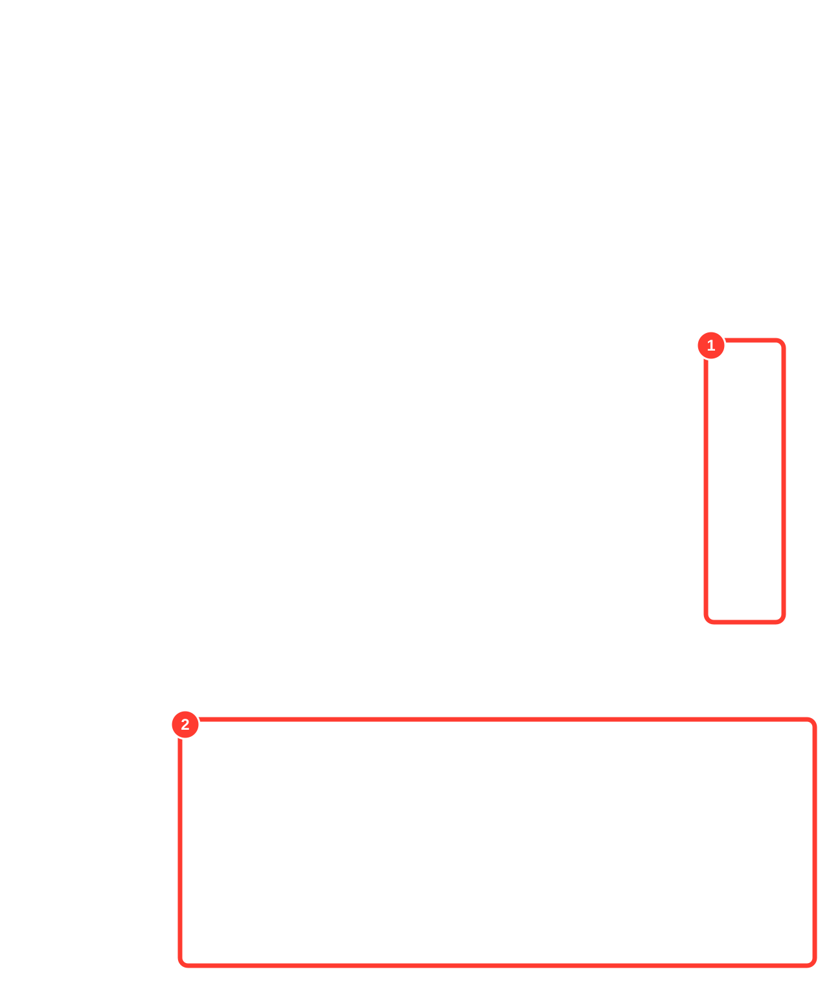

1. ที่กรอบ **1** กด “เปิดข้อมูลสินค้า” เพื่อดูหรือแก้ไขข้อมูลของสินค้าที่มีอยู่
2. ที่กรอบ **2** กรอกรหัสสินค้า ชื่อ หน่วยนับหลัก และรูปแบบการติดตาม
3. กด “บันทึกสินค้า” เมื่อกรอกข้อมูลครบ

รหัสสินค้าและหน่วยนับหลักกำหนดได้ครั้งเดียวตอนสร้าง จึงต้องตรวจสอบให้ถูกต้อง
ก่อนบันทึก งานสำเร็จเมื่อสินค้าใหม่ปรากฏในทะเบียนข้อมูล

## 3. สร้างผู้จัดจำหน่าย

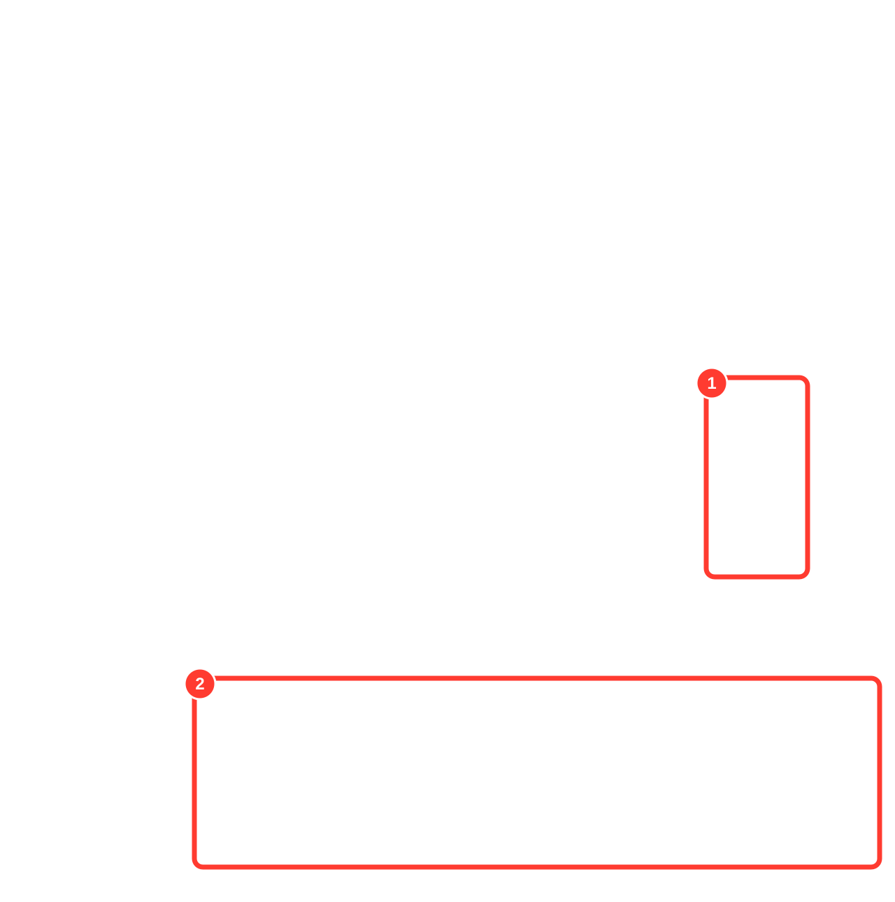

1. ที่กรอบ **1** ใช้ปุ่มในคอลัมน์การจัดการเมื่อต้องการปิดหรือเปิดใช้งานผู้จัดจำหน่าย
2. ที่กรอบ **2** กรอกรหัสและชื่อผู้จัดจำหน่าย แล้วกด “บันทึกผู้จัดจำหน่าย”

งานสำเร็จเมื่อผู้จัดจำหน่ายปรากฏในทะเบียนและมีสถานะ “ใช้งาน”

## 4. สร้างและเปิดใบสั่งซื้อ

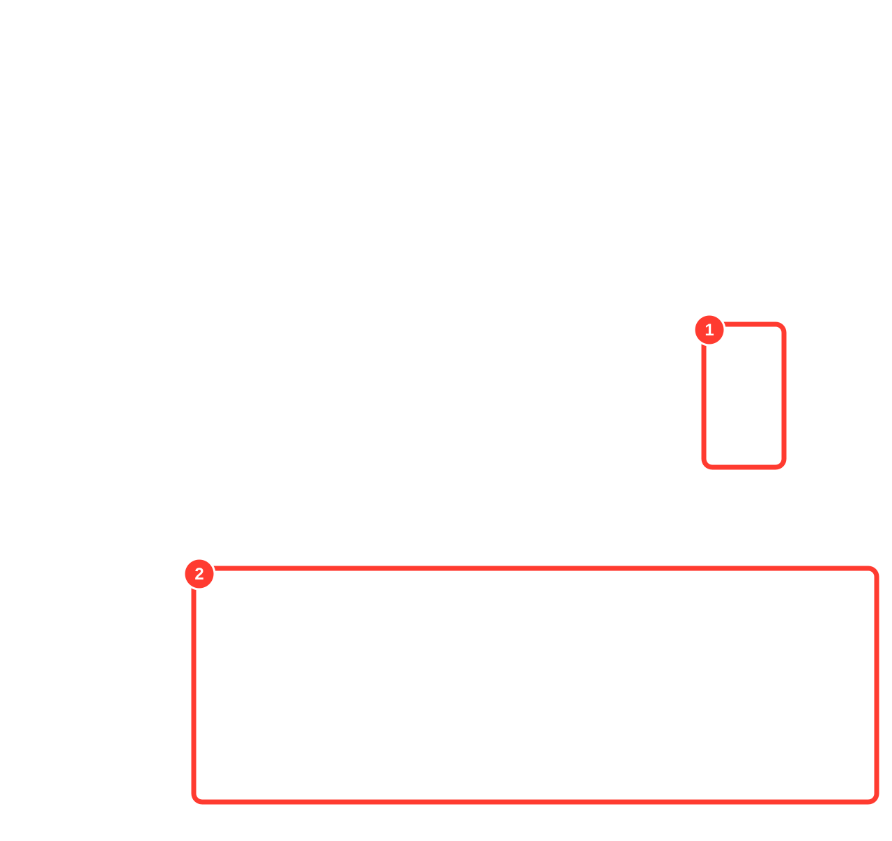

1. ที่กรอบ **1** กด “เปิดใบสั่งซื้อ” เมื่อต้องการทำงานต่อกับใบสั่งซื้อที่มีอยู่
2. ที่กรอบ **2** กรอกเลขที่ใบสั่งซื้อ เลือกผู้จัดจำหน่าย และกรอกอ้างอิงภายนอก
   ถ้ามี
3. กด “บันทึกใบสั่งซื้อ”

ใบสั่งซื้อใหม่เริ่มเป็นฉบับร่าง และจะพร้อมรับสินค้าเมื่อมีรายการสินค้าอย่างน้อยหนึ่งบรรทัด

## 5. เพิ่มรายการสินค้าและเปิดใบรับสินค้า

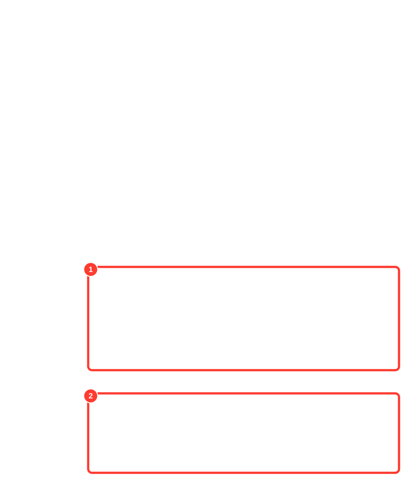

1. ที่กรอบ **1** กรอกหมายเลขบรรทัด เลือกสินค้า กรอกจำนวนและหน่วยนับ
   แล้วกด “บันทึกรายการ”
2. ตรวจสอบยอด “สั่งซื้อ / รับแล้ว / คงเหลือ” ในตารางด้านบน
3. ที่กรอบ **3** กรอกเลขที่ใบรับ แล้วกด “เปิดใบรับ”

งานสำเร็จเมื่อบรรทัดสินค้ามีสถานะ “ยังรับได้” และใบรับใหม่ปรากฏในหน้าการรับสินค้า

## 6. เปิดใบรับสินค้าและบันทึกข้อยกเว้น

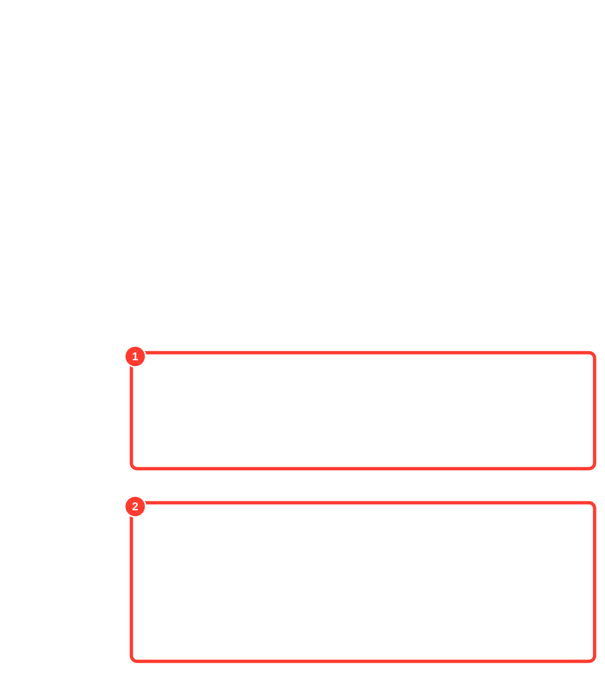

1. ที่กรอบ **1** กรอกเลขที่ใบรับ เลือกใบสั่งซื้อที่เปิดอยู่ แล้วกด “เปิดใบรับ”
2. หากพบความเสียหาย ของไม่ครบ หรือปัญหาการส่งมอบ ให้ใช้กรอบ **2**
3. เลือกประเภทข้อยกเว้นและรหัสเหตุผล เพิ่มบันทึกที่จำเป็น แล้วกด
   “แจ้งข้อยกเว้น”

ห้ามใช้ช่องบันทึกแทนประเภทปัญหา ต้องเลือกประเภทและเหตุผลให้ตรงก่อนเสมอ

## 7. บันทึกรายการรับ พาเลท และข้อมูลป้าย

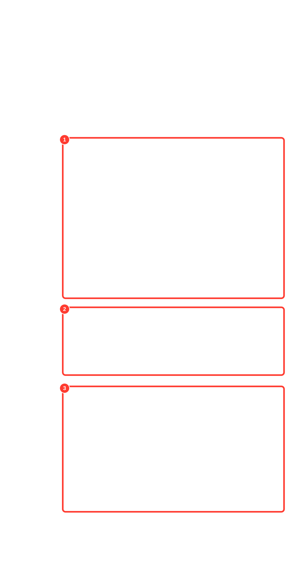

1. ที่กรอบ **1** เลือกตำแหน่งรับเข้า สแกนหรือค้นหาสินค้า เลือกบรรทัดใบสั่งซื้อ
   แล้วกรอกจำนวน หน่วยนับ ล็อต และวันหมดอายุ จากนั้นกด “บันทึกรายการ”
2. ที่กรอบ **2** กรอกรหัสพาเลท แล้วกด “บันทึกพาเลท” เมื่อต้องรวมรายการรับไว้บนพาเลท
3. ที่กรอบ **3** เลือกแม่แบบป้ายที่เผยแพร่แล้ว กรอก LPN และ SKU แล้วกด
   “สร้างข้อมูลป้าย”

งานรับสินค้าสำเร็จเมื่อรายการปรากฏในตาราง “รายการที่รับเข้า” และสถานะสต็อกแสดงผล
ตามกฎการตรวจสอบคุณภาพ

## 8. ตัดสินผลการตรวจสอบคุณภาพ

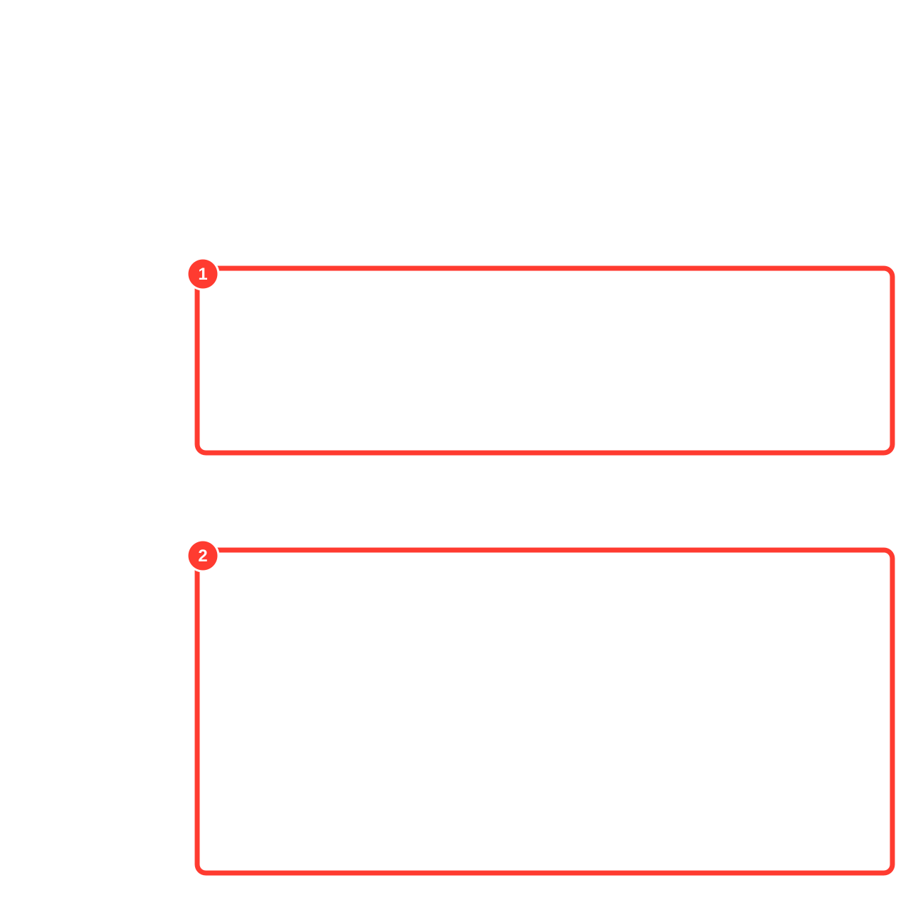

1. ที่กรอบ **1** ตรวจสอบสินค้า สถานะ วิธีสุ่มตัวอย่าง และจำนวนที่ต้องตรวจ
   จากนั้นกด “ตัดสินผลการตรวจ” ในรายการที่เปิดอยู่
2. บันทึกผลตรวจและผลการตัดสิน เช่น ปล่อยผ่าน กักกัน หรือไม่ผ่าน
3. ที่กรอบ **3** ผู้ใช้คนที่สองเลือกใบตรวจที่รออนุมัติ แล้วกด “อนุมัติผลนี้”

ผู้บันทึกผลและผู้อนุมัติต้องเป็นคนละผู้ใช้ งานสำเร็จเมื่อสถานะเปลี่ยนจาก
“รอตรวจ” หรือ “รออนุมัติ” เป็น “ตัดสินแล้ว”

## 9. รับงานจัดเก็บและยืนยันตำแหน่ง

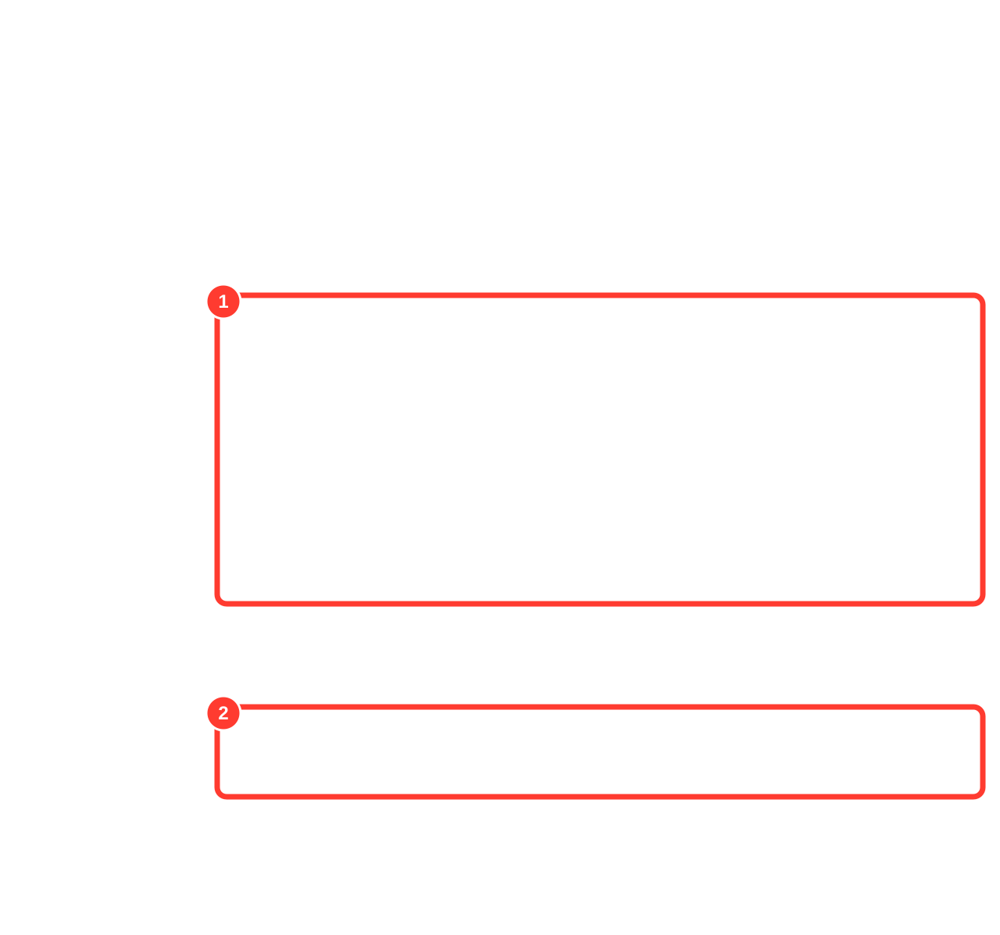

1. ที่กรอบ **1** เลือกงานที่สถานะ “พร้อมจัดเก็บ” แล้วกด “รับงานนี้”
2. กด “คำแนะนำตำแหน่ง” เพื่ออ่านตำแหน่งที่ระบบแนะนำและเหตุผล
3. ที่กรอบ **3** ตรวจสอบคำแนะนำก่อนยืนยันตำแหน่งที่เลือกจริง
4. เมื่อวางสินค้าบนชั้นแล้วจึงยืนยันการจัดเก็บ

งานสำเร็จเมื่อสถานะเป็น “จัดเก็บแล้ว” และตำแหน่งที่เลือกปรากฏในรายการ

## 10. ตรวจสอบยอดคงเหลือ

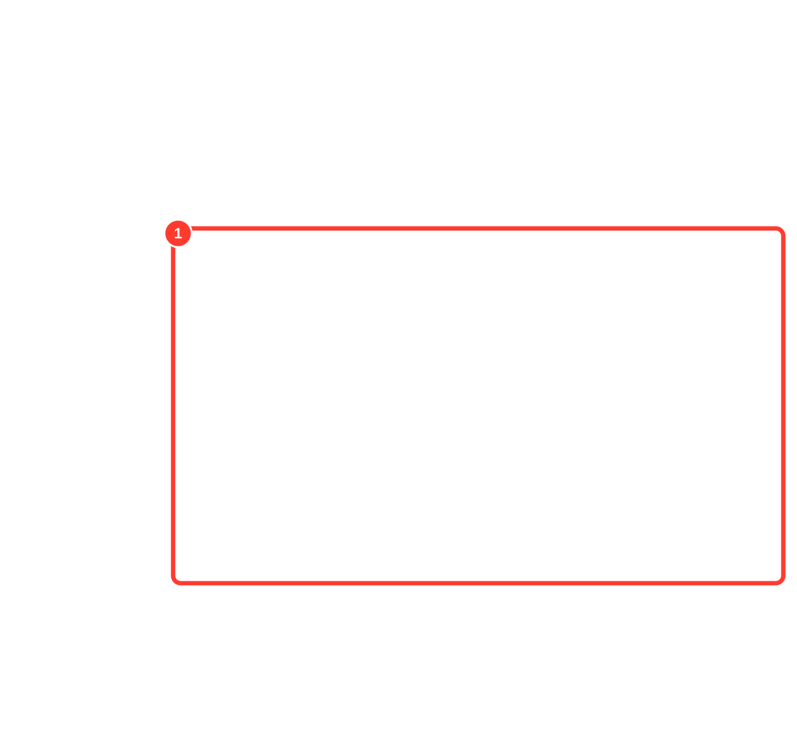

1. ในกรอบ **1** หาแถวจากสินค้า ตำแหน่งจัดเก็บ และล็อต
2. ตรวจสอบสถานะสต็อกก่อนดูจำนวน เช่น พร้อมใช้ รอตรวจสอบคุณภาพ กักกัน
   หรือหมดอายุ
3. อ่านจำนวนคู่กับหน่วยนับเสมอ

หน้านี้เป็นแบบอ่านอย่างเดียว การแก้ไขยอดต้องทำด้วยรายการกลับรายการหรือขั้นตอนที่มีหลักฐาน
ห้ามแก้ตัวเลขโดยตรง

## 11. ตรวจสอบประวัติการเคลื่อนไหว

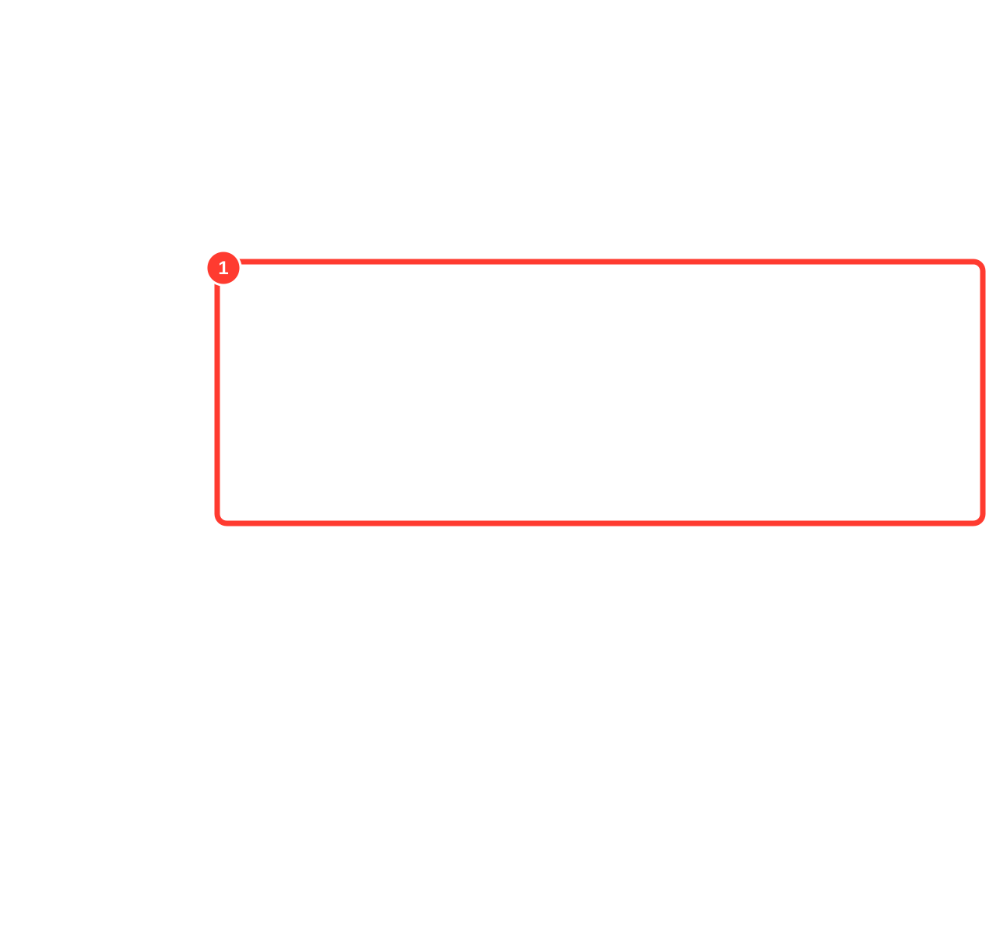

1. ในกรอบ **1** ตรวจสอบรหัสรายการ ประเภท เวลาที่เกิด วันที่ทางธุรกิจ
   และจำนวนบรรทัด
2. รายการที่มีป้าย “รายการกลับรายการ” คือรายการแก้ไขที่อ้างอิงธุรกรรมเดิม
3. ใช้รหัสรายการเมื่อติดต่อฝ่ายสนับสนุนหรือตรวจสอบหลักฐาน

ประวัติเป็นแบบเพิ่มอย่างเดียว จึงไม่มีปุ่มลบหรือแก้ไข

## 12. ส่งออกข้อมูล

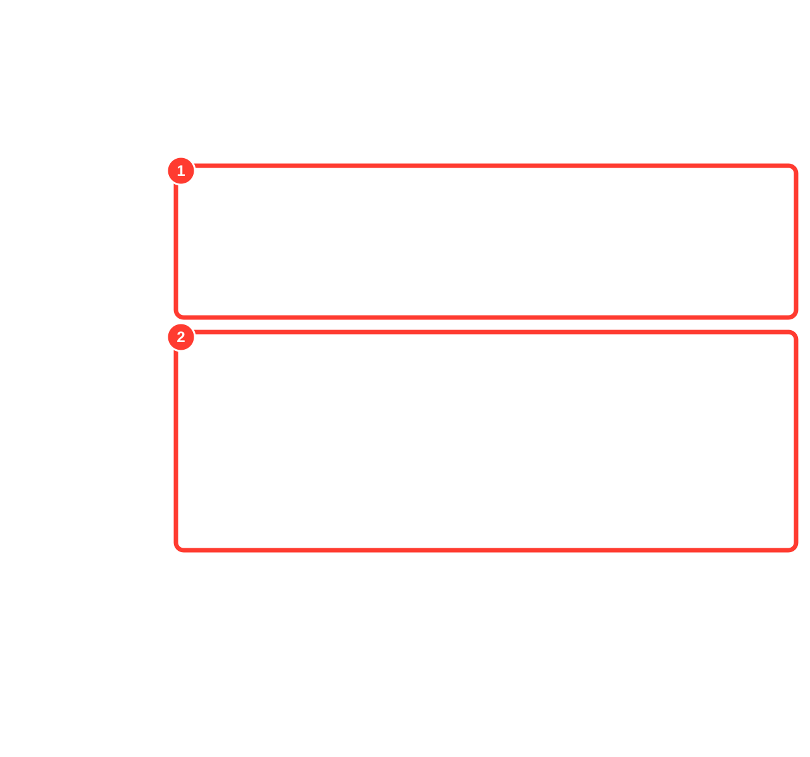

1. ที่กรอบ **1** เลือกชนิดข้อมูล แล้วกด “ขอส่งออก”
2. ที่กรอบ **2** ตรวจสอบสถานะงาน:
   - “เสร็จแล้ว” — กด “ดาวน์โหลด CSV”
   - “กำลังทำงาน” — กด “ทำหน้าถัดไป” จนจบ
   - “หยุดทำงาน” — อ่านเหตุผลและลดขอบเขตข้อมูลก่อนเริ่มใหม่
3. ตรวจสอบจำนวนแถวก่อนใช้ไฟล์

## 13. ใช้งานบนเครื่องพกพา

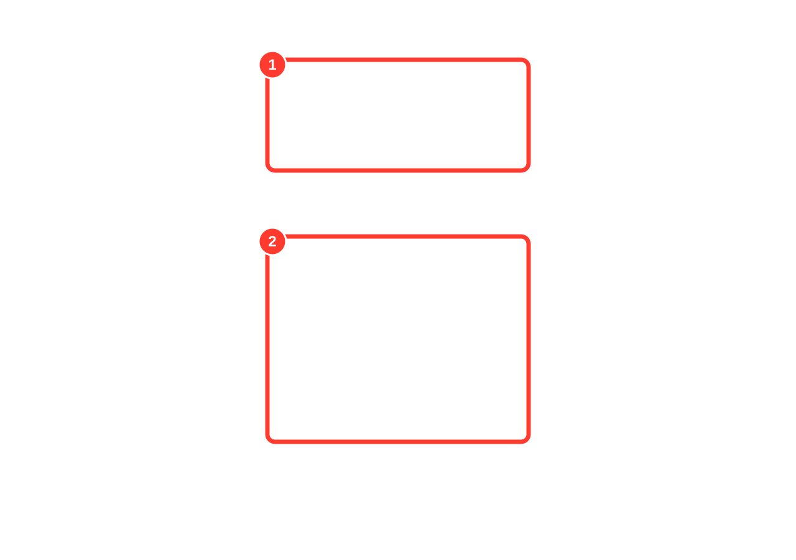

1. ที่กรอบ **1** ตรวจสอบภาษา องค์กร และคลังสินค้าก่อนเริ่มงาน
2. ที่กรอบ **2** เลือกหนึ่งงานต่อครั้ง: ค้นหาสต็อก รับสินค้า ตรวจสอบคุณภาพ
   หรือจัดเก็บ
3. ทำตามลำดับที่หน้าจอแสดง ปุ่มขั้นถัดไปจะพร้อมเมื่อข้อมูลของขั้นปัจจุบันครบ
4. ใช้ “กลับไปหน้าจอเดสก์ท็อป” เมื่อต้องกลับไปงานของหัวหน้างาน

## วิธีตรวจสอบว่างานเสร็จสมบูรณ์

- ตรวจชื่อองค์กรและคลังสินค้าก่อนและหลังทำงาน
- ตรวจสถานะของเอกสารหรือรายการ ไม่ใช้ข้อความบนปุ่มเป็นหลักฐานเพียงอย่างเดียว
- ตรวจจำนวนพร้อมหน่วยนับทุกครั้ง
- ก่อนกดบันทึกในระบบจริง ให้ยืนยันองค์กร คลังสินค้า และรายการที่จะเปลี่ยนแปลง
- ในระบบจริง หากได้รับข้อความปฏิเสธ ให้บันทึกรหัสคำขอไว้สำหรับฝ่ายสนับสนุน

## การปรับปรุงภาพประกอบ

ข้อความ ขั้นตอน และพิกัดกรอบทั้งหมดอยู่ในแคตตาล็อกเดียวคือ
`scripts/manual/tasks.mjs` หมายเลขในกรอบตรงกับหมายเลขขั้นตอนของงานนั้นเสมอ
สร้างภาพ SVG ใหม่และสร้างคู่มือ HTML แบบออฟไลน์ได้ด้วยคำสั่ง:

```sh
pnpm manual:build   # สร้างกรอบ SVG ใหม่ แล้วสร้าง docs/manual-html/
pnpm manual:check   # ตรวจว่าแคตตาล็อก ภาพ เส้นทาง และผลลัพธ์ตรงกัน
```

คำสั่งข้างต้นไม่ต้องใช้เซิร์ฟเวอร์ บัญชีผู้ใช้ หรือเครือข่าย
เมื่อต้องการนำภาพหน้าจอชุดใหม่เข้ามา ให้ระบุโฟลเดอร์ภาพเป็นอาร์กิวเมนต์แรก:

```sh
node scripts/generate-operator-manual-assets.mjs ../industrial-sas-visual-audit/after-final
```

เมื่อหน้าจอเปลี่ยน ให้สร้างชุดภาพ visual audit ใหม่ก่อน แล้วจึงรันคำสั่งนี้เพื่อป้องกัน
ไม่ให้คู่มือชี้ไปยังส่วนควบคุมที่ล้าสมัย

วิธีเพิ่มงานใหม่ เพิ่มขั้นตอน หรือย้ายกรอบ อ่านได้ที่
[คู่มือผู้เขียนคู่มือ](./operator-manual-authoring.md)
