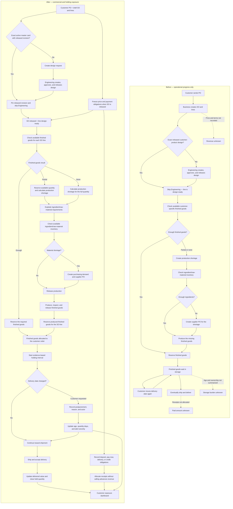

# Customer commercial and holding exposure

Status: **Proposed feature plan**

This feature answers two questions without pretending the application is already
an accounting system:

1. What sales value, cash, and recorded cost are associated with each customer?
2. Which customers have finished goods occupying warehouse capacity because the
   delivery commitment keeps moving?

The first release does **not** claim accounting profit. It keeps commercial value,
cash, cost evidence, and warehouse burden separate so an owner can see exposure
and drill into the facts behind it.

## At a glance: before and after

| Area                        | Before                                                                                        | After                                                                                                                                                                                 | Business benefit                                                                 |
| --------------------------- | --------------------------------------------------------------------------------------------- | ------------------------------------------------------------------------------------------------------------------------------------------------------------------------------------- | -------------------------------------------------------------------------------- |
| Customer identity           | Customer and customer PO exist, but commercial exposure is not summarized                     | Every amount and holding interval drills back to the customer, SO, customer PO, and order line                                                                                        | One accountable customer view                                                    |
| Product-design routing      | The design decision was missing from the simplified commercial diagram                        | Each SO line checks the exact customer + customer product code for an active master card with a released revision; a match skips Engineering, while no match creates a design request | Reuse an approved design safely without delaying repeat orders                   |
| Finished-goods routing      | The operational flow checks stock, but the commercial plan did not show this decision clearly | Each SO line checks customer-specific available finished goods first: reserve all, reserve part and produce the shortage, or produce all                                              | Avoid unnecessary production and preserve the link to the exact customer product |
| Ingredient purchasing       | “Produce finished goods” can hide the material-readiness step                                 | Only the production shortage creates ingredient requirements; available raw material is checked before a supplier PO is raised                                                        | Buy only the ingredient shortage needed for uncovered customer demand            |
| Selling value               | No authoritative line price or released-order total                                           | Released SO freezes exact THB line prices and booked sales value                                                                                                                      | See how much open business each customer represents                              |
| Delivery value              | Delivery evidence exists but has no commercial value attached                                 | Delivered quantity updates proportional delivered value                                                                                                                               | Separate work booked from goods actually delivered                               |
| Payment terms               | Pay now, deposit, pay on delivery, and credit terms are not modeled                           | Presets generate exact dated or event-triggered payment obligations                                                                                                                   | See what should be paid now, later, or at delivery                               |
| Cash                        | No customer receipt or allocation records                                                     | Receipts and reversals are append-only and allocated to obligations/orders                                                                                                            | See deposits, partial payments, remaining balance, and overdue amounts           |
| Delivery-date changes       | One requested date may exist; later changes have no authoritative history                     | Every promise change keeps the previous date, new date, requester, reason, actor, and time                                                                                            | Identify repeated postponement without losing history                            |
| Finished-goods waiting time | Inventory exists, but the customer-level holding age is not visible                           | QA release plus order lineage/reservation starts a measurable holding interval                                                                                                        | Find goods held for weeks or months                                              |
| Responsibility for delay    | All old stock can look like a customer problem                                                | Exposure is classified as planned, customer postponement, business delay, quality, transport, or unknown                                                                              | Avoid blaming customers for early production or internal delays                  |
| Storage burden              | Warehouse space pressure is anecdotal                                                         | Show held quantity, oldest age, quantity-days, and optional policy-based holding estimate                                                                                             | Prioritize the orders consuming scarce capacity                                  |
| Direct cost                 | No approved customer-order costing authority                                                  | Manual/imported cost evidence is labeled actual, standard, or estimate                                                                                                                | See recorded cost without presenting guesses as facts                            |
| Profit                      | Cannot be calculated honestly                                                                 | Optional contribution estimate appears only when required sales and cost evidence is complete                                                                                         | Prevent a misleading profit KPI                                                  |
| Management action           | Staff discover problems manually                                                              | Sales and Warehouse receive threshold alerts with a next owner and drilldown                                                                                                          | Act before finished goods sit for six months                                     |

## 1. Current repository truth

The repository already owns the operational relationships needed for the feature:

- `customers` identifies the party the tenant sells to.
- `customerOrders` stores the internal sales order and optional customer PO
  reference as one customer-order document (`ADR-0013`).
- `customerOrderLines` stores ordered quantity and links through fulfillment and
  production to the finished item.
- adding an SO line checks customer + normalized customer product code for an
  active master card with a `RELEASED` revision. An exact match pins that revision
  and makes the line `DESIGN_READY`; otherwise the line becomes
  `AWAITING_DESIGN` and a design request is created in the same transaction.
- structural similarity is only a suggestion for a person. A similar design does
  not automatically skip Engineering.
- demand routing checks available-to-promise finished goods for each line and
  calculates the exact production shortage when stock is insufficient.
- production material requirements and supplier purchasing exist, but the current
  implementation does not yet connect a production shortage through a material-
  availability check to supplier-PO demand. The business flow requires that link
  before this feature may rely on it.
- `fulfillmentOrders.requestedDeliveryAt` stores one requested date, but there is
  no committed-date owner or change history.
- `productionOutputReceipts` records when finished goods enter inventory and when
  QA releases or rejects them.
- `inventoryReservations` ties stock to fulfillment demand.
- packages, shipments, delivery milestones, and proof of delivery provide the
  execution and delivery evidence.
- the append-only inventory ledger is authoritative for physical stock movement.

The repository does not yet own:

- selling price, discount, tax, currency, or an immutable released-order total;
- payment terms, deposit obligations, receipts, or allocations;
- invoice or accounts-receivable facts;
- an approved cost/valuation policy;
- a delivery-promise history that says who requested each change;
- a customer-level commercial or holding-exposure projection.

Therefore the existing UI may show operational quantity and status, but cannot
honestly calculate customer revenue, customer cost, cash outstanding, or profit.

## 2. Product language

These are proposed terms. Promote them to the project glossary and `CONTEXT.md`
only after the open decisions in section 13 are accepted.

| Term                           | Meaning                                                                                                                 | Must not be presented as                                                  |
| ------------------------------ | ----------------------------------------------------------------------------------------------------------------------- | ------------------------------------------------------------------------- |
| Booked sales value             | Net value of released customer-order lines in one currency, excluding tax unless a view explicitly asks for gross value | Revenue or cash                                                           |
| Delivered value                | Proportional net sales value for quantity supported by accepted delivery evidence                                       | Accounting revenue until Finance approves the recognition policy          |
| Cash received                  | Valid, non-reversed receipts allocated to the customer or order                                                         | Revenue                                                                   |
| Payment obligation             | One amount expected under agreed terms, with a trigger or due date                                                      | Payment received                                                          |
| Customer advance               | Cash received before the related goods satisfy the approved delivery/revenue boundary                                   | Revenue                                                                   |
| Recorded direct cost           | Cost evidence attached to an order line, classified as actual, standard, or estimate                                    | Total cost when categories are incomplete                                 |
| Holding exposure               | Finished-goods quantity and elapsed time tied to a customer order while it remains in the tenant's warehouse            | Customer-caused cost by default                                           |
| Customer postponement exposure | The part of holding exposure supported by a customer-requested promise change after the relevant goods were ready       | All storage time                                                          |
| Estimated holding cost         | Holding exposure multiplied by a versioned warehouse policy                                                             | Inventory valuation or an amount automatically chargeable to the customer |
| Contribution estimate          | Delivered value less included recorded costs, with completeness and estimate labels                                     | Accounting profit                                                         |

The separation is intentional. IFRS 15 recognises revenue when promised goods or
services transfer to the customer, and treats prepayment before transfer as a
contract liability rather than immediate revenue. IAS 2 separately governs
inventory cost and generally excludes storage cost unless it is necessary before
a further production stage.

References:

- <https://www.ifrs.org/issued-standards/list-of-standards/ifrs-15-revenue-from-contracts-with-customers/>
- <https://www.ifrs.org/issued-standards/list-of-standards/ias-2-inventories/>

This product plan uses those distinctions to avoid misleading labels; Finance
still owns the tenant's accounting policy and system of record.

## 3. Outcomes and non-goals

### 3.1 Outcomes

- Owners can rank customers by booked value, delivered value, collected cash,
  recorded cost, open balance, finished-goods holding days, and postponement risk.
- Sales can see which open customer orders require a date, payment, or escalation
  conversation.
- Warehouse managers can see which ready finished goods are consuming capacity,
  for how long, and which order/customer owns the demand.
- Every number drills down to bounded source records and states its currency,
  time boundary, cost basis, and freshness.
- A moved delivery date never erases the prior promise, actor, requester, or
  reason.
- Deposits, pay-now, pay-on-delivery, credit-day, and custom staged terms share one
  obligation model.

### 3.2 Non-goals for the first release

- General ledger, statutory financial statements, VAT filing, or tax advice.
- Automatic accounting revenue recognition.
- Full inventory valuation, cost of goods sold, or audited gross profit.
- Automatic customer storage invoices, penalties, credit holds, cancellations,
  or disposal decisions.
- Multi-currency consolidation or FX gain/loss.
- Replacing an ERP/accounting integration when one is the tenant's authority.

## 4. Core product rules

1. **One money amount always has one ISO currency and integer minor units.** The
   initial supported currency is THB, consistent with `SC-D07`; unlike currencies
   are never added.
2. **Order release freezes commercial terms.** Later changes create an amendment
   or reversal; they do not silently patch the released snapshot.
3. **Payment presets generate obligations.** `PAY_NOW`, `DEPOSIT_BALANCE`,
   `PAY_ON_DELIVERY`, and `CREDIT_DAYS` are form conveniences, not separate data
   models.
4. **Cash, delivered value, and invoice state are orthogonal.** Paying early does
   not make an order delivered; delivering does not make it paid.
5. **Cost source is visible.** Every direct-cost amount says `ACTUAL`, `STANDARD`,
   or `ESTIMATE`, its source, effective time, and included category.
6. **Unknown stays unknown.** Missing cost is not zero. The contribution estimate
   is unavailable or incomplete when required categories are absent.
7. **Holding begins from physical evidence.** Finished goods become eligible when
   an available quantity is tied to the fulfillment line: immediately for
   customer-specific finished goods reserved from existing stock, or after QA
   release and reservation for newly produced finished goods.
8. **Delay attribution needs evidence.** Storage is customer-postponement exposure
   only when an append-only promise change says the customer requested the move.
   Early production, business rescheduling, QA hold, or transport failure remain
   separate causes.
9. **Quantity is partial throughout.** One line may be produced, held, shipped,
   delivered, invoiced, and paid in different partial quantities.
10. **No dashboard history scans.** Customer summaries are maintained projections;
    detail timelines are cursor-paged from indexed event records.
11. **Commercial and cost permissions are separate.** Warehouse users may see age,
    quantity, and space exposure without seeing prices, receipts, or margin.
12. **Every correction is additive or reversible.** Released snapshots, promise
    changes, cost entries, receipts, and allocations retain their history.

## 5. Proposed data model

Names are provisional and should be finalized with the schema/3NF guard before
implementation.

### 5.1 Commercial terms

`customerOrderCommercialSnapshots`

- one active release snapshot per customer order and commercial revision;
- `customerOrderId`, revision number, currency, net/tax/gross minor units;
- release actor/time and optional superseded snapshot;
- immutable after release.

`customerOrderLineCommercials`

- normalized child of the snapshot;
- `customerOrderLineId`, unit price, quantity priced, discount, tax, net and gross
  minor units;
- no floating-point arithmetic and no duplicated customer/order attributes.

### 5.2 Payment expectations and cash

`customerPaymentObligations`

- one obligation generated from the selected preset or custom schedule;
- amount, currency, sequence, trigger (`ORDER_RELEASE`, `FIXED_DATE`,
  `DISPATCH`, `DELIVERY`, or `CUSTOM`), due date when known, and state;
- deposit percentage is input convenience; the durable fact is the exact amount.

`customerReceipts`

- append-only received/reversed cash evidence;
- customer, payer reference, currency, amount, received time, method, source, and
  external idempotency key;
- a reversal references the original receipt rather than rewriting it.

`customerReceiptAllocations`

- explicit allocation of one receipt to one obligation/order;
- supports deposits, partial payment, one receipt across orders, overpayment, and
  reallocation through reversal entries.

Invoices and credit notes remain a later, separate aggregate or an integration.
The first release must call this area **payment obligations and receipts**, not
accounts receivable, unless invoice authority is implemented.

### 5.3 Promise history

`customerOrderPromiseChanges`

- append-only old/new requested, committed ship, and committed delivery values;
- requester (`CUSTOMER`, `BUSINESS`, `CARRIER`, `SYSTEM`), reason code, note,
  actor, occurred time, notification state, and optional customer acknowledgement;
- the current promise is projected from the latest accepted event, not overwritten
  without history.

The existing `fulfillmentOrders.requestedDeliveryAt` should remain readable during
migration, then become a projection/compatibility field or be contracted only
after all consumers use the promise authority.

### 5.4 Cost evidence

`customerOrderCostEntries`

- append-only amount by customer-order line and category: material, conversion,
  freight, packaging, subcontract, holding, or other;
- basis (`ACTUAL`, `STANDARD`, `ESTIMATE`), currency, source reference, effective
  time, actor, and reversal link;
- categories may arrive manually, by import, from production facts, or from an
  accounting adapter; the source remains visible.

`holdingCostPolicies`

- versioned warehouse policy with currency, grace period, unit of measure, daily
  rate, effective interval, and approver;
- first supported rate basis should match facts the system can measure reliably,
  such as handling-unit/day. Do not offer pallet/day, square-metre/day, or
  cubic-metre/day until those quantities are authoritative for the stock.

### 5.5 Maintained projections

`customerCommercialRollups`

- one bounded row per customer and currency, optionally partitioned by business
  month;
- booked, delivered, received, due, overdue, recorded direct cost, estimated
  holding cost, ready quantity, holding days, oldest held-since, postponement
  count, and data-quality flags;
- reconciliation cursor/version and updated time.

`customerOrderExposureRollups`

- one row per open customer order and currency;
- supports the Sales queue and the Customer detail drilldown without scanning
  ledger, promise, receipt, or delivery history.

## 6. Holding-exposure calculation

Holding exposure must be reconstructed from authoritative quantity events rather
than a salesperson-entered `ready` checkbox.

For each customer-order line quantity slice:

1. Start an eligible holding interval at the later evidence needed to prove both:
   the finished goods are `AVAILABLE`, and the quantity is tied to the fulfillment
   demand by production lineage or reservation.
2. End or reduce the interval when that quantity is issued, shipped, delivered,
   released from the reservation, cancelled, returned, rejected, or otherwise
   ceases to be ready stock held for the order.
3. Split the interval whenever the current promise or attribution cause changes.
4. Classify each segment as planned pre-delivery, customer postponement, business
   delay, QA/quality, transport, or unknown.
5. Customer postponement begins no earlier than the prior committed delivery date
   plus the approved grace period. Producing earlier than the commitment remains
   planned/business exposure.
6. Aggregate exact quantity-time, for example handling-unit-days and base-unit-days.
7. Apply the policy version active for each day only when a monetary estimate is
   requested.

The UI must show the physical exposure even when no holding-cost policy exists.
That allows the feature to answer “this customer has occupied 18 handling units
for 193 days” without inventing baht cost.

## 7. User experience

### 7.1 Owner: Customer exposure

A bounded table, grouped by currency, with:

- customer;
- booked sales value;
- delivered value;
- cash received and currently due;
- recorded direct cost with basis/completeness badge;
- estimated holding cost with policy badge;
- ready finished-goods quantity and oldest held age;
- customer-requested postponement count;
- risk state and next owner.

Default sort: decision severity, then oldest customer-postponement exposure. Every
summary opens a customer detail page; no decorative chart is required for v1.

### 7.2 Customer detail

- commercial summary by currency;
- open-order table with internal SO and customer PO references;
- payment obligations and allocated receipts;
- finished-goods holding exposure by warehouse/order;
- promise-change timeline with requester and reason;
- data-quality panel naming missing prices, costs, policies, or source evidence.

### 7.3 Customer-order detail

- commercial snapshot and amendment history;
- ordered/delivered quantities and proportional delivered value;
- selected payment preset expressed as exact obligations;
- cash allocation timeline;
- original/current promise and complete change history;
- finished-goods quantity timeline and holding-cost breakdown;
- cost entries grouped by category and basis.

### 7.4 Sales and warehouse queues

Sales receives exception cards for payment overdue, deposit not met, ready goods
past commitment, repeated customer postponement, and missing next action.

Warehouse receives only operational exposure: order/customer reference, quantity,
location or handling unit, held-since, age band, promise date, attribution, and
escalation owner. Price, cash, cost, and contribution remain hidden unless the user
holds the corresponding permission.

## 8. Workflow changes

1. **Draft SO:** Sales selects currency, enters line pricing, chooses a payment
   preset, and enters requested/committed dates where known.
2. **Resolve product design:** Check for the exact customer-product master card and
   a released revision. Pin it and skip Engineering when found; otherwise create
   a design request and wait for an approved released design. Similarity alone
   never skips Engineering.
3. **Release SO:** The server validates exact totals, freezes the commercial
   snapshot, and creates exact payment obligations atomically with release. SO
   release and design readiness may progress separately, but both are required
   before fulfillment routing.
4. **Route each SO line:** Check customer-specific finished-goods ATP. Reserve the
   covered quantity and create production demand only for the shortage.
5. **Plan missing production:** Expand the shortage into ingredient/raw-material
   requirements, use available material first, and create supplier purchasing
   demand only for the remaining material shortage.
6. **Record receipt:** Finance records/imports cash and allocates it. A deposit may
   satisfy a release policy but does not change delivery state.
7. **Change promise:** Sales records requester, reason, and new commitment through
   an append-only mutation. Released-order dates are never silently patched.
8. **Allocate finished goods:** Existing stock starts holding exposure when it is
   reserved for the order. Newly produced stock starts after QA release and
   reservation tie it to the same order line.
9. **Move/ship/deliver:** Existing ledger and fulfillment facts reduce or close
   the holding interval and update delivered value.
10. **Escalate:** Threshold breaches create an accountable exception; v1 never
    auto-charges or auto-cancels.

## 9. Permissions

Add distinct permission families rather than expanding `sales.order.read`:

- `commercial.order.read` / `commercial.order.manage`;
- `commercial.payment.read` / `commercial.payment.record` /
  `commercial.payment.allocate`;
- `commercial.cost.read` / `commercial.cost.record`;
- `commercial.executive.read` for cross-customer rollups;
- `fulfillment.holdingExposure.read` for quantity/time without money;
- `commercial.holdingPolicy.manage` for approved monetary rate schedules.

The Organization Admin role does not automatically imply executive or cost
visibility. Cost, payment, and customer exposure exports use the same separate
permission boundaries.

## 10. Delivery slices

### CE-0 — Approve policy and vocabulary

- Decide the delivered/revenue boundary, cost authority, currency scope, holding
  rate unit, grace period, and who may see cost.
- Add accepted terms to the glossary and `CONTEXT.md`.
- Record an ADR only for the hard-to-reverse revenue/cost authority boundary.
- No production code.

### CE-1 — Promise history and physical holding exposure

- Add append-only promise changes and current-promise projection.
- Build quantity/time holding calculation from production release, reservation,
  ledger, shipment, and delivery facts.
- Add Warehouse and Sales exposure queues with age bands and attribution.
- No money yet; this slice immediately exposes the six-month finished-goods issue.

### CE-2 — Released-order commercial value

- Add exact money primitives, THB minor units, line pricing, and immutable release
  snapshots.
- Show booked and delivered value separately by customer/order.
- Backfill/import existing open orders with explicit `UNKNOWN` or approved values;
  never treat missing price as zero.

### CE-3 — Payment obligations and receipts

- Add preset-to-obligation planning, append-only receipts, reversals, and
  allocations.
- Show advance received, due now, overdue, and remaining balance.
- Add idempotent import seam if Finance records payments elsewhere.

### CE-4 — Cost evidence and holding-cost estimate

- Add cost entries with basis/source and versioned holding policies.
- Show recorded direct cost and estimated holding cost separately.
- Add contribution estimate only when completeness policy passes.

### CE-5 — Customer rollups and executive workspace

- Maintain/reconcile customer and order projections.
- Add Customer exposure list, detail drilldowns, bounded exports, freshness, and
  quality indicators.
- Add alert thresholds and accountable follow-up workflow.

### CE-6 — Invoice/accounting integration

- Decide whether invoices, credit notes, AR, and revenue recognition are owned in
  this application or imported from an accounting authority.
- Reconcile imported facts idempotently and display source conflicts.
- Rename delivered value to recognized revenue only when the approved policy and
  evidence justify it.

## 11. Verification

### Domain and property tests

- exact integer-money arithmetic and proportional allocation with remainder;
- preset obligations always sum to the commercial total;
- partial delivery/payment/cost allocation never exceeds its source amount;
- holding intervals never overlap for the same quantity slice;
- quantity-time cannot become negative under release, reversal, return, or
  reallocation;
- customer postponement is impossible without a qualifying promise-change event;
- cross-currency values are never summed.

### Integration and concurrency tests

- SO release atomically freezes pricing and creates obligations;
- concurrent receipt allocation cannot allocate the same cash twice;
- repeated imports are idempotent;
- promise changes preserve every prior commitment;
- production/QC/reservation/shipment reversals repair projections once;
- daily rollup reconciliation detects and repairs drift.

### Isolation and authorization tests

- cross-tenant IDs return the existing non-enumerating refusal shape;
- warehouse access cannot reveal money;
- Sales access cannot reveal cost without `commercial.cost.read`;
- executive rollups cannot cross organization boundaries;
- exports enforce the same scope as on-screen reads.

### UX tests

- Thai/English parity, long Thai labels, tabular money, timezone boundaries, and
  accessible tables;
- empty, incomplete, stale, denied, loading, retry, and partial-data states;
- visible labels for currency, cost basis, recognition boundary, policy version,
  and data freshness;
- no green/success treatment for an advance when delivery is still outstanding.

## 12. Release gates

- One customer with pay-now terms, one with a deposit/balance schedule, and one
  with pay-on-delivery terms reconcile exactly from order to receipt.
- A partial production/partial shipment case preserves correct quantity, value,
  cash, and holding exposure.
- A customer-requested date move after QA release creates postponement exposure;
  an early-production case and a business-caused delay do not.
- A six-month held-finished-goods scenario appears in both Warehouse and Sales
  queues and drills to the exact order, quantity, dates, and reason history.
- Unknown price, missing cost, absent policy, and stale rollup never display as
  zero or as profit.
- Tenant isolation, permission separation, idempotency, concurrency, reversal,
  reconciliation, accessibility, and bounded-read gates pass.

## 13. Decisions to approve together

| ID       | Decision                                   | Recommended first-release default                                                                                                | Consequence if changed                                                                          |
| -------- | ------------------------------------------ | -------------------------------------------------------------------------------------------------------------------------------- | ----------------------------------------------------------------------------------------------- |
| `CE-D01` | What may the UI call revenue?              | Call it **delivered value** until Finance approves a recognition boundary; use accepted delivery/POD as the operational boundary | Changes KPI labels, projection rules, and accounting integration                                |
| `CE-D02` | Where does direct cost come from?          | Manual/imported order-line cost entries with visible `ACTUAL`/`STANDARD`/`ESTIMATE` basis                                        | Determines whether contribution can be shown and how much reconciliation is needed              |
| `CE-D03` | What is the first holding-rate unit?       | Handling-unit/day, only if handling-unit linkage is complete; otherwise show quantity-days without baht                          | Determines policy schema and whether monetary holding cost is defensible                        |
| `CE-D04` | When is delay attributed to the customer?  | After QA-ready, the prior committed delivery date, an approved grace period, and a customer-requested promise change             | Determines customer risk ranking and prevents unfair attribution                                |
| `CE-D05` | What happens when thresholds are breached? | Alert and accountable follow-up only                                                                                             | Automatic fee/hold/cancel would require stronger permissions, contracts, notices, and overrides |
| `CE-D06` | Currency scope                             | THB only in v1; store ISO currency on every amount                                                                               | Multi-currency requires FX policy and grouped reporting                                         |
| `CE-D07` | Invoice/payment source of truth            | Record obligations and receipts here; defer invoice/AR ownership or integrate the tenant's accounting system                     | Determines CE-6 size and reconciliation model                                                   |

The best starting sequence is `CE-0` then `CE-1`. It addresses the immediate
six-month storage problem before waiting for complete costing or accounting work.
