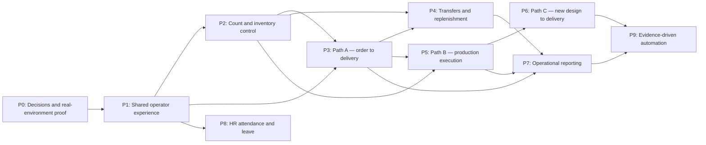

# Full-flow implementation plan

Status: **Implementation in progress — local P1–P9 vertical slices are partial; release evidence remains open**
Updated: 2026-08-17
Scope owner: Product owner + Engineering lead
Execution baseline: local code through Phase 5A plus partial P1–P9 vertical slices;
production/pilot proof remains open

## 1. Outcome

Implement the complete operational journey without creating separate sources of truth:

```text
Customer PO
  → Sales order and requirement validation
  → route by design readiness and available stock
  → allocate existing stock OR design/procure/produce missing stock
  → QC release
  → receive/tag/put away
  → pick/check/issue
  → load/gate out/deliver/POD
  → close order and expose traceable reports
```

The plan covers all three customer paths:

1. **Path A — stock ready:** existing design, enough available stock.
2. **Path B — repeat production:** existing design, insufficient stock.
3. **Path C — new design:** no released design/SKU; engineering work is required first.

Supporting operational scope includes opening stock, cycle count, reconciliation,
transfers, reporting, and HR attendance/leave. Advanced automation remains gated by
pilot evidence.

This document does not replace the approved historical baseline in
[`PROJECT_PLAN.md`](../../PROJECT_PLAN.md). Implementing this expansion requires updates to
[Project goal](./project-goal.md), [Business logic](./business-logic.md),
[Database](./database.md), [Delivery](./delivery.md), coverage, permissions, release
gates, and ADRs before code is claimed as in scope.

## 2. Source documents

- [Module and action plan](../module-action-plan.html)
- [Detailed module flow blueprints](../module-flow-blueprints.html)
- [Approved project baseline](../../PROJECT_PLAN.md)
- [Current delivery state](./delivery.md)
- [Business rules](./business-logic.md)
- [Database rules](./database.md)
- [Permission catalogue](../permissions.md)
- [Release gates](../release-gates.md)
- [Specification coverage](../specification-coverage.md)
- [Degraded-online contract](../adr/0009-degraded-online-connectivity.md)
- [Thai-first and accessibility contract](../adr/0010-thai-first-i18n-and-accessibility.md)
- [UI component migration plan](../ui-component-migration-plan.md)
- [UX component research](../ux-component-research.md)
- [ReUI authoring selection](../reui-authoring-selection.md)

The referenced FigJam board informed role lanes and branch presentation only. Its
text is not treated as an approved domain contract. `FO`, `SO`, and both meanings
of `PO` require explicit vocabulary decisions in Phase 0.

## 3. Current-state boundary

| Area                                                                           | Current local state             | Expansion implication                                                               |
| ------------------------------------------------------------------------------ | ------------------------------- | ----------------------------------------------------------------------------------- |
| Tenant, identity mirror, RBAC, audit, idempotency                              | Code exists                     | Extend catalogue and tests; do not create a second authorization path               |
| Inventory primitives and append-only ledger                                    | Code exists                     | Every new movement must use the existing ledger seam                                |
| Master data, supplier PO, receipt, inbound QC, tag/label, putaway              | Code exists                     | Generalize proven commands instead of cloning workflows                             |
| Dashboard, four stock views, exception center, exports                         | Local P7 vertical slice partial | Finish historical as-of, broad exceptions, cost controls, and scalable projections  |
| Customer order, engineering master card, factory packet                        | Local Phase 5A code complete    | Integrate downstream fulfillment/production; preserve immutable revision pinning    |
| Opening stock, count, and reconciliation                                       | Local P2 vertical slice partial | Finish file import, device/load proof, and deployed reconciliation evidence         |
| Outbound fulfillment and transport/POD                                         | Local P3 vertical slice partial | Finish recovery, printing, retention, device/load, and deployed Path A evidence     |
| Transfers and replenishment                                                    | Local P4 vertical slice partial | Finish return/resolution, handheld, aging/SLA, replenishment, and external proof    |
| Production execution                                                           | Local P5 vertical slice partial | Finish shortage/purchasing, WIP/return/reversal, Path A handoff, and external proof |
| New-design readiness and revision impact                                       | Local P6 vertical slice partial | Finish sample/first article, waiting-order impact, external proof, and Path C POD   |
| HR attendance and leave                                                        | Local P8 vertical slice partial | Finish HR admin, closed periods, OT/evidence, device/load, and deployed proof       |
| Integrations and degraded recovery                                             | Local P9 vertical slice partial | Wire real source events/providers; finish credentials, worker, timeout/load proof   |
| Clerk/Convex/UploadThing production setup, scanner/printer, legal, load, pilot | Open                            | Phase 0 blockers; code completion is not release completion                         |

## 4. Non-negotiable invariants

1. Every tenant row carries `orgId`; every tenant index begins with `orgId`.
2. Public Convex functions authorize before data access and declare a code-owned
   permission.
3. The browser cannot grant warehouse, team, customer, threshold, maker-checker,
   or step-up scope.
4. Posted stock facts are append-only. Corrections use reversal plus replacement.
5. Balance projections update atomically with the ledger transaction that earns
   them and remain recomputable.
6. Quantities use integer base-UOM minor units and exact conversions.
7. Order, fulfillment, QC, transport, and stock statuses are separate dimensions.
8. Cross-warehouse transfers use two legs:
   `source → IN_TRANSIT → destination`.
9. Released master-card revisions remain immutable; production orders pin one
   exact revision.
10. All device commands carry `operationId`, `deviceId`, `capturedAt`, and an
    expected version where conflict detection matters.
11. High-risk overrides, dispositions, reconciliation, and reversals use
    threshold policy and maker-checker controls.
12. Attachments are private. Access is inherited from the parent entity and every
    download performs a fresh permission check.
13. Thai is primary, English is complete, and key parity is tested.
14. Lists, jobs, imports, exports, and migrations are bounded, paginated, and
    resumable.
15. A phase is not complete without integration, isolation, accessibility, E2E,
    recovery, and external evidence appropriate to its risks.
16. Every command is code-classified as `QUEUEABLE` only when it is idempotent and
    independent of current stock/location/QC state; otherwise it is
    `BLOCKED_OFFLINE`. Pending work is never presented as completed.
17. Every multi-step handheld flow persists a server-side draft under its
    `operationId` and offers resume or discard-with-reason after interruption.
18. Claimed tasks have an owner, lease expiry, and heartbeat. An expired lease
    returns the task with partial evidence intact; supervisor reassignment is
    audited.
19. Supervisor step-up happens on the operator device by re-authenticating the
    approver. It records operator, approver, device, reason, and decision without
    giving the browser a reusable elevated scope.
20. Every user-facing surface distinguishes loading, empty, no-permission,
    not-built, stale, conflict, queued-pending, failed, and success where relevant.

## 5. Delivery strategy

### 5.1 Vertical slices

Each phase must finish a real user journey across UI, domain rules, Convex public
functions, schema, permissions, audit, files, events, tests, runbooks, and rollout.
Backend-only or screen-only delivery does not satisfy a phase gate.

### 5.2 Thin command boundary

```text
Route / feature UI
  → typed application command
  → tenant + permission + policy resolution
  → idempotency and version guard
  → pure domain transition
  → source write + ledger/projection + audit + outbox in one transaction
  → task/notification/external adapter
```

### 5.3 Repository placement

| Concern                                         | Location                   |
| ----------------------------------------------- | -------------------------- |
| Page composition                                | `src/app/[locale]/**`      |
| One operator or supervisor workflow             | `src/features/<domain>/**` |
| Shared visual primitives after two uses         | `src/components/**`        |
| Browser adapters and typed Convex API state     | `src/lib/**`               |
| Pure rules, states, quantity and planning logic | `convex/model/<domain>/**` |
| Tenant-bound queries/mutations/actions          | `convex/<domain>/**`       |
| Auth, audit, idempotency, ledger, ports         | `convex/lib/**`            |
| Integration/isolation/E2E proof                 | `tests/**`                 |
| Decisions, permissions, gates, runbooks         | `docs/**`                  |

### 5.4 Phase entry rule

Phase 0 is exempt because it creates the research and decision evidence below. Every
later phase begins only when:

- its vocabulary and actor/permission matrix are approved;
- source documents and at least 10 representative exception cases exist;
- upstream event contracts are stable;
- unresolved external gates are named with owners and dates;
- UX has a tested low-fidelity journey for handheld and desktop roles;
- the rollback boundary is defined.

## 6. Dependency and critical path



The critical customer path is `P0 → P1 → P2 → P3 → P5 → P6`. P2 may be staffed by
a separate team after P1 contracts stabilize, but it cannot be scheduled behind the
Path A pilot because opening stock is required. P4 protects transfer accuracy and
may run alongside P5 after P2 and P3 pass.

## 7. Phase 0 — Promote scope and prove the environment

Target: 1–2 weeks of decision work plus external lead time.
Outcome: the expansion is approved, named, measurable, and safe to start.

### Scope

- Amend project goal/non-goals and record dated authorization.
- Decide vocabulary: Customer PO, Supplier PO, SO, FO/Production Order,
  preparation order, pick list, invoice/delivery note, shipment, trip, transfer.
- Confirm whether production site equals warehouse/site or needs a new master.
- Confirm Path A/B/C routing authority and whether routing may change after SO
  release.
- Confirm ATP, reservation, FIFO/FEFO, partial, backorder, substitute, over/short,
  negative-stock, and cancellation policies.
- Confirm BOM/routing/revision ownership and the production operations used by the
  pilot factory.
- Confirm QC contexts, sampling expectations, dispositions, and maker-checker
  thresholds.
- Confirm fleet/provider, driver model, GPS source, map provider, POD/original
  document rules, and location retention.
- Decide the driver identity model and whether Thai printed documents display
  Buddhist Era dates while persisted/API dates remain ISO Gregorian.
- Confirm HR scope, shift/OT/leave rules, privacy roles, and whether payroll is out
  of scope; decide shared kiosk versus personal-device identity and privacy.
- Configure a real Clerk development/staging identity, Convex deployment, and
  UploadThing private-file application.
- Benchmark pilot-site latency and verify target scanner, printer, camera, and
  weak-network behavior.
- Survey RF coverage at every aisle, dock, gate, and yard task point; assign an
  owner/date or audited fallback for each dead zone.

### UX/UI work

- Observe at least three operators per critical role across at least two shifts,
  including a night shift where one exists.
- Record glove use, scan distance, lighting, device size, keyboard wedge behavior,
  language, noise, handoff points, and recovery practices.
- Produce one service blueprint for each customer path and one cross-role task map.
- Prototype the common scan loop and one exception/approval loop on the target
  handset before detailed screens are designed.
- Establish measurable UX baselines: task time, taps/scans, error recovery time,
  abandonment, training time, and accessibility barriers.

### Deliverables

- `FF-P0-01` approved vocabulary and document ownership table.
- `FF-P0-02` actor, scope, and maker-checker matrix.
- `FF-P0-03` event catalogue and routing decisions.
- `FF-P0-04` external integration and privacy decisions.
- `FF-P0-05` device/latency/UploadThing/identity evidence record.
- `FF-P0-06` updated ADR, permission, release-gate, and coverage backlog.
- `FF-P0-07` UX research evidence and prototype test notes.
- `FF-P0-08` RF coverage map, remediation owners, and sanctioned fallback register.

### Exit gate

No unresolved decision can change stock identity, document ownership, tenant
boundary, production revision authority, or external data residency. Real identity
and private-file checks pass in staging. The product owner accepts the three
customer paths and Phase 1 experience contract. The target environment demonstrates
p95 scan-to-acknowledgement at or below 800 ms and at least 95% handheld completion,
or records an approved blocker with owner and date. No handheld flow ships into an
unremediated RF dead zone without its audited fallback.

## 8. Phase 1 — Shared operator experience and platform extension

Target: 2–3 weeks.
Outcome: every later module uses the same navigation, task, scan, command,
attachment, approval, and failure behavior.

### Domain and platform

- Extend the permission catalogue for tasks, approvals, outbound, transfer, count,
  production, transport, reporting cost, and HR scopes.
- Add shared task/assignment, approval request, notification, scan event, attachment
  metadata, and domain-event/outbox contracts where existing primitives do not
  already cover them.
- Standardize the command envelope and replay outcome across all mobile writes.
- Add device registration, naming, retirement, and `deviceId` issuance.
- Add task claim/lease/heartbeat/release/reassignment and preserve partial evidence.
- Implement the degraded-online intent queue and code-owned offline classification
  required by ADR-0009 before new posting workflows are introduced.
- Define stock-status and virtual-boundary additions without weakening existing
  ledger validation.
- Add document numbering policy for SO/FO/transfer/shipment/trip/count batches.

### UX/UI surfaces

- Role-aware home with **My work**, unassigned queue, approvals, exceptions, and
  recent documents instead of a static module icon wall.
- Persistent organization/warehouse/shift context with an explicit context-change
  confirmation when work is in progress.
- Shared scan surface with hardware input, camera fallback, manual-entry reason,
  duplicate feedback, resolved-object preview, and offline/conflict state.
- Shared quantity entry with numeric keypad, explicit entry UOM, server-side base-UOM
  conversion, Thai-digit normalization, unambiguous separators, and plausibility
  confirmation.
- Shared task header: document, owner, SLA, progress, source, connection, and
  irreversible-action warning.
- Shared action pattern: draft → review summary → confirm → server acknowledgement;
  no success before acknowledgement.
- Shared exception sheet containing reason code, evidence, disposition, approver,
  and recovery action.
- In-place supervisor step-up and a minimal exception inbox needed by the first
  pilot; Phase 7 expands it into the cross-module command center.
- Shared activity timeline and private attachment viewer.
- Desktop command center shell with saved filters, keyboard operation, pagination,
  bulk assignment, and accessible status text.

### Deliverables

- `FF-P1-01` information architecture and role navigation.
- `FF-P1-02` scan/resolve/input component contract.
- `FF-P1-03` task, approval, exception, timeline, and attachment components.
- `FF-P1-04` permission catalogue/schema expansion with seed migration.
- `FF-P1-05` command envelope, task/event/outbox services, and deny-path tests.
- `FF-P1-06` bilingual shared copy and accessibility test fixtures.
- `FF-P1-07` responsive reference routes demonstrating the complete shared states.
- `FF-P1-08` device registry and auditable `deviceId` lifecycle.
- `FF-P1-09` task claim, lease, heartbeat, release, and supervisor reassignment.
- `FF-P1-10` shared quantity-entry and UOM conversion contract.
- `FF-P1-11` supervisor step-up-on-device service and UI.
- `FF-P1-12` intent queue, command classification, pending state, and stale refusal.

### Exit gate

The shared components pass Thai and English accessibility tests at 320 px, the
narrowest supported device, and desktop widths; Thai lists use the approved
collation. A full flow works keyboard-only and with keyboard-wedge input on target
hardware. The scan contract fixes prefix/suffix handling, duplicate debounce,
camera-denied, focus-capture, and the rule that Enter resolves a scan but never
submits a business command. Queue/retry/idempotency, cross-tenant isolation, and a
real private upload/download journey pass.

## 9. Phase 2 — Opening stock, cycle count, and reconciliation

Target: 3–4 weeks.
Outcome: the system can establish and prove inventory truth before more movement
types are added.

### Domain and data

- Add opening-stock batches, validation rows, source hash, cut-off, approval, and
  immutable opening ledger transactions.
- Add count plans/tasks/snapshots/entries/recounts/reconciliations.
- Support full, cycle, spot, blind, frozen-location, and movement-aware counts.
- Add variance policy by quantity/value/item class and mandatory root-cause codes.
- Store count-line entry UOM and convert exactly to base-UOM minor units server-side.
- Post approved adjustments through the existing ledger reversal/transaction seam.
- Add bounded reconciliation jobs and drift evidence.
- Define freeze-expiry behavior and a sanctioned paper fallback for RF dead zones,
  including re-entry, dual-key verification, and audit evidence.

### UX/UI surfaces

- Desktop opening-stock import with mapping, validation summary, row-level errors,
  dry run, impact preview, and explicit irreversible post step.
- Supervisor count-plan builder with warehouse map/list, ABC/risk filters, assignment,
  progress, and freeze/movement-aware explanation.
- Handheld count flow that hides system quantity in blind mode, keeps the location
  visible, prioritizes the scan field, detects duplicates, and supports unknown stock.
- Resume/discard recovery for partial count sheets; discard requires a reason.
- Recount handoff that does not reveal the first counter's value.
- Reconciliation comparison showing system snapshot, in-count movement, physical
  count, adjusted variance, value, evidence, approval, and final ledger link.

### Deliverables

- `FF-P2-01` pure count/opening/reconcile state machines and policies.
- `FF-P2-02` tenant tables, indexes, permissions, and migrations.
- `FF-P2-03` opening-stock desktop workbench.
- `FF-P2-04` count planner and handheld journey.
- `FF-P2-05` recount/reconciliation/approval journey.
- `FF-P2-06` property, integration, isolation, a11y, E2E, and load evidence.

### Exit gate

Opening import replay cannot double-post. Blind counts do not leak system quantity
through task headers, timelines, recount handoffs, or exports.
The counter cannot approve a high-risk adjustment. Every adjustment drills through
to count evidence, approvers, and a balanced ledger transaction. Reconciliation
finds zero unexplained drift.

## 10. Phase 3 — Path A: customer order to delivery from available stock

Target: 5–7 weeks.
Outcome: an approved order with available stock reaches accepted POD and closes.

### Domain and data

- Extend customer/order data for ship-to snapshot, requested date, attachment,
  routing decision/version, fulfillment status, and cancellation of remaining qty.
- Add ATP query, reservations/allocations, pick waves/tasks/lines, totes/packs,
  shipments/issues, trips/loads/gate passes/milestones/POD/document returns.
- Define reservation expiry, FEFO/FIFO override, partial, backorder, substitute,
  short pick, damage, issue reversal, failed delivery, return-to-warehouse, and POD
  exception policies.
- Post issue through the ledger and link every shipment tag/serial to the transaction.
- Classify POD capture as `QUEUEABLE`; issue, allocation, and other stock-dependent
  commands remain `BLOCKED_OFFLINE`.

### Happy path

```text
Customer PO → Draft SO → CS validation → Approve/release
→ ATP/reserve → release pick → scan location/item/lot/tag
→ checker/pack/stage → issue ledger transaction
→ plan trip/load scan/seal → gate pass → depart
→ delivered → POD review/original return → order complete
```

### UX/UI surfaces

- Sales order intake with source-document preview, completeness checklist, product
  availability explanation, and separate order/fulfillment/design status.
- Fulfillment board grouped by due risk and readiness, not only document status.
- Handheld pick flow with one instruction per screen, large quantity/location cues,
  FEFO explanation, tote context, short/damage recovery, and no hidden auto-submit.
- Checker/packing workspace optimized for scan comparison and discrepancy isolation.
- Load screen showing expected, loaded, remaining, wrong-vehicle, duplicate, seal,
  and close-readiness states.
- Gate release checklist with vehicle/driver/document/evidence and the shared
  supervisor step-up pattern.
- Driver milestone/POD flow with minimal typing, queueable capture and visible pending
  state, clear privacy language, recipient details, and failed/partial recovery.
- Printable Thai delivery note, gate pass, and POD form with physical printer/glyph
  verification and display-only Buddhist Era behavior if Phase 0 approves it.
- Picker handover for shift end, battery loss, priority interruption, and supervisor
  reassignment with partial evidence intact.
- Customer-service timeline showing fulfillment, transport, ETA, exceptions, and POD
  without exposing internal draft or unrelated tenant data.

### Deliverables

- `FF-P3-01` ATP/reservation/allocation domain and projection.
- `FF-P3-02` pick/check/pack/stage/issue domain and public Convex functions.
- `FF-P3-03` shipment/trip/load/gate/milestone/POD domain.
- `FF-P3-04` sales/CS and fulfillment desktop surfaces.
- `FF-P3-05` picker/checker/loader/gate/driver handheld surfaces.
- `FF-P3-06` private POD and document-return file lifecycle.
- `FF-P3-07` complete Path A integration/isolation/a11y/E2E/device/load proof.
- `FF-P3-08` printable document lifecycle and physical printer evidence.
- `FF-P3-09` POD retention/redaction and driver/recipient privacy controls.

### Exit gate

Full, partial, short, damaged, duplicate, cancelled-remaining, failed-delivery,
reversal, and interruption/handover journeys reconcile ordered, allocated, picked,
issued, loaded, delivered, returned, and backordered quantities. POD is private and
traceable. A real scanner and weak-network rehearsal passes the measurable UX gate
in section 17. FEFO override requires supervisor step-up rather than picker
confirmation alone.

## 11. Phase 4 — Transfers and replenishment

Target: 3–5 weeks.
Outcome: stock moves between locations/warehouses without disappearing between
source and destination.

### Domain and data

- Add transfer request/line/allocation/dispatch/receipt/discrepancy aggregates.
- Support sources: SO, invoice/delivery document, preparation/replenishment, and
  approved other transfer.
- Use a virtual in-transit location/boundary and two balanced ledger transactions.
- Support partial dispatch/receipt, lost/damaged/wrong tag, seal evidence, return to
  source, cancel remaining, and destination putaway.
- Add replenishment suggestions only as explainable proposals; operators approve the
  movement.

### UX/UI surfaces

- Transfer request builder that makes source, destination, purpose, availability,
  ownership, and approval impact visible.
- Source handheld flow reusing pick patterns but retaining transfer identity.
- Dispatch summary with tag manifest, seal, carrier, expected arrival, and handoff.
- Destination receive flow that starts from transfer/seal, compares sent/received,
  moves unknown tags to a named physical quarantine location through a handheld
  action, and creates a discrepancy case before closure.
- In-transit aging board with an owner and SLA assigned at dispatch, ETA, latest
  evidence, and escalation.

### Deliverables

- `FF-P4-01` two-leg transfer state machine and ledger policies.
- `FF-P4-02` transfer tables/indexes/permissions/events.
- `FF-P4-03` request/approval/source dispatch surfaces.
- `FF-P4-04` destination receipt/discrepancy/putaway surfaces.
- `FF-P4-05` in-transit and replenishment supervisor views.
- `FF-P4-06` cross-warehouse isolation, loss, partial, retry, and drift proof.

### Exit gate

Every dispatched quantity is at the source, in transit, received, returned, or in
an owned discrepancy case. No transfer closes with an unexplained quantity. Another
warehouse or tenant cannot discover or operate the transfer outside its scope.
Transfer visibility is exactly source warehouse, destination warehouse, and
transfer-coordinator scope; the destination can always discover and receive it.

## 12. Phase 5 — Path B: repeat production from an existing design

Target: 6–8 weeks.
Outcome: an order with an approved design but insufficient finished stock is
planned, supplied, produced, quality-released, received, and shipped.

### Current implementation checkpoint — partial

The local Path B seam is executable and tested. A tenant-bound command now creates
fulfillment demand and records available-stock commitment plus exact production
shortage **before** factory handoff. Factory packet issue requires that production
route. An acknowledged packet creates a production run pinned to its customer-order
and fulfillment lines, master-card revision, released route snapshot, BOM
requirements, output item, remaining-shortage target, and due date. A different
actor releases the run. Completed runs may be followed by one bounded recovery run
for the remainder after QC-released output; overlapping active runs are refused.
Material is
issued from an exact available physical bucket through `PRODUCTION_ISSUE`; every
issue retains the source lot, operator, transaction, and quantity as immutable
genealogy, and a final-operation report is refused until every requirement is fully
issued. Operation reports retain route step, operator, good/scrap/rework, downtime,
and reason. Reported good output enters a physical location only through
`PRODUCTION_RECEIPT` as `QC_HOLD`; an independent checker then posts a status move
to `AVAILABLE` or `REJECTED`. Retry keys for ledger and aggregate writes are
separate, and integration tests prove one retry does not duplicate material, mixed
lines do not claim the same ATP, and a handed-off line resumes reservation after FG
becomes available.

Thai/English planner and responsive handheld routes expose the pinned revision,
route, reconciliation quantities, and all six actions. Pure-domain, Convex runtime,
permission parity, accessibility, preview E2E, and repository guard evidence are
local only. This does **not** close Phase 5: material shortage/purchase-demand
handoff, capacity planning, material return/reversal, WIP tags and movements,
multi-lot selection UX, backflush/substitution/over-production policy, partial
close, maintenance handoff, event-driven automatic allocation resumption, load/device,
deployed identity, and pilot evidence remain open.

### Domain and data

- Add BOM/routing versions, production orders/operations, material requirements,
  reservations/issues/returns, WIP tags/movements, output reports, scrap/rework,
  downtime events, production inspection context, and genealogy.
- Pin production order to customer-order line and exact released master-card/BOM/
  route revisions.
- Compute material shortage as a named projection; create purchase demand without
  allowing production to patch purchasing tables.
- Extend supplier PO/receiving flow for production demand linkage.
- Post material issue, WIP movement, output receipt, return, scrap, and reversal via
  the existing ledger.
- Define yield, over-production, manual consumption, substitute lot, backflush,
  partial close, rework, and scrap thresholds.

### Happy path

```text
SO line requires production → release production order
→ material/capacity check → purchase shortage if needed
→ receive and QC material → issue material lots to line
→ run operations and WIP moves → report good/scrap/rework
→ final QC → receive/tag/put away FG
→ resume Path A fulfillment and delivery
```

### UX/UI surfaces

- Planner board with demand, due risk, material readiness, capacity warning, pinned
  revision, and explicit release—not an opaque auto-scheduler.
- Material shortage view that distinguishes on-hand, available, allocated, inbound,
  in-transit, QC hold, and unresolved purchase demand.
- Warehouse material-pick and line-handover flows reusing scan primitives.
- Operator work screen showing one current operation, expected inputs, good/WIP/
  scrap controls, downtime, drawing/spec access, and shift/device context.
- Shared line-terminal session with badge-scan attribution, visible active operator,
  safe handoff, and no shared user identity.
- Blocked-output recovery that explains what is unposted and where physical output
  must wait when the connection drops.
- WIP tag flow with clear source lot genealogy and next operation.
- Downtime capture with a one-tap start, reason refinement after the line is safe,
  maintenance handoff, elapsed timer, and resume confirmation.
- Scrap/rework entry reuses the P1 quantity contract with plausibility ceiling and
  reason before confirmation; downtime duration uses server time as authority.
- QC final-release flow and FG receipt handoff; rejected output never appears as
  available stock.

### Deliverables

- `FF-P5-01` BOM/routing/production-order/WIP/genealogy pure domain.
- `FF-P5-02` material requirement/shortage/purchasing handoff.
- `FF-P5-03` issue/return/WIP/output/scrap/downtime ledger commands.
- `FF-P5-04` planner and shortage desktop surfaces.
- `FF-P5-05` warehouse/line/operator/WIP handheld surfaces.
- `FF-P5-06` production QC/FG receipt integration.
- `FF-P5-07` full Path B genealogy, retry, isolation, a11y, E2E, and load proof.

### Exit gate

Every finished lot traces to the pinned design/BOM/route, material lots, operations,
operators, output, scrap/rework, inspections, and ledger facts. Material and output
quantities reconcile within approved policy. Path B resumes Path A without manual
re-entry.

## 13. Phase 6 — Path C: new design to production and delivery

Target: 3–5 weeks after Phase 5.
Outcome: a new customer product moves from incomplete requirement through released
design to production and delivery without losing revision authority.

### Current implementation checkpoint — partial

The first local P6 vertical slice adds an immutable, version-numbered requirement
sign-off for every newly created design request. Eight named sections cover customer
product identity, dimensions, construction, print, packing, route, materials, and
quality. A human confirmation is necessary but not sufficient: the server also
requires the corresponding structured route, BOM, quality, print, and packing facts.
New requests start `INCOMPLETE`; fulfilment with either an exact released revision
or a human-confirmed similar design is refused until the latest sign-off is `READY`.
Legacy rows with no readiness field remain migratable instead of being stranded.

Revision approval now computes a stable semantic, top-level field diff against the
previous release. Every active production order pinned to that previous revision
gets an owned `designChangeImpact` row with changed fields, requirement categories,
and `NO_IMPACT`, `REVIEW_REQUIRED`, or `BLOCKING` severity. The production order is
not repinned or mutated. Production can acknowledge the impact with a reasoned note;
acknowledgement records handling intent but still does not alter the pinned design.
The Engineering queue exposes readiness and missing customer/factory information,
and the Production board exposes the impact queue in Thai and English. Pure-domain,
Convex integration, tenant-boundary, component accessibility, and preview-flow tests
are local only.

This does **not** close Phase 6. File-level revision diffs, affected waiting-order
projections, first-article/sample and customer approval policy, a controlled
cancel/replan/repin command, automatic production-demand creation, automatic Path A
resumption through accepted POD, deployed identity/device/load evidence, and Thai
domain-speaker approval remain open.

### Domain and integration

- Reuse Phase 5A customer, design request, master-card revision, private file, and
  factory packet capabilities.
- Add requirement completeness/version, customer product code, production-ready
  checklist, design-to-BOM/route mapping, sample/first-article policy, and change
  impact on unreleased/released production orders.
- Route a released revision back to the waiting SO line and create production demand
  explicitly; do not produce against implicit latest.
- Define repeat-order matching by customer + customer product code + released
  revision authority, not visual similarity alone.

### UX/UI surfaces

- CS requirement checklist that shows missing information in customer language and
  preserves all question/answer history.
- Engineering queue prioritized by due risk, completeness, assignment, and revision
  state.
- Structured editor grouped by identity, dimensions, construction, print,
  converting/packing, route, files, calculations, and production notes.
- Side-by-side revision comparison with semantic field changes, file changes,
  affected waiting orders, and reviewer decision.
- Revision changes are also exposed as a screen-reader-navigable added/changed/removed
  list; color is never the only distinction.
- Production-readiness review that exposes exact pinned version and prevents a
  misleading generic “approved” state.
- First-article/sample and customer-change loop if required by Phase 0 policy.

### Deliverables

- `FF-P6-01` requirement completeness and customer-product identity rules.
- `FF-P6-02` design-to-BOM/route release contract.
- `FF-P6-03` change-impact and production-order pinning rules.
- `FF-P6-04` CS requirement and engineering queue/editor improvements.
- `FF-P6-05` revision comparison/readiness/sample UX.
- `FF-P6-06` complete Path C integration/isolation/a11y/E2E evidence.
- `FF-P6-07` domain-speaker review of Thai corrugated terminology and customer-visible
  versus internal Q&A/note permissions.

### Exit gate

Incomplete requirements cannot silently reach production. The reviewer sees every
meaningful change. Released production remains pinned after a newer revision. Both
new-design and repeat-design customer paths reach accepted POD and reconcile to the
same order and ledger model.

## 14. Phase 7 — Operational reporting and exception command center

Target: 3–4 weeks.
Outcome: users can answer where stock/work is, why it is blocked, and which source
fact proves the answer.

### Current implementation checkpoint — partial

The first local P7 vertical slice adds three warehouse-scoped, bounded reporting
queries. One physical-balance read joins item, location, and lot identities and
drives named Stock Balance, Stock SKU, and Stock Lot views. SKU summaries separate
available, active/picking commitments, ATP, QC hold, rejected, and other stock. Lot
summaries expose expiry and restricted quantity. A movement view reads immutable
ledger lines with transaction type/operation, business date, exact signed quantity,
location or virtual boundary, stock status, actor, device, and reversal reference.

The operational exception command center currently combines open shared-task
exceptions, raised receiving exceptions, production-output QC holds, and active
design-revision impacts. It ranks stable `CRITICAL`/`HIGH`/`MEDIUM`/`LOW` severities
then oldest first and provides links back to the owning workflow. Every live view
reports an explicit server `asOf` instant and whether its bounded source set was
complete; capped data is labelled partial rather than presented as a complete total.
Thai/English semantic tables, keyboard-reachable horizontal scrolling, responsive
tabs, pure aggregation/priority tests, Convex integration, tenant isolation,
component accessibility, and preview E2E are local evidence only.

This does **not** close Phase 7. Historical as-of reconstruction, cursor-driven full
aggregate projections, running movement balance, full transfer/transport/late-order/
material-shortage/expiry-aging exception coverage, SLA ownership and acknowledgement,
URL-addressable filters, cost permissions, four dedicated export kinds, deep links
to exact source records, projection rebuild/repair, target-scale load proof, deployed
identity, and pilot validation remain open.

### Domain and data

- Extend current balances/history/dashboard/export foundations into named Stock
  Balance, SKU, Lot, and Movement projections.
- Add as-of strategy, allocation/inbound/outbound/WIP/in-transit dimensions, expiry,
  aging, and cost permission boundaries.
- Add exception projections for overdue tasks, in-transit aging, count variance,
  QC hold, material shortage, late production, late trip, and missing POD.
- Keep projection rebuild/reconciliation and bounded resumable export behavior.

### UX/UI surfaces

- One scope/filter bar shared by reports; URL-addressable filters and clear as-of
  timestamp/timezone.
- All numbers and dates use shared formatters; Buddhist Era is display-only and CSV
  uses a verified Thai/Excel-safe UTF-8 BOM path.
- Summary first, then progressive drilldown to warehouse/location/tag/lot and the
  exact source transaction/document.
- Stock SKU view centered on available vs committed supply/demand, not only on-hand.
- Lot view centered on expiry, QC, genealogy, and forward/backward trace.
- Movement view with running balance, from/to bucket, reason, actor/device, and
  reversal chain.
- Exception command center grouped by decision needed and owner, with safe deep
  links into the source workflow; it expands the minimal P1/P3 pilot inbox.
- Export progress, scope preview, sensitive-field warning, completion, expiry, and
  failure recovery.

### Deliverables

- `FF-P7-01` named projections, indexes, and reconciliation jobs.
- `FF-P7-02` four report surfaces and drill-through contracts.
- `FF-P7-03` operational exception command center.
- `FF-P7-04` private export and cost-data permissions.
- `FF-P7-05` projection rebuild, report reconciliation, a11y, E2E, and load proof.

### Exit gate

Every displayed quantity drills to source facts and recomputes from the ledger.
Reports agree for the same dimensions and as-of time. Exports never truncate and do
not reveal cost or cross-scope data without permission.

## 15. Phase 8 — HR attendance and leave

Target: 3–5 weeks.
Outcome: employees can record time and request leave while sensitive HR access stays
separate from warehouse/system administration.

### Current implementation checkpoint — partial

The first local P8 vertical slice separates employee records from login identities,
adds worksite/team/supervisor scope, immutable attendance events, a rebuildable
employee-day projection, traceable correction requests, and private leave requests.
Clock in, break start/end, and clock out use server receipt time for ordering while
retaining optional device time as evidence. A caller-supplied stable command ID makes
clock retry replay the original event instead of creating another event. A shift
opened before midnight can be closed on the previous business date in the tenant's
IANA timezone. Duplicate/impossible event sequences and overlapping active leave are
refused.

Self-service and team reads are deliberately different functions. The employee can
see their private leave reason; the team inbox returns only employee identity,
request kind, date/capacity summary, and request time. Holding a Supervisor or site
manager role is not enough by itself: team reads and maker-checker decisions also
prove that the actor is the recorded supervisor of the target employee's active
team. System administrators receive self-service permissions but do not inherit team,
employment-admin, period-close, or payroll permissions. Those sensitive codes can be
composed only into an explicit tenant HR role.

Thai/English desktop and handheld routes expose the employee → supervisor flow,
current attendance, four clock actions, correction/leave forms, request history, and
privacy-safe decision inbox. Pure time/state tests, Convex integration, cross-tenant
isolation, retry evidence, component accessibility, responsive target checks, and
preview E2E are local evidence only.

This does **not** close Phase 8. Employee/team administration commands, shifts and
assignments, holidays, start/end shift and break policy, overtime, leave balance and
accrual, partial-day collision rules, private UploadThing medical evidence,
attendance anomalies, closed periods and post-close adjustments, HR/payroll reads,
queue persistence while offline, shared-kiosk privacy, biometric/geofence policy,
projection rebuild, target-device/clock-burst/load proof, deployed identity, retention,
and pilot validation remain open.

### Domain and data

- Add employees distinct from users, employment records, teams, shifts, assignments,
  holidays, attendance events/days, corrections, leave types/requests/balances,
  overtime requests, and closed periods.
- Store device-captured and server-received time plus worksite timezone.
- Classify clock intents as `QUEUEABLE` with visible pending state and deduplication.
- Define cross-midnight shift, break, duplicate/impossible clock, leave overlap,
  correction, approval, cancellation, HR override, and closed-period policy.
- Keep medical/leave evidence private with a stricter attachment classification.
  Tenant administrators do not inherit access to this class.

### UX/UI surfaces

- Employee home or shared kiosk, as decided in Phase 0, with the single current
  action: clock in/out or start/end break, current shift, trusted server
  acknowledgement, privacy-safe identity handling, and recent events.
- Correction flow built from the event timeline; users request a correction instead
  of editing attendance.
- Leave request with balance, team-capacity context that reveals no sensitive reason,
  full/half/hour choice, attachment, and clear approval state.
- Supervisor team inbox optimized for conflict/context comparison and batch-free
  deliberate decisions.
- HR period review with anomalies, unresolved corrections, close readiness, and
  append-only post-close adjustment.

### Deliverables

- `FF-P8-01` HR permission/scope/privacy contract.
- `FF-P8-02` employee/shift/attendance/leave state machines and schema.
- `FF-P8-03` employee self-service surfaces.
- `FF-P8-04` supervisor and HR review/close surfaces.
- `FF-P8-05` private evidence, isolation, time-boundary, a11y, and E2E proof.

### Exit gate

Employee, own-team, HR, payroll-read, and system-admin scopes are isolated. Clock
retry cannot create duplicates. Closed periods remain immutable and corrections are
traceable. Sensitive attachments are not visible to ordinary tenant admins.

## 16. Phase 9 — Evidence-driven automation and integrations

Target: scheduled only after pilot metrics identify the bottleneck.
Outcome: automate proven pain without replacing auditable manual controls.

Candidate work:

- ERP/EDI order, PO, invoice, and inventory events through versioned ports/outbox.
- Email, LINE, push, and webhook notifications with dedupe and delivery history.
- GPS/geofence/ETA, map routing, scale, plate recognition, e-signature, and OCR.
- Printer bridge, ZPL/PDF fallback, RFID, IoT/PLC counters, and instrument adapters.
- MRP, finite-capacity scheduling, backflush, OEE, SPC, CAPA, anomaly detection.
- Expand the P1 queueable intent set only after conflict and operational ownership
  are proven; do not introduce general offline execution.

Each integration needs an ADR/port contract, timeout, retry, idempotency, privacy,
degraded-mode UX, support owner, observability, and rollback. No adapter may bypass
the same domain commands used by the first-party UI.

### Current implementation checkpoint — partial

The first local P9 vertical slice establishes a provider-neutral transactional
outbox seam with stable event keys, payload schema versions and digests, bounded
claim leases, exponential retry, permanent/max-attempt dead-letter handling, and
immutable delivery-attempt records. Adapter registrations store only an approved
server-side configuration reference; adapters begin disabled, and the local health
query never returns credentials, payload bodies, or provider response bodies.
Claim, result, and deliberate-retry commands are replay-safe and tenant-bound.
Provider failure degrades only the adapter: the already-committed first-party
business fact remains authoritative and available to an approved manual handoff.

The Thai/English Integration Health screen makes available, degraded, disabled,
retry-wait, blocked, bounded-result, and safe-next-action states explicit. It gives
administrators step-up-protected registration/status controls and continuously
states the manual fallback. Pure-domain, Convex integration, tenant-isolation,
component accessibility, preview E2E, type, build, and repository guard evidence
exist locally.

This does **not** close Phase 9. No production aggregate emits through the seam yet,
no machine worker identity delivers to a real provider, and provider selection,
credential vault/rotation, inbound dedupe and ordering, network timeout/partial
response rehearsal, correlation drill-down, source-document links, notifications,
GPS/maps, printer/ERP adapters, load/deployment/pilot evidence, and rollback rehearsal
remain open. The generic seam is an implementation foundation, not evidence that an
external integration works.

### UX/UI work

- Every adapter exposes available, delayed, blocked, retrying, recovered, and
  support/escalation states in operator language rather than provider error codes.
- The operator sees whether the original action is safe to retry, already accepted,
  queued, or must move to the sanctioned manual fallback.
- Support staff get a bounded integration-health view with correlation ID, last
  successful exchange, retry ownership, and a safe link to the source document.
- Automation never removes the first-party manual control until pilot evidence and
  rollback rehearsal prove the replacement.

### Deliverables

- `FF-P9-01` degraded-mode operator UX contract for every adapter.
- `FF-P9-02` versioned port, idempotency, retry, timeout, and rollback contract.
- `FF-P9-03` integration-health, support, privacy, E2E, and provider-failure proof.

### Exit gate

Provider timeout, duplicate delivery, out-of-order delivery, partial response,
credential expiry, and recovery are rehearsed. Operators never see a false success,
can identify the safe next action, and can continue through the approved fallback.
Disabling the adapter returns work to the first-party command path without losing
audit evidence or posting twice.

## 17. UX/UI quality contract for every phase

Every phase must include all of the following:

### Discover and model

- Observe the real role, device, environment, source document, handoff, and recovery.
- Write the happy path and top ten exception paths before high-fidelity design.
- Identify the one primary action and the irreversible/high-risk actions per state.
- Define task success, time, error, and recovery metrics.

### Design

- Thai-first content at realistic length; English key parity.
- Handheld layouts are verified at 320 px, the narrowest supported device fixed in
  `FF-P0-05`, and desktop. Interactive targets are at least 48×48 px using the
  sanctioned touch token, with visible focus and no horizontal page scrolling.
- Scan input survives keyboard-wedge prefix/suffix behavior; Enter resolves a scan
  but never submits a business command.
- Desktop tables with bounded pagination, keyboard navigation, meaningful empty/
  loading/no-permission/not-built/error/stale/conflict/queued states, and persistent
  scope.
- Status shown in words and context, never color alone.
- Confirmation summarizes the actual business effect; destructive/irreversible work
  requires reason and consequence.
- Server acknowledgement distinguishes pending, queued, succeeded, conflict, replay,
  and failed states.
- Progressive disclosure keeps the next physical action dominant.
- Reuse the existing ReUI/design-system guidance linked in section 2. New shared
  primitives extend that system instead of starting a parallel one.

### Prototype and test

- Test happy, partial, exception, approval, retry, weak-network, and recovery paths.
- Include operator, supervisor, keyboard-only, screen-reader, and target-device checks.
- Record task time, scan/tap count, error rate, recovery time, comprehension, and
  unresolved friction.
- Update the phase UX specification and acceptance tests from evidence.

### Implement and verify

- Reuse shared primitives only when behavior matches; do not visually unify different
  business consequences.
- Keep route components thin and state transitions in typed domain/application code.
- Add component, interaction, a11y, bilingual, responsive, and E2E tests.
- Capture screenshots for every meaningful state and compare Thai wrapping.
- Do a manual physical-device walkthrough before accepting a handheld flow.

### Measurable handheld acceptance

Phase 0 ratifies role-specific numbers. Unless it approves stricter targets, a
handheld flow exits only after target-hardware evidence from at least five operators
over at least two shifts shows:

- p95 scan-to-acknowledgement at or below 800 ms;
- at least 95% completion without desktop fallback;
- median task time no worse than the observed paper baseline;
- at most 2% of confirmations require correction or reversal;
- median error recovery at or below 60 seconds and zero unrecoverable rehearsal states;
- zero automated accessibility violations against the Thai catalogue; and
- keyboard/HID-only completion of the whole flow.

## 18. Cross-phase test matrix

| Proof                   | P0             | P1            | P2             | P3                  | P4               | P5                | P6            | P7             | P8               | P9              |
| ----------------------- | -------------- | ------------- | -------------- | ------------------- | ---------------- | ----------------- | ------------- | -------------- | ---------------- | --------------- |
| Pure domain/unit        | —              | Required      | Required       | Required            | Required         | Required          | Required      | Required       | Required         | Required        |
| Property/invariant      | —              | Command IDs   | Count/ledger   | Allocation/qty      | Two-leg ledger   | Genealogy/yield   | Revision pin  | Projection     | Time rules       | Adapter retry   |
| Convex integration      | Setup          | Required      | Required       | Required            | Required         | Required          | Required      | Required       | Required         | Required        |
| Cross-tenant/isolation  | Identity proof | Required      | Required       | Required            | Required         | Required          | Required      | Required       | Required         | Required        |
| Accessibility/bilingual | Prototype      | Shared states | Count flows    | Path A              | Transfer         | Production        | Design        | Reports        | HR               | Degraded states |
| E2E                     | Vendor smoke   | Shared demo   | Count          | Full A              | Transfer         | Full B            | Full C        | Drill/export   | Attendance/leave | Integration     |
| Target hardware         | Baseline       | Scan shell    | Scanner        | Scan/camera         | Scanner          | Scanner/printer   | Drawing/print | Desktop/export | Time device      | Adapter         |
| Load/contention         | Baseline       | Envelope      | Count post     | Allocation/hot pick | In transit       | Output/hot bucket | Queue         | Reports/jobs   | Clock burst      | Provider        |
| Restore/rollback        | Plan           | Schema seed   | Opening/count  | Reservation/issue   | Transfer         | Production        | Revision link | Projections    | HR periods       | Adapter         |
| Degraded network        | RF baseline    | Queue/block   | Count fallback | Pick/POD            | Dispatch/receive | Output report     | —             | Stale/as-of    | Clock queue      | Adapter timeout |
| UX metric evidence      | Define         | Required      | Required       | Required            | Required         | Required          | Required      | Required       | Required         | Required        |

## 19. Module-to-phase coverage

| Module                          | Primary phase       | Follow-on                                   |
| ------------------------------- | ------------------- | ------------------------------------------- |
| Shared platform and master data | P1                  | Every phase, P9 adapters                    |
| Customer                        | Existing/P3         | P6 identity and requirement refinements     |
| Order and customer service      | Existing/P3         | P5/P6 routing, P7 reporting                 |
| Design/engineering              | Existing            | P6 production integration and UX refinement |
| Purchasing                      | Existing inbound/P5 | P9 ERP/EDI                                  |
| Receiving                       | Existing            | P5 production-demand linkage                |
| Tag/putaway                     | Existing            | P4 transfer, P5 WIP/FG                      |
| Count/reconcile                 | P2                  | P7 analytics                                |
| Outbound                        | P3                  | P4 transfer-source reuse                    |
| Transport/POD                   | P3                  | P9 GPS/maps/e-signature                     |
| Transfer/replenishment          | P4                  | P7 aging, P9 optimization                   |
| Production execution            | P5                  | P6 new design, P9 automation                |
| QC                              | Existing inbound/P5 | P6 first article, P9 SPC/CAPA               |
| Reporting                       | Existing/P7         | P9 analytics                                |
| HR                              | P8                  | P9 payroll/biometric only if approved       |

## 20. Data migration and rollout

Use `expand → migrate → verify → contract` for every phase:

1. Add tables/fields/indexes and dual-read compatibility where required.
2. Seed new permission codes and preserve tenant-edited roles.
3. Backfill in bounded resumable jobs with per-tenant checkpoints.
4. Reconcile counts, relationships, ledger/projections, and attachment references.
5. Enable by tenant/warehouse/role feature entitlement.
6. Run shadow/read-only mode where possible.
7. Train with anonymized pilot documents and physical devices.
8. Enable one warehouse/shift, observe, then expand.
9. Roll back the feature flag or new command path; never delete posted facts.
10. Contract obsolete readers/fields only after restore and rollback evidence.

## 21. Planning and execution rules

- Create one issue per `FF-Px-yy` deliverable, then split implementation into commits
  that leave tests green.
- Every issue names source docs, owner, dependencies, state transitions, permissions,
  schema/index changes, UX states, events, tests, migration, telemetry, and rollback.
- Do not start phase-wide parallel UI work before shared state and command contracts
  are approved.
- No release claim may be based only on unit tests or screenshots.
- Product owner signs domain behavior; operations signs physical workflow; security
  signs access; QA signs evidence; legal signs external privacy/retention gates.
- Status changes occur in [Delivery](./delivery.md), coverage, and release gates; this
  proposal remains the implementation sequence and does not own proof status.

## 22. Full-flow completion gate

The expansion is complete only when:

1. Paths A, B, and C reach accepted POD without manual database edits or duplicate
   data entry.
2. Ordered, allocated, picked, issued, loaded, delivered, returned, produced, WIP,
   scrap, transferred, counted, and adjusted quantities reconcile.
3. Every stock fact drills to its source document, actor, device, reason, approval,
   and reversal chain.
4. Every produced lot traces to the exact released design/BOM/route and material
   lots.
5. Every module enforces tenant and operational scope server-side.
6. Private evidence remains private across uploads, downloads, exports, and retention.
7. Thai/English, handheld/desktop, accessibility, weak-network, retry, and physical
   device journeys pass.
8. Load, restore, rollback, support, incident, retention, and tenant-offboarding
   rehearsals pass at the approved scale.
9. One pilot factory completes the observation period with zero tenant leak, zero
   unexplained ledger drift, zero P0 defects, and accepted operational metrics.
10. Product, operations, engineering, QA, security, and legal owners sign the final
    release record.

## 23. Open decisions

| ID       | Decision                                                                                      | Blocks |
| -------- | --------------------------------------------------------------------------------------------- | ------ |
| `FF-D01` | Exact meaning/owner of Customer PO, Supplier PO, SO, FO, preparation, pick, invoice, shipment | P3–P6  |
| `FF-D02` | ATP/reservation/partial/backorder/substitute/expiry policy                                    | P3     |
| `FF-D03` | Transfer ownership and intercompany scope                                                     | P4     |
| `FF-D04` | Production site, BOM/route authority, operation sequence, backflush                           | P5     |
| `FF-D05` | QC sampling, first article, conditional release, CAPA scope                                   | P5–P6  |
| `FF-D06` | Fleet/GPS/map/POD/original-document providers and retention                                   | P3/P9  |
| `FF-D07` | HR shift/OT/leave/payroll boundary and privacy roles                                          | P8     |
| `FF-D08` | Pilot volumes, concurrent devices, printer/scanner models, weak-network envelope              | All    |
| `FF-D09` | Cost visibility and valuation ownership                                                       | P2/P7  |
| `FF-D10` | Which P9 integrations are commercially justified by pilot evidence                            | P9     |
| `FF-D11` | Buddhist Era display on delivery note, gate pass, POD, and other Thai prints                  | P3     |
| `FF-D12` | Driver identity: named user, managed shared device, or expiring scoped link                   | P3     |
| `FF-D13` | HR attendance identity: shared kiosk, personal device, or both                                | P8     |
