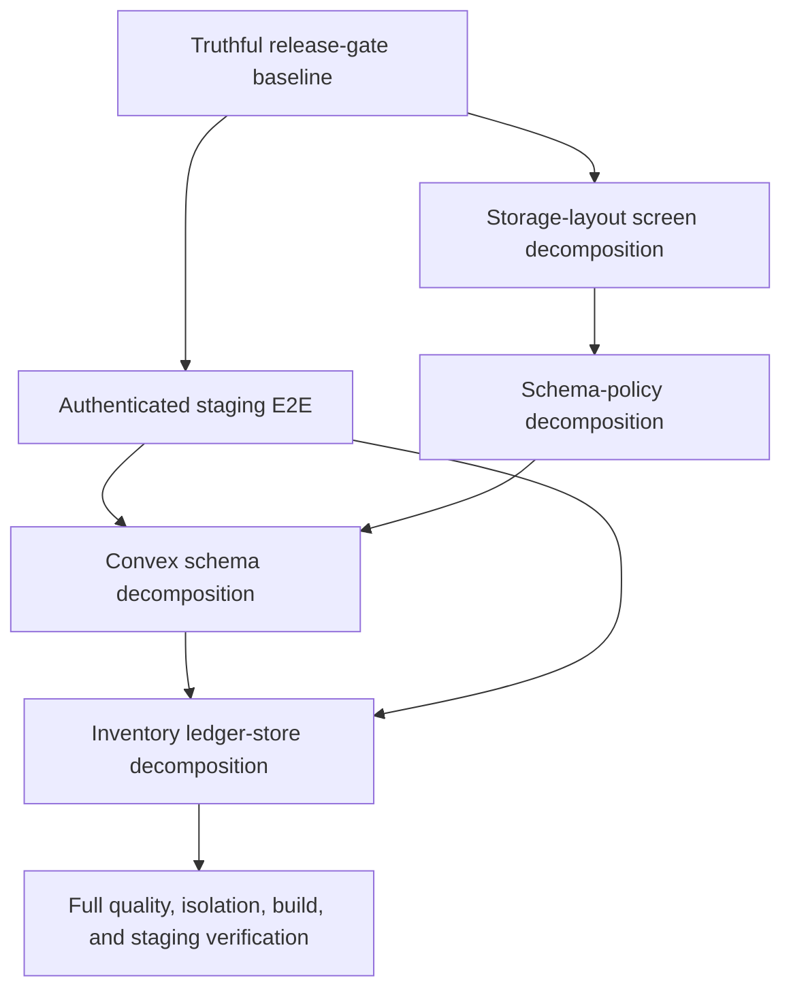

# Selective module-decomposition plan

Status: **Proposed — no hotspot implementation has been moved**
Updated: 2026-08-22
Owner: Engineering lead

## Outcome

Reduce change risk in four large modules by placing cohesive behavior behind
small interfaces at deliberate seams. File length identifies candidates; it does
not authorize splitting. A decomposition proceeds only when it improves leverage
for callers, locality for maintainers, and tests through the same interface.

## Candidate plans

| Order | Candidate              | Current size | Plan                                                  | Why this order                                                           |
| ----- | ---------------------- | ------------ | ----------------------------------------------------- | ------------------------------------------------------------------------ |
| 1     | Storage-layout screens | ~3,200 lines | [Storage-layout screens](./storage-layout-screens.md) | Isolated UI surface with five route callers and existing component tests |
| 2     | Schema policy          | ~2,100 lines | [Schema policy](./schema-policy.md)                   | Pure, deterministic policy with strong negative-control tests            |
| 3     | Convex schema          | ~3,900 lines | [Convex schema](./schema.md)                          | Broad type blast radius but excellent schema and tenant-policy guards    |
| 4     | Inventory ledger store | ~2,000 lines | [Inventory ledger store](./inventory-ledger-store.md) | Highest correctness/security risk and many production callers; do last   |

## Required safety net

Begin implementation only after:

1. The [release-gate refresh](../release-gate-refresh.md) establishes a truthful
   baseline.
2. The existing credential-free quality and E2E suites are green.
3. The [authenticated E2E slice](../authenticated-e2e/README.md) is green in the
   approved staging environment before schema or ledger work begins.
4. The candidate's characterization tests cover its current external interface.

The storage-layout UI and pure schema-policy work may be prepared before the
authenticated lane becomes required, but schema and ledger changes wait for that
deployed wiring proof.

## Design rules

- A **module** has one external **interface**; moving code without changing the
  knowledge required by callers is not automatically an improvement.
- Put the **seam** where behavior or ownership actually changes.
- Keep internal seams private. Do not export helpers merely so tests can call
  past the external interface.
- Introduce an adapter only where at least two implementations exist or are
  required. These candidates are primarily in-process and do not need new ports.
- Preserve stable external imports until a tiny commit can migrate all callers.
- Replace tests of accidental internals with tests through the new interface;
  retain pure-kernel tests where the pure module is itself the interface.
- One candidate per branch/PR. One behavior-preserving extraction per commit.
- Stop when the next split would enlarge the external interface or scatter an
  invariant across modules.

## Dependency order

## Global acceptance criteria

- Public behavior and error contracts are unchanged.
- No new exported helper exists solely for tests.
- Callers learn no additional ordering, storage, or configuration rules.
- Tenant, ledger append-only, idempotency, bounded-read, and schema invariants
  remain enforced by the same or stronger guards.
- Formatting, lint, strict typecheck, all Vitest tiers, production build,
  credential-free E2E, and authenticated staging E2E pass.
- A candidate is allowed to finish with **no decomposition** when the design spike
  shows the current module is already deep and splitting would reduce locality.

## Project benefit

The result is not “more files.” It is smaller caller-facing knowledge, clearer
ownership, more local changes, and safer reviews. The highest-risk modules remain
deep: complex behavior stays hidden behind a narrow interface even when the
implementation is organized internally.
