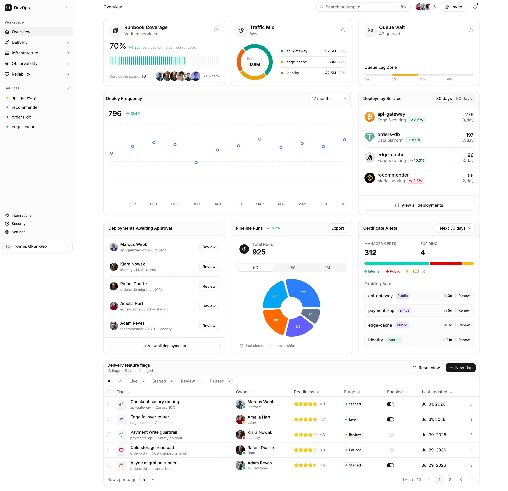

# Owner dashboard UI implementation plan

Status: **Proposed — references captured; third-party source not imported or audited**
Updated: 2026-08-24
Product perspective: organization business owner/executive

## 1. Outcome

Replace the current supervisor-oriented dashboard composition with an
owner-first decision surface while keeping warehouse execution on its existing
pages. The dashboard will combine:

- a permission-safe, per-membership customizable quick menu;
- business-impacting exceptions ranked before routine activity;
- a small owner scorecard with explicit scope, period, freshness, and targets;
- drilldowns into the existing operational workbenches; and
- new trends only after bounded, maintained projections exist.

“Owner” does not mean the consigned-stock `owners` table and is not inferred
from the technical `ORG_ADMIN` role. The owner profile and any sensitive KPI
permissions must be explicit.

This plan refines the product and authorization findings in
[Owner dashboard and customizable quick menu](../research/owner-dashboard-customization.md).
It is proposed delivery work, not authority to add new permissions, financial
claims, or third-party code without the gates below.

## 2. Reference inventory

### Supplied component references

The following commands are preserved as references. They have **not** been run
in this worktree:

```bash
npx shadcn@latest add "https://21st.dev/r/ravikatiyar162/financial-dashboard"
npx @21st-dev/cli add monolythdev/ai-agent-pipeline
```

- [21st.dev Financial Dashboard](https://21st.dev/r/ravikatiyar162/financial-dashboard):
  reference for a dashboard hub containing cards, quick actions, recent
  activity, and service entry points.
- [21st.dev AI Agent Pipeline](https://21st.dev/r/monolythdev/ai-agent-pipeline):
  reference for communicating a multi-stage process, live state, fan-out, and
  execution history. It is not a proposal to put AI-agent terminology on a WMS
  dashboard.
- [shadcn CLI documentation](https://ui.shadcn.com/docs/cli): registry items may
  write project files and dependencies, so both references must be inspected in
  isolation before any selective port.

The 21st.dev registry endpoints exposed titles and descriptions but required an
authenticated session for source retrieval during planning. Their generated
files, dependency changes, license terms, accessibility, animation behavior,
and compatibility with this repository therefore remain unaudited until the
reference-evaluation gate in section 7.

### Supplied visual reference



Repository copy:
[owner-dashboard-lucent-reference.png](./assets/owner-dashboard-lucent-reference.png)
(3456 × 3340 PNG; SHA-256
`e84b4cb95e9a200138d2240a4ff21b42d1cbfe4b5d2bbb5a215f6f7a7a59245f`).

The screenshot is a composition reference, not a domain specification. DevOps
labels, cryptocurrency/service logos, invented values, people, and actions must
not be copied into the product.

## 3. Reference disposition

| Reference pattern                                          | Warehouse-owner adaptation                                                                            | Decision                                                                 |
| ---------------------------------------------------------- | ----------------------------------------------------------------------------------------------------- | ------------------------------------------------------------------------ |
| Compact top KPI cards                                      | Commitments at risk, fulfillment service, inventory risk, and capacity risk                           | Reuse the compact hierarchy; show at most four initially                 |
| Large central trend                                        | On-time shipment or orders-at-risk history with target and prior-period comparison                    | Defer until a bounded historical rollup exists                           |
| Ranked right-side list                                     | Warehouses, customers, or processes contributing most to risk                                         | Adapt with a descriptive drilldown                                       |
| Awaiting-approval list                                     | QC dispositions, release approvals, or other decisions the signed-in owner may approve                | Reuse only when the separate approval permission is present              |
| Segmented pipeline card                                    | Order → allocate → pick → dispatch flow health                                                        | Optional later reference; never animated decoration without useful state |
| Alert list                                                 | Stockouts, late commitments, suspect rollups, transfer discrepancies, and failed integrations/jobs    | Reuse as the first “Needs attention” list                                |
| Full-width comparison table                                | Orders/customers/warehouses at risk, sorted by decision severity then age                             | Reuse; tables beat overloaded cards for comparison                       |
| Sidebar, global search, invite/avatar controls             | Existing application shell already owns navigation, warehouse selection, language, and identity       | Reject duplication                                                       |
| Stars, toggles, certificate renewal, deployment vocabulary | No warehouse-owner decision supported                                                                 | Reject                                                                   |
| Donut and decorative charts                                | Use only when the composition communicates a real part-to-whole question and has a textual equivalent | Do not include in the first delivery                                     |

## 4. Owner dashboard information architecture

### 4.1 Page order

1. **Compact page heading:** “Owner overview,” scope, and data freshness. Keep
   organization, warehouse, language, and account controls in the shell.
2. **Customizable quick menu:** four to six authorized actions in one compact
   row/grid, followed by a clear Customize control.
3. **Needs attention:** one ranked list with severity text, impact, age/deadline,
   affected entity, owner, and a descriptive drilldown.
4. **Owner scorecard:** a maximum of four first-release KPI cards. Missing,
   partial, stale, denied, and suspect data remain visibly distinct from zero.
5. **Trend and contributors:** a dominant trend panel and smaller ranked list
   only after their projections and comparison periods are truthful.
6. **Decision queues:** approvals and alerts, filtered to permissions that allow
   the user to read or take the represented action.
7. **Detailed comparison table:** a full-width, sortable list for entities at
   risk. This is the primary analytical surface, not a decorative chart wall.
8. **Operational detail:** occupancy and routine execution counts below the
   owner summary or behind drilldowns.

### 4.2 First truthful release

The first release must use only existing maintained or bounded sources:

- `readOperationalExceptions` for prioritized operational exceptions;
- `readDashboard` for quality and putaway backlog counters and their
  freshness/suspect state;
- `readOccupancy` for current capacity bands and the location drilldown;
- `readCurrent` for active membership, warehouse scope, and bounded navigation
  permissions; and
- existing report, order, balance, quality, production, and administration
  routes for authorized drilldowns.

Do not present lifetime receipt counters as current owner performance. Keep them
as labeled operational totals, move them below the owner summary, or omit them.

### 4.3 Deferred owner KPIs

Each KPI requires a definition, target, period, prior-period comparison,
freshness contract, bounded projection, reconciliation path, and drilldown:

| KPI                       | Required projection before UI delivery                                     |
| ------------------------- | -------------------------------------------------------------------------- |
| On-time shipment rate     | Daily shipment due/on-time/late rollup by organization and warehouse       |
| Orders at risk            | Due-window fulfillment-risk projection with committed and blocked quantity |
| Dock-to-stock time        | Receipt-to-available duration aggregate with percentile/average definition |
| Inventory accuracy        | Count discrepancy and overdue-plan historical aggregate                    |
| Capacity risk trend       | Historical occupancy-band rollup, not a client aggregation of locations    |
| Production plan adherence | Due/completed/late production-order aggregate                              |

Inventory value, revenue, margin, and cash exposure remain excluded until the
system has authoritative price, cost, currency, period, and reconciliation
models plus separately approved permissions.

## 5. Customizable quick menu contract

### 5.1 Registry

Create one code-owned `DASHBOARD_ACTIONS` registry and remove the page’s two
hardcoded hero actions, its eight inline entries, and the separate unused static
quick-action list. Each registered action owns:

```text
id                    stable, non-localized identifier
route                 existing internal route constant
labelKey              English/Thai translation key
icon                  existing Lucide icon
requiredPermissions   read permission for visibility
requiredEntitlements  product capability, if applicable
requiresWarehouse     whether active warehouse scope is mandatory
profiles              profiles whose default may include it
```

No arbitrary URLs, labels, permission claims, or entitlement claims are stored
in preferences.

### 5.2 Preference ownership

Persist one bounded tenant record per active membership and page:

```text
dashboardPreferences
  orgId
  membershipId
  pageKey: "OWNER_DASHBOARD"
  presetVersion: 1
  quickActionIds: string[]  // ordered, unique, maximum 6
  widgetIds: string[]       // ordered and bounded
  hiddenWidgetIds: string[] // bounded
  updatedAt
```

Index the record by `(orgId, membershipId, pageKey)`. A global `userId` is not
the ownership boundary because one person may be a member of several
organizations.

### 5.3 Resolution and enforcement

The server resolves:

```text
registered actions
∩ latest owner-profile default or saved membership preference
∩ current effective permissions
∩ current entitlements
∩ current warehouse scope
∩ active membership
```

The destination query or mutation authorizes again on every request. Menu
visibility is presentation, not enforcement. Revocation must remove a saved item
on the next read without rewriting the preference first.

### 5.4 Customization interaction

- Enter an explicit Customize mode; do not make ordinary cards draggable.
- Add only from the currently permitted registry subset.
- Support Remove, Move up, Move down, Move to position, Save, Cancel, and Reset
  to current owner default.
- Drag-and-drop may use the repository’s existing `@dnd-kit` dependencies, but
  it cannot be the only ordering method.
- Announce save/reset results without moving focus unexpectedly.
- When an item is revoked while editing, explain that it is no longer available
  and exclude it from the saved effective result.

## 6. UI composition and component boundaries

Build the page from deep, independently testable modules rather than importing a
third-party dashboard page wholesale:

```text
OwnerDashboard
├── OwnerDashboardHeader
├── DashboardQuickMenu
│   └── QuickMenuCustomizer
├── OwnerAttentionList
├── OwnerScorecard
│   └── OwnerMetricCard
├── OwnerTrendPanel          // deferred until historical projection exists
├── OwnerRiskContributors    // deferred until grouped projection exists
├── OwnerDecisionQueues
└── OwnerRiskTable           // delivered with a bounded source
```

Each widget owns its query gate and loading/denied/empty/error/stale/partial
state so one failure never blanks the page. Reuse the existing `Card`, button,
table, badge, tabs, select, and skeleton primitives and the project’s semantic
tokens. Do not introduce a second visual theme from a registry item.

Desktop may use a 12-column composition inspired by the reference. Tablet and
mobile must preserve the semantic order above and collapse to a single logical
column without horizontal page scrolling. Dense tables may use their own
focusable scroll region when a stacked representation would destroy comparison.

## 7. Third-party reference-evaluation gate

Do this in a clean disposable branch or worktree before product implementation.
The repository uses pnpm, so an evaluator may translate the supplied commands to
`pnpm dlx`; the exact supplied commands remain preserved in section 2.

1. Record `git status`, `package.json`, lockfile, `components.json`, shared UI
   primitives, and global CSS before import.
2. Import the Financial Dashboard reference alone and record every created,
   overwritten, and dependency-modified file.
3. Restore the clean evaluation baseline, then inspect the AI Agent Pipeline
   reference separately.
4. Audit license/provenance, network calls, dependencies, client boundaries,
   generated sample data, animations, reduced-motion support, keyboard behavior,
   focus order, color contrast, responsive behavior, and design-token usage.
5. Classify each file or pattern as **reuse**, **adapt**, or **reject** using
   section 3. No generated domain data, auth logic, routes, global CSS, or shell
   layout may be copied.
6. Port only the selected presentational ideas into repository-owned modules and
   tests. Do not merge the registry-import diff itself.

Current compatibility facts to account for:

- the project already uses shadcn `radix-nova`, ReUI registry aliases, Tailwind
  CSS variables, Lucide icons, React 19, and Next.js 16;
- `@dnd-kit` is already present;
- no charting or general motion library is currently declared; and
- generated primitives must not overwrite repository-owned components without a
  reviewed diff.

## 8. Delivery sequence and parallel work

| Step | Work                                                                                         | Dependency               | Can run in parallel with                                         |
| ---- | -------------------------------------------------------------------------------------------- | ------------------------ | ---------------------------------------------------------------- |
| 0    | Quarantine and audit both component references                                               | None                     | Screenshot composition specification                             |
| 1    | Approve owner profile, KPI definitions, registry IDs, and permission contract                | Research brief           | Visual component prototypes using static typed fixtures          |
| 2    | Add `dashboardPreferences` schema, read/update/reset functions, and isolation tests          | Step 1                   | Quick-menu UI and responsive layout behind a typed port          |
| 3    | Consolidate hardcoded actions into the registry and integrate customization                  | Step 2 contracts         | First-release owner attention/scorecard composition              |
| 4    | Integrate existing bounded reporting sources and drilldowns                                  | Step 1                   | English/Thai copy, accessibility, and visual-regression fixtures |
| 5    | Add historical owner projections one domain at a time                                        | Approved KPI definitions | Independent projection domains after their contracts are fixed   |
| 6    | Enable trend, contributors, flow visualization, and risk table as their sources become ready | Relevant projection      | Per-widget test and documentation work                           |
| 7    | Full audit, authenticated browser test, refactor, and release evidence                       | Integrated page          | None; this is the convergence gate                               |

Do not start trend charts, cross-warehouse totals, or financial cards merely to
fill the reference layout. Empty grid slots are cheaper than untrustworthy data.

## 9. Likely file ownership

| Concern                     | Likely files/modules                                                                         |
| --------------------------- | -------------------------------------------------------------------------------------------- |
| Page composition            | `src/app/[locale]/(desktop)/dashboard/page.tsx` and its test                                 |
| Action registry             | new pure module under `src/features/reporting/dashboard/` using `src/lib/navigation.ts`      |
| Quick-menu UI               | replace/consolidate `src/features/reporting/DashboardQuickActions.tsx`                       |
| Owner widgets               | new modules under `src/features/reporting/dashboard/`                                        |
| Existing reporting adapters | `src/features/reporting/OperationsTiles.tsx`, `OccupancyMap.tsx`, and reporting API wrappers |
| Preference persistence      | `convex/schema.ts` and new tenant-bound reporting/workspace functions                        |
| Permission vocabulary       | existing permission/navigation modules; changes require explicit review                      |
| Owner projections           | new model kernels and bounded Convex projections per domain                                  |
| Copy                        | `messages/en.json`, `messages/th.json`, and message-manifest tests                           |
| Evidence                    | dashboard manual, specification coverage, and focused screenshots after implementation       |

## 10. Verification matrix

### Domain and server

- Registry IDs are stable, unique, bounded, and resolve only known routes.
- Preference writes reject duplicate, unknown, excessive, cross-tenant, inactive,
  and wrong-membership inputs.
- Reads intersect saved IDs with current grants, entitlement, and warehouse
  scope; revoked items disappear immediately.
- Reset resolves the latest permitted preset rather than replaying a stale array.
- Projection properties cover replay, correction, freshness, partial reads, and
  boundedness.

### Component and accessibility

- Owner, supervisor, denied, loading, empty, stale, partial, suspect, and error
  states have focused component coverage.
- Keyboard users can customize without drag; focus order matches visual order.
- Save/loading/status changes are announced programmatically.
- Color is never the sole status signal, interactive target sizes meet the
  project’s touch target rule, and charts have text/table equivalents.
- English and Thai layouts are tested for expansion and truncation.

### Browser and visual

- Authenticated owner and non-owner personas render the correct content and
  cannot reach unauthorized destinations directly.
- Permission, membership, entitlement, and warehouse-scope revocation are tested
  after a preference has already been saved.
- Screenshot checks cover 320 CSS pixels, tablet, standard desktop, and a wide
  desktop matching the reference composition.
- No page-level horizontal scrolling, shell duplication, hydration warnings,
  unexpected network calls, or animation under reduced-motion preference.

### Repository gates

- Focused unit, Convex runtime, integration/isolation, accessibility, and E2E
  suites pass.
- `pnpm typecheck`, scoped ESLint, Prettier, `git diff --check`, and the relevant
  repository guards pass.
- Third-party dependency and production audits are green before merge.

## 11. Acceptance criteria

- The first visible content answers what needs the owner’s attention and why.
- Every metric states scope, period, freshness, and definition; no invented
  financial or trend value appears.
- Each membership can reorder or hide a maximum of six authorized quick actions
  without changing another membership or organization.
- A saved preference cannot grant visibility, navigation, query, mutation,
  approval, export, or administration access.
- The existing warehouse shell remains the single owner of primary navigation,
  organization/warehouse scope, language, and identity.
- The delivered visual hierarchy is recognizably informed by the three supplied
  references while remaining consistent with this application’s design system,
  data contracts, English/Thai copy, and accessibility rules.

## 12. Deliberate exclusions

- Running either supplied import command in the active worktree as part of this
  planning task.
- Copying the reference screenshot pixel-for-pixel.
- Adding a chart or animation before its decision, data definition, reduced-
  motion behavior, and textual equivalent are established.
- Treating `ORG_ADMIN` as business-owner proof.
- Client-side aggregation of unbounded operational rows or all warehouses.
- Arbitrary external quick-menu URLs or user-authored executable configuration.
- Financial KPIs without authoritative price, cost, currency, and reconciliation
  contracts.
