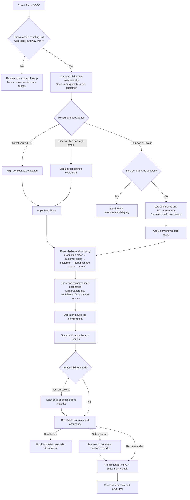
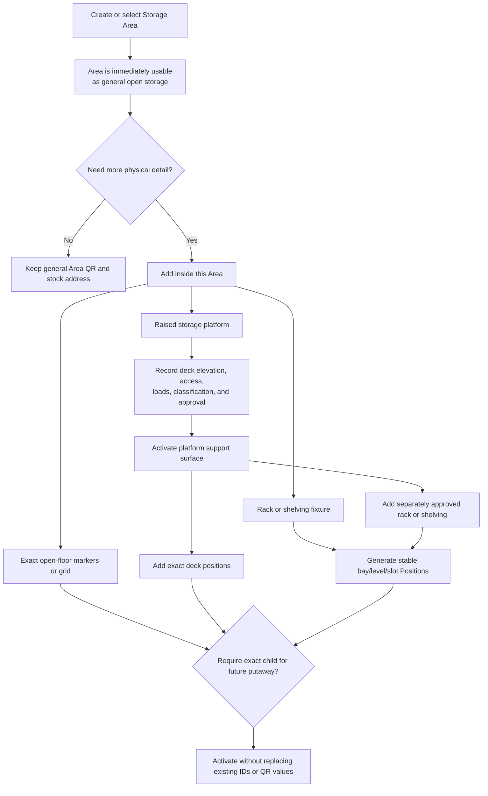

# Storage and finished-goods putaway improvement plan

Status: **Proposed**  
Scope: storage-area planning, storage structures, finished-goods recommendation,
and operator putaway  
Decision baseline: [ADR-0018](../adr/0018-general-area-stock-and-fg-putaway-confidence.md)

## Outcome

Turn the current storage-layout slice and putaway prototypes into one operational
workflow with two properties:

1. A planner draws a mode-less **Storage Area** first and adds racks, shelving,
   exact floor markers, or a raised platform only when the real warehouse needs
   them.
2. An operator normally scans the finished-good LPN/SSCC, follows one explained
   recommendation, and scans the destination. The second scan revalidates and
   posts the ledger move, placement, and audit atomically.

The plan preserves existing location IDs, QR values, ledger history, and simple
open-area operation. It does not require every Area to have a separately
configured Position.

## Product rules this plan implements

- A Storage Area is a bounded planning and policy region. It has no storage mode.
- An Area's existing location is a valid general-storage stock address. It means
  “somewhere in this Area”; it is not a computed roll-up of child stock.
- A rack, shelf, or raised platform is a **fixture**, not a stock address.
- A Storage Position is optional exact precision. Rack bay/level/slot leaves and
  an Area configured with `exact child required` must use one.
- One ledger line names exactly one stock address: either the general Area or one
  exact Position. It never posts the same quantity to both.
- Unknown dimensions or capacity remain unknown. They are never converted to
  zero, copied from plausible UI defaults, or presented as verified fit.
- Known prohibitions, compatibility, physical-fit, structural-load, clearance,
  quality, and lifecycle rules are hard constraints. Affinity, travel, planned
  utilization, and fragmentation are ranking preferences.
- Existing IDs, QR payloads, and history survive migration. Geometry and display
  labels may change without changing identity.

ADR-0018 is authoritative where older ADR-0017 wording or exploratory research
still says every balance must use a child Position.

## Current state

### Reusable implementation

- Storage buildings, floors, reserved blocks, Areas, generated Positions,
  breadcrumbs, QR values, geometry editing, Thai/English copy, and demo layouts
  are present.
- `resolveStorageAddress` can resolve an Area or Position QR and can distinguish
  automatic resolution from a request for an exact child.
- Putaway tasks can be claimed and confirmed with tenant-safe Convex functions.
  Confirmation posts an inventory ledger transaction and retains recommendation
  versus chosen-location evidence.
- The recommendation model already has deterministic hard-filter-before-score
  behavior for its current candidate facts.
- A reusable camera scanner supports camera capture and a manual fallback, with
  component and accessibility coverage.
- The putaway page contains three UI concepts and measured/unmeasured examples
  that are useful for evaluating presentation.

### Prototype or compatibility-only behavior

- The three putaway concepts use hard-coded LPN, order, customer, candidates,
  capacity, and scores. A destination scan changes local UI state but does not
  complete a task.
- The explanatory case flow is not an operator state machine.
- Desktop and handheld routes both render the same table-first
  `PutawayWorkbench`.
- `storageZones.mode`, `baseElevationMm`, and mode-specific mutations still make
  the Area itself act like one storage structure. They are migration inputs,
  not the target write model.
- Existing `storagePositions` combine exact-address identity with rack/platform
  structure fields. Dedicated fixtures and support surfaces do not yet exist.

### Production gaps

| Gap                                                                                                          | Consequence                                                                                   |
| ------------------------------------------------------------------------------------------------------------ | --------------------------------------------------------------------------------------------- |
| No LPN/SSCC putaway resolver                                                                                 | The operator must know and select an internal task.                                           |
| No measurement provenance, gross weight, or result status                                                    | The system cannot truthfully distinguish measured, reused, estimated, and unknown dimensions. |
| Candidate loader omits production order, customer order, customer, dimensional fit, and most occupancy facts | The visible recommendation cannot implement the approved ranking model.                       |
| Scorer returns numeric score/components but no fit status or confidence                                      | The operator cannot tell what is proven versus estimated.                                     |
| Confirmation trusts a location from the earlier ranked set without recalculating all live rules              | A stale recommendation can survive changing occupancy or configuration.                       |
| Putaway confirmation and stack placement are separate workflows                                              | Ledger location and physical placement can drift.                                             |
| Plausible dimensions default to `1.2 × 1.0 × 1.4 m` in stack placement                                       | Missing evidence can look like a real measurement.                                            |
| No fixture/support-surface lifecycle                                                                         | Mixed structures and a rack on an approved platform cannot be represented safely.             |
| Aggregate free area is not backed by contiguous free geometry                                                | “18.4 m² available” does not prove a rectangular LPN fits.                                    |

## Target operator flow

### Measured and unmeasured decision table

| Evidence                                                                  | Fit claim allowed                  | Normal destination                                                     | Operator action                                          |
| ------------------------------------------------------------------------- | ---------------------------------- | ---------------------------------------------------------------------- | -------------------------------------------------------- |
| Direct, in-range measurement of this HU plus trusted destination geometry | `VERIFIED_FIT`, high confidence    | General Area or exact Position that passes all checks                  | Scan destination; no dimension typing                    |
| Verified exact package configuration, quantity, and revision              | `ESTIMATED_FIT`, medium confidence | Eligible Area/Position                                                 | See source; optionally measure instead; scan destination |
| Coarse handling-unit class only                                           | `FIT_UNKNOWN`, low confidence      | Policy-approved general Area only                                      | Visual-fit acknowledgement and scan                      |
| No usable evidence or failed/out-of-range capture                         | No positive fit claim              | Measurement/staging unless low-confidence general storage is permitted | Measure, retry, or follow supervisor path                |

## Target planner flow

The Area editor should not ask for a mutually exclusive mode. It should show:

- general Area properties and exact-child policy;
- support surfaces and their available footprint separately;
- fixtures and exact Positions inside the selected Area;
- reserved/access/clearance geometry;
- affected LPNs and approval impact before occupied edits.

## Delivery plan

Each phase is independently reviewable and keeps compatibility reads until the
corresponding migration is verified.

### Phase 0 — Characterize and simplify the current slice

**Goal:** protect today’s behavior while making prototype boundaries explicit.

Deliverables:

- Mark the three-style experience as a design preview and move it away from the
  normal operator happy path.
- Keep the existing table-first workbench as the supervisor/desktop fallback.
- Add route-level characterization tests for desktop and handheld putaway.
- Extract route-level storage-layout modules according to the existing
  decomposition plan before large planner changes.
- Remove anonymous dimension defaults; blank, measured, reused, estimated, and
  unknown must render as different states.

Acceptance:

- No prototype value can be posted to Convex.
- Existing claim/confirm and storage-layout tests remain green.
- Thai and English identify prototype versus live data unambiguously.

### Phase 1 — Mode-less Area and fixture foundation

**Goal:** make the persisted model match ADR-0018 without breaking deployed
labels or history.

Deliverables:

- Add `storageFixtures`, `storageSupportSurfaces`, stable rack bay/level records,
  and fixture-approval/lifecycle state.
- Add Area policy such as `GENERAL_ALLOWED` or `EXACT_CHILD_REQUIRED`; do not use
  an area-wide storage mode for new writes.
- Separate exact Position identity from fixture geometry and configuration.
- Make the Area's existing `locationId` the general-storage address. Area and
  child balances remain independent buckets.
- Backfill old modes incrementally:
  - `SIMPLE` → mode-less Area; reuse its historical location as general storage;
  - `FLOOR_POSITIONS` → open-floor arrangement plus retained children;
  - `RACK` → rack fixture, bays/levels, and retained Position IDs;
  - `PLATFORM` → platform fixture/support surface and retained Position IDs.
- Keep `mode` and `baseElevationMm` readable during one bounded migration window;
  block new mode-based writes after compatibility verification.

Acceptance:

- Existing Area/Position location IDs, QR payloads, balances, history, and
  breadcrumbs are byte-for-byte stable through backfill.
- One transaction cannot post the same physical quantity to both Area and child.
- Tenant isolation, warehouse authorization, idempotency, and occupied-delete
  refusal have focused tests.

### Phase 2 — Progressive storage planner

**Goal:** let planners create an Area first and add real structures inside it.

Deliverables:

- Replace Area mode selection with **Add structure**: open-floor markers/grid,
  rack/shelving, or raised platform.
- Show Area, floor support surface, each platform deck, and rack availability as
  separate concepts. Do not combine elevated deck area with ground-floor area.
- Implement support-surface parenting and Z derivation:
  - floor/open position Z = support surface Z;
  - rack leaf Z = support surface Z + approved level elevation;
  - platform deck Z = approved top-of-deck elevation.
- Add platform draft → approval → active lifecycle, with intended use above and
  below, classification, access/guards, clearances, and approval references.
- Generate stable rack bay/level/slot leaves; retained logical slots keep IDs and
  QR values when geometry changes.
- Improve 3D inspection with top/isometric/side POV controls, a readable vertical
  height control, and selectable context objects that show their height.
- Quick Change lists affected LPNs, requires confirmation for occupied geometry
  changes, and hard-blocks occupied leaf deletion.

Acceptance:

- One Area can visibly contain an open stack, a rack, and a raised platform.
- A rack on a platform is allowed only on an active approved support surface.
- Collision, containment, clearance, derived-Z, identity-stability, keyboard,
  reduced-motion, Thai, and English tests pass.

### Phase 3 — Measurement truth and handling-unit resolution

**Goal:** make one scan load all known facts without asking the operator to type
them again.

Deliverables:

- Add `resolvePutawayLpn` for internal LPN and supported SSCC values. It returns
  the active HU, ready/claimed task, item, lot, quantity, production order,
  customer order, customer, current address, and ownership state.
- Extend HU measurement with gross weight, source, source reference/device,
  captured time, units, package configuration/revision, quality/result status,
  and accepting actor where needed.
- Store canonical millimetres/kilograms while preserving the original reading
  and provenance.
- Add exact package-profile reuse rules and prevent stale/mismatched revisions
  from claiming verified fit.
- Add explicit capture outcomes: in range, below/above range, no dimension,
  timeout, cancelled, manual, and package-profile reuse.

Acceptance:

- LPN/SSCC scan resolves only within the selected tenant and warehouse.
- Unknown never becomes zero or a default dimension.
- Direct measurement, package reuse, manual acceptance, and failure states have
  model/integration/audit tests.

### Phase 4 — Explainable recommendation engine

**Goal:** calculate recommendations from real occupancy, order affinity, and
measurement evidence.

Deliverables:

- Build candidates from active Area addresses and exact Positions, including
  fixture/support-surface lifecycle and Area exact-child policy.
- Hard-filter known violations before scoring: scope/status, quality, storage
  class, prohibition, dimension/rotation fit, approved load, clearance, and
  structural compatibility.
- Rank survivors by production order, customer order, customer, item/package,
  reliable usable space, travel, and fragmentation with deterministic ties.
- Calculate `VERIFIED_FIT`, `ESTIMATED_FIT`, or `FIT_UNKNOWN` plus
  `HIGH`/`MEDIUM`/`LOW` confidence and evidence provenance.
- Replace aggregate square-metre proof with contiguous-free-rectangle checks for
  verified open-floor fit. Until that exists, label Area space estimated/advisory.
- Persist an immutable recommendation snapshot with inputs, filters, weights,
  reasons, rejected candidates, evidence versions, and calculation time.

Acceptance:

- Hard failures always outrank preferences by filtering candidates out.
- Same production/customer order affects only eligible candidates.
- Fragmented-space property tests prove that total free area alone cannot yield
  `VERIFIED_FIT`.
- Recommendation results are deterministic and tenant-isolated.

### Phase 5 — Two-scan operator workflow and atomic commit

**Goal:** make the handheld happy path two scans and no typing.

Deliverables:

- Give handheld its own scan-state workflow; retain tables and detailed scoring
  for supervisors on desktop.
- LPN scan resolves and claims work automatically. Show one primary destination,
  a breadcrumb, confidence/fit badge, and at most three short reasons.
- Destination scan resolves the Area/Position server-side. If exact child is
  required, show a focused scan/map/list selection instead of guessing.
- Add `confirmPutawayByScan` with raw scan value and input method. It recomputes
  live hard eligibility and occupancy; it must not trust an old client location.
- Recommended and still-safe scan auto-submits. A safe alternate requires a
  tap-sized reason code and explicit confirm. Hard failures block completion.
- Merge the ledger move and physical placement into one idempotent Convex
  transaction; auto-advance to the next LPN after success.
- Preserve recommendation time, final scan time, original recommendation,
  revalidation result, chosen address, override reason, operator, and transaction
  ID in audit evidence.

Acceptance:

- Happy path: scan LPN/SSCC → move → scan destination → success, with no typing.
- Camera, hardware/HID input, and manual lookup are recorded as different capture
  methods.
- Stale/full/blocked destinations cannot be posted.
- Duplicate/retried destination scans are idempotent.
- Area-general, Area-needs-child, rack Position, safe override, and unsafe
  override flows have Thai/English integration and accessibility coverage.

### Phase 6 — Pilot, automation, and operational hardening

**Goal:** tune policy with real warehouse evidence and remove remaining manual
work safely.

Deliverables:

- Seed a connected demo containing a simple general Area, a bulk Area with exact
  floor markers, a rack, and an approved raised platform.
- Integrate a dimensioner/scale behind an adapter only after the scan-first
  workflow works without special hardware.
- Add reason-code analytics, recommendation acceptance, stale revalidation,
  measurement fallback, and staging rates.
- Add task sequencing and auto-advance by warehouse travel policy.
- Pilot ranking weights and low-confidence general-Area policy per warehouse;
  do not hard-code one global operating policy.
- Add feature flags and rollback reads for schema migration and operator rollout.

Acceptance:

- Browser QA in Thai covers planner creation, mixed structures, measured and
  unmeasured LPNs, camera scanning, exact-child selection, safe override, and
  blocked revalidation.
- Pilot evidence is reviewed before enabling automatic submission broadly.

## Automation boundary

| Automate                                         | Keep as a deliberate operator or approver action        |
| ------------------------------------------------ | ------------------------------------------------------- |
| Resolve HU/task/order/customer from LPN or SSCC  | Scan the physical destination                           |
| Claim eligible work                              | Visually confirm unknown-fit general storage            |
| Import trusted measurements and provenance       | Accept uncertain/manual or out-of-range measurement     |
| Filter, rank, rotate, and calculate availability | Choose and explain a safe alternate destination         |
| Resolve a sole permitted child                   | Approve rack/platform configuration and safety evidence |
| Timestamp, audit, transact, and advance          | Resolve damage, blocked access, or hard-rule exceptions |

Use coded reason chips for normal exceptions. Free text, photos, and supervisor
approval belong only to configured safety/damage cases, not the happy path.

## Test and release gates

Every phase must add focused tests at the narrowest useful seam:

- pure model tests for geometry, measurement confidence, filters, ranking, and
  scan-state transitions;
- Convex integration tests for migration, tenant/warehouse access, live
  revalidation, idempotency, ledger/placement atomicity, and audit evidence;
- component and accessibility tests for Thai/English, keyboard, camera fallback,
  confidence/fit language, and error recovery;
- browser QA with fresh Thai screenshots for mixed Area structures, exact floor
  Positions, rack levels, raised-platform elevation/POV, measured recommendation,
  unknown-fit fallback, and exact-position selection.

Required gates are scoped Prettier, typecheck, lint, relevant Vitest projects,
the full test suite, and production build where route/backend changes warrant it.
Unrelated baseline failures must be named separately and never counted as a pass.

## Success measures

Instrument before setting final targets. Proposed pilot measures are:

- median manual fields on the normal measured path: **0**;
- normal measured path: **2 scans** and no extra submit tap;
- ambiguous parent-address postings when exact-child policy is active: **0**;
- hard-rule overrides: **0** by construction;
- recommendation acceptance and reason-coded safe-override rate;
- measurement evidence mix: direct, package reuse, manual, unknown, and staging;
- stale recommendation block rate and scan-to-completion latency;
- inventory/placement reconciliation exceptions: **0**.

## Risks and controls

- **False precision:** require provenance and fit status; unknown stays unknown.
- **Unsafe capacity claims:** engineered loads and configured clearances are hard;
  planned utilization remains advisory.
- **Migration drift:** dual-read temporarily, stable-ID assertions, reconciliation
  reports, feature flags, and bounded removal of compatibility writes.
- **Stale recommendations:** revalidate on destination scan inside the confirming
  transaction.
- **Configuration overload:** Area works immediately; fixture detail is
  progressive and requested only for the structure being added.
- **UI overload:** handheld shows one next action; supervisor views retain tables,
  alternatives, traces, and configuration tools.
- **Regulatory overclaim:** store site jurisdiction, approval source, and revision;
  the planner checks configured rules but does not certify engineering safety.

## Recommended next three increments

1. **Truthful baseline:** remove dimension defaults, label prototypes clearly,
   add handling-unit measurement provenance, and characterize desktop/handheld
   routes.
2. **Mode-less compatibility:** add Area policy plus fixture/support-surface
   tables and migrate one simple Area, one mixed bulk Area, one rack, and one
   platform without changing IDs or QR values.
3. **Live two-scan slice:** implement `resolvePutawayLpn` and
   `confirmPutawayByScan` for measured HUs using current safe candidates, then
   replace the handheld table flow. Expand affinity and geometry scoring only
   after the transaction and scan evidence are correct.

## References

- [Domain context](../../CONTEXT.md)
- [ADR-0017 — Storage areas and exact leaf positions](../adr/0017-storage-areas-and-leaf-positions.md)
- [ADR-0018 — General-area stock and confidence-aware FG putaway](../adr/0018-general-area-stock-and-fg-putaway-confidence.md)
- [Warehouse areas with heterogeneous storage structures](../research/warehouse-area-storage-structures.md)
- [Finished-goods recommendation research](../research/fg-putaway-recommendation-measured-and-unmeasured.md)
- [Scan-first, low-input putaway research](../research/fg-putaway-scan-first-low-input-ux.md)
- [Finished-goods UX flow](../product/finished-goods-putaway-ux-flow.md)
- [Storage-layout screen decomposition](./module-decomposition/storage-layout-screens.md)
