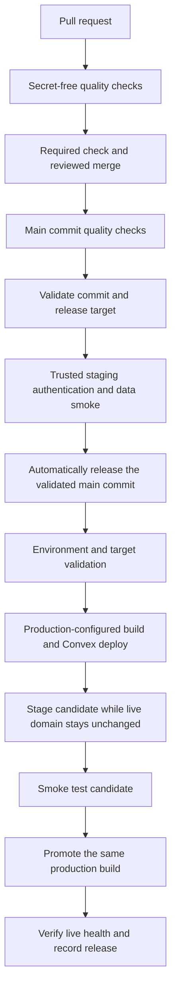

# CI/CD audit and implementation plan — 2026-10-09

Status: proposed plan. Three agents independently audited CI quality, deployment,
and security/supply chain. The coordinating agent verified live GitHub settings
and recent runs. This work adds documentation; implementation and platform
configuration are follow-up work.

The follow-up [five-agent Kiro audit](../reviews/ci-cd-kiro-audit-2026-10-09.md)
contains 76 practice records with exact placement, acceptance cases and reviewed
corrections. This plan incorporates its material findings.

The priority is to enforce the existing quality checks and control production
changes. The repository already has fast, reproducible CI. A failed check can
currently be bypassed by merging or pushing to an unprotected `main`, and the
documented Vercel build also changes the production Convex backend.

## Evidence and limits

| Area                | Audited state                                                                                                                                                          |
| ------------------- | ---------------------------------------------------------------------------------------------------------------------------------------------------------------------- |
| Repository          | Public GitHub repository `Rugby-Thailand/industrial-sas`                                                                                                               |
| Local snapshot      | HEAD `0e9ea3aba4d241d4e1d732e2adb5637966ebabaa`, with substantial existing tracked and untracked application work                                                      |
| Remote snapshot     | Live `main` was `cc42063335f1355b053a4544c5ed658dd0b6d1f2` when inspected                                                                                              |
| Toolchain           | Node 24; pnpm 10.33.2; installed Next 16.3.8 and Convex 1.46.0                                                                                                         |
| CI history          | All 15 most recent quality runs succeeded; latest main run took about 98 seconds from creation to final check completion                                               |
| Branch enforcement  | Rulesets API returned zero rulesets; `main` protection API returned `404: Branch not protected`                                                                        |
| GitHub environments | Existing `Preview` and `Production` had no protection rules or deployment branch policy                                                                                |
| Actions policy      | Read-only default token; Actions cannot create/approve PRs; fork-run policy is first-time contributors; all actions allowed; mandatory SHA pinning disabled            |
| GitHub security     | Secret scanning, secret-scanning push protection, and Dependabot security updates reported disabled                                                                    |
| CodeQL              | Default setup reported `not-configured`; no scanning workflow was found locally. External scanning uploads were not investigated.                                      |
| Vercel              | Connector project inspection returned 403 because its token lacks access to the documented team scope; CLI was not installed. Live project settings remain unverified. |

The [latest successful main run](https://github.com/Rugby-Thailand/industrial-sas/actions/runs/37946027709)
is evidence about that remote commit, not the current dirty working tree. No full
local test/build suite, production dry run, deployment, platform setting change,
or credential-value inspection was performed for this audit. Current vulnerability
counts, backups, live preview isolation, and production deployment settings need
verification during implementation.

Relevant installed Next guides were read before making recommendations: CLI
`next typegen`, TypeScript, CI caching, Playwright, environment variables, and
deployment guidance under `node_modules/next/dist/docs/`.

## Findings from the independent audits

### CI quality and tests

Keep the shared setup action, frozen lockfile installation, hosted Ubuntu runners,
two test shards, parallel production build, and the existing `check` job. The
aggregate checks every dependency for `success`, including failure/cancellation
handling. PR cancellation avoids cancelling a running main check, but the default
concurrency queue can replace pending main checks. Give non-PR quality runs unique
groups and serialize the release job separately. Cache scopes are appropriate;
38 entries used about 5.80 GB when refreshed. Measure eviction and hit rates before
changing cache policy.

Evidence: `.github/workflows/quality.yml:7–73`,
`.github/actions/setup-node-pnpm/action.yml:14–28`, and `package.json:7–31`.

The static working-tree inventory contained 151 test files: 132 tracked and 19
untracked. Every file matched one Vitest project. Reproducing the installed
sharding algorithm produced 76/75 files without overlap or omissions. The empty
`property` project does not imply missing property testing: fast-check tests in
`convex/model/` execute under `unit-node`. However, dedicated identity-webhook,
tenant-policy and authorization tests were deleted in `983fb5a` while their
subjects still ship. Restore and adapt those tests for current modules. This was
a discovery audit, not a runtime execution or shard-duration measurement.

| Priority | Gap                                                                          | Implication                                                                                                              |
| -------- | ---------------------------------------------------------------------------- | ------------------------------------------------------------------------------------------------------------------------ |
| P1       | No configured Playwright suite or deployed-flow gate                         | Mocked Vitest coverage cannot establish that Clerk, real routes, and Convex work together.                               |
| P0       | Dedicated webhook/tenant-security regressions were deleted                   | Restore critical negative authorization and replay/signature tests before the release cutover.                           |
| P1       | Convex generated contracts lag the pinned CLI; clean-tree assertion missing  | Regenerate reviewed contracts and verify generator/build output before release.                                          |
| P1       | CI build has no deployment configuration validator                           | The intentionally supported unconfigured mode can build successfully without a working identity/backend integration.     |
| P2       | `format:check` exists but CI never runs it                                   | ESLint disables formatting rules, so formatting drift is accepted.                                                       |
| P2       | Standalone `typecheck` runs only `tsc --noEmit`                              | Fresh checkouts lack generated Next route contracts in this job; the separate production build currently mitigates this. |
| P2       | No machine-readable test reports, uploaded diagnostics, or coverage baseline | Failures are harder to diagnose and uncovered critical behavior is not measured.                                         |
| P2       | Fonts download at build time; browser performance checks are manual          | Network reliability and performance budgets need measurement before further optimization.                                |

Evidence: `vitest.config.mts:21`, `vitest.setup.ts:8`, `package.json:22–29`,
`.github/workflows/quality.yml:21–55`, `src/lib/environment.ts:21–31`,
`src/proxy.ts:13–19`, `src/app/[locale]/layout.tsx:2–24`, and
`scripts/storage-workspace-preview/README.md:19`.

### Deployment and operations

The documented Vercel command invokes `convex deploy` around `pnpm build`
(`README.md:73–87`). Installed Convex CLI code builds the frontend and then
pushes backend changes before the Vercel build finishes. Consequently, backend
changes can be live while the old frontend still serves users, or after a later
frontend release check fails.

Vercel Deployment Checks delay production domain assignment after creating a
deployment. They are useful additional protection, but do not themselves guard
this earlier backend mutation. The release gate must run before invoking the
coupled build. This conclusion combines the repository command, installed CLI
behavior, and [Vercel's documented lifecycle](https://vercel.com/docs/deployment-checks).

| Priority | Gap                                                                                             | Required response                                                                                        |
| -------- | ----------------------------------------------------------------------------------------------- | -------------------------------------------------------------------------------------------------------- |
| P0       | No demonstrated gate before production backend changes                                          | Establish one production release path that waits for CI on the selected main commit.                     |
| P0       | A frontend rollback does not restore backend code/data                                          | Keep previous frontend compatibility and document separate backend recovery.                             |
| P1       | Live preview environment isolation is unverified; README warns about an old backend target      | Verify separate Convex and Clerk preview resources and scoped credentials.                               |
| P1       | Production schema regression protection uses a partial dated metadata fixture                   | Keep full captured-validator checks, expand compatibility tests, and rehearse staging schema deployment. |
| P1       | No automated deployment smoke/health gate is configured locally                                 | Verify a production-configured candidate before promotion and monitor after release.                     |
| P2       | Repository observability sinks are only `none`/`console`; backup and alert settings are unknown | Verify platform capabilities, then add durable monitoring and exercise recovery.                         |

The October 8 incident already demonstrated the difference between a successful
frontend build and a deployable backend: Convex CLI permissions and existing
production schema metadata caused deployment failures. Preserve deploy-only
credential scope; do not solve this by granting broad production data access.
A deploy-only key still permits backend code deployment and is not a guarantee
of data containment.
Evidence: `docs/plans/production-deploy-fix-2026-10-08.md:5–64`,
`tests/integration/production-schema-compatibility.integration.test.ts:11–33`,
and `src/lib/observability/port.ts:8–40`.

Use the [Convex hosting integration](https://docs.convex.dev/production/hosting/vercel)
to validate deployment-scoped keys and the [deploy reference](https://docs.convex.dev/cli/reference/deploy)
for optional non-applying preflight inside the Vercel build environment. A dry run
complements the metadata fixture; it does not prove application semantics or
old-client compatibility. It can write generated files locally; use
`--codegen disable` when freshness is checked separately. Codegen dry-run alone
does not fail on drift.

### Security and supply chain

Keep the current secret-free `pull_request` workflow, `contents: read`,
`persist-credentials: false`, full-SHA action pins, and weekly action updates.
Environment/credential exclusions and local seed/login target guards are already
good safeguards. Only the `.env.example` template was tracked among the inspected
environment filenames.

The high-priority gaps are verified live platform controls: unprotected `main`,
disabled secret scanning/push protection, unprotected deployment environments,
and disabled Dependabot security updates. Local gaps are absent `CODEOWNERS`,
dependency review, and scheduled dependency auditing. The current audit covers
only high/critical production dependencies, excluding build/test tooling.

The deeper audit also found unignored private outputs in `data/import-staging/`
and operator scripts using `CONVEX_DEPLOY_KEY` for an admin credential. Plan an
ignore rule/private artifact location and a distinct admin-key variable while
preserving the existing target, preflight and backup guards.

Application dependency versions are deliberately reviewed manually under D-29
(`.github/dependabot.yml:5–6`). Security-update PRs should be introduced as an
explicit policy refinement with manual review and exact pins. GitHub supports
security-only npm updates with `open-pull-requests-limit: 0`, which disables
routine version-update PRs. [Dependabot security-update configuration](https://docs.github.com/en/code-security/how-tos/secure-your-supply-chain/secure-your-dependencies/configure-security-updates).

Do not characterize pnpm 10 as executing every dependency postinstall: it already
blocks dependency lifecycle scripts by default. Explicit build permissions and
release-age/provenance policies are later hardening options, after clean-install
compatibility is checked. [pnpm 10 settings](https://pnpm.io/10.x/settings).

## Proposed release design

Use GitHub Actions as the production orchestrator, retain Vercel for deployment,
and retain Git previews with verified isolation. The user selected automatic
production releases after CI passes. Successful quality checks on the exact
merged main commit trigger the release without a separate manual release approval.
SHA validation, environment isolation, smoke tests, and recovery requirements
remain mandatory.

Design requirements:

- A production release depends on successful `check` for its own full commit SHA.
  Prefer explicit `needs: check` on the main push path. A manual retry must
  resolve and verify a main commit and its qualifying quality run; selecting an
  arbitrary branch or trusting an input claiming success is insufficient.
- Checkout the validated SHA. Record the repository, SHA, workflow run, Vercel
  team/project/deployment ID, Convex deployment, and environment in a release
  manifest without secrets. Validate all targets before mutation.
- Prefer a dedicated `production-release` GitHub environment, restricted to `main`, with
  no required manual release reviewers and tightly controlled bypasses. Keep PR
  review requirements separate from release automation. Environment
  protections apply only to workflows that actually reference the environment.
  [GitHub environment controls](https://docs.github.com/en/actions/how-tos/deploy/configure-and-manage-deployments/manage-environments).
- Disable automatic Git-triggered production builds before enabling the new
  release path. `git.deploymentEnabled` can disable `main` while other branches
  retain previews. Read back effective project settings and verify actual
  behavior. Merely disabling automatic domain assignment leaves the backend
  build side effect intact. [Vercel Git configuration](https://vercel.com/docs/project-configuration/git-configuration).
  Inventory existing builds, deploy hooks, and manual release paths. Drain
  in-flight production builds and complete or recover any backend mutation before
  the new path starts; disabling future triggers does not place existing work
  under the GitHub concurrency lock. Restrict other release paths to documented
  emergency access.
- Serialize the entire build/deploy/smoke/promote sequence, preferably in one
  release job, with a production concurrency group and `cancel-in-progress: false`.
  Do not unlock between jobs and allow a second backend version to overwrite the
  candidate under test. Recheck stale queued SHAs before mutation. Once mutation
  starts, finish or run recovery; do not abandon a partially applied release.
  Explicit `queue: max` can retain up to 100 pending runs; the default single
  pending slot replaces older pending work. Queue-entry order does not guarantee
  commit order. Use unique non-PR quality groups and a fixed release job lock
  across push and dispatch. Detect external Vercel builds that outlive a cancelled
  runner before starting another release. [Concurrency semantics](https://docs.github.com/en/actions/how-tos/write-workflows/choose-when-workflows-run/control-workflow-concurrency).
- Build once with production public configuration, stage it without switching
  the live production domain, test it, then promote that same build. A secret-free PR build is
  not a production artifact: `NEXT_PUBLIC_*` values are baked in. Start with a
  pinned native Vercel remote build using `--prod --skip-domain`, then explicitly
  promote the same production-target deployment. Keep production Convex/Clerk
  secrets in Vercel and the scoped Vercel token in GitHub. A prebuilt flow is a
  conditional later change requiring system-variable, Skew Protection and secret
  isolation analysis. Keep environment files and build output out of
  shared caches/public artifacts. [Vercel prebuilt constraints](https://vercel.com/docs/cli/deploy#when-not-to-use---prebuilt).
  Validate real authentication on trusted staging before production deployment.
  Validate production configuration, safe routes and widget availability on the
  candidate; complete authenticated production reads require an owned compatible
  host and designated synthetic identity. Use an
  approved host/domain and scoped Vercel automation access where necessary.
  Rehearsal with Clerk test keys does not replace production-configuration checks;
  do not substitute test keys or rebuild the candidate after testing it.
  Plan an owned candidate hostname compatible with Clerk's production domain
  configuration; Clerk does not support `*.vercel.app` as its production domain.
  [Clerk on Vercel](https://clerk.com/docs/guides/development/deployment/vercel).
  Protect candidate access and pass any automation bypass credential through
  scoped headers, without placing it in URLs or published traces.
  [Vercel automation access](https://vercel.com/docs/deployment-protection/methods-to-bypass-deployment-protection/protection-bypass-automation).
  Clerk Testing Tokens support production with helper limitations; they bypass
  bot protection and do not establish application authorization.
  [Clerk testing](https://clerk.com/docs/guides/development/testing/overview).
- Production backend deployment happens before frontend promotion in this
  design. Use additive schema/API changes and keep the previously serving
  frontend compatible. This is not an atomic frontend/backend transaction.
- Keep production keys unavailable to PR jobs. Verify Vercel preview settings
  too: the secret-free GitHub workflow does not prove Vercel previews are safe.
  Require review before executing untrusted code with preview service secrets.
  Use isolated deployments with synthetic data, following
  [Convex's multiple-deployment guidance](https://docs.convex.dev/production/multiple-deployments).
  Existing local seed/login scripts retain their loopback guards; cloud previews
  need a separately scoped fixture mechanism.
- Use bounded, idempotent migrations outside the build. Record progress and
  rehearse interruption/retry. Treat destructive cleanup as a later release after
  the compatibility window and verified recovery readiness.
- Keep deployment credentials least privileged and scoped to approved steps.
  Use `VERCEL_TOKEN` through environment variables, an exact CLI version, and a
  production Convex deploy-only key inside Vercel. Use OIDC only where the actual provider
  supports it; it does not automatically replace Vercel/Convex deploy credentials.

## Implementation sequence

Work from a fresh branch based on current remote `main`, preserving the existing
dirty workspace. Each row is a reviewable change or platform operation. Verify
the baseline before turning new checks into required gates.

| Step | Priority / owner              | Concrete work                                                                                                                                                                                                                                                                                                                                      | Acceptance criteria                                                                                                                                                                                                           |
| ---- | ----------------------------- | -------------------------------------------------------------------------------------------------------------------------------------------------------------------------------------------------------------------------------------------------------------------------------------------------------------------------------------------------- | ----------------------------------------------------------------------------------------------------------------------------------------------------------------------------------------------------------------------------- |
| 1    | P0 · maintainer               | Verify current main CI, Vercel project/build command, preview targets, Convex target, deployment permissions, and available backup/monitoring features. Assign release/security owners.                                                                                                                                                            | Record settings without secret values; distinguish reviewed facts from stale README claims; identify the exact required check and recovery owner.                                                                             |
| 2    | P0 · repository admin         | Add active main protection/ruleset requiring PRs, existing `check` from GitHub Actions, updated-branch validation, resolved conversations, and restricted bypasses; block force pushes/deletion.                                                                                                                                                   | A failed/cancelled dependency blocks merge; an unauthorized direct push is rejected. One independent reviewer is required when a second maintainer is available; document a sole-maintainer policy if needed.                 |
| 3    | P0 · security owner           | Enable secret scanning and repository push protection; triage historical alerts with rotation ownership.                                                                                                                                                                                                                                           | Readback reports enabled; controlled nonfunctional test secret is blocked; historical findings are assigned. [Push protection](https://docs.github.com/en/code-security/concepts/secret-security/push-protection).            |
| 4    | P1 · maintainer               | Add valid CODEOWNERS for workflows, dependency configuration, deployment files/scripts, schema/migrations, and authorization. Require their review where team staffing allows. Enforce SHA pins and approved actions.                                                                                                                              | Critical-path PRs request real eligible owners; unpinned/unapproved external actions fail policy; local composite setup still works.                                                                                          |
| 5    | P1 · application engineer     | Restore surviving webhook/tenant security tests and regenerate reviewed Convex contracts; add clean-tree and workflow validation. Baseline formatting separately, then require it. Cold Next route type generation is P2.                                                                                                                          | Auth/tenant and stale-contract regressions fail; clean checkout checks pass; formatting gate follows baseline. Preserve concurrent feature changes and served reference HTML.                                                 |
| 6    | P1 · security owner           | Add dependency review; enable CodeQL JS/TS and Actions scanning after checking platform setup. Enable security-only npm update PRs and scheduled full dependency audits.                                                                                                                                                                           | New vulnerable dependencies fail the chosen gate; scanning trigger coverage is verified, including fork limitations and idle-period schedules; D-29 routine manual version review remains intact.                             |
| 7    | P1 · application engineer     | Add deployment-only target/configuration validation inside the Vercel command before Convex push; rehearse real schema deployment on staging. Production dry-run inside Vercel is optional and must not silently rewrite generated contracts.                                                                                                      | Missing/wrong target, local deployment, production/preview credential mismatch, or incompatible schema fails in staging/real push validation; output names errors without exposing values.                                    |
| 8    | P1 · QA/application engineer  | Restore/adapt credential-free current-route Playwright tests on PRs. Add a trusted main-only staging smoke spanning real Clerk and Convex with isolated fixtures and safe diagnostics.                                                                                                                                                             | Thai/English, mobile/desktop, critical storage flows and accessibility pass; authenticated write/readback, denied access, and tenant isolation are verified with disposable staging data.                                     |
| 9    | P0 · release engineer/admin   | Configure main-only `production-release` without manual release approval; implement automatic same-SHA quality dependency, staged deployment, smoke and promotion; pin deployment tooling. Rehearse, drain existing production builds, and cut over the workflow and production Git-trigger disable together; inventory hooks and manual bypasses. | Failed main CI cannot change Convex or production frontend; successful CI triggers release automatically; only one release can mutate at a time; candidate URL/build/SHA match promotion; previews retain verified isolation. |
| 10   | P1 · release/operations owner | Add live post-release verification, manifest/history, alerting, and a rollback/backfill runbook. Verify backup scheduling and rehearse restore in an isolated deployment.                                                                                                                                                                          | A failed candidate is not promoted; failure after backend push invokes explicit recovery; frontend rollback remains backend-compatible; restore meets agreed recovery targets.                                                |
| 11   | P2 · application engineer     | Publish shard-specific JUnit/blob reports and safe failure diagnostics; baseline merged coverage and consider critical-domain thresholds after restoring security tests.                                                                                                                                                                           | Failed shards retain useful reports; full-suite report inventory matches discovery; thresholds use combined coverage, not partial shard coverage; untested modules are included intentionally.                                |
| 12   | P2 · maintainer               | Measure timings/flakes, introduce stable performance budgets, and consider local fonts and additional pnpm trust/build policies.                                                                                                                                                                                                                   | Budgets derive from repeated measurements; exact allowlists/exceptions have owners; clean installs/builds pass; no speculative extra sharding or broad toolchain migration.                                                   |

Step 9 is the production cutover and depends on steps 1–2 and 7–8. Step 3 can
proceed independently. Steps 4–6 improve required CI incrementally. Recovery
procedures and a verified backup baseline from step 10 must exist before the
first release under the new path; monitoring automation can follow that cutover.
Prepare and rehearse the replacement before disabling the current path. Ordinary
retries use a main-only dispatch with fresh CI; document separately coordinated
emergency recovery without leaving a parallel unlocked production deployment path.

Validate workflow and composite-action configuration with a pinned workflow
validator as part of step 5. Introduce new required jobs only after their complete
workflow can execute and publish the expected checks. Schedule security scanning
as well as PR/main scanning so new findings surface between application changes.

## Test and release acceptance

Preserve all current Vitest projects and the existing aggregate check name.
When adding mandatory jobs in the same workflow, include their results in
`check`; retain strict failure/cancellation behavior. PR-only dependency review
needs a separate required PR check or explicit event-aware handling of intentional
main skips. Separate/default CodeQL workflows use their own ruleset checks, not
a same-workflow `needs` dependency. Run required jobs on all PRs instead of introducing
path skips that accidentally satisfy or deadlock the gate. If merge queue is
adopted later, add the appropriate `merge_group` trigger before requiring it.
[Required-check behavior](https://docs.github.com/en/repositories/configuring-branches-and-merges-in-your-repository/managing-protected-branches/about-protected-branches).

Verify production controls through a staging rehearsal and readbacks:

1. A failed CI run, wrong SHA, missing configuration, or stale queued candidate
   cannot initiate the production-changing command. Successful quality checks on
   the selected main SHA trigger release without a manual approval step.
2. A fork PR runs quality checks without production/service secrets. Authenticated
   staging tests execute only reviewed code and use isolated test credentials.
3. A backend-compatible candidate can be built, tested, and promoted with the same
   deployment identity; a failed smoke leaves the old frontend serving safely.
   Production candidate and post-promotion smoke are read-only; staging contains
   write/readback flows and cleanup. No production seeding or business writes.
4. A failure between Convex push and frontend promotion invokes the backend-aware
   recovery procedure. Exercise this failure explicitly in staging.
5. Concurrent releases cannot mix a newer backend with an older candidate's
   verification or promotion. New commits arriving during a release queue safely.
6. Docs/workflow-only changes continue to validate in CI. Preserve the preview ignore
   script's missing-history fallback and force-build escape hatch. For a GitHub
   release skip, compare against the last successful release SHA explicitly;
   CLI deployments cannot assume the previous-Git-deployment variable exists. A workflow configuration release can intentionally
   request a verification deployment rather than accidentally relying on a skip.
7. Reports have unique shard names and bounded retention. Raw environment files,
   login state, tokens, and sensitive production traces are not uploaded. Capture
   real-service diagnostics only where access and redaction have been reviewed.
8. Camera acquisition changes require a physical-device PR-review check; headless tests cover
   decoding and application behavior but cannot establish real device acquisition.

Retain the high/critical runtime audit gate. Baseline dev-tool vulnerabilities
before making them blocking. Exceptions must identify the advisory, affected
version, reason, owner, and expiry; a registry outage is an observable failed check,
not a silent pass. Coverage targets should emphasize authorization, isolation,
stock placement/moves, schema compatibility, and release decisions rather than an
arbitrary repository-wide percentage. [Vitest coverage configuration](https://v4.vitest.dev/config/coverage).

## Recovery and operational ownership

Before rollout, name the release operator, backup/restore owner, and security
triage owner. Agree recovery time and acceptable data-loss targets, then verify
platform backup schedules and a restore drill against those targets.

Record both frontend deployment and backend release provenance. Frontend rollback
restores an older frontend artifact; it does not undo Convex writes, schema changes,
or migrations. Prefer a reviewed compatible backend fix when restoring old backend
code would reject current data. Keep any restore operation explicit and rehearsed,
including Clerk webhook and environment reconfiguration where needed.
Use Vercel's rollback operation for an existing previously serving artifact.
`Redeploy` rebuilds and can push old Convex code through the build command; it is
not the frontend-only recovery path.
[Vercel rollback](https://vercel.com/docs/cli/rollback).

Convex backups do not include backend code, environment variables, or pending
scheduled functions. Retain code/configuration provenance separately. Scheduled work is absent today;
account for it if introduced. Job-photo files stored in UploadThing are outside
Convex backups and need an explicit external-storage recovery decision.
[Convex backup and restore](https://docs.convex.dev/database/backup-restore).

Monitor deployment failures, auth/webhook failures, backend errors, and key
application health signals with release SHA correlation and alerts routed to the
assigned owner. Repository `none`/`console` sinks are insufficient evidence of
durable alerting; inspect Vercel/Convex capabilities before selecting a paid tool.

## Release policy and remaining decisions

| Decision                               | Proposed default                                                                                      |
| -------------------------------------- | ----------------------------------------------------------------------------------------------------- |
| Production release policy              | Confirmed: deploy automatically after CI passes for the exact main commit; no manual release approval |
| Reviewer and CODEOWNERS identities     | Existing eligible maintainer/team; avoid self-review deadlocks for a sole maintainer                  |
| Production orchestration               | GitHub Actions controls releases; Vercel previews continue with verified isolation                    |
| Staging resources                      | Separate Clerk test instance and Convex preview/staging deployment, with synthetic fixtures           |
| D-29 security-update refinement        | Reviewed security-only npm PRs; keep exact pins and manual routine version review                     |
| Recovery targets and alert destination | Set by the operational owner before cutover                                                           |

This plan does not require a container/Kubernetes migration, a second CI provider,
or replacing the working test/caching structure. Advanced attestations, SBOM
publishing, multi-browser matrices, and stricter pnpm provenance policies can
follow once the production gates and recovery path are established.
