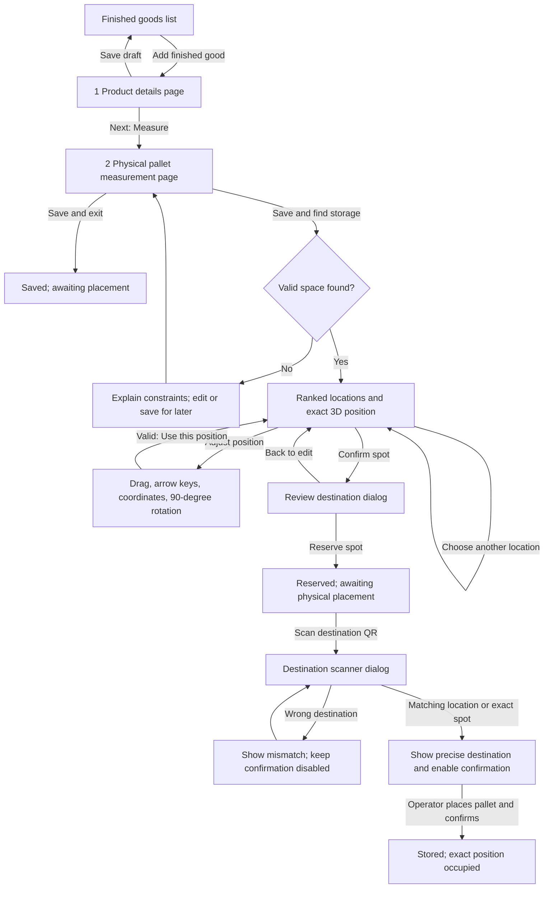
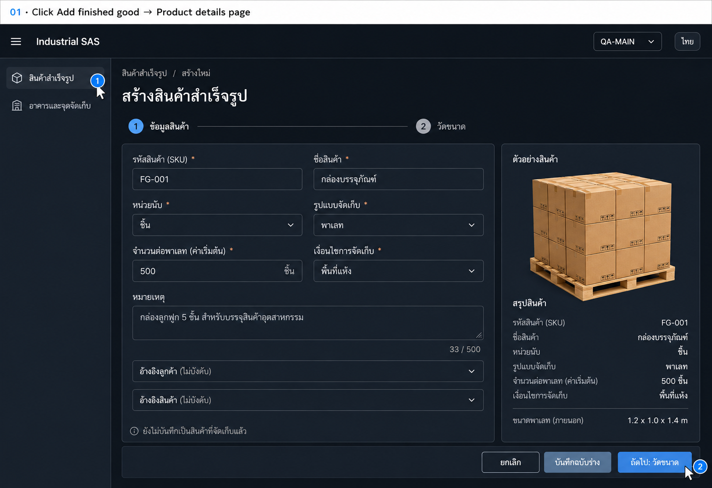
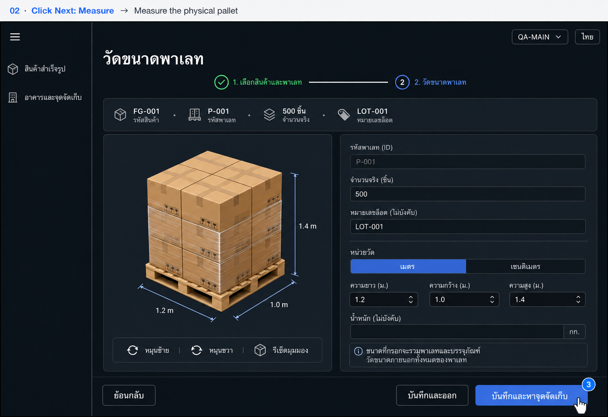
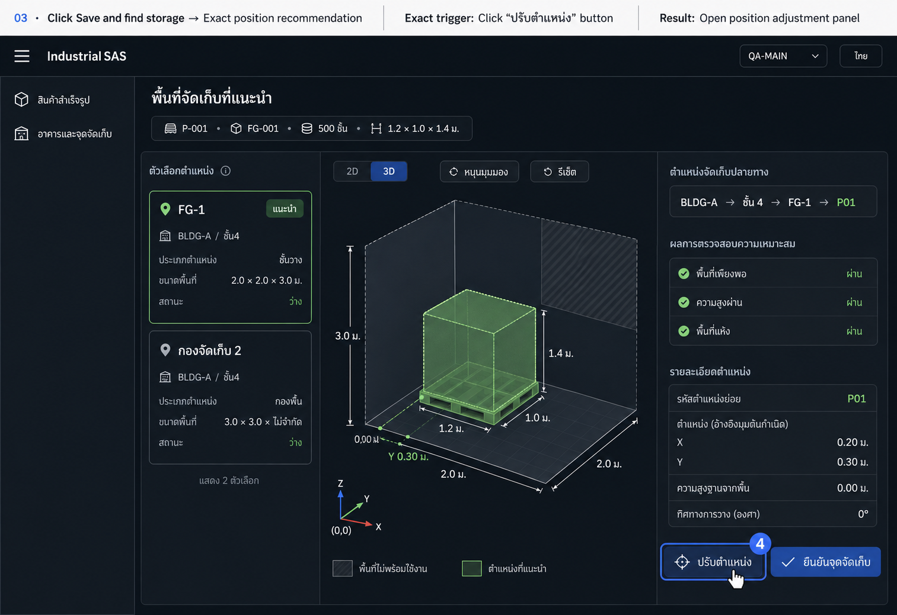
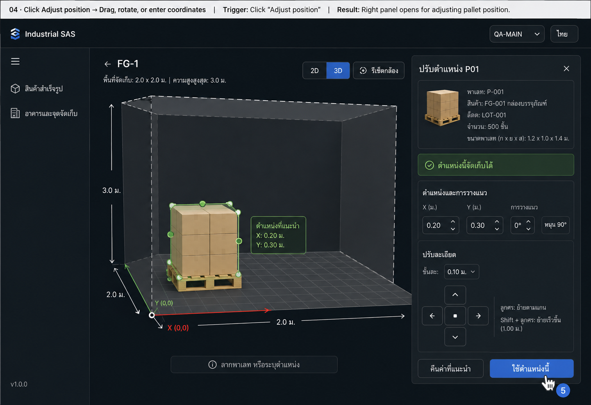
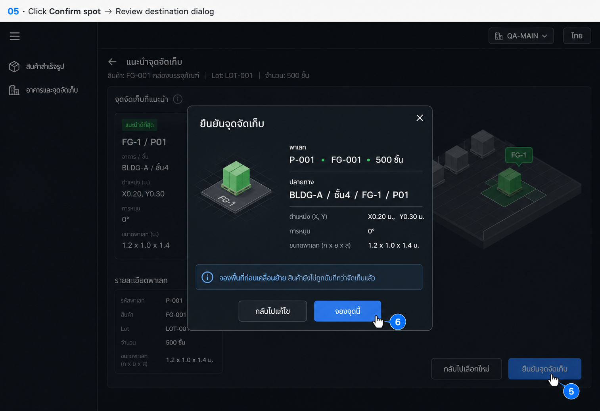
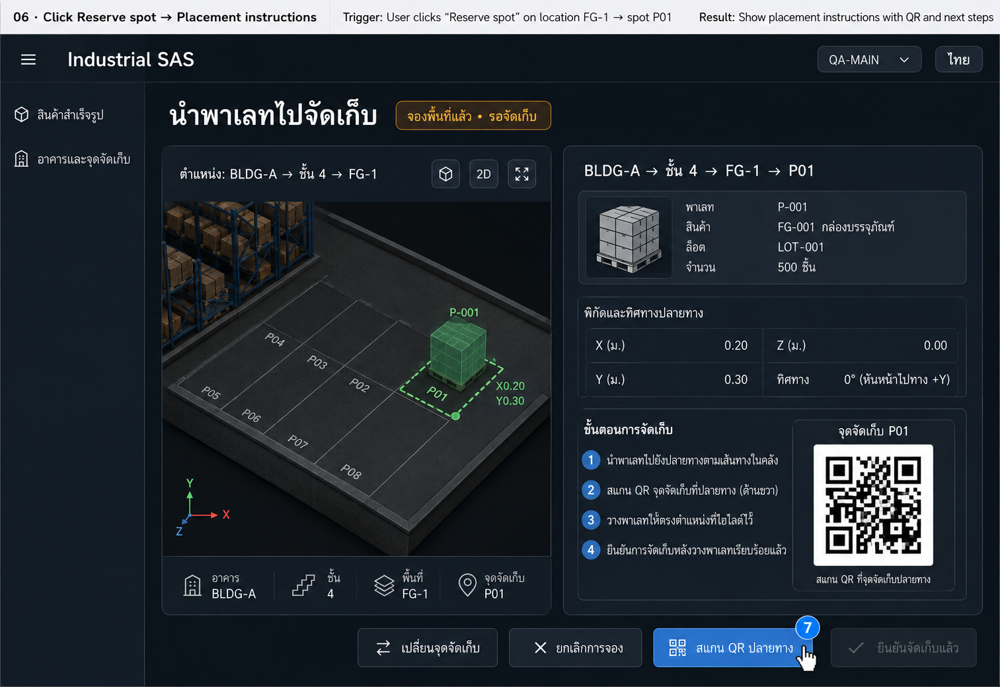
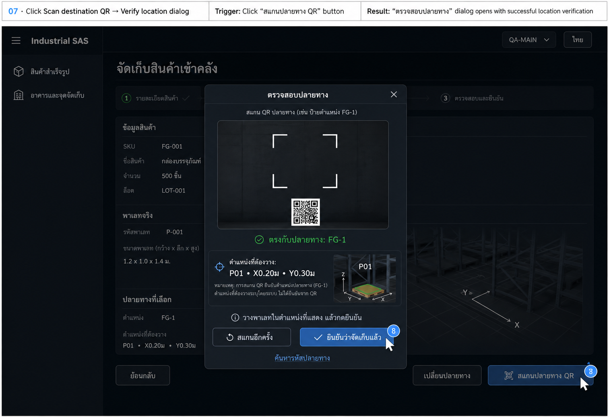
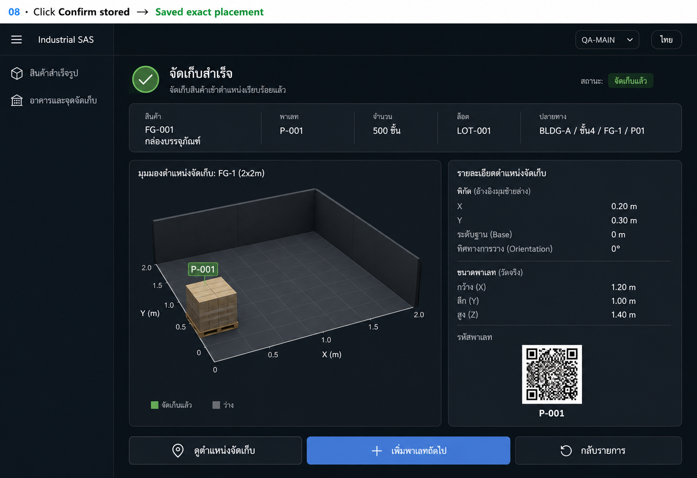

# Finished goods: proposed UI flow

Historical proposal saved before implementation. These generated images are design references, not screenshots of the implemented app. See [the current user flow](flow.md) for implemented behavior.

## Terminology

- **FG-001**: finished-good SKU, product name กล่องบรรจุภัณฑ์.
- **P-001**: one physical pallet containing 500 pieces.
- **FG-1**: existing location name (จุดจัดเก็บ), inside BLDG-A, floor 4.
- **P01**: proposed exact position inside FG-1, with coordinates relative to the marked location origin. Its identity is distinct from the pallet.
- Creation contains two steps. Recommendations and physical placement follow creation.

## Diagram

## Action-by-action screens

| Image | User action                             | Visible result                                                                                               | Saving behavior                                                         |
| ----- | --------------------------------------- | ------------------------------------------------------------------------------------------------------------ | ----------------------------------------------------------------------- |
| 01    | List → **Add finished good**            | Full product-details page, creation step 1                                                                   | Nothing saved simply by opening                                         |
| 02    | **Next: Measure**                       | Validate details; open creation step 2 with pallet ID, actual quantity, optional lot, 3D measurement preview | Persist product and pending pallet draft; Back resumes same records     |
| 03    | **Save and find storage**               | Save valid external dimensions; display ranked locations and exact proposed position in selected location    | Measurements saved; recommendation does not occupy space                |
| 04    | **Adjust position**                     | Open inline right panel; drag, use arrow controls, enter X/Y, or rotate pallet 90°                           | Preview only; **Use this position** returns to recommendation summary   |
| 05    | **Confirm spot**                        | Modal summarizes pallet, location, exact position and measurements                                           | No reservation until **Reserve spot**                                   |
| 06    | **Reserve spot**                        | Revalidate and hold space; show destination, 3D instructions and scan button                                 | Reserved, awaiting storage; not yet stored                              |
| 07    | **Scan destination QR**                 | Scanner modal; on match show FG-1 and exact P01 placement, enable **Confirm stored**                         | Scan verifies destination identity; does not prove physical coordinates |
| 08    | **Confirm stored** after placing pallet | Success and pallet detail with solid occupied footprint                                                      | Atomically mark pallet stored at the reserved position                  |

## Screen details

### 01 — Product details

- Full page, two-step indicator. Not a popup.
- Fields: SKU, product name, counting unit, storage format, default quantity per storage unit, storage conditions, notes, optional customer reference, optional product reference.
- Right: pallet illustration and live summary.
- Footer: **Cancel**, **Save draft**, **Next: Measure**.
- Required fields validate inline. A duplicate SKU offers opening the existing product rather than creating a duplicate.
- Cancel with unsaved edits opens a discard-changes dialog. Save draft returns to list with Draft status.
- A new pallet for an existing product starts at measurement.

### 02 — Measure physical pallet

- Show product identity and a distinct pallet identity. Quantity defaults from the product but is editable; lot is optional.
- Length, width and height are external measurements including pallet and packaging. Weight is optional.
- Metre/centimetre toggle converts existing values; it never reinterprets the same number.
- Left interactive 3D preview; camera rotation and reset do not alter measured dimensions.
- Footer: **Back**, **Save and exit**, **Save and find storage**.
- Missing or non-positive dimensions prevent recommendations. Save and exit keeps incomplete work as a draft.
- Completed measurement does not create a stored inventory placement.

### 03 — Recommend exact storage

- Layout: ranked location list at left, large shared 3D control in center, selected destination and fit details at right.
- Select a location to load its exact best-fitting position. Show breadcrumb Building → Floor → Location → Position.
- Clearly distinguish occupied, held, unavailable and proposed footprints. Only recommend valid available space.
- Show boundary fit, height fit, configured storage-condition compatibility and no overlap.
- Unknown constraint data must be marked unknown; do not show a successful check for unconfigured information.
- Example only: FG-1 = 2 × 2 × 3 m; pallet = 1.2 × 1.0 × 1.4 m; X = 0.20 m, Y = 0.30 m; base Z = 0; orientation = 0°.
- The marked X/Y origin is local to FG-1. The stored placement must also map correctly into its floor.
- Proposed first version places pallets on the floor or a configured supporting surface. Goods-on-goods stacking is outside this proposal.

### 04 — Adjust

- Reuse the existing planner's 3D controls and visual language.
- Object controls: drag along supporting surface, arrows with proposed 0.10 m increments, numeric X/Y, 90° rotation.
- Camera controls are separate: orbit/rotate view, reset, 2D/3D.
- Proposed position is green when valid; red with a specific explanation when outside boundaries, intersecting unavailable space, exceeding height or overlapping another item.
- **Use this position** is disabled for invalid placement. **Reset to recommendation** restores the current recommendation.
- Do not expose free vertical floating placement.

### 05 — Review destination modal

- Show product/pallet/quantity, full destination, exact coordinates, orientation and small 3D preview.
- **Back to edit** closes without changing the reservation state.
- **Reserve spot** validates against current availability and creates the hold atomically.
- If another operator claimed the space, keep the pallet pending, explain the conflict and refresh valid recommendations.

### 06 — Reserved instructions

- Status: **Reserved · Awaiting storage**.
- Large destination and 3D placement guide remain visible.
- **Scan destination QR** opens the scanner modal.
- **Change spot** retains the current hold until the replacement is successfully reserved, then releases the old hold.
- **Cancel reservation** opens a confirmation dialog; confirming releases the hold and returns the pallet to awaiting-placement status.
- Refresh/reopening resumes the reservation. Do not invent an automatic expiration without an agreed operational rule.

### 07 — Verify destination

- Request camera access only when Scan is clicked; allow retry or destination-code lookup if scanning is unavailable.
- Location QR must match FG-1; a position QR, if used, must match the selected position.
- A location-level scan verifies only the location; the precise P01 position remains explicit on the placement guide.
- Wrong code: expected versus scanned destination, retry action, disabled storage confirmation.
- Matching code: green confirmation and **Confirm stored** enabled; operator places the pallet first.
- Manual lookup, if supported, is explicitly shown as manual verification rather than a successful scan.

### 08 — Stored

- After explicit operator confirmation, change held footprint to occupied and show Stored status.
- Show exact destination and the same 3D view with a solid pallet.
- Actions: **View storage position**, **Add next pallet**, **Back to list**.
- Repeated confirmation must not create duplicate quantities or placements.

## Shared state and error rules

- States: Product draft → Pallet awaiting measurement → Pallet awaiting placement → Reserved → Stored.
- No-fit result stays on recommendations: show the pallet dimensions and constraint reasons, offer Edit measurements or Save for later.
- Editing measurements invalidates any old recommendation. After reservation, require changing/releasing the hold before saving dimensions that invalidate it.
- Failed saves keep entered values, show an inline error and allow retry.
- All checks and placements remain scoped to the signed-in organization and authorized warehouse.
- QR graphics have a fixed square background and equal white padding regardless of text length.
- Compact rounded warehouse/language fields and unhighlighted hamburger follow the previous UI changes.
- These mockups illustrate behavior; exact Thai copy and pixel layout are governed by this written plan where generated text differs.

## Generated screens

Image-generation review: some illustrations show shelving or a larger-looking floor, and screen 01 includes example dimensions in its summary. These are visual artifacts, not added requirements: step 1 must show dimensions as unmeasured, and all placement screens must reuse the same actual FG-1 geometry and supporting surface at true scale. Creation remains two steps even if a generated background shows another progress indicator. QR patterns here are illustrative.

### 01-add-finished-good

### 02-measure-pallet

### 03-recommended-exact-position

### 04-adjust-position

### 05-confirm-reservation-dialog

### 06-reserved-destination

### 07-scan-destination-dialog

### 08-stored-success

