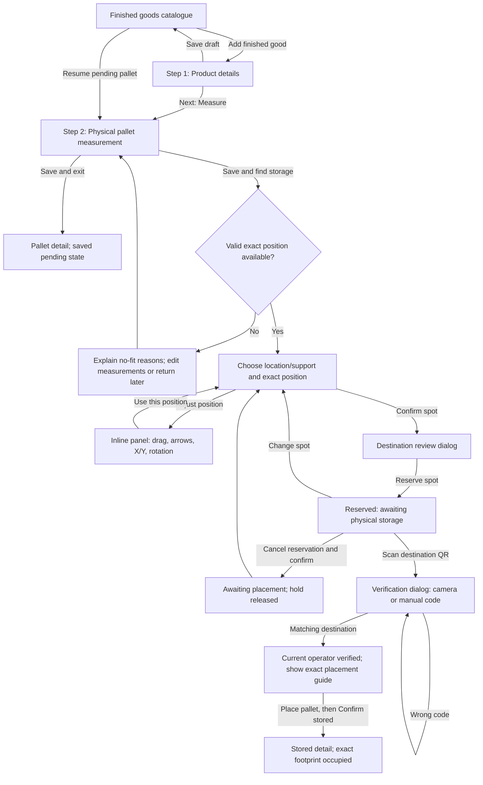

# Finished goods: implemented user flow

Updated 2026-09-06. This document describes the implemented app. The [original proposal](design-proposal.md) and [eight generated concept images](index.html) remain design history; they are not screenshots or evidence of current runtime behavior.

Creation has **two pages**: product details, then measurement of a physical pallet. Exact-position selection, reservation, and physical storage confirmation follow those two pages.

## Terms

| Example          | Meaning                                                                                                       |
| ---------------- | ------------------------------------------------------------------------------------------------------------- |
| `FG-001`         | Product SKU, shared by physical pallets of that product                                                       |
| `P-000001`       | One physical pallet/storage unit, with actual quantity and measured external size                             |
| `FG-1`           | The existing location name, จุดจัดเก็บ, inside a building and floor                                           |
| Shelf label/code | Optional configured support inside that location                                                              |
| `POS-000001`     | A reserved/stored exact position, distinct from both pallet and location                                      |
| X / Y / Z        | Millimetre coordinates relative to the location; X follows width, Y follows length, Z is supporting elevation |

## Diagram

## Click-by-click behavior

| Action                                                          | Page or popup shown                                   | Persisted result                                                     |
| --------------------------------------------------------------- | ----------------------------------------------------- | -------------------------------------------------------------------- |
| Catalogue → **Add finished good**                               | Full product page, step 1 of 2                        | Opening alone creates no record                                      |
| Product → **Save draft**                                        | Return to catalogue                                   | Save incomplete product draft                                        |
| Product → **Next: Measure**                                     | Full measurement page, step 2 of 2                    | Validate/activate product and create one pending physical pallet     |
| Existing product → **Add pallet & measure**                     | Measurement page for a new pallet                     | Create one new physical pallet; reuse the product                    |
| Measurement → back to product → **Return to measurement**       | Resume the same pending pallet                        | Update product if needed; do not create a duplicate pallet           |
| Measurement → **Save and exit**                                 | Pallet detail                                         | Save partial or complete measurements without a reservation          |
| Measurement → **Save and find storage**                         | Recommendations page, or explicit no-fit state        | Save valid measurements; recommendations create no occupancy         |
| Recommendation → **Adjust position**                            | Inline adjustment panel                               | Preview only                                                         |
| Adjustment → **Use this position**                              | Recommendation summary                                | Preview only; invalid positions cannot advance                       |
| Recommendation → **Confirm spot**                               | Destination review dialog                             | No hold yet                                                          |
| Review → **Reserve spot**                                       | Reserved pallet detail and placement guide            | Revalidate and atomically hold the exact volume                      |
| Reserved detail → **Scan destination QR**                       | Verification dialog                                   | Opening alone does not verify or request camera access               |
| Scanner → **Start camera**, or manual destination code → verify | Camera view or manual validation result in the dialog | Record matching verification and its method for the current operator |
| Verified dialog → **Confirm stored**, after physical placement  | Stored pallet detail                                  | Atomically mark the existing reserved position occupied              |

## 1. Product details

Enter SKU, name, counting unit, storage format, default quantity per storage unit, storage condition, notes, and optional customer/product references. The right-hand illustration and summary update with the form. The illustration intentionally has no invented dimensions; measurements belong to step 2.

A draft can be incomplete. Advancing requires valid product fields. A duplicate normalized SKU offers **Open existing product**. Explicit Cancel with unsaved edits opens a discard dialog. Refresh recovery is scoped to the signed-in user and warehouse. Successful writes use retry identifiers to avoid duplicate product or pallet creation.

Existing products remain editable subject to authorization and occupied-stock constraints. Changing storage requirements while that product has reserved/stored pallets is refused; equivalent condition spelling and descriptive edits remain possible. A resumed pallet must belong to the selected product and still be pending measurement/placement.

## 2. Measure a physical pallet

The header identifies both product and pallet. Enter actual quantity, optional lot, external length/width/height including packaging and pallet, and optional weight. Switching metres/centimetres converts values. The 3D preview responds to valid dimensions; camera rotation does not rotate or change the measured object. Empty/invalid measurements show an unmeasured placeholder without fabricated numeric labels.

**Save and exit** allows an incomplete draft. **Save and find storage** requires all three positive valid external dimensions. Measurements are stored as integer millimetres. A complete measurement moves the pallet to awaiting placement; it does not mark stock stored. Reserved measurements require releasing the reservation first, and stored measurements are read-only.

## 3. Select and adjust an exact position

The recommendation page lists eligible location/support options, with support label/code and elevation where configured. A shared 2D/3D scene shows the selected location at actual scale, reserved/stored pallets, excluded areas, and the proposed pallet. The destination summary distinguishes building, floor, location, support, and exact coordinates.

The proposed footprint must fit within the selected support, height clearance, and usable location geometry, with no volume overlap. Known storage-condition mismatches are excluded. Unconfigured conditions are visibly unknown. Product **No special condition** is compatible with any known configured condition.

**Adjust position** exposes X/Y in metres and the existing scene controls: drag on the support plane, arrow keys in 0.10 m increments, and 90-degree object rotation. Separate view controls rotate the camera, reset it, or switch 2D/3D. Invalid placement shows its reason and cannot advance. **Reset to recommendation** restores the candidate. Z stays on the selected floor or configured support; users cannot float the pallet vertically.

No-fit, no-active-location, unavailable-support, and changed-geometry states explain why placement cannot proceed and offer the relevant navigation. They do not fabricate a valid location. A reservation rechecks current geometry and occupancy even if the preview was valid earlier.

## 4. Review and reserve

**Confirm spot** opens a dialog summarizing pallet, quantity, destination, exact coordinates, and orientation. **Back to edit** closes it without a write. **Reserve spot** performs the authoritative transaction. A conflict preserves pending work and displays an error so availability can be reconsidered.

Reserved detail shows an amber held pallet and “awaiting storage” wording. **Change spot** retains the old hold until a valid replacement is reserved atomically. **Cancel reservation** requires a dialog confirmation, then releases the hold and returns the pallet to awaiting placement. Holds persist across refresh and have no automatic expiry.

## 5. Verify destination and confirm physical storage

Camera access begins only with **Start camera**. The operator can instead use the explicitly labeled manual destination-code method. A valid code is the chosen location QR, the chosen configured support QR, or the reserved exact-position QR. Manual entry also accepts the corresponding exact human-readable codes. The location display name alone is not an identity code.

A mismatch shows the backend refusal and leaves storage confirmation disabled. A failed verification clears previous verification. A matching code records SCAN or MANUAL and enables confirmation for that operator. Another operator must verify for themselves, including after switching accounts. Refresh preserves the same operator's successful verification.

A location-level QR confirms location identity; it cannot prove the pallet's physical X/Y coordinates. The exact placement guide remains visible. The operator places the pallet and explicitly selects **Confirm stored**. The server rechecks destination availability and commits the existing placement; repeated confirmation cannot create a duplicate placement or quantity.

## 6. Stored and planner visibility

Stored detail shows a solid pallet with stored status, exact position, QR identity, and destination. **View storage layout** opens the floor planner; **Add next pallet** returns to the product to start another physical unit; **Back to list** returns to the catalogue. Occupied footprints and exact position details appear in the existing location planner. Geometry changes that would invalidate held/stored placements are refused.

## Shared states and access

- Products: `DRAFT` or `ACTIVE`. Physical pallets: `AWAITING_MEASUREMENT`, `AWAITING_PLACEMENT`, `RESERVED`, `STORED`. Placement history: `RESERVED`, `STORED`, `RELEASED`.
- All queries and mutations enforce organization and warehouse scope. Read-only users can inspect details but cannot create, measure, reserve, verify, or confirm storage.
- Empty catalogue states offer the permitted next step. Missing/inaccessible records avoid presenting editable data. Failed saves retain form input and provide a retry path.
- Local form recovery is per operator/warehouse/record; saved workflow states are backend records. This is not a full offline mode.
- Responsive layouts support desktop and mobile. QR surfaces remain fixed squares with equal white padding. Header selectors are compact rounded fields, and the sidebar uses an unhighlighted hamburger control.
- Physical camera hardware has not been exercised in this development run. Mocked scanner tests and manual verification are separate evidence; consult the QA records for completed browser checks.

See [implementation notes](implementation-notes.md) for validation bounds, transaction decisions, and scope limits.
