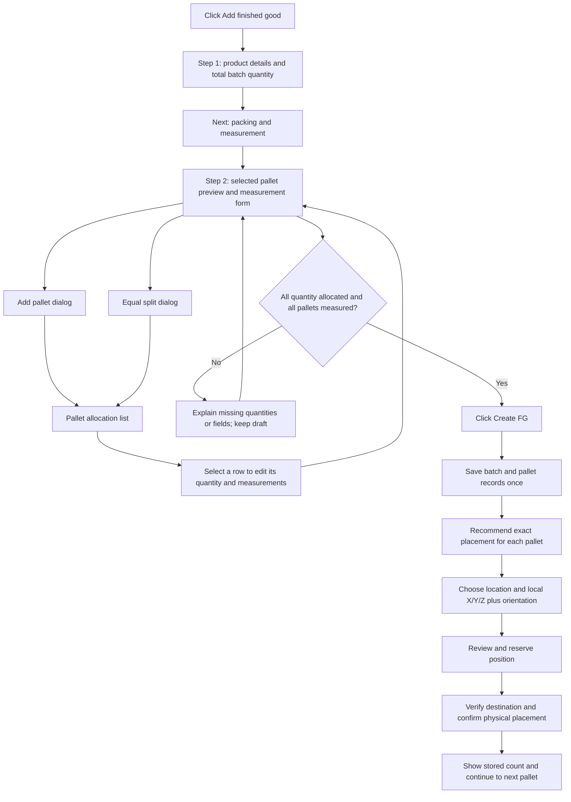

# Next plan: packing and measurement for multiple pallets

Status: proposed UI flow; implementation has not started. Based on the user's latest reference and the current P-000004 measurement screenshot.

## What is missing

The current screen measures one physical pallet. The reference manages a finished-goods batch across several pallets before creation completes. Its header shows a total quantity of 1,000 pieces, with two pallets allocated 500 pieces each.

The current screenshot also has no height entered. Length is 20 cm and width is 100 cm. A true-scale three-axis preview cannot be completed until height is supplied. Do not silently replace 20 cm with the reference's 1.2 m: these are different measurements.

Missing from the reference comparison:

- A total batch quantity distinct from the product's default quantity per pallet.
- Add pallet, equal split, pallet selection, and editable/removable pallet rows.
- Allocated / total / remaining quantity and creation validation.
- A selected-pallet packing-format field and per-pallet measurements.
- A recognizable pallet base, carton surfaces, stretch-wrap/straps, a dashed outer envelope, and readable dimension arrows around the preview.
- A consistent viewer toolbar with 2D/3D, orbit/pan/zoom, fit view, reset, and an expanded view.
- A completed first-step checkmark, packing-and-measurement second step, and a final Create FG action.

## Proposed flow

Creating FG saves the batch and its measured pallets. Stock is shown as physically stored only after the existing destination-verification and placement-confirmation flow.

## Exact UI actions

| Action | Display and behavior |
| --- | --- |
| Open Step 2 | Header shows SKU, product name, total batch quantity, and completed Step 1. First pallet selected. Desktop: preview left, form right, allocation list below, actions at bottom. |
| Click Add pallet | Small dialog for quantity and packing format. Show remaining quantity. Add creates and selects a draft pallet row with measurements pending. |
| Click Equal split | Dialog asks for number of pallets and previews the quantities before applying. Example: 1,000 / 2 → 500 + 500. Explain whether existing draft rows will be replaced; preserve them until confirmation. |
| Select a pallet row or its Edit action | Highlight the row and load that pallet into the viewer and form. Save the previous row's draft edits while switching. |
| Change quantity or dimensions | Update selected row, totals, and viewer immediately. Retain unsubmitted values across refresh. |
| Copy measurements to other rows | Explicit action only. Mark copied values as needing confirmation; do not imply every pallet has been independently measured. |
| Click Delete pallet | Confirm which draft pallet is removed and how much quantity returns to Remaining. Never delete existing reserved/stored pallets through this UI. |
| Click Back | Return to product details with draft pallet allocation preserved. Changing total quantity revalidates the allocation. |
| Click Save draft and exit | Persist the unfinished batch and return to the catalogue with a Resume action. |
| Click Cancel | If changed, confirm discard; otherwise return directly. |
| Click Create FG | Enabled when allocation matches total and every pallet has valid quantity, format, length, width, and height. Weight remains optional. Prevent duplicate creation during loading/retry. |
| Creation succeeds | Open storage planning with a pallet queue and per-pallet status. Each recommendation identifies the location plus exact placement inside it. |

## Viewer behavior

- Use one shared viewer for measurement and exact-location placement. Preserve the same camera and interaction vocabulary across both steps.
- Before complete measurements: neutral illustrative pallet and a specific prompt such as “Enter height to show the measured size.” Missing values are not a red collision/error state.
- After complete measurements: actual outer length, width, and height, including pallet base and packaging. Dimension labels sit outside the object and remain legible on mobile.
- Packaging details are illustrative unless actual carton dimensions and packing rules exist. Do not infer carton count or a proven packing arrangement from piece quantity alone.
- Rotating the camera never changes physical orientation or measurements. Rotating a pallet for placement is a separate, clearly labeled action.
- Keep dimension units synchronized between the form, viewer, and table. Converting units preserves the physical size.

## Allocation rules and states

- Show “Allocated 1,000 / 1,000 pieces” and “Remaining 0” beneath the rows. Over-allocation is explicit and blocks creation.
- Split using the unit's supported precision. For whole pieces, 1,001 split across two pallets becomes 501 + 500; never lose a remainder or create fractional pieces silently.
- All quantities must be positive. Dimensions must be positive and within supported limits. Show field-specific errors next to the selected pallet and an error marker on any other invalid row.
- Keep a batch draft separate from the product catalogue record. Reuse an existing product without creating a duplicate SKU.
- Save batch creation atomically with idempotent retries. Draft row IDs remain stable while editing; final pallet codes are assigned once.
- Recommendations consider stored pallets and active reservations. Reserving one pallet updates the available space for the remaining queue.
- If some pallets do not fit, show the affected pallets and recovery actions while retaining other valid reservations.

## Mobile layout

Use a compact selected-pallet switcher, then the measurement form and collapsible viewer. Render allocation rows as cards with quantity, dimensions, validation state, and edit/remove actions. Keep totals and the primary action easy to reach. Dialogs must fit narrow screens without horizontal overflow.

## Implementation order

1. Batch draft and allocation state, separate total quantity from per-pallet defaults.
2. Two-step UI, add/split dialogs, selectable allocation rows, totals and validation.
3. Shared viewer improvements and truthful incomplete-measurement state.
4. Atomic creation, refresh recovery, and per-pallet storage-planning queue.
5. Desktop/mobile review, full-flow tests, and refreshed screenshots/video.

## Verification

Cover one pallet, multiple pallets, unequal quantities, odd-number splits, decimal units, zero/negative values, under/over-allocation, missing dimensions, unit conversion, optional weight, row switching, remove/cancel, total-quantity changes, duplicate SKU, refresh and back navigation, interrupted creation/retry, two-operator reservations, partial no-fit queues, read-only users, warehouse changes, and 320/390 px mobile layouts.

Do not restore the removed organization label or the removed search/filter background as part of matching the reference.
