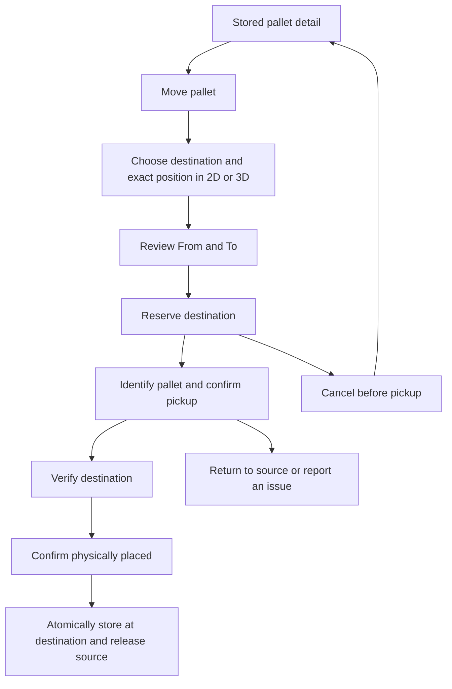

# Move a stored pallet — proposed flow

Status: plan only, 2026-09-06. No application behavior changed.

## Current gap

The stored pallet detail footer currently offers the layout and another pallet. Storage routing excludes STORED pallets, and reserve/cancelReservation refuse ALREADY_STORED. A relocation therefore needs its own transaction, rather than resetting a stored pallet to an unmeasured or unplaced state.

## UI entry and actions

1. On a stored pallet detail page, add a prominent **Move pallet / ย้ายพาเลท** action next to View storage layout. Use a move icon with an accessible name and tooltip if the chosen design uses icon-only buttons. Users with read access only see move progress/history, not mutation actions.
2. Click opens a dedicated move workspace. Header shows pallet ID, product, quantity and current location. Keep the source visible in a compact card throughout. Default search stays in the current warehouse; include same-location repositioning and other locations/floors/buildings in that warehouse.
3. Reuse the existing recommendation and exact-position editor: select destination, drag/snap or enter local X/Y, choose allowed support/base Z and physical rotation. Camera rotation remains separate from physical rotation. In the same location show the source footprint outlined and the proposed destination in blue; other occupied/reserved space remains blocked.
4. **Review move** opens a dialog with From → To, both full location paths, both X/Y/Z coordinates and rotations, pallet dimensions/quantity and an optional reason. An unchanged destination is a no-op and cannot be submitted.
5. **Reserve destination** creates one move and holds the new position. The old position stays occupied. Detail page shows “Move prepared”, source, destination, Resume move and Cancel move. Booking a destination never claims that physical movement happened.
6. **Start move** requires identifying this pallet by QR or explicit manual code, and the operator confirms it has been picked up. Show “Moving” and clearly label the source as last confirmed position, not current physical whereabouts. Both spaces remain blocked conservatively.
7. At the destination, scan its QR or use explicit manual verification. Show the destination-local coordinates and orientation beside the verification controls. A location QR identifies the location; it does not prove the pallet is at the exact coordinates.
8. **Confirm placed here / ยืนยันวางแล้ว** requires successful destination verification by the current operator and a physical-placement acknowledgement. Recheck space and geometry and commit the relocation atomically. Show success, new location/QR and a compact movement history row.

## Data and occupancy rules

- Add a dedicated `finishedGoodsMoves` record: tenant/warehouse/pallet, source placement ID and revision, target placement ID, state, actor, optional reason, verification details, timestamps and idempotency identity. Index by pallet and state and by warehouse for pending moves.
- Proposed move states: RESERVED → IN_TRANSIT → COMPLETED; RESERVED → CANCELLED; IN_TRANSIT → RETURNED only after explicit physical return confirmation. Record issues while retaining both holds until resolved.
- Keep the current source placement STORED and a separate target placement RESERVED until completion. Expose the active move alongside pallet details so a pallet in transit is never presented as simply “stored successfully”.
- Only one active move per pallet. The source placement and pallet measurements cannot be edited while a move is active. Saved packing quantity, SKU/product identity, lot and pallet QR stay unchanged. Position identity changes to the destination's exact position.
- Recommendation/collision checks may exclude the moving pallet's own source footprint for same-location repositioning. Do not exclude other pallets or reservations. Source and target holds must both block unrelated operations; avoid counting the same physical pallet twice in pallet/quantity totals or reporting overlapping footprints as additive used area.
- Completion atomically sets target STORED, source RELEASED, pallet placementId to target and move COMPLETED. Preserve old placement/move history. Never release source in a separate earlier write.
- Continue using occupancy protections to block geometry/archive changes affecting either held position. Revalidate source revision, target geometry/status, fit, storage conditions, reservations and operator ownership before completion.
- Use explicit monotonic revisions or immutable source identity checks to reject stale moves. All mutations have idempotent retries and tenant/warehouse permission checks. Fresh verification belongs to this move, target revision and current operator; old destination verification cannot be reused.
- Z follows supported base/elevation rules. Do not introduce arbitrary pallet-on-pallet stacking or claim to plan a collision-free forklift travel path.

## Cancellation, interruption and failure

- Before pickup: cancel releases only the destination reservation, preserving source stock. Changing destination swaps target reservations atomically and clears prior destination verification.
- After pickup: no ordinary “Cancel” that silently restores source. Offer **Return to source**, require source verification and confirmation of physical return, then release target. If neither move nor return can be completed, retain holds, show a visible issue and allow resumption.
- Refresh/back/navigation: reload the active move from the server. Resume the same move rather than creating another. Persist an uncertain request identity; disable conflicting commands until its outcome is known.
- No fitting destination: keep source intact; show reasons and allow another location or exit. Wrong pallet/destination scan: show the mismatch and allow retry without changing occupancy.
- Another operator: show the current move owner. Do not permit a second move or reuse another operator's verification. Ownership handover, if later needed, must be explicit and audited.
- Connection loss, duplicate clicks and changed destination: retain previous valid state and offer safe retry. Do not automatically expire a hold after pickup.

## Scope and implementation order

Initial version supports moving one stored pallet within its warehouse, including an exact reposition inside its current location. Cross-warehouse transfer requires a separate receiving/transfer workflow and is excluded from this first version.

1. Move domain/state rules, indexed schema and atomic reserve/start/verify/confirm/cancel/return commands.
2. Extend getPallet with active move and move history; adapt occupancy views to show source and target holds accurately.
3. Add the stored-page action and reuse exact storage controls for the move workspace and review dialog.
4. Add pallet/destination identification, physical pickup/placement acknowledgement, owner/resume/return/error states.
5. Validate desktop and mobile; capture actual UI evidence and run the complete source-to-destination and return flows.

## Required tests

- Move within same spot, rotate in place, move to another spot/floor/building; reject unchanged pose and unsupported cross-warehouse references.
- Preserve pallet ID, lot, quantity and packing group; append history; source released only after final success.
- Boundary/height/support/condition checks, overlapping self-source reposition, collision with another pallet, collision with another move's target, exact occupancy totals.
- Concurrent moves on the same pallet and competing destinations; atomic target replacement; stale source/measurement/target revision; archive/geometry changes during a hold.
- Wrong pallet scan, wrong location QR, correct location but explicit coordinate acknowledgement still required, manual verification and different-operator verification.
- Cancel before pickup, return after pickup, unresolved physical move, refresh at every step, request replay/conflicting retries and network failures around commit.
- Empty/no-fit/error/read-only states, direct navigation, back, keyboard focus, icon tooltips, 390 px mobile and desktop; no console errors.

Implementation touchpoints: `convex/finishedGoods/workflow.ts` and/or a dedicated moves module; `convex/model/finishedGoods/placement.ts`; `convex/schema.ts`; `src/lib/convex/finishedGoodsApi.ts`; `PalletScreens.tsx`, `PalletScene.tsx` and `DestinationScanner.tsx`; storage occupancy/catalogue projections and integration tests.
