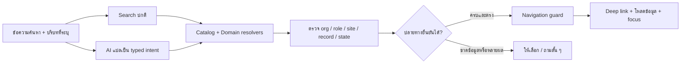

# Global Search และ AI navigation

วันที่: 2026-10-09  
สถานะ: implement Phase 1–2 พร้อม audit/fix ในเครื่องแล้ว; Phase 3 ยังเลื่อนไว้ และยังไม่เปิด PR  
ที่มา: annotation `preview-annotation_annotation_2` บน sidebar ของ `/th/hr/review`

ผลตรวจจริงและข้อจำกัดล่าสุด: [Independent validation](../reviews/global-search-independent-validation-2026-10-09.md) · [Kiro implementation review](../reviews/global-search-implementation-2026-10-09.md)

## ข้อเสนอ

เพิ่มจุดค้นหากลางใน sidebar ใช้ได้ทุกหน้าของแอป ค้นทั้งเมนู หน้าย่อย และรายการที่ผู้ใช้มีสิทธิ์เข้าถึง พร้อมปุ่ม **AI Search** สำหรับบอกงานด้วยภาษาไทย เช่น “ลืมลงเวลาเมื่อวาน” แล้วพาไปยังวันนั้นและส่วนส่งคำขอแก้เวลา

ส่งเป็น 3 phase: **Search + deep links → AI navigation สำหรับ HR → ขยายการค้นรายการไปโมดูลคลังสินค้า** ทุก phase ใช้ทะเบียนปลายทางและตัวตรวจสิทธิ์ชุดเดียวกัน เริ่มด้วยหน้าของทุกโมดูล แต่ค้นข้อมูลรายรายการและ AI จาก HR ก่อน ตามงานที่กำลังใช้อยู่

AI มีหน้าที่แปลความต้องการเป็นงานที่แอปรองรับ ระบบค้นและยืนยันรายการจริง แล้วเปิดหน้า เลือก record และ focus ส่วนที่เกี่ยวข้อง การกรอก บันทึก รับรอง เปิดฉบับใหม่ และส่งออกดำเนินผ่าน flow เดิมของหน้าปลายทาง

## สิ่งที่ตรวจพบในโค้ดก่อน implementation

| สิ่งที่มีอยู่                                                                                                                                                             | ผลต่อแผน                                                                                                               |
| ------------------------------------------------------------------------------------------------------------------------------------------------------------------------- | ---------------------------------------------------------------------------------------------------------------------- |
| [Navigation registry](../../src/lib/navigation.ts) มี 11 เมนู พร้อม permission และ path helpers ของ HR day/period, product, batch, pallet, building/floor และแก้ unit     | ใช้เป็นฐานของ destination catalog ขยาย metadata แทนเขียน route ซ้ำใน search                                            |
| [Sidebar](../../src/components/examples/c-sidebar-2.tsx) รวม grants ของ HR และ storage แยกกัน                                                                             | Search ต้องใช้ได้สำหรับสมาชิก HR-only แม้ storage access ถูกปฏิเสธ                                                     |
| [ReviewScreen](../../src/features/hr/ReviewScreen.tsx) เก็บ employee/date, ช่วงวันที่, site และ tab ใน React state                                                        | การเปิด `/hr/review` อย่างเดียวเลือกคำขอให้ไม่ได้ ต้องเพิ่ม URL contract                                               |
| [EmployeesScreen](../../src/features/hr/EmployeesScreen.tsx) เปิด editor ด้วย state                                                                                       | ต้องมี deep link เพื่อเปิด editor ของ employee ที่ยืนยันได้                                                            |
| [DayScreen](../../src/features/hr/DayScreen.tsx) และ [period detail](../../src/features/hr/PeriodDetailScreen.tsx) มี dynamic route แล้ว แต่ period version ยังเป็น state | เพิ่ม stable focus target และ URL version โดยรักษา validation และสถานะล็อก                                             |
| [SettingsScreen](../../src/features/hr/SettingsScreen.tsx) มี Holidays / Access / Policy ในหน้าเดียว                                                                      | ลงทะเบียนแต่ละส่วนเป็นผลค้นหาได้ แม้ไม่อยู่ในเมนูหลัก                                                                  |
| [HR server scope](../../convex/hr/shared.ts) ตรวจ site, reporting relationship และห้าม self-review; queries เดิมมีขอบเขตและ completeness                                  | Search ต้องตรวจ scope เดียวกันก่อนคืนชื่อ/รหัส/สถานะ/count และแสดงผลไม่ครบอย่างชัดเจน                                  |
| [Employee schema](../../convex/schema.ts) มี org/code, site/code และ supervisor indexes; ยังไม่มี full-text index                                                         | ใช้ exact code lookup ก่อน ทดสอบชื่อไทยก่อนเพิ่ม derived field/index                                                   |
| [Job scan AI](../../convex/finishedGoods/jobScans.ts) เรียก OpenRouter ฝั่ง server พร้อม structured output อยู่แล้ว                                                       | ใช้แนวทาง provider configuration เดิมได้ แต่ต้องมี HR entrypoint; credential/model capability ของ search ยังไม่ได้ตรวจ |
| [Storage navigation guard](../../src/features/storageLayouts/useWorkspaceNavigationGuard.tsx) ดัก link และกำหนดให้ programmatic transitions ผ่าน `requestTransition`      | Search/AI navigation ต้องร่วม guard; `router.push` จาก shell โดยตรงอาจข้ามการป้องกัน draft                             |

การสำรวจก่อน implementation ตรวจหน้า `/th/hr/review` ใน collaborative preview แบบอ่านอย่างเดียว: sidebar กว้าง 256 CSS px, ตอนนั้นไม่มีช่องค้นหา และรายการที่เลือกยังไม่ปรากฏใน URL ผลทดสอบฟีเจอร์ที่เพิ่มแล้วอยู่ในรายงาน validation ด้านบน

## UX ที่ต้องได้

### จุดเปิดค้นหา

- Sidebar แบบเต็ม: วางแถว “ค้นหา…” พร้อม `⌘K`/`Ctrl+K` ใต้ชื่อแอป เหนือรายการโมดูล อยู่ในส่วนที่ไม่เลื่อนหายพร้อมเมนู มีปุ่ม **AI Search** แยกชัดเจนด้านล่าง ใช้ความกว้าง sidebar ปัจจุบันได้
- Sidebar แบบย่อ: ไอคอน search และ AI พร้อม tooltip/accessible name
- มือถือ: ปุ่มค้นหาใน header เปิด dialog เต็มพื้นที่ที่เหมาะกับ keyboard โดยมี AI Search อยู่ใน dialog เดียวกัน ไม่ต้องเปิดเมนูก่อน
- Shortcut เปิด dialog; ลูกศรเลือกผล, Enter เปิดผล, Escape ปิด, คืน focus ไปจุดเปิด ปุ่ม AI เป็นปุ่มปกติแยกจากตัวเลือกผลค้นหา

### Search ปกติ

เปิด dialog แล้วเห็นช่อง “ค้นหาเมนู หน้าย่อย หรือรหัสรายการ” และปุ่ม “AI Search” ใช้ข้อความเดียวกันได้ แสดงผลเป็น 3 กลุ่ม: **หน้าและส่วนงาน / รายการ / งานที่ทำได้** โดยใช้ UI เดียวสำหรับ desktop/mobile

แต่ละผลมีชื่อ, breadcrumb, รหัส/วันที่/site เท่าที่จำเป็น และข้อความ action เช่น “เปิดฟอร์มแก้ตารางงาน” ทำให้แยกชื่อซ้ำได้ ไม่ flatten ชื่อหน้าจนดูไม่ออกว่าอยู่โมดูลไหน ใช้ label ภาษาไทย/อังกฤษและคำพ้องที่ทีมตรวจ เช่น “ลงเวลา”, “เข้างาน”, “แก้เวลา”, “วันหยุด”, “CSV”

Ranking ที่เสนอ: รหัสตรง > ชื่อตรง > ชื่อขึ้นต้น > คำพ้อง/ส่วนของข้อความ > typo match สำหรับชื่อเมนู ภาษาไทยเก็บสระ/วรรณยุกต์ไว้; หลีกเลี่ยง normalizer ที่ลบทิ้งแล้วรวมชื่อคนผิด ข้อมูล inactive แสดงสถานะชัดเจนและไม่ซ่อนเมื่อระบุรหัสตรง ถ้าหน้าปลายทางอนุญาตให้เข้าถึง

Search ปกติทำงานได้โดยไม่เรียก model; backend หายหรือ query ล้มเหลวต้องแยก “ค้นข้อมูลไม่ได้” ออกจาก “ไม่พบ” และยังใช้ผลเมนูที่ยืนยัน grants แล้วได้ ไม่ทำ request ทุกตารางเมื่อผู้ใช้ยังไม่เปิด search

### AI Search

เมื่อกดปุ่ม ให้แสดงตัวอย่าง 3 ข้อและบริบทที่ใช้ เช่น “กำลังดู: HR › ตรวจคำขอ › EMP-003 › 8 ต.ค. 2569” ผู้ใช้มองเห็นและล้างบริบทได้ ข้อความ “ตรงนี้” ใช้ record ที่เลือกผ่านข้อมูลของหน้า ไม่อ่าน DOM/ภาพหน้าจอทั้งหน้า

1. แปลข้อความเป็น intent ที่ระบบรองรับ และข้อมูลอ้างอิง เช่นรหัสพนักงาน วันที่ หรือส่วนของฟอร์ม
2. ค้นและตรวจรายการผ่าน domain resolver ที่ตรวจสิทธิ์ฝั่ง server
3. **ปลายทางครบและตรงแน่นอน** เช่นวันของตัวเองหรือรหัสพนักงานตรงหนึ่งรายการ → ไปทันที พร้อม breadcrumb แจ้งปลายทางสั้น ๆ
4. ขาดวันที่/พนักงาน/site หรือมีชื่อซ้ำ → ถามสั้น ๆ ใน dialog หรือให้เลือกผล ไม่พาไปตามคะแนนที่ model ประเมินเอง
5. ไม่พบ/สิทธิ์ไม่ผ่าน/ผลค้นยังไม่ครบ → อยู่ใน dialog และให้ปรับคำค้น ข้อความต้องไม่ยืนยันว่ารายการที่ผู้ใช้ไม่มีสิทธิ์มีอยู่

ปลายทางเลื่อนไปยัง heading/form ที่กำหนด และ focus หลังข้อมูลพร้อม ทำงานกับ scroll container ของหน้าและ panel จริง แสดง highlight สั้น ๆ รองรับ reduced motion; บนมือถือเปิด detail view พร้อมปุ่มกลับ ผล AI เก่าต้องถูกทิ้งเมื่อ query, organization, account หรือบริบทที่เลือกเปลี่ยน

## ตัวอย่างที่ใช้เป็น acceptance cases

| ข้อความ                                                        | ปลายทาง/พฤติกรรม                                                                                                        |
| -------------------------------------------------------------- | ----------------------------------------------------------------------------------------------------------------------- |
| “ตั้งวันหยุด”                                                  | HR Settings → Holidays panel                                                                                            |
| “ลืมลงเวลาเมื่อวาน”                                            | วันก่อนหน้าตาม timezone องค์กร → ส่วนส่งคำขอแก้เวลา; ถ้ามี pending/locked แสดงสถานะนั้น                                 |
| “แก้ตารางงาน EMP-DEMO-003”                                     | HR Employees → editor ของรหัสตรง → ส่วน schedule ถ้ามีสิทธิ์ admin และ site scope                                       |
| “ตรวจคำขอ EMP-DEMO-003 วันที่ 8 ต.ค. 2569”                     | Review → employee/date ที่ตรวจได้ → ส่วนคำขอถ้ามี; ถ้ารับรองแล้วแสดงผลรับรองแทน                                         |
| “พาไปตรงที่ต้องแก้ของรายการนี้” ใน Review ที่เลือกหนึ่ง record | ใช้ employee/date ที่เลือก → pending decision หรือ disposition form ตามสถานะจริง; ไม่มี record ที่เลือกต้องให้เลือกก่อน |
| “ส่งออกงวด 19–25 ก.ย. 2569”                                    | ค้นงวดตามช่วงวันที่และ site → version ที่ยืนยัน → ส่วน export; หลาย site ให้เลือก, ถ้า DRAFT แสดงว่าต้องปิดงวดก่อน      |
| “แก้เวลาสมชาย”                                                 | ถามวันและเลือกพนักงานที่อยู่ใน scope; ไม่เลือกคนจากชื่ออย่างเดียว                                                       |
| “อนุมัติ OT”                                                   | แจ้งว่างานนี้ยังไม่รองรับใน HR Phase 1 และเสนอปลายทางที่มีจริงอย่างชัดเจน                                               |

วันที่ “วันนี้/เมื่อวาน” ใช้ clock/timezone ฝั่ง server ขององค์กร รองรับเลขไทยและปี พ.ศ./ค.ศ. ที่ระบุชัดเจน ถ้าปีหายหรือข้อความคลุมเครือ ต้องแสดงวันที่ตีความแล้วหรือถามก่อน; กะกลางคืนใช้ business date เดิม ไม่แยกกะตามวันของเวลาออก

## Destination contract และ deep links

ตารางนี้เป็น **URL ที่เสนอเพิ่ม** ไม่ใช่ความสามารถที่มีครบแล้ว Prefix locale มาจาก `src/i18n/navigation.ts`; ไม่ hardcode `/th` ใน builders

| Destination             | ตัวอย่าง URL ที่เสนอ                                      | การเปิดหน้า                                                                            |
| ----------------------- | --------------------------------------------------------- | -------------------------------------------------------------------------------------- |
| วันของตนเอง/คำขอแก้เวลา | `/hr/time/2026-10-08?focus=correction`                    | โหลด self detail ก่อน เปิด form เฉพาะเมื่อสถานะอนุญาต                                  |
| ตรวจวันของทีม           | `/hr/review?employee=<id>&date=2026-10-08&focus=decision` | โหลด detail โดยตรงแม้อยู่นอกช่วง default; ตั้ง range/tab ตามข้อมูลจริงโดยไม่ขยายสิทธิ์ |
| แก้พนักงาน              | `/hr/employees?employee=<id>&mode=edit&focus=schedule`    | query employee-by-id ที่ตรวจ admin/site แทนพึ่ง employee ที่อยู่ใน list page แรก       |
| งวด/version             | `/hr/periods/<id>?version=4&focus=export`                 | ตรวจ version จริง/สิทธิ์เข้าหน้า และ export; ค่า version หายใช้ current ตาม flow เดิม  |
| ตั้งค่า HR              | `/hr/settings?section=holidays`                           | เปิด section พร้อม heading ที่มี stable id                                             |

Catalog แต่ละรายการกำหนด `destinationKey`, module, label/breadcrumb keys, aliases ไทย/อังกฤษ, permission requirements, typed parameter validators, path builder และ focus targets ที่อนุญาต เมนูและ search อ้าง metadata ชุดเดียวกัน

URL ต้อง reload/share/back/forward ได้ Query ที่สร้างขึ้นไม่มีชื่อพนักงาน คำค้น หรือเหตุผลแก้เวลา; มีเพียง IDs/date/version/section ที่จำเป็น ทุกหน้าตรวจสิทธิ์และสถานะใหม่ก่อนแสดง และแยก target ไม่พบจากส่วนที่เปิดไม่ได้ ถ้า focus ไม่รู้จักให้เปิดหน้าปกติอย่างปลอดภัย การเปิดฟอร์มด้วย link ไม่ submit หรือ activate การตรวจซ้ำ

Selected day ของ Review เป็น target อิสระจากผล queue ที่อาจจำกัด 31 วัน/จำนวนรายการ: ต้องโหลด detail แบบเฉพาะรายการ และให้ผล queue ที่ไม่ครบแสดงคำอธิบาย ไม่ทำให้ target ที่ valid หายไปเพราะอยู่นอก list window

## โครงสร้างการทำงาน

### Search และภาษาไทย

- เมนู/section/tasks มีขนาดเล็ก ใช้ local matcher พร้อม aliases ที่เขียนและทดสอบเอง
- รหัส employee ใช้ org/code index และตรวจ site/role ก่อนคืนผล วันที่ของตนเองใช้ linked employee และ server clock
- ชื่อไทย pilot ใช้การอ่านที่จำกัดและอยู่ใน scope เท่านั้น ส่งกลับ minimal result พร้อม completeness/cursor ตามวิธีที่เลือก ห้าม scan ข้าม tenant หรือใช้ list ที่ตัดแล้วสรุปว่าไม่พบทั้งหมด
- ทำ spike เปรียบเทียบ scoped substring/prefix กับ derived Thai tokens + Convex search ด้วยชื่อไทยติดกัน ชื่อซ้ำ เลขไทย คำไทยปนอังกฤษ รหัสมีขีด และชื่อเกิน 32 ตัวอักษร ผล spike ต้องบอกทั้ง recall, false matches และ read cost
- ถ้าขอบเขตใหญ่เกิน pilot bound ให้ผู้ใช้ระบุ site/รหัส หรือใช้ indexed/paginated adapter ที่ผ่าน spike; ไม่เพิ่ม external search/vector database จนกว่าข้อมูลและผลวัดแสดงความจำเป็น

ข้อจำกัด Convex และหลักฐานการแบ่งคำไทยอยู่ใน [research note](./global-search-research-2026-10-09.md) วิธีค้นที่เลือกเป็น design recommendation ของแผนนี้ ยังไม่มีการวัดประสิทธิภาพจริง

### AI เป็น intent router

เริ่มด้วยหนึ่ง model call ต่อการกด AI Search: ส่งข้อความ, server business date/timezone และบริบทแบบมี schema เช่น page key/record reference ที่จำเป็น ใช้ catalog งานที่กำหนดไว้ แปลงเป็น union ของ intent เช่น `OPEN_PAGE`, `SELF_DAY_CORRECTION`, `TEAM_DAY_REVIEW`, `EMPLOYEE_EDIT`, `PERIOD_EXPORT`, `HR_SETTINGS_SECTION`, `CLARIFY`, `UNSUPPORTED`

AI คืน reference และ field key ตาม schema; domain resolvers จึงไปค้นข้อมูลจริง โมเดลไม่คืน URL, JavaScript, DOM selector หรือ mutation ให้แอปรัน ไม่ใช้ model confidence เป็นตัวอนุมัติการเลือกคน/วัน การไปทันทีต้องผ่านกฎ deterministic ว่าข้อมูลครบ, exact/explicit reference, ผลครบและไม่กำกวม

ก่อน auto-navigation ตรวจด้วยว่า code/reference มาจากข้อความผู้ใช้หรือ context ที่ระบุจริง และวันที่ตรงกับ date expression ต้นฉบับผ่าน parser ที่ทดสอบแล้ว ไม่ยอมรับรหัส/วันที่ที่ model เติมขึ้นเองแม้บังเอิญ resolve เป็น record จริงได้ ชื่อที่ผ่าน fuzzy matching หรือ date expression ที่ parser ยังไม่รองรับต้องแสดงตัวเลือกให้ผู้ใช้ยืนยัน

ใช้ OpenRouter integration style ที่มีอยู่ โดยตรวจ model/provider endpoint ว่ารองรับ strict structured output, ตั้ง capability requirement และ validate output ฝั่ง server อีกชั้น ไม่นำ default model ของงาน OCR มาใช้ search โดยไม่ได้ประเมิน Provider key อยู่ฝั่ง server; ข้อมูล credential availability ยังไม่ได้ตรวจ

HR AI action ใช้ HR access declaration ตาม pattern เดิม และตัวค้นข้อมูลเป็น queries/resolvers แยกตาม permission ที่ต้องใช้ `actionWithOrg` ปัจจุบันให้ context ที่ไม่มี `tenantDb`/`runQuery`; pipeline แปล intent ก่อน แล้ว domain query resolve ภายใต้ auth จึงไม่อ้างว่า handler นี้อ่าน record ได้เอง ไม่คัดลอก permission ของ storage OCR มาปิดกั้นสมาชิก HR-only

ตั้ง timeout/rate limit/budget ของ AI แยกจาก search ปกติ มีสถานะ loading/cancel/error/fallback ใช้ request identity กัน stale result Telemetry เก็บ intent kind, duration, result count/completeness, ambiguity และการเปิดปลายทาง; ข้อความค้นหาหรือข้อมูล HR ไม่ถูก log โดย default Model/provider และตัวเลข latency/cost ต้องเลือกหลัง eval ไม่สัญญาความเร็วที่ยังไม่วัด

### สิทธิ์และสถานะที่ต้องคง

| งาน                      | สิทธิ์/ข้อจำกัด                                                              |
| ------------------------ | ---------------------------------------------------------------------------- |
| วัน/โปรไฟล์ของตนเอง      | `hr.self.access` + linked employee ใน org เดียวกัน                           |
| ตรวจของทีม               | `hr.team.review` + site/reporting scope และ `reviewBlocker`; ไม่ self-review |
| พนักงาน/ตารางงาน/ตั้งค่า | `hr.admin.manage` + site/member scope ตาม flow เดิม                          |
| เปิดงวด                  | `hr.period.close` ตาม gate ปัจจุบัน                                          |
| ไปส่วน export            | สิทธิ์เข้าหน้างวดตามปัจจุบัน + `hr.period.export`; version CLOSED จริง       |

ไม่เปลี่ยน role/grant เพื่อให้ search ใช้ง่ายขึ้น ถ้า export-only เข้าหน้างวดไม่ได้ ให้สะท้อนข้อจำกัดปัจจุบันและแยก issue เรื่อง page access ออกจากงาน search คำค้น “ต้องแก้” ต้องยึด exception/pending/state ที่ระบบมีจริง ไม่วินิจฉัย payroll/OT เพิ่มเอง

เมื่อมี draft หรือ mutation pending ให้ผ่าน guard ก่อนเปลี่ยนหน้า; ขยาย guard integration สำหรับ shell และ HR editor ที่จำเป็นอย่างจำกัด ไม่ติดตั้ง history listener หลายชุดที่แข่งกัน และตรวจการเปลี่ยนเฉพาะ query string/record ในหน้าเดียวกันด้วย

## Phase และ implementation work

| Phase                 | ขอบเขตส่งมอบ                                                                                                                                                           | เงื่อนไขจบ                                                                                                      |
| --------------------- | ---------------------------------------------------------------------------------------------------------------------------------------------------------------------- | --------------------------------------------------------------------------------------------------------------- |
| 1 — Search + subpages | Sidebar/header trigger, accessible dialog, catalog ของทุกเมนูและหน้าย่อยที่ไม่ต้องเลือก entity, HR task aliases, HR employee/day/period resolvers และ deep links/focus | ภาษาไทย/รหัส/วันที่ผ่าน test set; เปิด target ได้หลัง reload และผ่านสิทธิ์ทุกแบบ; search ปกติไม่ใช้ model       |
| 2 — AI HR navigation  | ปุ่ม AI Search ใช้งานจริง, intent schema/provider adapter, explicit context, automatic exact destination, ambiguity/fallback, state-aware form focus                   | eval ไทยผ่านเกณฑ์ด้านล่าง, ไม่มีปลายทางที่แต่งขึ้นหรือข้อมูลนอก scope, provider ล่มแล้ว normal search ยังใช้ได้ |
| 3 — ขยายรายรายการ     | product/batch/pallet/building/floor/unit adapters และ AI intents ตามงานจริง                                                                                            | ตรวจ warehouse context + permission + navigation guard ของแต่ละโมดูล; ranking/latency/read cost ตามข้อมูลจริง   |

ลำดับงานให้ Kiro ในแต่ละ phase:

1. **T0 / Spike:** freeze role fixtures และชุดคำค้น ตรวจ retrieval ภาษาไทย + provider schema capability; เลือกวิธี bounded/indexed retrieval และเขียนเหตุผล
2. **T1 / Contract:** destination registry, validators/builders, URL parsing และ stable focus keys พร้อม adapter contract `items + completeness` ให้เมนูเดิมใช้ร่วม
3. **T2 / Deep links:** Review direct target, employee-by-id editor, date correction focus, period version/export focus, settings section และ dirty-navigation integration
4. **T3 / Search UI:** shell triggers, keyboard/mobile/focus behavior, normal ranking/grouped results, authorized HR queries และ unavailable/incomplete states
5. **T4 / AI:** HR intent action, strict parse, deterministic resolver, auto-navigation/clarification, provider timeout/budget และ stale-context protection
6. **T5 / Verify + design loop:** role-scoped integration checks, Thai AI eval, browser flow + screenshot desktop/mobile light/dark, ปรับความหนาแน่นและ error states จากภาพจริง

T1–T3 จบและส่งได้เป็น Phase 1; T4–T5 สำหรับ AI เป็น Phase 2 ไม่มี AI ปุ่มที่แสดงว่าใช้งานได้แต่ยังไม่ต่อ backend ระหว่างส่ง Phase 1 ยังไม่แสดงปุ่ม AI แบบ active เริ่ม Phase 3 หลังสอง phase แรกถูกใช้งานและมีหลักฐานว่าควรขยาย

ไฟล์/พื้นที่ที่คาดว่าจะเปลี่ยน: `src/lib/navigation.ts`, `src/components/examples/c-sidebar-2.tsx`, `src/components/shell/search/` (ใหม่), `src/lib/search/` (ใหม่), HR screens ที่รับ deep links, `src/lib/convex/hrApi.ts`, `convex/hr/search.ts` / `navigationIntent.ts` (ใหม่), `convex/model/search/` (ใหม่), i18n keys และ focused tests Schema/tenantDb search capability เปลี่ยนเฉพาะเมื่อ spike ยืนยันว่าต้องมี index; regenerate generated types ด้วย tooling เดิม

ยังไม่มี estimate เป็นวัน: retrieval ภาษาไทย, AI endpoint และ guard integration เป็นจุดต้อง spike ก่อนตี effort ของแต่ละ phase

## เกณฑ์ตรวจรับ

- **Role matrix:** HR employee-only, supervisor, HR admin, period/export combinations, storage-only, mixed, no grants, cross-org/site IDs และ grant ถูกถอนระหว่างค้น; ผล/จำนวน/คำถาม/ชื่อไม่เปิดเผยข้อมูลนอก scope
- **Deep-link matrix:** direct load, reload, copy link, Back/Forward, mobile detail/back, dateนอก default range, inactive employee, ID/version เสีย, pending/returned/certified/locked, version CLOSED กับ DRAFT; ถ้า form ใช้ไม่ได้แสดงสถานะจริง
- **Search quality:** exact code ต้องพบรายการที่อนุญาตครบ; ไทย/อังกฤษ/เลขไทย/ชื่อยาว/ชื่อซ้ำ/คำพ้อง/วันที่และรหัสมีขีด ไม่มี false “ไม่พบ” จาก incomplete list ไม่ใช้ typo match เพื่อเลือก entity อัตโนมัติ
- **AI eval:** อย่างน้อย 60 ข้อที่มี expected intent/target/clarification ครอบคลุมไทยสั้น ไทยภาษาพูด ปนอังกฤษ ข้อมูลขาด และคำสั่งฝังในข้อความ/ชื่อ record; เป้าหมาย proposed สำหรับเปิด beta คือ ≥95% outcome ถูกต้อง, 0 unauthorized result, 0 fabricated destination และ 0 navigation ไปผิดคน/วัน ทุกข้อที่กำกวมต้องอยู่เลือก/ถาม ตัวเลขนี้เป็น release target ไม่ใช่ผลทดสอบที่ได้แล้ว
- **Navigation:** dirty/pending ของ storage/HR ไม่หายเมื่อเลือกผลหรือ AI ไปเอง; old response ไม่ย้ายหน้าหลังเปลี่ยน org/account/query/selection; focus ไม่ย้ายก่อน data พร้อม
- **Accessibility:** dialog focus/return, arrows/Enter/Escape, Thai IME/composition ไม่ submit ก่อนจบ, screen reader result status, touch target, reduced motion และ no horizontal overflow
- **Failure:** AI credentials ไม่พร้อม, provider error/schema invalid/timeout/rate limit, backend error, permission revoked และ incomplete result ต้องมีข้อความที่ใช้ต่อได้ พร้อม normal-search fallback
- **Checks:** typecheck/lint/focused meaningful unit+integration tests และ production build; screenshot ใน native preview ที่ desktop 1440 และ mobile 390 ทั้งสอง theme/locale ตามหน้าที่เปลี่ยน

เก็บค่าจริง p50/p95 ของ local matching, authorized retrieval, AI response และ navigation/data-ready พร้อม cost/query; กำหนด performance gate หลัง spike และข้อมูลตัวแทน ไม่ใช้ความเร็วจาก dev server เป็นคำรับรอง production

## Research และข้อจำกัดของแผน

อ่าน source ปัจจุบันและ Next 16.3.8 guides ที่ติดตั้ง (`linking-and-navigating`, `use-search-params`, `use-router`) ก่อนกำหนด navigation contract; implementation ต้องอ่าน guide ที่เกี่ยวข้องเพิ่มเติมตาม `AGENTS.md`

หลักฐานภายนอกและข้อควรระวังเรื่อง Convex Thai tokenization, W3C combobox/dialog, structured output และ authorization อยู่ใน [Research วันที่ 2026-10-09](./global-search-research-2026-10-09.md) คำแนะนำ UX, phases, pipeline และเกณฑ์ beta เป็นข้อเสนอจากการวิเคราะห์ source นี้ ไม่มีการเปลี่ยนแอป ข้อมูล backend หรือเรียก provider ด้วยข้อมูล HR ในงานวางแผนนี้
