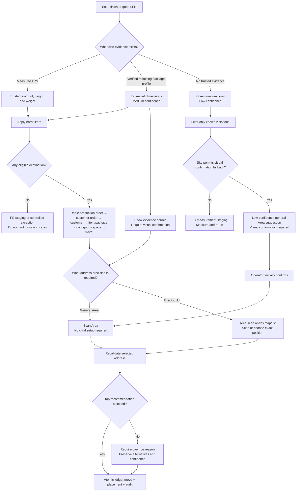

# Finished-goods putaway UX flow

This flow turns a completed finished-good LPN into one audited stock address.
It does not require rack or child-position setup for a general storage Area.

## Decision rules

1. Hard constraints run before ranking: storage class, quality, prohibitions,
   lifecycle, physical fit, structural load, fire/access clearance, and fixture
   compatibility.
2. Ranking preferences never override a hard failure. Rank by the same
   production order, customer order, customer, item/package, reliable contiguous
   usable space, then travel and fragmentation.
3. Missing dimensions are not zero. A verified package profile permits only an
   estimated-fit claim; no trusted evidence means fit remains unknown.
4. A general storage Area is a valid stock address without child setup. An Area
   that enables exact addressing, or a rack/shelf leaf, requires one exact child
   before posting.
5. Confirmation revalidates the destination. Overrides preserve the original
   recommendation, alternatives, confidence, evidence, operator, and reason.
6. Every positive balance bucket for the handling unit moves to the selected
   stock address in the same transaction that writes placement and audit history.
