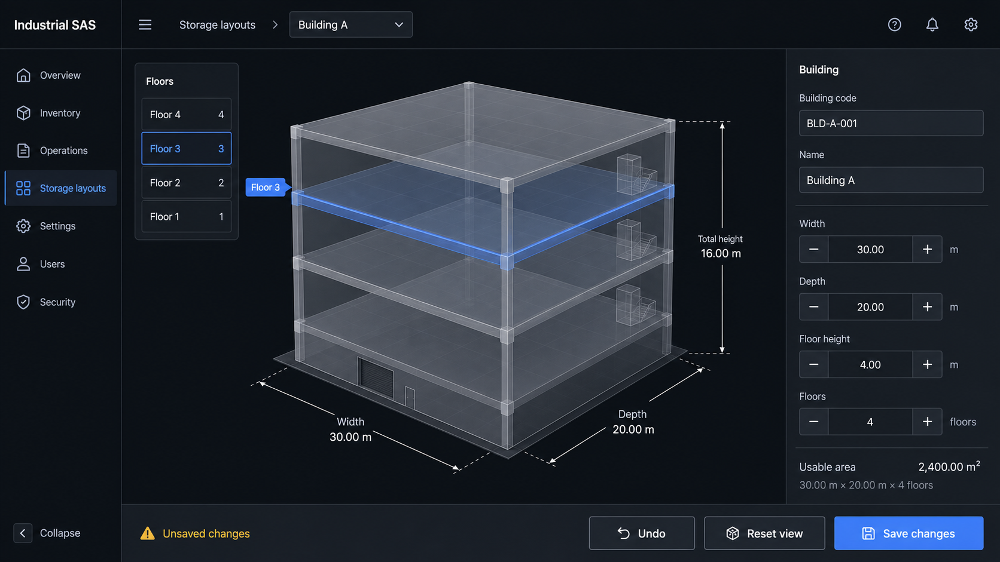
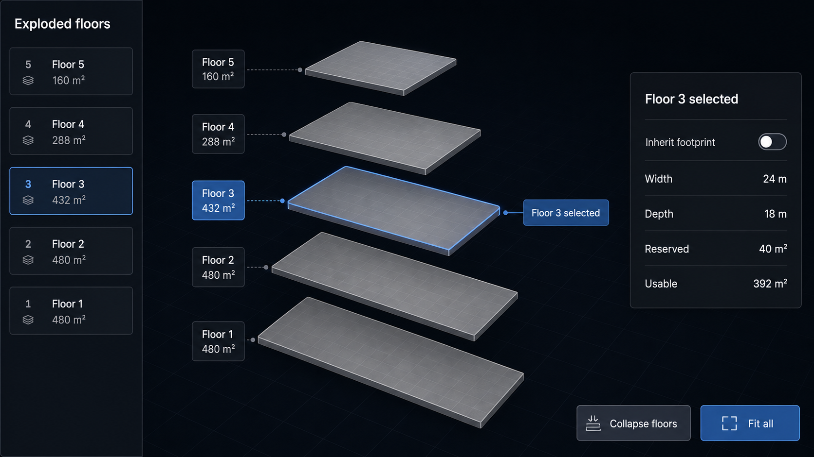

# Storage Building Planner — Visual Concepts

These images are product-direction mockups, not pixel-perfect implementation specifications. They use the current Industrial SAS dark semantic palette and keep the 3D view supplementary to ordinary controls and tables.

For the complete five-page product flow, see [Complete Page Flow](../pages/README.md).

Generation mode: built-in ImageGen (`ui-mockup`), one prompt per requested concept.

## 1. Main building editor

Purpose:

- Establish the desktop information architecture.
- Keep the 3D model central while ordinary form controls remain the source of editable values.
- Show width, depth, default floor height, and floor-count steppers together.
- Make floor selection available in both the model and a labelled list.
- Keep save, undo, reset, and unsaved-state feedback persistent.

Prompt summary: production-ready dark-mode Industrial SAS desktop editor; four-floor translucent isometric building; selected Floor 3; dimension guides; floor navigator; building property inspector; metric units; existing semantic palette; no inventory heat map or photorealistic architecture.

## 2. Exploded floor selector

Purpose:

- Demonstrate how floors with different footprints can be understood at a glance.
- Provide a large selection target per floor.
- Show that a selected floor can expose inherited/overridden dimensions and usable area without leaving the building context.

Prompt summary: five vertically separated rectangular floor plates with different setbacks; Floor 3 selected; labelled floor list; compact inspector; 24 m × 18 m footprint; 40 m² reserved; 392 m² usable; collapse and fit controls; no occupancy data or racks.

## 3. Floor usable-space editor

Purpose:

- Make the basic per-floor calculation explicit: gross minus reserved equals usable.
- Show the floor plate inside the maximum building envelope.
- Represent reserved space with both a hatch and a label so color is not the only signal.
- Repeat the canvas values in a semantic table for accessibility and verification.

Prompt summary: top-down Floor 3 workspace; 24 m × 18 m floor plate inside a 30 m × 20 m envelope; simple hatched Utilities block; right-side inputs; Gross 432 m², Reserved 40 m², Usable 392 m², 90.7% available; accessible summary table; no complex CAD tools.

## Recommended composition

Use the first concept as the default editor. Add the exploded view as a toggle in its canvas toolbar. Open the third concept as the focused floor-editing mode when a user selects “Edit floor space.” This gives one coherent workflow rather than three separate product areas.
