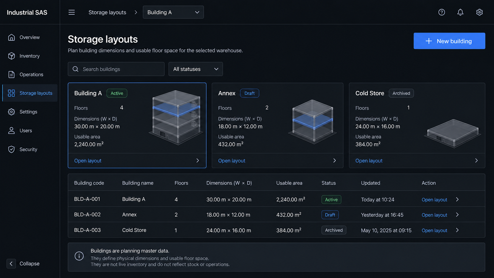
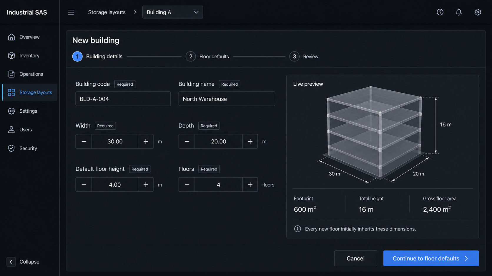
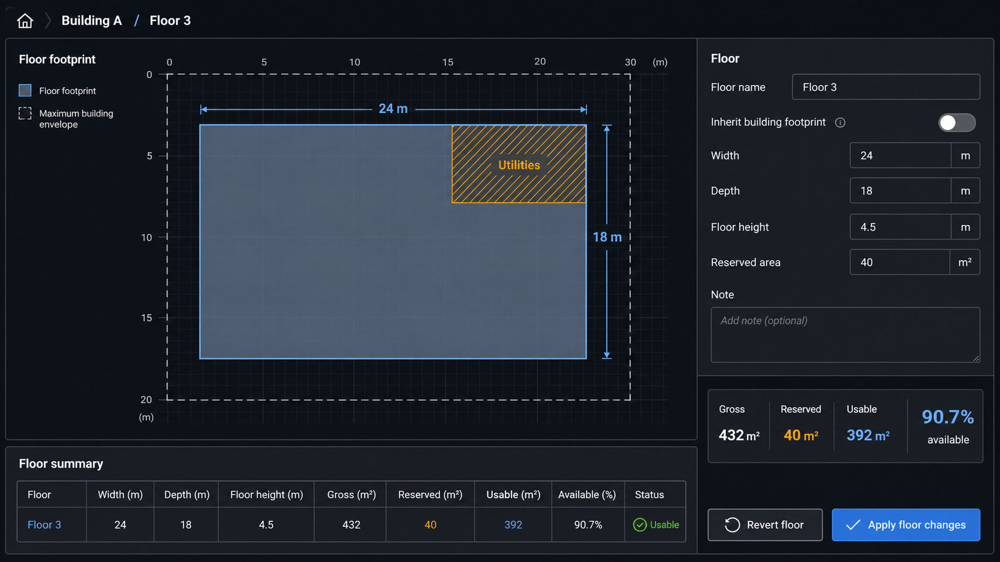
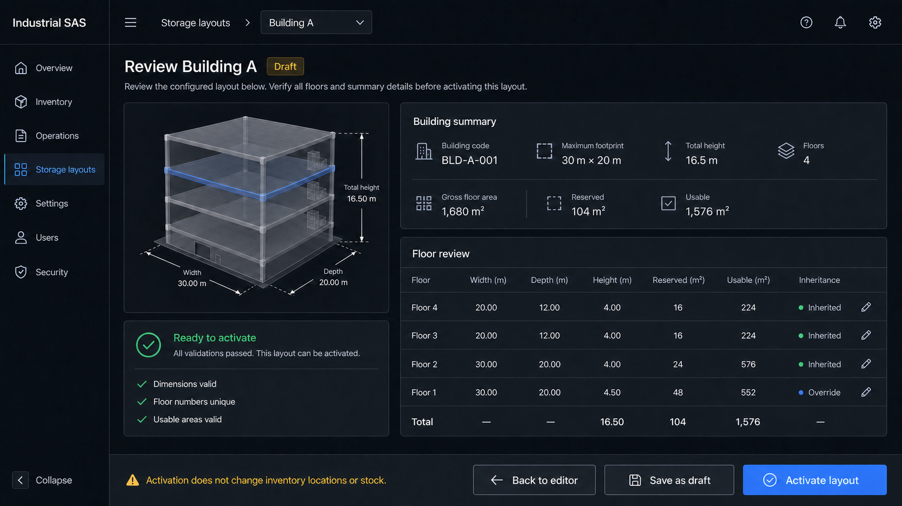

# Storage Building Planner — Complete Page Flow

Generation mode: built-in ImageGen (`ui-mockup`), using the main building editor as the visual reference for the additional pages.

Implementation behavior and acceptance criteria are defined in the [Implementation Specification](../implementation-spec.md).

## Page 1 — Storage layouts overview

Route: `/master-data/storage-layouts`

Shows all buildings in the selected warehouse, with search, status filtering, summary cards, an accessible table, and the `New building` entry point.

Prompt: create a shippable Industrial SAS layouts overview with three building states, small isometric previews, practical filters, and a table; make clear that layouts are planning master data rather than live inventory.

## Page 2 — New building setup

Route: `/master-data/storage-layouts/new`

Collects building code, name, width, depth, default floor height, and floor count. A live preview explains the calculated footprint, total height, and gross floor area before the user enters the editor.

Prompt: create a three-step new-building setup flow with editable metric fields and a four-floor isometric preview; match the existing dark Industrial SAS design system and keep all required fields accessible.

## Page 3 — 3D building editor

Route: `/master-data/storage-layouts/[buildingId]`

The default working page. It combines floor selection, the basic 3D building, dimension controls, floor-count controls, undo/reset, and persistent save status.

Prompt: create a production-ready dark-mode building editor with a central four-floor 3D model, selected Floor 3, width/depth/height guides, floor list, property inspector, and save controls.

## Page 4 — Floor usable-space editor

Route: `/master-data/storage-layouts/[buildingId]/floors/[floorNumber]`

Edits one floor without becoming a full CAD tool. The floor plate sits inside the maximum building envelope; a labelled and hatched reserved block makes usable-space calculation visible and accessible.

Prompt: create a top-down Floor 3 workspace with a 24 m × 18 m plate inside a 30 m × 20 m envelope, a 40 m² Utilities block, 392 m² usable area, editable properties, and a semantic summary table.

## Page 5 — Review and activate

Route: `/master-data/storage-layouts/[buildingId]/review`

Verifies dimensions, floor numbering, and usable-area calculations before activation. The warning makes clear that activating a building layout does not move stock or alter current inventory locations.

Prompt: create a review page with a cutaway building preview, validation checklist, building summary, complete floor table, and actions for returning, saving a draft, or activating the layout. Keep all area totals mathematically consistent.

## Additional editor mode

The [exploded floor selector](../concepts/02-exploded-floor-selector.png) is a canvas mode inside Page 3, not a separate route.
