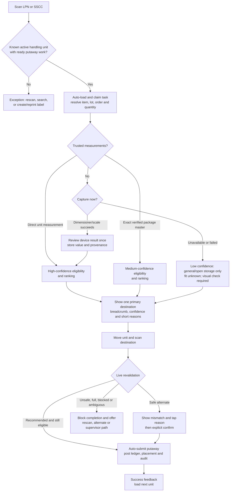

# Scan-first finished-goods putaway with minimal typing

Research brief, 2026-08-28. This note asks how ISAS can reduce writing and
decision load in finished-goods putaway while retaining evidence that the right
handling unit reached a safe destination.

Evidence labels used below:

- **Sourced fact** is directly supported by an official GS1 standard/page,
  first-party WMS documentation, or first-party measurement-device
  documentation.
- **Product recommendation** is an ISAS design decision inferred from those
  facts and from the repository's current implementation. No cited vendor is
  claimed to use ISAS's exact confidence policy or screen design.

This note complements
[Finished-goods putaway recommendations with minimal setup](./fg-putaway-recommendation-measured-and-unmeasured.md).
It focuses on interaction and capture rather than repeating the ranking model.

## Executive answer

Make the normal operator journey **two scans and no typing**:

1. Scan the finished handling unit's LPN/SSCC. The system resolves the unit,
   loads and claims its putaway work, and calculates the best eligible
   destination.
2. Move the unit, then scan the destination QR/barcode. A matching, still-safe
   scan posts the putaway and advances to the next unit.

Measurements should be captured upstream or by integrated equipment and reused
only with explicit provenance. If measurements are missing, do not prefill
plausible-looking dimensions. Either capture them in one guided action, reuse a
trusted exact package configuration with lower confidence, or offer only a
low-confidence general/open-storage destination with visual confirmation.

The operator should confirm **physical facts and exceptions**, not re-enter data
the system already knows. Preserve a deliberate action for the destination scan,
an out-of-range or uncertain measurement, an alternate destination, and any
manual correction. Automate identifier resolution, task selection, master-data
lookup, recommendation, capacity calculations, audit timestamps, and successful
submission.

## Recommended target flow

The diagram's confidence levels and fallbacks are product recommendations. The
source-backed building blocks are identifier scanning, system-directed location
selection, location-scan confirmation, capacity validation, and device-reported
measurement status.

## What the primary sources establish

### One handling-unit scan can replace several typed fields

- **Sourced fact:** GS1 defines the SSCC as the identifier for an individual
  logistics unit such as a case, pallet, or parcel. The identifier acts as a key
  to information about that unit in computer files. [GS1 General
  Specifications, individual logistic units](https://ref.gs1.org/standards/genspecs/)
- **Sourced fact:** the GS1 Logistic Label requires an SSCC, and scanning its
  barcode lets the physical movement be matched to electronic business messages.
  A homogeneous-unit label may additionally carry the contained GTIN, count,
  lot, and relevant dates. [GS1 Logistic Label
  Guideline](https://www.gs1.org/standards/gs1-logistic-label-guideline/1-3)
- **Sourced fact:** GS1 Application Identifiers tell the receiving application
  what each captured value means. GS1-128, GS1 DataMatrix, and GS1 QR Code can
  carry multiple AIs. [GS1 Application
  Identifiers](https://www.gs1.org/gs1-application-identifiers)
- **Sourced fact:** for a normal logistics label, the current GS1 General
  Specifications require GS1-128 for the SSCC; a GS1 DataMatrix or GS1 QR Code
  may be added, and may be used alone only under the standard's small-label
  condition. [GS1 General Specifications, data-carrier
  specification](https://ref.gs1.org/standards/genspecs/)

**Product recommendation:** use the stable handling-unit identifier as the only
normal-path input. Resolve item/design, package configuration, quantity, lot,
production order, customer order, customer, current staging location, and ready
task server-side. Do not ask the operator to type those values again. Accept the
site's internal LPN and standards-compliant SSCC, but do not describe an arbitrary
QR payload as a GS1 logistics label.

### Directed putaway naturally forms a scan–direct–scan loop

- **Sourced fact:** Oracle's System Directed Putaway mobile transaction starts
  by scanning an LPN, directs the worker to a specific location, and completes
  after the worker scans that location's barcode. A different location in the
  same zone triggers an override prompt; a full or insufficient-capacity
  location produces an error. [Oracle WMS: System Directed
  Putaway](https://docs.oracle.com/en/cloud/saas/warehouse-management/26a/owmol/system-directed-putaway-.html)
- **Sourced fact:** Microsoft location directives identify pick and put
  locations and are evaluated in configured sequence; work templates determine
  the instructions workers receive on mobile devices. [Microsoft Dynamics 365:
  work templates and location
  directives](https://learn.microsoft.com/en-us/dynamics365/supply-chain/warehousing/control-warehouse-location-directives)
- **Sourced fact:** Microsoft can require location confirmation when the system
  filled the location. If the worker started work by scanning a license plate,
  redundant license-plate confirmation can be skipped. [Microsoft Dynamics 365:
  batch, license-plate, and location
  confirmation](https://learn.microsoft.com/en-us/dynamics365/supply-chain/warehousing/batch-and-license-plate-confirmation)
- **Sourced fact:** Microsoft's warehouse app supports scanned-data submission
  without a separate tap when the device sends an Enter after the scan; Microsoft
  recommends device-controlled submission for consistent behavior across
  devices. [Microsoft Dynamics 365: data submission
  behavior](https://learn.microsoft.com/en-us/dynamics365/supply-chain/warehousing/warehouse-app-autosubmit-behavior)

**Product recommendation:** the first scan should both identify the unit and
open its work. The destination scan is the proof-of-presence event and should
replace a dropdown plus Confirm button. Auto-submit only after the server resolves
the scan unambiguously and revalidates the destination. Give success/error
feedback immediately through color, sound, and vibration, then focus the input
for the next LPN.

### Scan-first needs a manual fallback, not a parallel manual workflow

- **Sourced fact:** Microsoft lets each mobile field prefer scanning while still
  permitting manual entry when a barcode is unreadable or damaged. It also
  supports non-editable selections and numeric-specific input. [Microsoft
  Dynamics 365: configure warehouse app
  fields](https://learn.microsoft.com/en-us/dynamics365/supply-chain/warehousing/configure-app-field-names-priorities-warehouse)
- **Sourced fact:** Microsoft mobile detours can temporarily leave a task, carry
  known values into an inquiry, return a selected value, and resume without
  losing the main task. Microsoft's data-inquiry guidance explicitly identifies
  damaged, unreadable, or missing barcodes as the reason an inquiry fallback is
  needed. [Microsoft Dynamics 365: mobile
  detours](https://learn.microsoft.com/en-us/dynamics365/supply-chain/warehousing/warehouse-app-detours),
  [Microsoft Dynamics 365: data-inquiry
  detours](https://learn.microsoft.com/en-us/dynamics365/supply-chain/warehousing/warehouse-app-data-inquiry)

**Product recommendation:** keep a small “Can't scan” action below the active
scan field. It opens an in-context lookup prefiltered by the current warehouse
and task; it must not discard the scan flow. Record `HID`, camera, manual search,
or manual typing as capture provenance. Manual values need stricter validation
and should never silently create new master data.

### Measurement capture can remove transcription, but its result has states

- **Sourced fact:** GS1 defines a consistent, repeatable method for length/depth,
  width, height, and gross-weight measurements at a specified product/package
  level. Physical items sharing a GTIN can still vary, and GS1 publishes
  tolerances between stated and actual values. [GS1 Package and Product
  Measurement Standard](https://ref.gs1.org/standards/ppm/3.2.0/)
- **Sourced fact:** GS1 Application Identifiers include logistics-unit gross
  weight and dimensions: `330n` for kilograms and `331n`–`333n` for the three
  dimensions in metres. The transport guideline says to keep 2D barcode content
  simple and include only information needed for correct local handling.
  [GS1 transport-process encoding
  guideline](https://www.gs1.org/standards/encoding-transport-process-information-gs1-implementation-guideline/10)
- **Sourced fact:** Zebra's Mobile Parcel API returns length, width, height,
  units, timestamp, object ID, dimension ID, legal-for-trade flag, and per-axis
  statuses including `NoDim`, `BelowRange`, `InRange`, and `AboveRange`.
  Zebra warns that its speed optimization disables protections intended to
  reject lower-confidence results. [Zebra Mobile Parcel
  API](https://techdocs.zebra.com/mobile-parcel/latest/guide/api/)
- **Sourced fact:** Zebra's documented flow distinguishes in-range,
  out-of-range, timeout, and cancelled results. An out-of-range result can be
  retried or explicitly confirmed; timeout/cancel returns `NoDim`. [Zebra:
  dimensioning flow](https://docs.zebra.com/us/en/mobile-computers/software/zebra-dim-mobile-parcel/dimensioning-flow.html)
- **Sourced fact:** integrated DWS equipment can merge barcode ID, dimensions,
  and weight and send one data record to the host, avoiding separate operator
  transcription. [METTLER TOLEDO: DWS combination
  systems](https://www.mt.com/gb/en/home/products/Transport_and_Logistics_Solutions/dimensioning/dynamic-weighing-scanning-systems.html)

**Product recommendation:** represent measurement as data plus provenance and
quality, never as three anonymous numbers. At minimum record `source`, device or
master-data reference, captured time, units, package configuration/revision,
result status, and the actor who accepted an uncertain/manual value. Convert to
canonical millimetres/kilograms server-side while retaining the original reading.

Recommended confidence policy:

| Evidence available                                                                          | Recommendation confidence | Operator action                                                     |
| ------------------------------------------------------------------------------------------- | ------------------------: | ------------------------------------------------------------------- |
| In-range direct measurement of this handling unit, plus known destination geometry/capacity |                      High | Review once at capture; destination scan completes                  |
| Trusted measurement for the exact item + package configuration + quantity/revision          |                    Medium | No typing; show source and allow “Measure instead”                  |
| Dimensions absent, device unavailable/failed, general/open storage otherwise allowed        |         Low / fit unknown | Visual-fit acknowledgement and destination scan                     |
| Out-of-range, `NoDim`, package mismatch, or known hard constraint cannot be checked         |           No verified fit | Retry, measure by approved fallback, or route to staging/supervisor |

Unknown must remain unknown. It must not be converted to zero or a convenient
default. A weight encoded on a label is useful captured data, but its origin is
not the same as an on-site scale measurement; preserve that distinction.

### Capacity and safety checks belong before and after travel

- **Sourced fact:** Oracle system-directed putaway considers maximum units,
  LPNs, volume, weight, location size/type, sequence, and search modes such as
  empty or most/least empty. [Oracle WMS: putaway
  strategy](https://docs.oracle.com/en/cloud/saas/warehouse-management/23a/owmol/system-directed-putaway.html)
- **Sourced fact:** Microsoft location stocking limits calculate remaining
  capacity from matching product, variant, or container-type rules, including
  inventory and inbound work already consuming capacity. [Microsoft Dynamics
  365: location stocking
  limits](https://learn.microsoft.com/en-us/dynamics365/supply-chain/warehousing/location-stocking-limits)

**Product recommendation:** calculate the advice when the unit is claimed, but
repeat hard checks when the location is scanned. The original recommendation
trace remains the audit record of what the worker saw; the live check prevents a
stale suggestion from placing stock into a location that became blocked or full.
Never let grouping affinity, distance, or a reason code override a known hard
failure.

## What to automate and what to confirm

| Step or fact                                                      | Default behavior                                    | Why                                                                         |
| ----------------------------------------------------------------- | --------------------------------------------------- | --------------------------------------------------------------------------- |
| Handling-unit/task lookup                                         | Automate from LPN/SSCC scan                         | The identifier is the key to stored unit data; retyping adds no evidence    |
| Claiming an eligible task                                         | Automate after successful resolution                | The worker's scan expresses intent; show ownership conflict as an exception |
| Item, lot, quantity, orders, customer, current location           | Read-only auto-fill                                 | They are consequences of the identified unit/task                           |
| Candidate filtering, ranking, orientation, remaining capacity     | Automate server-side                                | Rules and current occupancy should be applied consistently and audited      |
| Trusted dimension/weight import                                   | Auto-fill with source badge                         | Eliminates transcription while keeping provenance visible                   |
| Direct device measurement                                         | Launch in context and import automatically          | Device/API can bind results to the scanned object ID                        |
| In-range measurement acceptance                                   | One review action at capture, not four typed fields | Confirms the device framed the correct physical unit                        |
| Out-of-range, `NoDim`, manual measurement, or stale master value  | Require retry or explicit acceptance/escalation     | The evidence is uncertain or incomplete                                     |
| Recommended destination                                           | Display one primary answer and compact alternatives | Operators need a direction, not a scoring spreadsheet                       |
| Physical destination                                              | Require location scan                               | Proves presence at the labelled destination and catches wrong-place errors  |
| Correct, still-eligible destination                               | Auto-submit on scan                                 | The scan itself is the deliberate confirmation                              |
| Different but eligible destination                                | Require reason selection and explicit confirm       | Records an intentional override without free-text writing                   |
| Full, blocked, prohibited, incompatible, or ambiguous destination | Block; offer rescan/alternate/supervisor            | A reason code must not waive a hard rule                                    |

Use tap-sized reason chips for frequent exceptions—such as `LOCATION_OCCUPIED`,
`ACCESS_BLOCKED`, `LABEL_DAMAGED`, or `RECOMMENDATION_UNREACHABLE`—with optional
notes only when policy requires detail. Keep photographs and long comments out
of the happy path; request them only for configured damage or safety exceptions.

## Implementation implications for this repository

The repository already contains several useful seams, but the visible putaway
experience is not yet the target flow.

### Reuse

- [`resolveStorageAddress`](../../convex/storageLayouts/zones.ts) already resolves
  either an Area QR or exact position QR and distinguishes `AREA_AUTO` from
  `AREA_NEEDS_POSITION`. Use it behind destination-scan confirmation rather than
  duplicating location lookup in the client.
- [`handlingUnits`](../../convex/schema.ts) already have an LPN and optional
  width/depth/height, and storage areas/positions already have QR values and
  geometry. These provide the base identities for scan-first capture.
- [`claimPutawayTask` and `confirmPutaway`](../../convex/putaway/tasks.ts) already
  preserve a recommendation trace, enforce task ownership, post the ledger
  move, and record recommendation versus chosen location. Preserve those audit
  invariants.
- [`itemScanResolution`](../../convex/lib/itemScanResolution.ts) already
  normalizes scans and resolves active item barcodes before SKU fallback. Its
  normalization/result pattern is reusable, but putaway needs a dedicated
  handling-unit/task resolver rather than treating an LPN as an item barcode.

### Change in a future implementation

1. Replace the shared table-first handheld screen. Both desktop and handheld
   currently render [`PutawayWorkbench`](../../src/features/inbound/PutawayWorkbench.tsx),
   which requires selecting a task, claiming it with a button, reading a ranked
   table, selecting a destination from a dropdown, and pressing Confirm. Keep
   that workbench as a supervisor/desktop view; give handheld a scan-state flow.
2. Add a `resolvePutawayLpn` query/mutation returning the active handling unit,
   ready/claimed task, display summary, measurement state, and ownership result.
   The scan should make task IDs an internal detail.
3. Add `confirmPutawayByScan` that resolves area/position server-side, compares
   it with the stored recommendation, rechecks live hard constraints, requires
   a reason only for a safe override, and completes the ledger move
   idempotently. Do not trust a client-supplied `chosenLocationId` merely because
   it appeared in an earlier ranked list.
4. Extend handling-unit measurements with gross weight and provenance/status.
   The current optional width/depth/height cannot distinguish direct measurement,
   package-master reuse, estimate, or manual entry; there is no gross weight.
5. Remove the plausible defaults in
   [`StorageStackPlacementWorkbench`](../../src/features/storageLayouts/StorageStackPlacement.tsx).
   It currently starts at 1.2 × 1.0 × 1.4 m and can store those values as if they
   described the selected unit. Blank/unknown, verified reuse, and direct capture
   must be different states.
6. Merge putaway confirmation and physical stack placement into one operator
   transaction or a server-orchestrated atomic workflow. They are currently two
   separate UI sections and backend mutations even though both describe where
   the same handling unit was physically placed.
7. Populate recommendation candidates with the facts the scorer already models.
   [`putawayScoring`](../../convex/model/inbound/putawayScoring.ts) supports
   capacity, same item/lot, home, preferred zone, travel, and fragmentation, but
   the current candidate loader supplies almost none of them. Add fit status and
   confidence to the returned recommendation instead of exposing only a numeric
   score.
8. Keep two times in the audit record: recommendation/claim time and final scan
   time. Store raw scan value and input method, resolved destination, measurement
   evidence version, original recommendation, live revalidation outcome,
   override reason if any, and transaction ID.

## Suggested delivery order

1. **Two-scan happy path:** LPN/task resolver, destination scan resolver,
   auto-submit, and handheld state machine using existing recommendations.
2. **Safe exception path:** ownership conflict, unknown/damaged labels,
   destination mismatch, tap-based reason codes, and live hard-rule recheck.
3. **Measurement truth:** remove defaults; add measurement status, source,
   timestamp, gross weight, and confidence/fit status.
4. **Integrated capture:** bind supported dimensioner/scale results to the
   scanned LPN; keep manual measurement as an explicit fallback.
5. **Richer automation:** populate capacity/occupancy and affinity inputs, unify
   putaway with stack placement, then auto-advance and batch work sequencing.

The first release can therefore remove most writing before procuring measurement
hardware. The largest immediate gain is changing task selection and destination
confirmation from tables/forms into scans, while treating missing measurements
honestly.
