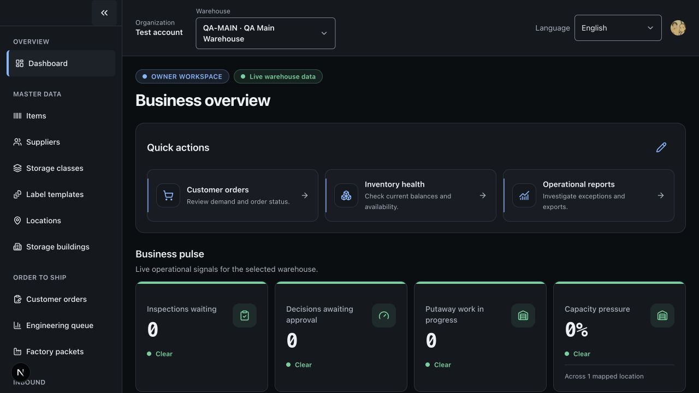
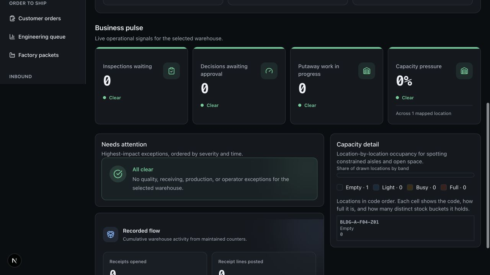

# Owner dashboard implementation result

Date: 2026-08-24  
Status: implemented and verified locally

## Outcome

The dashboard is now a denser owner-first decision surface rather than a
warehouse landing-page hero. The forklift illustration, oversized call-to-action
area, repetitive zero-card wall, and exposed setup diagnostics are gone. The
page now presents:

1. an organization and warehouse scope;
2. a customizable, account-scoped quick menu;
3. four truthful business-pulse cards;
4. an owner attention queue backed by real operational exceptions;
5. a detailed occupancy view; and
6. recorded receiving flow without repeating the pulse queues.

The Lucent/DevOps reference influenced the information density, compact section
headers, bordered cards, short action tiles, and top-down decision hierarchy. It
was not copied literally: this implementation continues to use the repository's
semantic tokens, dark theme, accessible controls, and warehouse domain language.
The final refinement added stronger status strips, compact icon treatments, an
all-clear attention state, and a balanced two-column lower dashboard without
dead space.
The business-pulse capacity card was subsequently simplified to one headline
percentage and one textual status, removing the competing percentage/count
visualization that became cramped in the four-column row.
The final de-duplication pass keeps every fact in one visual location: pulse
counts are not repeated in operational detail, capacity pressure is not repeated
above the location map, and empty metrics do not repeat their zero in helper
copy.
Warehouse context now appears only in the global selector; the duplicate
read-only warehouse block was removed from the dashboard hero, including its
unused client translation dependency.
The remaining page hero was reduced to two status tags and the page heading;
its descriptive copy and card-like decoration were removed to keep the top of
the dashboard visually light.

## What is working

### Customizable quick actions

- Up to six actions can be selected and ordered.
- The editor supports keyboard-accessible move up, move down, add, remove, save,
  cancel, and reset controls.
- The menu header stays compact: customization is an icon-only edit control with
  a localized accessible name, and redundant helper copy is omitted.
- Choices are stored per organization membership, so the same user can have a
  different menu in each account.
- Available actions are recalculated from current server-side permissions.
- Revoked or stale actions disappear safely from the resolved menu.
- A destination still performs its own authorization; the menu never grants a
  capability.
- The authenticated browser test opened the editor, reordered an item, restored
  its order, saved successfully, and followed Inventory Health to the balances
  workflow.

### Owner business pulse

The first four cards are computed only from existing bounded data sources:

- inspections waiting;
- decisions awaiting approval;
- putaway work in progress (ready plus claimed); and
- constrained storage locations (busy plus full).

Each maintained counter shows its timestamp when one exists; the page omits the
same never-recorded placeholder from every empty card. Suspect counters are
marked in words and with an icon. Capacity states whether the mapped-location
view is complete or partial and derives its percentage from constrained mapped
locations. No trend, revenue, or target is fabricated.

### Operational detail

- Recorded receipts and receipt lines are grouped as cumulative flow.
- The latest maintained activity timestamp is shown when one exists.
- Quality and putaway counts remain only in Business pulse instead of being
  repeated in a second queue summary.

### Needs attention

- Reuses the existing bounded operational-exception query.
- Shows the highest six results with severity, localized exception title,
  source detail, opened time, and a real workflow link.
- Explicitly warns when the bounded source view is incomplete.
- Shows a clear, non-alarming empty state when nothing needs attention.

### Localization and accessibility

- Complete English and Thai copy is present for the owner page, all twelve quick
  actions, editor controls, pulse cards, and error states.
- Thai capacity copy uses direct warehouse language (`พื้นที่จัดเก็บใกล้เต็ม`)
  and states how many storage locations were checked, avoiding literal technical
  translations.
- Client message namespaces are declared exactly for the dashboard route.
- Axe checks cover the owner pulse, attention state, operational summary,
  occupancy view, and open quick-action dialog.
- Color is not the sole carrier of capacity, severity, or suspect-state meaning.
- The global account/warehouse header was reflowed at phone width so menu,
  language, account, organization, and warehouse controls no longer collide.

## Security and tenancy

The new preference API uses the existing tenant function boundary and requires
`reporting.dashboard.read` for the selected warehouse. Organization, actor,
membership, and permission facts remain server-owned. Preferences are indexed by
organization, membership, and page key. Integration tests prove:

- the same user has isolated preferences in two organizations;
- invalid or unavailable actions are rejected without writing; and
- reset resolves the latest permission-filtered owner default.

## Data decision

The local QA warehouse currently has one mapped location and no recorded
receiving, quality, putaway, or exception activity, so its truthful result is a
set of zero/empty states. Although synthetic data was authorized for visual
polish, no fabricated business facts were inserted into the tenant. The current
repository has no production-safe demo-seed path, and its release documentation
explicitly keeps demo seeds guarded from production. Visual behavior with
non-zero states is covered by typed component fixtures and tests.

Financial performance, margin, order value, on-time delivery, and historical
trend cards remain intentionally absent. They require maintained commercial and
time-series rollups that the current model does not yet provide.

## Verification result

All validation completed successfully:

| Gate                    |                                                   Result |
| ----------------------- | -------------------------------------------------------: |
| Unit                    |                                             1,583 passed |
| Property                |                                               137 passed |
| Tenant isolation        |                                               433 passed |
| Accessibility           |                                                84 passed |
| Convex runtime          |                                               121 passed |
| Integration             |                                               550 passed |
| Total automated tests   |                                         **2,911 passed** |
| TypeScript              |                                                   Passed |
| ESLint                  |                                    Passed, zero warnings |
| Prettier and diff check |                                                   Passed |
| Tenant-boundary guard   |                       145 production Convex files passed |
| Workflow guard          |                                                   Passed |
| Production build        |                         94 routes generated successfully |
| Authenticated browser   | Dashboard, editor save, and quick-link navigation passed |

The local development server remains running at
`http://localhost:3000/en/dashboard`.

## Screenshots

## Recommended next increment

1. Define and maintain owner commercial rollups: order value, backlog value,
   shipped value, on-time delivery, and aging.
2. Add a guarded, idempotent development/demo data runner before adding visual
   demo data to real tenant deployments.
3. Add widget-level customization only after the owner KPI contracts are stable.
4. Add authenticated Playwright fixtures so the browser workflow runs in CI
   without relying on an already-signed-in local session.
