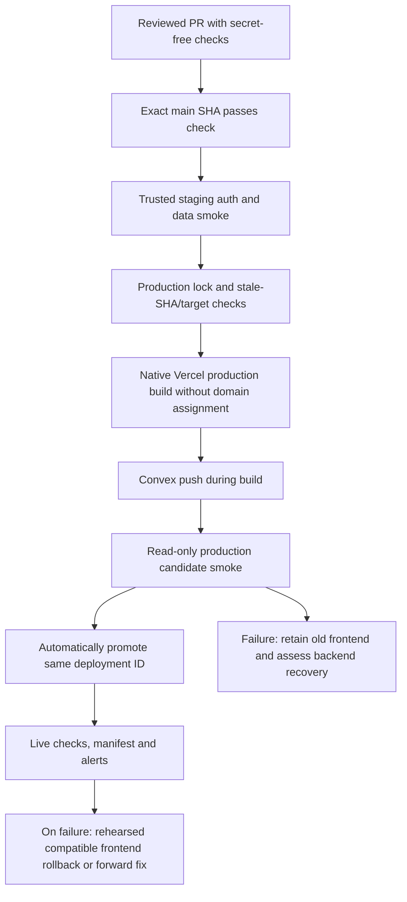

# CI/CD best-practices audit with five Kiro agents — 2026-10-09

**Release policy: deploy automatically after CI passes on the exact merged `main` commit. No manual production release approval.** PR review protects what enters `main`; release checks then run automatically.

Five independent Kiro CLI agents completed read-only audits using `claude-opus-5.5`, high effort. Their **76 practice records** cover workflows/builds, tests/browsers, security/governance, releases/environments, and backend/data/operations. Some records deliberately overlap across domains. This consolidated review resolves disagreements and is the authority for implementation; the individual reports retain the agents' evidence and proposals with coordinator corrections.

| Kiro audit                     | Records | Detailed evidence, prerequisites, failure cases and maintenance notes |
| ------------------------------ | ------: | --------------------------------------------------------------------- |
| Workflows and builds           |      16 | [CI report](ci-cd-kiro-2026-10-09/01-workflows-build.md)              |
| Tests and browser verification |      15 | [Testing report](ci-cd-kiro-2026-10-09/02-tests-browser.md)           |
| Security and governance        |      15 | [Security report](ci-cd-kiro-2026-10-09/03-security-governance.md)    |
| Releases and environments      |      15 | [Release report](ci-cd-kiro-2026-10-09/04-release-environments.md)    |
| Backend, data and operations   |      15 | [Operations report](ci-cd-kiro-2026-10-09/05-data-operations.md)      |

The [implementation plan](../plans/ci-cd-best-practices-2026-10-09.md) gives the rollout order. This audit specifies where each practice belongs and how to prove it works. No application code, workflow, platform setting or production deployment was changed.

## Evidence and confidence

The local checkout is `0e9ea3aba4d241d4e1d732e2adb5637966ebabaa`, with substantial existing HR/search changes. Live GitHub `main` was `cc42063335f1355b053a4544c5ed658dd0b6d1f2`. Agents compared relevant committed CI/deployment files against the locally fetched remote ref; these files were unchanged. Findings about uncommitted HR/search code are explicitly preparatory and do not establish that it is deployed.

Installed versions inspected: Next 16.3.8, Convex 1.46.0, pnpm 10.33.2, Vitest 4.1.10, Playwright 1.62.1 and convex-test 0.0.54. Relevant installed Next guides were read as required by `AGENTS.md`.

| Directly verified by the coordinator | Result                                                                                                                                                                   |
| ------------------------------------ | ------------------------------------------------------------------------------------------------------------------------------------------------------------------------ |
| Repository visibility                | Public: `Rugby-Thailand/industrial-sas`                                                                                                                                  |
| Main enforcement                     | Zero rulesets; branch-protection API: `404 Branch not protected`                                                                                                         |
| GitHub environments                  | `Preview` and `Production`: no protection rules or branch policy                                                                                                         |
| Actions controls                     | Default token read-only; cannot create/approve PRs; all actions allowed; SHA pinning not enforced                                                                        |
| Fork workflow approval               | `first_time_contributors`; separate from the PR-approval permission above                                                                                                |
| Security controls                    | Secret scanning, push protection and Dependabot security updates disabled                                                                                                |
| CodeQL                               | Default setup `not-configured`; no local analysis workflow                                                                                                               |
| Recent quality runs                  | Latest ten refreshed runs passed; latest main [run 37946027709](https://github.com/Rugby-Thailand/industrial-sas/actions/runs/37946027709) completed in about 98 seconds |
| GitHub cache usage                   | 38 entries, 5,795,168,195 bytes; sampled Next entries approximately 118–176 MB                                                                                           |
| Live Vercel access                   | Connector returned 403 for this project's team scope; installed CLI absent                                                                                               |

Vercel build settings, fork protection, candidate hosts, Convex backup/log-stream settings, and Clerk instance configuration remain **unverified**. README statements describe the intended deployment, not proof of current remote behavior. No credential values, production records or sensitive import-file contents were read. No build, application test suite, browser session or deployment preflight was executed. One Kiro agent ran read-only formatting and workflow validation; these are diagnostic findings, not a passing quality run for the dirty checkout.

Priorities: **P0** blocks a safe production cutover; **P1** fixes a material correctness/security/recovery gap; **P2** improves feedback and reliability; **P3** is maintenance or conditional optimization. **KEEP**, **ADD NOW**, **ADD NEXT**, **CONDITIONAL**, and **N/A** describe applicability, not permission to deploy.

## Findings that change the plan

1. **CI must precede the Convex-mutating build.** The documented Vercel command runs `convex deploy --cmd 'pnpm build'`. Installed CLI source runs the frontend command before pushing Convex, but that push still happens before frontend promotion. Vercel Deployment Checks hold domain assignment after the build; they cannot protect this earlier mutation. Gate creation of the production build in GitHub first. [Convex deploy lifecycle](https://docs.convex.dev/cli/reference/deploy), [Vercel Deployment Checks](https://vercel.com/docs/deployment-checks).
2. **Security coverage was removed with unrelated ERP cleanup.** Commit `983fb5a` deleted dedicated webhook, identity-mirror, tenant-policy and authorization tests while those modules still ship. The empty property project is harmless for model properties that run elsewhere, but the deleted identity-webhook property test is a real coverage gap. Recover and adapt tests for surviving modules; restoring old ERP suites wholesale would be inappropriate.
3. **Generated contracts lag the pinned Convex CLI.** Committed `_generated/server.*` predates the 1.46 template's typed `env` export. The dirty feature work already contains regeneration, which must be preserved and reviewed. A module-count check detects missing API modules, but cannot prove complete freshness. Codegen's dry-run logs drift without necessarily failing.
4. **Sensitive import artifacts can be accidentally committed.** `data/import-staging/` is untracked and not ignored. Filename inspection indicates business/identity/import outputs; their contents were not read. Plan an ignore rule or an external private location. Operator scripts also read an admin credential through the name `CONVEX_DEPLOY_KEY`; use a distinct admin-key name and retain existing target/permission guards.
5. **Concurrency and event handling need explicit design.** The current default concurrency queue can replace pending `main` checks despite `cancel-in-progress: false`. Give non-PR quality runs unique groups; serialize only the release job. Current GitHub supports `queue: max`, with up to 100 pending entries, but queue-entry order does not guarantee commit order. Independently reject stale SHAs. [Concurrency semantics](https://docs.github.com/en/actions/how-tos/write-workflows/choose-when-workflows-run/control-workflow-concurrency).
6. **A PR-only security job can break every main release.** The aggregate currently requires all dependencies to report `success`. Adding dependency review to its `needs` while skipping that job on `push` makes `check` fail. Keep a separate required PR security check, or use an explicit event-aware aggregate that accepts skips only where intended. CodeQL in a separate/default workflow cannot be included through same-workflow `needs`.
7. **The schema fixture is useful but partial.** It compares complete validators for captured fields, not just field presence. It misses uncaptured fields/tables/indexes and newly required fields. Preserve it, expand compatibility tests, and rehearse actual schema validation on staging. Production dry-run is an optional early gate inside Vercel, not a reason to export production credentials to GitHub.

## Where checks run

| Lifecycle                            | Checks and purpose                                                                                                                                                          | Credentials/data boundary                                                                                                   | Release effect                                                         |
| ------------------------------------ | --------------------------------------------------------------------------------------------------------------------------------------------------------------------------- | --------------------------------------------------------------------------------------------------------------------------- | ---------------------------------------------------------------------- |
| Every PR, including forks/Dependabot | Frozen install, workflow lint, generated-contract checks, typecheck/lint/format, Vitest shards, production-mode build, credential-free browser/axe smoke, dependency review | Read-only GitHub token; no service credentials; synthetic local data                                                        | Required checks prevent merge                                          |
| Push to `main`                       | Repeat core quality checks on the actual merge result; assert clean checkout and exact SHA                                                                                  | Quality jobs remain secret-free                                                                                             | A successful `check` enables release gates                             |
| Trusted staging for that SHA         | Real Clerk development login, Convex write/readback, organization/warehouse denials, current auth/webhook contract tests                                                    | Dedicated staging secrets and synthetic run-namespaced data; never fork code                                                | Failure prevents production build                                      |
| Production candidate                 | Validate target/configuration before push; native Vercel production build; inspect READY state/SHA/target; read-only routes, headers, widget/config and backend probes      | Production secrets remain in Vercel; GitHub production job holds scoped Vercel token; synthetic identity only if configured | Failure prevents frontend promotion; backend may already have changed  |
| After promotion                      | Verify same deployment ID, real domain, auth availability and safe reads; record status; bounded recovery/alert                                                             | No seeds or business writes; sensitive traces disabled                                                                      | Failure marks release failed and applies rehearsed compatible recovery |
| Schedules and maintenance            | Dependency/SAST scans, broader browser/device runs, backup checks and restore drills, measured coverage/performance                                                         | Trusted main; staging for writes; restore access restricted                                                                 | Never deploy merely because a scheduled scan passed                    |

## Recommended automatic release architecture

Use the existing `quality.yml` and stable `check`. Add trusted staging validation and a production `release` job that explicitly depends on successful gates for the same `github.sha`. Start with native Vercel remote builds. A dedicated GitHub `production-release` environment has a `main` branch policy and **no required reviewers**. Keep production Convex/Clerk secrets scoped to Vercel Production; GitHub needs the Vercel token for orchestration. Staging testing can use separate non-production secrets.

Implementation outline, **not executable workflow YAML**:

1. On `push: main`, run quality. A retry through `workflow_dispatch` on `main` reruns CI; it does not bypass CI or authorize arbitrary input SHAs.
2. Validate staging against that commit. Serialize shared staging resources or use isolated targets/fixtures so two runs cannot overwrite the backend under test.
3. Acquire one fixed production job lock across build, smoke, promotion and recovery. Use `cancel-in-progress: false`; prefer explicit `queue: max` for visible pending outcomes, with stale-SHA checks. Non-PR quality uses a unique run group so every merge result gets its own checks.
4. Checkout the exact SHA in a clean release workspace. Verify repository, current main SHA, configured Vercel project/team, production target, previous serving deployment, and absence of in-flight production builds. An orphaned remote build must be completed/cancelled and its backend state reconciled before a new build starts.
5. Run the exactly pinned Vercel CLI source deployment with `--prod --skip-domain`; attach verified commit/run metadata. Current CLI source supports `VERCEL_TOKEN`; confirm the pinned version. Environment validation belongs inside the build command before the Convex push. [CLI deploy options](https://vercel.com/docs/cli/deploy), [Vercel CLI authentication source](https://github.com/vercel/vercel/blob/main/packages/cli/src/index.ts).
6. Inspect deployment ID, READY state, metadata and target; test safe candidate behavior. Promote that **production-target** deployment without rebuilding. Preview-to-production promotion rebuilds and would run the backend command again. [Promotion lifecycle](https://vercel.com/docs/deployments/promoting-a-deployment).
7. Verify live behavior and record outcome. Use `vercel rollback` for a previously serving compatible artifact; `Redeploy` rebuilds and could push old Convex code. An automatic frontend rollback requires demonstrated backend compatibility, not merely a brief period of the old frontend still serving. [Rollback command](https://vercel.com/docs/cli/rollback).
8. Cut over in one reviewed change: prepare and rehearse this path, drain existing production builds, disable Git production triggers with `git.deploymentEnabled.main = false`, revoke hooks/bypass paths, and activate the gated path. Preserve safe previews. Do not leave an unlocked production command in the README. [Git trigger configuration](https://vercel.com/docs/project-configuration/git-configuration).

Keep the entire production critical section in one job. GitHub locking does not stop a Vercel build that survives runner cancellation, or a dashboard/operator push. Record the external deployment as soon as it is created and include remote-state checks in recovery. A timeout is a failed/uncertain release requiring reconciliation, not evidence that no mutation occurred.

Clerk production keys require a compatible owned candidate host for complete browser authentication. Test keys on staging cannot validate the production candidate's configuration. Current Testing Tokens support production with authentication-helper limitations; they bypass bot protection, not tenant authorization. Start with real-auth staging plus safe production configuration/route probes; add authenticated candidate/live reads when the host and synthetic account are configured. [Clerk testing](https://clerk.com/docs/guides/development/testing/overview), [Clerk Vercel deployment](https://clerk.com/docs/guides/development/deployment/vercel).

## Practice map: workflows and builds

Owner: CI/application maintainer. Evidence paths are relative to the repo. Proposed files/jobs are identified as new.

| ID / decision                                      | Current evidence and reason                                                                                      | Exact placement / smallest change                                                                                                                                           | Acceptance and ongoing cost                                                                                              |
| -------------------------------------------------- | ---------------------------------------------------------------------------------------------------------------- | --------------------------------------------------------------------------------------------------------------------------------------------------------------------------- | ------------------------------------------------------------------------------------------------------------------------ |
| CI-01 **KEEP · P0** Aggregate quality gate         | `quality.yml:59–73` requires successful validate/test/build; stable merge interface                              | Keep `check`; add every mandatory same-workflow job to `needs`; handle conditional jobs explicitly; release depends on successful check                                     | Failing, cancelled or unexpectedly skipped mandatory job never yields green. Small maintenance per new job               |
| CI-02 **ADD NOW · P1** Concurrency                 | `quality.yml:9–11` can replace pending main runs                                                                 | PR group per PR with cancellation; other quality group per run; fixed release job group without cancellation                                                                | Rapid merges all receive quality results; no overlapping backend mutation; stale pending releases recorded as superseded |
| CI-03 **KEEP / ADD NEXT · P2** Frozen installs     | Shared setup uses pnpm 10.33.2 and frozen lockfile; pnpm engine allows later majors                              | `setup-node-pnpm/action.yml`; tighten `engines.pnpm` to intended major and review exact overrides in `pnpm-workspace.yaml`                                                  | Manifest/lock mismatch fails; install logs match pinned pnpm; inspect Vercel install version separately                  |
| CI-04 **KEEP · P3** Node major alignment           | `.nvmrc` 24, engine 24.x, engine-strict                                                                          | Keep major alignment with Vercel; record actual patches; patch pin only for a demonstrated need                                                                             | Correct major used locally/CI/Vercel; monthly supported-version review                                                   |
| CI-05 **KEEP / CONDITIONAL · P2** Caches           | pnpm store and `.next/cache` already scoped; 5.80 GB total, no proven eviction                                   | Measure hit/eviction/build timings; optionally PR restore-only and main saves; retain current low-trust token scope                                                         | Cache reuse improves measured duration; no sensitive files; no shared GitHub production cache save                       |
| CI-06 **ADD NOW · P1** Clean tree                  | `.gitignore:38–46` claims a missing build assertion and deleted artifact test                                    | Add `git status --porcelain --untracked-files=all` failure after generators/build in clean CI; correct stale comments                                                       | A tracked build rewrite fails and lists paths; expected ignored build output passes                                      |
| CI-07 **ADD NEXT · P2** Cold Next types            | Standalone tsc lacks route generation; full build currently mitigates; no typedRoutes/global route helpers found | `package.json` typecheck: `next typegen && tsc --noEmit`, after cold-run verification                                                                                       | Invalid route props fail validate; a few seconds added, not a current P0/P1 release defect                               |
| CI-08 **ADD NOW / NEXT · P1** Convex freshness     | CLI 1.46 templates differ from committed generated server files                                                  | Reviewed regeneration separate from feature changes; PR structural module check; rehearse isolated local-backend regeneration plus `git diff --exit-code convex/_generated` | Missing module and CLI/template drift fail. Structural check is cheap but partial; full codegen requires backend setup   |
| CI-09 **ADD NOW · P2** Formatting baseline         | `format:check` exists unused; Kiro found 18 already-unmodified tracked failures                                  | Separate baseline PR, scoped under concurrent work; ignore reference HTML if preserving rendered whitespace; run format check in validate/local check                       | Misformatted source fails; avoid broad edits to dirty features and served reference pages                                |
| CI-10 **KEEP / REFINE · P3** Lint/type/build gates | Strict tsc, max-warnings=0, build errors enforced                                                                | Keep gates; run lint/audit with explicit non-cancelled handling for useful independent feedback                                                                             | Combined type/lint defects both visible; advisory outage remains a failed gate, no silent pass                           |
| CI-11 **ADD NOW · P2** Workflow validation         | Local actionlint 1.7.12 found no current issues                                                                  | Pinned, checksum-verified actionlint in validate; security lint at secret-holding workflow introduction; update validator for current queue syntax                          | Bad matrix/expression fails; baseline zero false positives; seconds of runtime                                           |
| CI-12 **KEEP / CONDITIONAL · P3** Events           | Safe `pull_request`, main push, dispatch; no merge_group                                                         | Preserve PR events without secrets; add `merge_group` before adopting merge queue; avoid unnecessary workflow_run bridge                                                    | Fork/Dependabot checks run; dispatch cannot release non-main; merge queue only when justified                            |
| CI-13 **KEEP · P2** Bounds and visible failures    | 10/10/15/2-minute timeouts, non-fail-fast shards, no Vitest retries                                              | Preserve; give browser global timeout room for report upload; bound external-provider calls; consider local fonts separately                                                | Hung job fails check; flaky tests tracked, not hidden; no generic retry layer                                            |
| CI-14 **KEEP / ADD NEXT · P2** Docs-only skipping  | Vercel ignore script and integration tests fail open to building when uncertain; CI has no path filters          | Keep every required PR check; initially release every passing current main; optional release skip compares last successful release SHA and dispatch forces rebuild          | Docs-only change never strands required checks or loses an earlier unreleased code change                                |
| CI-15 **N/A / ADD NOW · P1** Provenance            | CI artifact is not production-configured or shipped                                                              | No attestations for unused CI build; record release SHA/run/Vercel ID/Convex target; revisit signing if artifact distribution changes                                       | Production deployment resolves to qualifying run and exact SHA; small metadata cost                                      |
| CI-16 **KEEP · P3** Update policy                  | D-29 manual npm versions; weekly SHA-pinned action updates                                                       | Keep action updates and reviewed npm versions; monthly toolchain/CLI review with generated-output diff                                                                      | CLI bump includes regeneration; do not introduce a second updater without need                                           |

## Practice map: tests and browser verification

Owner: application/QA maintainer. Restore coverage for current behavior, not obsolete ERP features.

| ID / decision                                      | Current evidence and reason                                                                        | Exact placement / smallest change                                                                                                                            | Acceptance and ongoing cost                                                                                                                |
| -------------------------------------------------- | -------------------------------------------------------------------------------------------------- | ------------------------------------------------------------------------------------------------------------------------------------------------------------ | ------------------------------------------------------------------------------------------------------------------------------------------ |
| T1 **KEEP · P0** Projects and shards               | Seven Vitest projects; static 151 files, 132 tracked/19 untracked; two shards                      | `vitest.config.mts`, existing quality test matrix and aggregate                                                                                              | All tracked/current tests assigned once; no runtime-pass claim for dirty checkout; rebalance only from durations                           |
| T2 **ADD NOW · P0** Auth/security regressions      | Deleted tests from `983fb5a`; live `convex/http.ts`, webhook/identity/tenant/permission modules    | Adapt surviving tests from parent commit into integration/isolation/properties; new HR tables included in tenant policy                                      | Bad signatures rejected, missing secret unavailable, replay/stale events safe, cross-tenant call denied; mutation of guard makes test fail |
| T3 **ADD NEXT · P1** Registered functions          | Many `_handler` calls bypass args/returns; installed convex-test validates registered calls        | Extend `tests/fixtures/convex-tenant-world.ts`; one representative registered query/mutation/action per public module                                        | Wrong return shape or invalid argument fails; retain fast pure tests for algorithm detail                                                  |
| T4 **ADD NOW · P1** Secret-free browser smoke      | Installed Playwright/axe; previous config/workflow removed; async access layout                    | New `playwright.config.ts`, current-route specs in `tests/e2e`; reuse production-mode build within build job initially                                       | Redirects both locales, public/not-found pages, headers, no page errors and axe pass on Chromium desktop/mobile; no service secrets        |
| T5 **ADD NEXT · P2** Workspace harness             | `verify.mjs` sleeps/always records video; responsive harness already covers 16 combinations        | Adapt into managed Playwright project, separate preview server/port; locator assertions, failure-only synthetic diagnostics                                  | Three runs with no flakes; geometry/drag-update checks work without ignored external fixture; optional wider scheduled matrix              |
| T6 **ADD NOW · P0** Trusted staging flow           | No actual Clerk/Convex browser gate                                                                | Release prerequisite on trusted main, separate staging environment and target; one worker initially                                                          | Login, context, layout edit, pallet move and readback, warehouse/tenant denial; failure precedes production build                          |
| T7 **ADD NOW · P1** Clerk fixture                  | Existing local login enforces test keys but ticket URL is sensitive                                | Pinned compatible `@clerk/testing` setup, ignored `.auth`, secure staging-only keys; preserve local guards                                                   | Synthetic login works; no auth state/ticket/cookie in uploads; production tokens conditional on proper account/host                        |
| T8 **ADD NOW · P1** Fixture lifecycle              | Loopback seeds correctly reject cloud/prod                                                         | Separate new `convex/staging/e2eFixture.ts`, exact staging marker, internal scoped setup/cleanup, run namespaces and bounded batches                         | Missing marker/production target refuses; no collisions; cleanup and stale sweep succeed even on failed suite                              |
| T9 **ADD NOW · P0** Production-safe smoke          | Manual checks; production frontend can be unconfigured while build succeeds                        | Candidate and live `@prod-safe` probes: READY/SHA/config/routes/headers/widget availability; optional synthetic authenticated reads                          | No business writes/seeds; invalid unsigned webhook returns 400 rather than 503/404; valid identity-sync correctness tested separately      |
| T10 **ADD NOW · P1** Diagnostics privacy           | Public repo; sessions/provider data can enter artifacts                                            | Failure-only PR reports, short retention; disable staging/prod trace/video/HAR/session uploads; synthetic-only screenshots if needed                         | Artifact inventory excludes auth/env/business data; preserve JUnit and safe summaries                                                      |
| T11 **ADD NEXT · P2** Reports/discovery            | No machine-readable shard artifacts or discovery guard                                             | Blob per shard, unique uploads, merge to JUnit; compare tracked tests to Vitest/e2e globs                                                                    | Complete merged inventory and diagnostics survive a failed shard; reporting gate handles partial failures explicitly                       |
| T12 **CONDITIONAL · P2** Coverage                  | No V8 coverage package/baseline                                                                    | Informational merged coverage first; include untested critical source; floors only after security tests restored                                             | Combined report covers critical auth/tenant functions; no arbitrary global 90% target or per-shard threshold                               |
| T13 **ADD NEXT · P2** Flake/performance management | No hidden Vitest retry; browser baseline absent                                                    | Zero retries for initial required smoke; diagnostic retries fail on flaky result (`failOnFlakyTests` supported); wider scheduled run and fixed-count budgets | Flake cannot silently become a green release; counters measured repeatedly; no unexplained wall-clock budget                               |
| T14 **KEEP / ADD NEXT · P2** Locale/a11y/devices   | Locale parity and jsdom axe; manual browser harness; scanner distinct from harness camera controls | Small PR locale/mobile/browser axe set; wider theme/viewports scheduled; fake-camera QR test; physical device checklist for acquisition changes              | Real contrast/layout checked; image decoding verified; add WebKit when target iOS usage justifies it                                       |
| T15 **KEEP / EXPAND · P1** Existing guards         | Schema fixture, Vercel ignore tests, seed refusal tests                                            | Retain in existing shards; refresh schema metadata after reviewed production changes; correct stale fixtures README                                          | Prevent guard removal, skip regressions and captured-validator narrowing; partial fixture limits documented                                |

Browser credentials belong only to trusted staging/main or configured production-safe jobs. A public PR build can verify the unconfigured branch of middleware and redirects, but cannot prove Clerk authentication. Install matching Playwright browsers/system dependencies; browser caching is optional and should be justified by measured savings. [Playwright CI guidance](https://playwright.dev/docs/ci), [Clerk Playwright integration](https://clerk.com/docs/guides/development/testing/playwright/overview).

Deterministic AI/provider mocks belong in PR tests for parsing, denied access, quotas, timeouts, malformed responses and fallback behavior (`convex/model/search/provider.ts`, `convex/hr/navigationIntent.ts`, `convex/finishedGoods/jobScans.ts`). Live paid-provider evaluation is conditional, trusted and scheduled with a cost budget; it must not be required on fork PRs. The harness's `camera.mjs` tests workspace view/drag behavior and does not replace physical barcode-camera QA.

## Practice map: security and governance

Owner: repository admin/security maintainer. Merge review remains independent of the user's automatic release decision.

| ID / decision                                         | Current evidence and reason                                                                     | Exact placement / smallest change                                                                                                                                               | Acceptance and ongoing cost                                                                                                                    |
| ----------------------------------------------------- | ----------------------------------------------------------------------------------------------- | ------------------------------------------------------------------------------------------------------------------------------------------------------------------------------- | ---------------------------------------------------------------------------------------------------------------------------------------------- |
| S1 **KEEP · P0** Least privilege                      | `contents: read`, no persisted checkout credentials or service secrets in quality               | Preserve PR workflow; scope higher permissions only to needed jobs; avoid privileged checkout of fork code                                                                      | Fork/Dependabot token read-only and service secrets absent; every new privileged step reviewed                                                 |
| S2 **KEEP / ADD NOW · P1** SHA pins                   | Full action SHAs already present; platform enforcement off                                      | Settings → Actions: SHA requirement and reviewed allowlist; include required pnpm/security tools; maintain Dependabot                                                           | Unpinned action rejected; composite setup still allowed; no broad unreviewed third-party execution                                             |
| S3 **ADD NOW · P0** Main ruleset                      | Live unprotected main and zero rulesets                                                         | Default-branch ruleset: PR, required check from Actions, updated merge result, block force/delete, restricted bypass; eligible independent review                               | Failed/cancelled check blocks merge; direct push rejected; fresh commit cannot reuse stale review; owner access verified                       |
| S4 **ADD NOW · P1** Ownership                         | No CODEOWNERS                                                                                   | New `.github/CODEOWNERS` for workflows, dependencies, deploy scripts, schema/auth/tenant/proxy/security; require eligible owner review                                          | Critical edit requests real write-capable owner; no self-review deadlock; ownership maintained as team changes                                 |
| S5 **KEEP / REFINE · P2** External runs               | Live fork policy first_time_contributors; PR creation/approval disabled                         | Keep low-trust isolation; all-external approval conditional on contribution/compute abuse; Vercel fork protection separately verified                                           | Reviewed fork cannot obtain prod secrets; no blanket claim that fork approval is currently disabled                                            |
| S6 **ADD NOW · P0** Release credentials               | No gated release job; documented production key in Vercel                                       | Main-only production-release job/environment, explicit successful needs, step-scoped Vercel token; staging credentials in separate environment                                  | Failed main checks/non-main dispatch cannot release; production key never added to fork jobs                                                   |
| S7 **CONDITIONAL · P1** Build/key separation          | Coupled Next build can read Vercel build secrets; deploy-only backend permission still powerful | Initial remote build retains existing boundary; later separate build/backend deploy only after system-env/Clerk/artifact analysis and separate secret/filesystem scopes         | A truly key-free build cannot read key via env or pulled files; prebuilt refactor rehearsed; no false data-containment claim                   |
| S8 **ADD NOW · P0** Secret protection                 | Live secret scanning/push protection off; env files already ignored                             | Enable scanning/protection; triage owner and rotation; check coverage for actual Clerk/Convex formats; custom scanner conditional                                               | Enabled readback; documented nonfunctional test pattern blocked; unsupported patterns identified, not assumed covered                          |
| S9 **ADD NOW · P1** Private operator artifacts        | Unignored import-staging; admin credential misnamed                                             | `.gitignore` or private external artifact folder; separate `CONVEX_ADMIN_KEY` in production scripts; private env-file path                                                      | Accidental add excludes data; script refuses deploy-only credential slot; no deleting user artifacts                                           |
| S10 **ADD NOW · P1** Dependency review                | Absent; current aggregate would fail skipped push job                                           | SHA-pinned PR dependency-review job with contents read/no comment-write; dependency graph; separate required PR gate or explicit event-aware aggregate                          | New known high advisory fails PR; fork works; main core check stays green when PR-only job intentionally skipped                               |
| S11 **ADD NOW / NEXT · P1** SAST                      | CodeQL unconfigured                                                                             | Enable JS/TS/Actions default setup, baseline findings; later require code-scanning result/ruleset; advanced setup only for needed gaps                                          | Main/eligible PR/schedule analysis verified; default setup does not cover fork PRs under current docs; never invent a same-workflow needs link |
| S12 **ADD NOW / NEXT · P1** Advisory response         | Production high/critical audit only; D-29 manual versions; caret overrides                      | Security-only npm updates (`open-pull-requests-limit: 0`, root directory, no target-branch); weekly `security-audit.yml`; full dev audit initially informative; exact overrides | No routine version PR flood; security PR reviewed; idle-period advisory appears; audited exception includes owner/expiry                       |
| S13 **ADD NEXT · P2** pnpm trust                      | pnpm 10 blocks dependency scripts by default; Vercel version unknown                            | Verify Vercel pnpm first; rehearse explicit allow/ignore build policy and strict dependency-build handling; release-age/trust policies conditional                              | New script dependency triggers reviewed policy; frozen install/build passes; emergency resolver exception documented                           |
| S14 **KEEP / ADD NOW · P1** Cache/artifact boundaries | PR scope cannot feed main; main caches readable by forks                                        | Preserve low-trust cache token defaults; no secret-bearing GitHub release cache saves; short synthetic diagnostics retention                                                    | No auth/env/production prerender data in shared caches/artifacts; Vercel private build cache not treated as public GitHub cache                |
| S15 **CONDITIONAL / N/A · P3** Advanced supply chain  | Vercel builds remotely; no distributed CI artifact                                              | OIDC only with verified provider GitHub trust; attestations/SBOM/signing/license gate when distribution/legal needs arise; hosted runners default                               | No token replaced by unsupported federation; no Kubernetes/Jenkins/self-hosted migration as a prerequisite                                     |

Dependencies and advisories belong at different points: PR dependency review checks changes; runtime audit checks installed production dependencies; scheduled full audit catches newly disclosed build-tool vulnerabilities between commits. Baseline dev-tool findings before making them required. Keep explicit failures for outages and reviewed, expiring exceptions rather than `continue-on-error` on a mandatory gate. [Security-update configuration](https://docs.github.com/en/code-security/how-tos/secure-your-supply-chain/secure-your-dependencies/configure-security-updates), [dependency review](https://docs.github.com/en/code-security/how-tos/secure-your-supply-chain/manage-your-dependency-security/configure-dependency-review-action).

Current cache token modes and branch scopes must be checked before introducing new save permissions. Low-trust workflows default to read mode; cache hardening should preserve that boundary rather than imply all PR caches contaminate main. [Workflow cache token modes](https://docs.github.com/en/actions/reference/workflows-and-actions/workflow-syntax), [cache scope](https://docs.github.com/en/actions/reference/workflows-and-actions/dependency-caching).

CodeQL default setup offers low maintenance, but current documentation excludes fork PRs and conditions weekly scans on recent activity. Verify actual trigger coverage and add an explicit safe schedule/advanced setup if requirements demand more. [Code scanning setup types](https://docs.github.com/en/code-security/concepts/code-scanning/setup-types).

## Practice map: releases and environments

Owner: release maintainer and platform admin. All recommendations preserve automatic release after successful gates.

| ID / decision                                        | Current evidence and reason                                                     | Exact placement / smallest change                                                                                                             | Acceptance and ongoing cost                                                                                                    |
| ---------------------------------------------------- | ------------------------------------------------------------------------------- | --------------------------------------------------------------------------------------------------------------------------------------------- | ------------------------------------------------------------------------------------------------------------------------------ |
| R1 **ADD NOW · P0** Exact-SHA gate                   | No release job; documented Vercel build can mutate before CI                    | quality release job with successful check/staging needs, push main or main dispatch only, exact checkout                                      | Deliberately failed CI causes no Vercel production build/Convex audit entry; passing current SHA releases automatically        |
| R2 **ADD NOW · P0** One production path              | `vercel.json` has only ignoreCommand; hooks/dashboard state unknown             | Rehearsed coordinated cutover; main Git deployment disabled; drain in-flight work and inventory/restrict hooks/manual commands                | Exactly one orchestration path; previews still isolated; no surviving old build outside lock                                   |
| R3 **ADD NOW / CONDITIONAL · P0** Native build first | Prebuilt introduces pulled secrets/system-env requirements                      | Pinned Vercel remote source deploy `--prod --skip-domain`; no production Convex/Clerk key in GitHub; prebuilt later only if justified         | Production target and pinned toolchain recorded; no automatic domain assignment; metadata resolves source SHA                  |
| R4 **KEEP · P1** Coupled command ordering            | `deploy2.ts:490–514` runs frontend command before backend push                  | Retain initially; require fresh checked-in contracts; document later packaging failure window                                                 | Injected frontend build failure on staging causes no backend push; late failure recovery rehearsed                             |
| R5 **ADD NOW · P1** Configuration validator          | `environment.ts`, `appAccess.ts`, proxy intentionally allow unconfigured builds | New `scripts/assert-deploy-env.mjs` inside `--cmd` before pnpm build; exact production URL, key classes, presence and target mapping          | Wrong/missing/local/preview target refuses before push; print variable names, no credentials; don't require unused env names   |
| R6 **ADD NOW · P0** Complete release lock            | Workflow groups differ by event; external build can outlive runner              | Fixed production job lock for push/dispatch, explicit pending policy, stale-SHA and in-flight checks, bounded reconciliation                  | Rapid merges/dispatch never overlap push; interrupted remote build detected; record superseded or failed state                 |
| R7 **ADD NOW · P1** Same build promotion             | NEXT_PUBLIC values frozen; preview artifact inappropriate                       | Stage production-configured artifact, test/promote same ID; rollback reuses previously serving ID                                             | No rebuild between test/promotion; no backend downgrade from dashboard Redeploy                                                |
| R8 **ADD NOW / CONDITIONAL · P0** Smoke/recovery     | No automated release verification                                               | Read-only candidate and live checks; real-auth staging before build; owned-host production auth extension                                     | Failure blocks promotion or invokes compatible rehearsed recovery; no production business writes                               |
| R9 **ADD NOW / NEXT · P2** Retry/docs policy         | Existing ignore script uses prior Git SHA; CLI may lack it                      | Main dispatch runs fresh CI and releases unchanged SHA when needed; default release all passing current main; optional last-released-SHA skip | Env-only retry rebuilds; docs skip cannot swallow unreleased source changes; dispatch doesn't bypass gates                     |
| R10 **ADD NOW · P0** Environment ownership           | Existing GitHub environments unrestricted                                       | Dedicated production-release, main-only, no manual reviewers, scoped expiring Vercel token; explicit project/team vars                        | Unauthorized ref cannot consume secret; rotation owner named; use existing Production only if same controls/ownership verified |
| R11 **ADD NOW · P1** Preview isolation               | README warns old preview points elsewhere; live settings unavailable            | Vercel Preview keys, Convex preview defaults/auth issuer and fork protection inspected without printing values                                | Preview uses test Clerk/non-prod Convex; production key misplacement refused; real webhook sync in stable staging              |
| R12 **CONDITIONAL · P2** Preview fixtures            | Local seeds correctly reject cloud                                              | New separate cloud fixture if needed; preview/staging marker, scoped org, bounded cleanup; --preview-run behavior verified                    | Cannot seed production; new/reused preview lifecycle handled; preserve loopback local guard                                    |
| R13 **ADD NOW / KEEP · P0** Compatibility            | Shared backend changes before promotion; large-index safety exists              | Expand/migrate/contract policy, current tests, no --allow-deleting-large-indexes; optional production dry-run inside Vercel                   | Old frontend/open clients tolerate backend N; incompatible schema refused; destructive cleanup reviewed separately             |
| R14 **ADD NOW · P1** Operator bypass                 | README suggests npx vercel --prod; admin scripts use deploy-key name            | Replace release instruction with gated dispatch; distinguish admin key; coordinate mutations against release state                            | No routine unlocked production push; operator data repair maintains target/digest/backup controls                              |
| R15 **N/A / CONDITIONAL · P3** Additional gates      | User selected automatic releases; current throughput modest                     | No manual release approval; Deployment Checks optional defense only; merge queue later if demonstrated need                                   | Production automation remains automatic; new merge queue has merge_group before enabled                                        |

A deploy-only Convex key reduces administrative operations; it still grants the ability to deploy backend functions that can access data. It cannot guarantee data containment. The initial remote-build choice minimizes new secret copies. A later split build is useful only if dependencies cannot read the key through pulled env files or a shared filesystem; removing it from a step's `env` alone is insufficient. [Convex deployment keys](https://docs.convex.dev/cli/deploy-key-types), [Vercel prebuilt constraints](https://vercel.com/docs/cli/deploy#when-not-to-use---prebuilt).

## Practice map: backend, data and operations

Owner: backend maintainer and operations/recovery owner. Production restores and data repairs remain deliberate operator actions; ordinary releases stay automatic.

| ID / decision                                            | Current evidence and reason                                                           | Exact placement / smallest change                                                                                                                  | Acceptance and ongoing cost                                                                                                                  |
| -------------------------------------------------------- | ------------------------------------------------------------------------------------- | -------------------------------------------------------------------------------------------------------------------------------------------------- | -------------------------------------------------------------------------------------------------------------------------------------------- |
| BD-01 **ADD NOW / KEEP · P0** Expand/migrate/contract    | Recent production compatibility repair; additive dirty HR schema                      | Deployment/engineering rules and review checklist; optional/default fields, widened unions, delayed removal after migration                        | Backend N supports frontend N-1 and prior clients; required-field change on populated data rejected in rehearsal                             |
| BD-02 **ADD NEXT · P1** Old-client contracts             | Public Convex functions called by name; old tabs retain subscriptions                 | New public-function contract fixture/test using exported validators plus registered behavior tests; version endpoints where necessary              | Removal/new required args/narrowing flagged; fixture edit reviewed, not automatic approval; skew protection alone insufficient               |
| BD-03 **KEEP / ADD NEXT · P1** Schema metadata/preflight | Fixture checks full validators in nine tables but partial overall                     | Expand snapshot/capture procedure; staging real deploy rehearsal; optional Vercel-side production --dry-run --codegen disable before coupled build | Missing/narrowed captured field fails; new required fields/index deletion separately assessed; no production key copied to GitHub            |
| BD-04 **ADD NOW / NEXT · P1** Generated contracts        | Stale committed template; codegen runs after frontend command                         | Regenerate reviewed output; local ephemeral PR freshness gate if verified; isolated git diff or version-tested parser                              | Stale output fails before production; codegen dry-run exit 0 alone never proves freshness                                                    |
| BD-05 **KEEP / ADD NEXT · P2** Resumable migrations      | Summary version/cursor/batches/readiness; imports digest/revision/rollback guards     | Keep outside build; operator invocation/progress checklist; remove completed one-off public mutations after recovery window                        | Interrupted batch resumes idempotently; unavailable summary not false zero; removal evaluated against old-client contracts                   |
| BD-06 **KEEP / CONDITIONAL · P1** Index rollout          | CLI large-index deletion guard; staged indexes supported                              | No broad deletion bypass flag; stage large indexes, enable in later release; reviewed metadata allowlist only for intended removals                | Delete risk fails visibly; index ready before code relies on it; no destructive work hidden in build                                         |
| BD-07 **KEEP / ADD NEXT · P2** Quotas/time bounds        | HR quota/search timeout; job-scan provider fetch has no timeout                       | Bound `jobScans.ts` request/body/retry deadline; keep action quota; job and smoke timeouts                                                         | Hung/malformed provider returns safe unavailable within bound; deterministic mocks; no blind data-mutation retries                           |
| BD-08 **ADD NOW · P0** Backups/restore                   | Live schedule unknown; UploadThing photo copy is external to Convex                   | Verify periodic backups/retention; environment-name/release inventory; isolated restore drill with restricted PII access                           | Restore redeployed compatible code/env, safe reads and storage assumptions checked; measured RPO/RTO; cleanup drill target                   |
| BD-09 **ADD NOW · P0** Recovery decision table           | README already says frontend rollback does not restore Convex                         | New deployment runbook: compatible frontend rollback, backend forward fix, data restore only when necessary                                        | Three failure classes rehearsed; no claim of atomic rollback or universal backend code rollback command                                      |
| BD-10 **ADD NOW · P1** Release manifest                  | No unified backend/frontend provenance                                                | GitHub deployment/status and step summary; SHA/run/Vercel ID/Convex target/previous ID/outcome; Convex --message with verified remote metadata     | Incident maps both versions to one run; failure records survive partial deploy; no secrets/business documents in summary                     |
| BD-11 **CONDITIONAL · P2** Flags/canaries                | Existing organization entitlements; shared Convex backend                             | Per-org entitlement for risky HR rollout if needed; frontend rolling releases only with globally compatible backend                                | Disabled tenant cannot access feature; enabled cohort works; external flag service/traffic split not prerequisite                            |
| BD-12 **ADD NEXT · P1** Durable telemetry                | Only none/console sinks; provider currently browser-side                              | One reviewed destination via port and platform drains/streams; release correlation; plan capability checked before purchase                        | Forced safe client/backend error arrives centrally; console alone not evidence; privacy controls precede collection                          |
| BD-13 **ADD NOW / NEXT · P1** Data minimization          | Regex permits identifier-like names; provider error body logged; private artifact gap | Ignore private outputs now; dimension key allowlist and bounded requestId; avoid provider response-body logging; update processor inventory        | Name/code/test PII dropped; no content in public artifacts; this is a preventative gap, not a demonstrated leak                              |
| BD-14 **ADD NOW · P0** Safe health/auth reads            | No automated health gate; webhook 400/503 branches exist                              | Candidate/live route/config probes; invalid unsigned webhook; conditional synthetic read and summary readiness; external monitor later             | Availability/config/routing failures fail release; invalid-signature probe never applies identity event; not proof signing secret is correct |
| BD-15 **ADD NOW / NEXT · P1** Ownership/targets/alerts   | No recorded release/restore owner or measured targets                                 | Assign before cutover; failures reach owner; choose business RPO/RTO, verify backups/drill against them; lightweight release/incident metrics      | Alert delivered; timed restore meets target; DORA metrics derived from release outcomes, not a new metrics platform                          |

Convex backups can include its file storage, but exclude code, environment variables and pending scheduled functions. This repo currently has no scheduled backend work; revisit that exclusion when introduced. UploadThing files are a separate recovery dependency and may outlive or disappear independently of restored URL records. [Convex backup/restore](https://docs.convex.dev/database/backup-restore).

For large indexes, use staged creation and enablement when data size justifies it. Installed CLI 1.46 still uses `--allow-deleting-large-indexes`; current online docs show newer flag names, so follow the pinned installed CLI and review on upgrade. [Staged indexes](https://docs.convex.dev/database/reading-data/indexes#staged-indexes).

## Reviewable rollout and proof of completion

Use a fresh branch/checkout based on current remote main for implementation. Preserve the dirty HR/search workspace. Validate actual baseline before requiring any new gate.

| Change                          | Owner                         | Work / dependencies                                                                                                                                             | Evidence needed before completion                                                                                                                  |
| ------------------------------- | ----------------------------- | --------------------------------------------------------------------------------------------------------------------------------------------------------------- | -------------------------------------------------------------------------------------------------------------------------------------------------- |
| 1. Protect the existing path    | Repository admin/security     | Main ruleset, scanning/push protection, owner eligibility and CODEOWNERS, action enforcement; ignore private import outputs and distinguish admin keys          | Readback controls; failed check/direct push/secret test rejected; private files ignored; no self-review deadlock                                   |
| 2. Restore critical contracts   | Backend/application           | Adapt deleted webhook/tenant tests; regenerate current Convex contracts; clean-tree check; cold Next typegen as P2                                              | Deliberate auth/validator regression fails; reviewed generated diff; cold checkout checks pass                                                     |
| 3. Improve safe PR feedback     | CI/QA/security                | Formatting baseline/workflow lint; PR browser smoke; dependency review with event-aware gate; baseline CodeQL/security-only updates/schedule                    | Fork/Dependabot/main behavior proven; new check names enforced only after working runs; diagnostics safe                                           |
| 4. Prepare release and recovery | Release/backend/QA/operations | Verify remote targets/toolchains/isolation; stable staging auth/fixtures; build validator; backup and recovery owner/drill; automatic release workflow prepared | Real staging flows pass; production-secret scope verified; backup/restore timed; failed build and late failure rehearsed                           |
| 5. Cut over automatically       | Release/platform admin        | Fixed lock/stale and external-state checks; exact SHA remote build/candidate/promotion/live checks; drain old builds and disable production Git/hooks together  | Failed main CI produces no prod mutation; green current main auto-releases; exactly one path; candidate ID equals promoted ID; safe recovery works |
| 6. Improve operation from data  | Maintainers                   | Merged reports/coverage, telemetry redaction/destination, measured cache/flake/performance refinements, old-client fixture, index/flag policies                 | Baselines justify each added gate/cost; no speculative tooling migration                                                                           |

The cutover is ready only after main is protected, critical auth/compatibility tests are restored, trusted staging passes, environment validation is in place, backups and recovery are verified, and deployment-state reconciliation is rehearsed. Formatting, typegen refinement, coverage targets, cache optimization, full device matrices, external flags, attestations and paid dashboards should not obscure these dependencies.

Implementation verification should deliberately exercise: failed/cancelled/skipped required checks; fork and Dependabot PRs; PR-only security skips on main; bad auth signature and tenant access; stale generated output; wrong deployment target; three fast merges; push/dispatch overlap; orphaned remote build; build failure before push; packaging/smoke failure after push; post-promotion failure; same-SHA retry; old open clients; interrupted backfill; and an isolated restore. Each case must have an expected release/merge outcome and safe recorded evidence.

This audit is complete as a plan and evidence review. Remote platform verification and implementation acceptance cases above are future work, not completed deployment guarantees.
